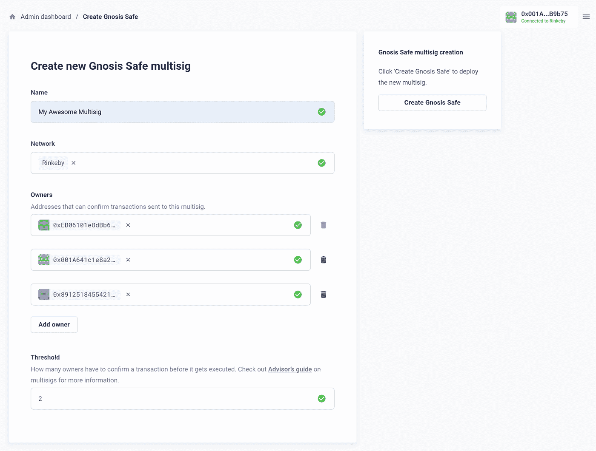
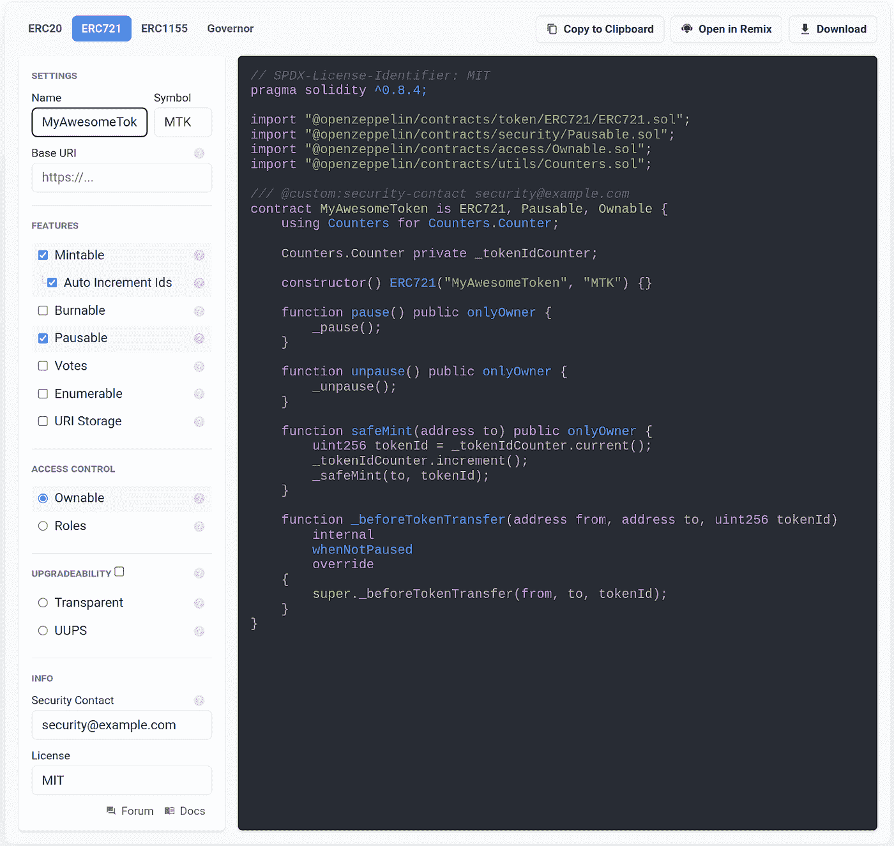
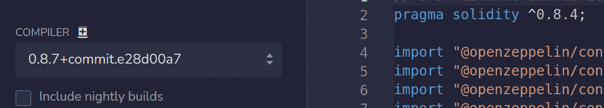
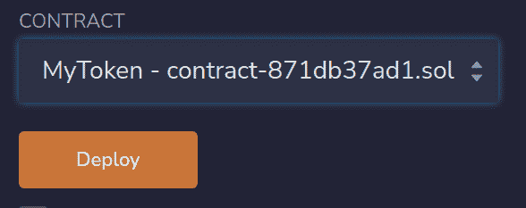
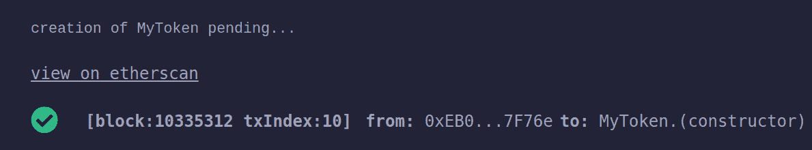
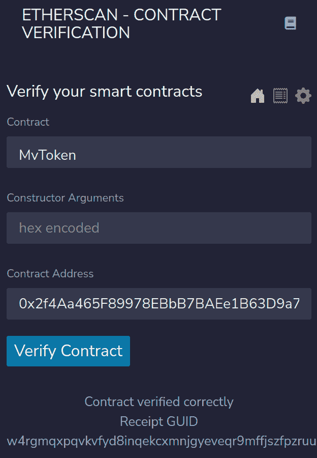
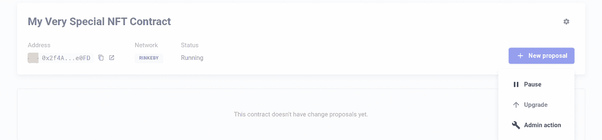
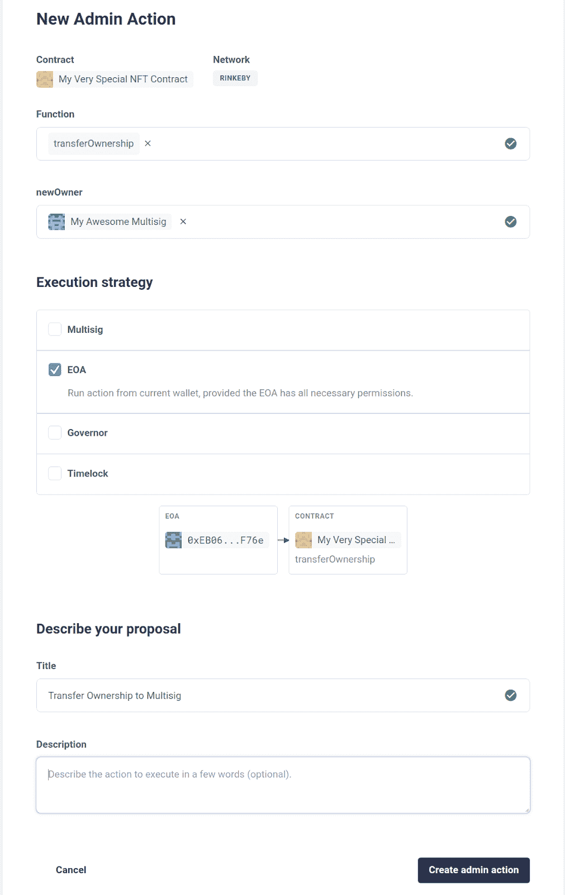
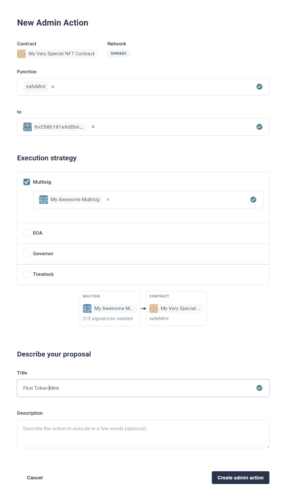
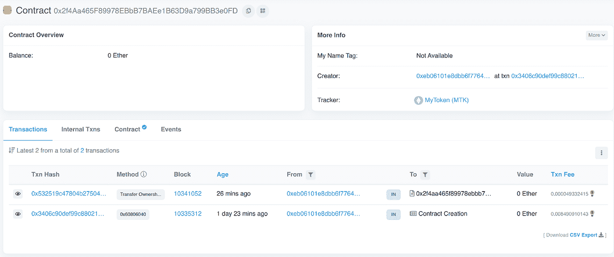

# 使用 OpenZeppelin 合同和 Defender 部署安全的 Mutisig 所有的 NFT

> 原文：<https://betterprogramming.pub/theres-a-lot-of-excitement-around-nfts-and-with-good-reason-b7ebc5ecc836>

## 围绕 NFTs 有很多令人兴奋的事情——这是有充分理由的

围绕 NFTs 有很多令人兴奋的事情，这是有充分理由的。通过几行 Solidity 代码，您可以创建一个代表独特艺术品所有权的令牌( [Twin Flames](https://opensea.io/collection/twinflames) )。你甚至可以在代码本身中对艺术作品进行编码([艺术块](https://www.artblocks.io/))。NFTs 可以用来注册[你自己的。eth name](https://ens.domains/) 或 signal membership in a community([BAYC](https://boredapeyachtclub.com/#/))。NFTs 的前景是光明的，该技术拥有巨大的价值创造潜力。然而，这种价值能否持续取决于基础合同的安全性。

在本教程中，我将向您展示如何使用 OpenZeppelin [合同向导](https://wizard.openzeppelin.com/)创建和部署 NFT 合同——无需接触任何 Solidity 代码或 JavaScript。您将能够通过 multisig 管理您的令牌，使用 OpenZeppelin [Defender](https://openzeppelin.com/defender/) 铸造令牌并在紧急情况下暂停合同的功能。

在本教程结束时，您将拥有自己的已部署 NFT 合同。更重要的是，您还将获得一些关于安全合同部署和管理的重要概念的宝贵经验。

# 创建三个帐户

首先，我们来看看合同所有权的问题。简单的 NFT 合同可以部署到任何[外部拥有的帐户(EOA)](https://ethereum.org/en/developers/docs/accounts/#types-of-account) 。例如，您可以使用您的[元掩码](https://metamask.io/)帐户来部署合同，然后您的帐户将拥有该合同。只要没有人窃取你的私人密钥，你永远不会失去访问该帐户，你将是该合同的唯一所有者，你可以运行你分配给它的任何管理功能。但是，单个 EOA 作为合同管理员是不安全的。

更安全的做法是让您的智能合约归一个`multisig`所有。把一个`multisig`想象成一个由多个账户组成的团队钱包。通常情况下，一个`multisig`的所有权会被分配给三到五个在不同地点使用硬件钱包的不同个人，但在这种情况下，为了简单起见，你将创建三个 Metamask 帐户，并仍然是所有帐户的唯一所有者。当您指定您的`multisig`中的三个账户中的两个必须批准给定的交易时，三账户`multisig`提供了额外的安全层。

对于三账户`multisig`，你需要有三个独立的账户。点击你的账户图片，然后选择**创建账户**，就可以很容易地在 Metamask 中创建新账户。一旦你这样做了三次，你就可以继续了。

**重要安全提示**:在开发过程中，使用不同的钱包甚至不同的浏览器是一个很好的做法，而不是您通常在以太坊上进行交易时使用的浏览器。即使 Rinkeby 和`mainnet`是不同的网络，你的 Rinkeby 私钥和你的`mainnet`私钥是一样的。如果您在开发过程中不小心泄露了您的私钥，您可能会丢失该钱包拥有的所有资产，因此使用不同的浏览器——和完全不同的帐户——是一件值得做的事情。

# 获取 Testnet ETH

在区块链上存储数据需要消耗汽油。你需要在联邦理工学院为此付费。幸运的是，由于你将使用`testnet`，你可以使用`testnet` ETH，它可以从水龙头免费获得。

水龙头是一个智能合同，它向任何调用它的合同发送预定数量的 ETH。您的三个账户中只有一个需要 ETH 提供资金。一旦你从水龙头中得到你的 ETH，你就为下一步做好了准备。

我在这里收集了一份 Rinkeby 水龙头的清单。

# 用防御者管理员创建一个灵知保险箱

OpenZeppelin Defender 是一个用于以太坊开发的安全操作(SecOps)平台。在本教程中，您将使用它来管理您的 multisig 帐户，并对您部署的合同运行管理功能。

前往[defender.openzeppelin.com](https://defender.openzeppelin.com)。如果您还没有帐户，您需要注册。免费帐号会给你很多功能，我们会在以后的教程中探索更多。

*   登录后，您会在左侧导航中看到一些选项。选择**管理员** → **添加合同** → **创建灵知保险箱**。
*   在 Metamask 中，选择 **Rinkeby** 网络。
*   点击**连接钱包**并选择持有您从水龙头获得的 testnet ETH 的账户。
*   给你的 multisig 起一个你喜欢的名字，然后选择 **Rinkeby** 网络。
*   在“所有者”下，您需要添加三个元掩码帐户的地址。为此，您在 Metamask 中选择一个帐户，复制地址，将其粘贴到 Defender 中，然后选择**添加所有者。对每个元掩码**帐户重复此步骤。
*   将您的**阈值**设置为 **2** 。
*   点击**创建 Gnosis 安全**。
*   连接到 Defender 的每个帐户都需要确认交易。

当您看到“交易已确认”消息时，您可以点击**进入保险箱**查看您的 multisig 的详细信息。在本教程的后面，您将把您的 NFT 合同的所有权转移到此帐户。

**重要安全提示**:在本教程中，三账户 multisig 的阈值为 2，这意味着三个账户中的两个账户必须批准任何交易才能通过。2/3 多西格比 EOA 更安全。将阈值设置为 1 将不如 EOA 安全，因为如果任何一个账户被泄露，交易可以代表 multisig 被批准。



# 咨询巫师

OpenZeppelin 契约向导允许您根据所做的选择，从最新发布的安全 OpenZeppelin 契约中为您提供预构建的可靠性代码，从而快速启动开发。你可以把这段代码导出到 Remix 或者下载到本地使用。

前往[wizard.openzeppelin.com](https://wizard.openzeppelin.com)继续。

使用这个工具，您可以创建用于管理 DAO 的 ERC20 可替换令牌契约、ERC721 NFTs、ERC1155 多令牌契约和调控器契约。由于您正在制作 NFT，您可以选择 ERC1155 或 ERC721。在本教程中，我们将选择 ERC721。

合同向导为您提供了几个特定于您所选合同标准的关键选项，以便您只需在左侧面板中做出所需的选择即可开始运行。

在“设置”下，为您的令牌指定您喜欢的名称和符号。

您可以暂时忽略基本 URI，因为在本教程中您不会使用令牌指向任何元数据。

关于元数据:令牌元数据本身就是一个完整的主题，所以我们将在以后的教程中专门讨论 NFT 开发的这个方面。对于本教程，重点是安全的合同所有权和管理。这是在分散的公共区块链上负责任地处理不可变代码的一个非常重要的构件。

在 Features 下，选择 Mintable，这样就可以通过调用 mint 函数来创建新的令牌。

接下来，让我们考虑令牌的访问控制。向导的工具提示对于解释这里的主要思想非常有帮助。您需要某种形式的访问控制来回答谁拥有和调用哪个函数这个非常重要的问题。Ownable 是一个简单的访问控制规则。

```
function safeMint(address to, uint256 tokenId) public onlyOwner {
    _safeMint(to, tokenId);
}
```

默认情况下，访问控制设置为`Ownable`，我们的契约设置为导入`Ownable.sol`。你会注意到代码中有一个关于公共函数的`onlyOwner`修饰符，这意味着只有契约的部署者的地址才能调用它。当契约被创建并写入区块链时，构造函数将部署者的地址存储为契约所有者。稍后，您将通过运行将所有权转移到您的 multisig 帐户的功能来更新合同的所有权。

除了`onlyOwner`修改器，制作契约`Ownable`给你其他可以使用的功能，比如`renounceOwnership`和`transferOwnership`。现有的所有者可以调用这些函数来永久地更改合同将哪个帐户视为其所有者。

为什么用户想要放弃合同的所有权？根据合同，放弃所有权可以作为一种诚信的标志，表明合同没有被任何爱管闲事的管理员篡改的风险。契约仍然存在，令牌仍然可以自由转移，契约的公共或外部状态变量仍然可以被查询。简而言之，任何不受 onlyOwner 修饰符限制的外部或公共函数都可以被调用。

选择**自动增加 id**，以便每次成功铸造代币时，合同跟踪铸造的代币总数。您可以从`Counters.sol`导入和添加到`safeMint`函数的代码中看到这一点。

接下来，我们来看看可贫性的问题。选择**暂停**添加暂停和取消暂停功能，以及在令牌传输中使用 whenNotPaused 修饰符时发生的检查。默认情况下，paused 设置为 false。暂停合同会影响令牌传输，因为 added _beforeTokenTransfer 函数会在有人想要传输令牌时运行。

为什么考虑实现这一点？如前所述，如果发生灾难性事件，暂停允许您禁止令牌传输功能，直到合同解除暂停。

当然，为了透明起见，提醒你的用户注意这个问题是个好主意，但那是另一回事。

退一步说，契约可废除性让我们考虑在令牌转移过程中到底发生了什么。你的电子钱包不像有法定货币的实体钱包。当你拥有一辆 NFT 时，那辆 NFT 永远不会被装进你的钱包。更准确的说，你的钱包里包含了你的私钥，以及它签署交易的能力。NFT 的所有权是通过您的公钥存储在智能契约上来实现的，在地址到令牌 id 的映射中，NFT 属于该智能契约。

请随意试验各种功能，看看在合同向导提供的代码中添加或修改了什么。

**关于可升级性** : Remix 目前不支持部署可升级合约。契约的可升级性真正打开了局面，因此在未来的教程中，您将使用 VSCode 和 Hardhat 在本地创建一个可升级的契约。

你会注意到这里有一个**安全联系人的位置。**最好现在就将它包括在内，因为一旦部署，您将无法编辑您的合同。如果您希望以后添加任何监控或警报服务，这将允许您的合同在代码通过验证后注册到该服务。

此时，你应该退一步，看看你这里有什么。它很安全，很棒，而且只需花一点点心思，我们就希望您的 NFT 合同具有什么功能。



# 导入到混音

当你准备好了，只需点击**在 Remix 中打开，**一切都会被导入到 [Remix](https://remix.ethereum.org) 中。Remix 是一个真正的 Solidity IDE，所以一旦你的代码被导入到这里，你就可以*添加或者改变它。然而，既然向导把一切都保持在良好的状态，就不要改变任何东西。*

# 编制

编译您的代码可以将其部署到区块链。

在左侧，确保编译器与您的`pragma`指定的 Solidity 版本匹配，或者是一个更新的版本，然后点击`Compile contract-{someAlphanumeric}.sol`。



代码将会编译，您会在左侧看到一些新选项。在下面，您会注意到一个复制 ABI 和字节码的链接。我们不会在这里使用它，但是如果您正在构建一个前端来与您的智能契约交互，您将需要契约的 ABI，它本质上是一个由诸如 ethers.js 之类的库使用的 API

# 部署

部署我们的代码会发送一个事务来将其写入区块链。

从 Remix 的工具栏中，选择**部署并运行事务**。

让我们考虑一下不同的环境。如果我们把它作为 JavaScript VM，部署它不会花费我们任何成本，但是它也不会存在于 Remix 之外。这个选项非常适合初始测试和实验，但是我们已经准备好将我们的代码部署到公共测试网。公共测试网是一个真正的区块链，有矿工和天然气费用，有一个关键的区别:测试网 ETH 没有现实世界的价值。如果你在测试网上犯了一个错误，需要重新部署，这不会在财务上给你造成损失。

首先，仔细检查您使用的是仅用于开发的元掩码钱包。这个钱包应该就是你之前放的那个。在您的 Metamask 钱包中，确保您在 Rinkeby 网络上。

在**环境**下，选择**注塑网 3** 。这样做将导致 Metamask 连接到该站点。

一旦连接，您将看到您的帐户的公钥显示在**帐户**下。


事情越来越激动人心了！让我们借此机会更深入地了解一下当涉及到合同中的重要声明时，幕后发生了什么。虽然我们首先看到的是顶部的附加代码行，但这里还有更多内容，它解释了附加功能的来源。

```
import "@openzeppelin/contracts@4.5.0/token/ERC721/ERC721.sol";
import "@openzeppelin/contracts@4.5.0/security/Pausable.sol";
import "@openzeppelin/contracts@4.5.0/access/Ownable.sol";
import "@openzeppelin/contracts@4.5.0/utils/Counters.sol";
```

在**合同**下，点击下拉菜单。在最底部，您会看到您的 ERC721 令牌合同。但是，所有这些其他合同是从哪里来的呢？这些是在契约顶部指定的导入及其所有必需的依赖项。实际上，你可以把你的合同想象成首先包括这些合同中的每一个，所有这些都在一个长的大型合同中。


您会注意到,`Ownable`显示在列表的顶部，但是我们希望部署我们的令牌，而不仅仅是`Ownable`,所以一定要选择您的令牌合同。当您部署它时，所有的导入和依赖项都将在同一个事务中部署。



选择**部署**将提示您确认 Metamask 中的交易并支付油费。

在屏幕的底部，Remix 让您知道交易正在被挖掘以及何时得到确认。它包括哪个块、从哪里部署的地址等细节。您可以在 etherscan 上选择**查看，查看该特定交易的所有详细信息。**



在 Etherscan 中， **From** 地址显示了您刚刚用来部署合同的地址。选择该地址将向您显示以前通过该地址进行的所有交易，由 Etherscan 索引。

**到**地址是已部署合同的地址。

您也可以通过返回 Remix 查看合同，点击按钮复制显示已部署合同的地址，并在 [Rinkeby Etherscan](https://rinkeby.etherscan.io) 的搜索框中输入该地址。


# 合同验证

验证合同是那些让任何人在 Etherscan 上查找源代码时都可以轻松访问的合同。验证合同还允许用户直接从 Etherscan 运行任何公开可用的读/写功能。虽然没有必要验证您的源代码，但这绝对是一个好的做法。

要在 Remix 中做到这一点，您需要首先通过点击左下方的插件来添加 Etherscan 合同验证插件。搜索并安装 Etherscan。安装完成后，从左侧导航栏中选择**以太扫描合同验证**插件。

你需要一个 Etherscan API 密匙，你可以通过进入 [etherscan.io](https://etherscan.io) 并创建一个账户来获得。登录后，您将在您的用户 ID 下的下拉列表中看到 **API 键**的列表。

一旦你创建并复制了你的 API 密匙，返回 Remix 并粘贴它，然后从下拉列表中选择你的令牌合同。(不需要包含任何构造函数参数。)粘贴已部署契约的地址。您可以在之前交易的**到**:字段中的以太网扫描中找到这一点。您也可以在**已部署合同**下的**部署**部分的 Remix 中找到它。



# 在 Etherscan 上与您已验证的合同互动

返回以太扫描并选择**合同**。您将看到合同的完整源代码以及所有导入的合同。因为您的合同已经过验证，所以您也获得了读写合同的能力。选择**读取合同**显示您可以在合同上调用的不消耗汽油的功能。

选择**写交易**显示要求您连接钱包并支付交易的功能，因为它们改变了区块链的状态。

Etherscan 为已验证的合同提供了与已部署和已验证的合同进行交易的最小前端。它很小，但足以运行与开发完整的 web 应用程序时使用 ethers.js 相同的事务。

现在，查询这些不会告诉我们任何非常有趣的事情。我们没有铸造任何代币。让我们回到防守那部分。

# 将合同导入 Defender

Defender 是处理已部署合同的一个非常棒的工具。要开始这个过程，我们需要将合同导入 Defender。“导入合同”不会改变合同本身。相反，你可以把 Defender 看作是一个调用契约函数的工具。事实上，同样可以将任何经过验证的合同导入 Defender，无论它是否为您所有。毕竟这是一个公共区块链！

回到[防御者](https://defender.openzeppelin.com)，选择**管理员**。您将看到之前创建的 multisig。我们一会儿会用到它。

从右上角选择**添加合同** → **导入新合同**。

你可以给它起任何名字。为了简单起见，最好将其命名为与部署的契约相同的名称。

选择 **Rinkeby** 并粘贴已部署的合同地址。请记住:您可以通过以太网扫描找到合同地址，作为您钱包最近交易的 **To:** 字段，或者在**部署的合同**下重新混合。


因为合同已经过验证，Defender 会自动加载 ABI，并检测到您的合同是可暂停的，这意味着如果您愿意，您可以使用 Defender 暂停我们的合同。

点击**添加**。

# 将所有权转移给 Multisig

现在，您的 NFT 合同将您用来部署它的钱包地址设置为其当前所有者。

Multisig 所有权更安全，因此我们将所有权转移到前面创建的 multisig。为此，选择**新提议**，然后选择**管理操作**。



在这里，在屏幕的右侧，您可以看到合同的当前状态。它不是暂停的，拥有者是你的钱包地址，并且`totalSupply`是零，因为我们没有铸造任何代币。

点击**功能**下拉菜单，选择`transferOwnership`。在`newOwner`下，选择您给 multisig 起的名字。

在这下面，你会看到**执行策略**。你会问，那是什么？Defender 只是问你希望如何促成这笔交易。

如果您的契约由治理契约拥有，就像 DAO 一样，您将选择 **Governor** ，这样，如果事务在投票中被通过，它们将会运行。通常，这将与时间锁一起完成，时间锁在事务执行中应用预设的延迟。为此，您可以选择**时间锁**。

我们没有使用时间锁或调控器，所以我们的执行策略相当简单。

总的来说，如果你遇到让你挠头的事情，搜索[文档](https://docs.openzeppelin.com/defender/admin)，答案可能就在那里。在 Defender 中，你会在左下角找到它的链接。

为外部拥有的账户选择 **EOA** 。确保用于部署合同的同一个 wallet 当前连接到 Defender，并设置为位于 Rinkeby 网络上。因为这个帐户拥有合同，所以我们有能力运行这个`onlyOwner`函数。转让所有权后，只有 multisig 可以运行此类功能。

在提案标题下，给出一个友好的描述，清楚地表明你打算在这里完成什么。“将所有权转让给 multisig”就足够了。



选择**创建管理操作**，您将看到该交易(带有您刚刚提供的友好标题)正在等待批准。

这个屏幕有点像在你真正购物之前查看你的购物车。这很好，因为转让所有权是一个重大决定。

选择**批准并执行**。您必须在 Metamask 中签署(并支付)交易，然后交易被执行。将来，当运行此合同的事务时，您仍需要使用元掩码，但该流程的工作方式会有所不同，因为该合同现在由 multisig 所有。

# 铸造代币

要使用 Defender 创建令牌，您将运行另一个管理操作。

选择**管理** → { **您的 NFT 合同** }。

在**提议**下，您将看到刚刚执行的所有权转让交易。

选择**新提议** → **管理动作**。

在**功能**下，选择**安全薄荷**。您将铸造一个令牌给契约的前所有者，对部署契约表示感谢。

对于执行策略，选择 Multisig 以及由当前所有者 Defender 管理的 multisig。

Defender 向我们展示了您的 multisig 有三个地址，您至少需要两个地址来批准交易才能通过。

将该提案描述为您的第一个 mint，并选择**创建管理操作**。



在下一个屏幕上，查看管理操作并选择**批准**。

要真正实现这个`multisig`交易，您需要用属于`multisig`的三个账户中的两个签署交易。属于给定`multisig`的账户可能是世界上任何地方的钱包。只是碰巧你在这里的一个地方管理它们。

在 Metamask 中，切换到`multisig`中的一个账户，选择**批准**，签字，切换到第二个账户，签字，然后选择**批准，执行**。(交易一旦经过两人签字，任何人都可以执行，包括刚刚签字的账户。)

您已经成功铸造了第一枚代币。要在区块链上看到这一点，选择合同的地址并将其粘贴到 Rinkeby Etherscan 中(或者只需将鼠标悬停在合同地址上并选择 Block Explorer 中的**视图)。**

在**交易**中，注意所有权的转移。



在**内部事务**中，您将看到 mint 事务。选择父事务会将您带到事务详细信息，在这里您可以看到，被传输的令牌是令牌 ID 零，与部署合同的地址相同。


恭喜你！您已经成功部署了一个 ERC721 合同，将所有权转移给了一个`multisig`，并为一个外部拥有的帐户铸造了一个令牌。从这里开始，您可以随意使用 Defender 进行进一步的实验。看看如果你暂停你的函数并尝试铸造另一个令牌会发生什么。

# 资源

*   [OpenZeppelin Defender 文档](https://docs.openzeppelin.com/defender/)
*   [Gnosis 安全多签名钱包](https://docs.openzeppelin.com/defender/admin#gnosis-safe)
*   [再混合文档](https://remix-ide.readthedocs.io/en/latest/)
*   [以太坊 EIP-721 不可替代令牌标准](https://eips.ethereum.org/EIPS/eip-721)
*   [OpenZeppelin 合同 ERC-721 文件](https://docs.openzeppelin.com/contracts/4.x/)