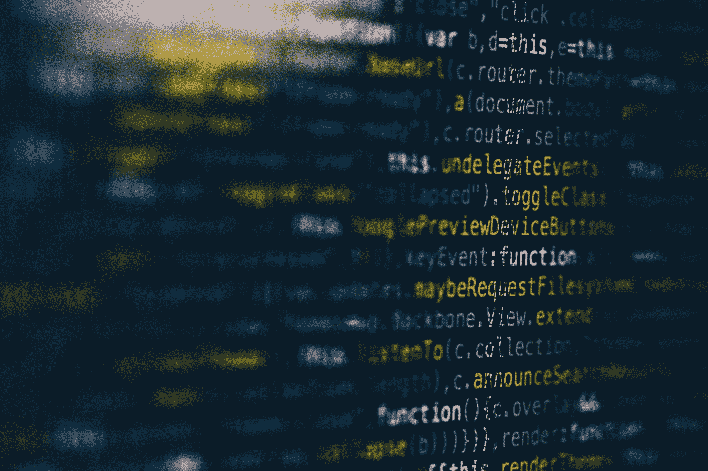

# 代码不仅仅是代码

> 原文：<https://betterprogramming.pub/theres-more-to-code-than-just-code-905753fc51ee>

## 编程帮助我们学会重新思考

马库斯·斯皮斯克在 [Unsplash](https://unsplash.com/s/photos/coding?utm_source=unsplash&utm_medium=referral&utm_content=creditCopyText) 上的照片

当人们碰到满是代码行的桌面时，通常会有两种反应:真正的好奇和普遍的不感兴趣。我让你来猜哪个更常见。

编程的世界已经被认为是一个越来越令人生畏的世界，充满了错误、bug 和对敏锐感知能力的需求，这对我们大多数人来说似乎很遥远。但是，尽管编码和编程似乎面临困难，越来越多的管理员、[程序员和](https://www.inc.com/glenn-leibowitz/steve-jobs-believed-everyone-should-learn-this-1-s.html)[学校](https://www.idtech.com/blog/5-reasons-your-child-should-learn-to-code)已经激烈地宣传学习编码对于学术、职业甚至个人成功的重要性。

现在，我不需要冠军的口头禅“[每个人都应该学会为你编码](https://www.topuniversities.com/courses/computer-science-information-systems/why-everyone-should-learn-code)；这个短语已经广为人知到了老生常谈的地步。然而最近，越来越多的人开始讨论是否每个人都应该被强迫学习如何编码，不管是在学术还是职业环境中。

[几十篇](https://medium.com/better-programming/the-real-reason-why-everyone-should-learn-to-code-bb62fec3821c)媒体[文章](https://medium.com/age-of-awareness/should-everyone-learn-how-to-code-86c6b265c5cc)优雅地权衡了这场[辩论](https://medium.com/@akbgunner4ever/fascinating-debates-should-everyone-learn-to-code-4354fba30bbf)的利弊。我的论点，就像其他人描述的一样，并不热衷于支持或不支持编码本身。更确切地说，这是为了支持它教会我并最终能教会你的可移植的解决问题和批判性技能。

# 我学习编码的旅程

作为一名高中生，看到所有这些吹捧学习编码不可逾越的重要性的标题，我会在暑假花几个小时练习使用 [Scratch](https://scratch.mit.edu/) 和 [Codeacademy](https://www.codecademy.com/) 用 HTML/CSS 和 Python 编写基本命令。尽管我花了很多时间学习编码，但我从未真正感受到程序员们热情聚集的“天才”感觉或力量。简而言之，我努力高效地开发和调试代码，并立即告诉自己“编码不适合我。”

接下来，我尽可能避免在任何时候和任何地方编码。我推断如果我不是计算机科学专业的，我就不会*需要*用代码来处理事情。在很大程度上，我尽了最大努力来完成这项工作。如果有一个预编程的平台，我可以用来生成结果，或者更糟，如果我可以把我的数据放入 Excel 电子表格，用我可信赖的 TI-87 处理数字，我会尽可能地绕过编码。

直到大二物理实验室，我才意识到逃避编码的问题。在计算一个简单的力学实验的结果时，我发现我的结果中有很大一部分远远超出了范围，都需要扔掉。

令我惊讶的是，我立刻希望我知道如何使用 if/else 语句，这一定是源于一些“很久以前”的 HTML/CSS 或 Python 模块知识的休眠。简而言之，if/then/else 语句是一种结构，它允许您基于特定的条件或您可以设置的数据值来做特定的事情。例如，**如果**我在周四收集了数据，**那么**将其标记为“null”，**否则**，保持原样。

接下来的一个月，我在同一个学期必修的 R 导论课上偶然发现了 if/then/else 语句。有了新的认同，我更加努力地理解编码语法和输出，并开始看到这个简单命令在生活的许多方面的应用。这些问题包括:如果温度低于一定程度，决定穿什么；如果我的蔬菜过期前还有五天，决定什么时候准备饭菜；如果这些项目也能帮助我培养学生技能，决定将我的时间投入到哪些项目中。

在看到拥有一个 if/then/else 语句的思维模式使得做决定和思考简单的问题变得更容易之后，我开始相信在成为一个优秀的程序员的过程中一定有其他的宝石可以帮助我成为一个更好的思考者。

在整个课程中，我仍然努力运行代码，这样每次运行时都不会产生几十个警告。我喜欢认为我在结束的时候发展了一些实际运行代码的直觉，但是训练是一个漫长的过程。第二天早上，我不只是醒来发现自己是一个编程高手，但我*的确*发现了一个事实，即“像编程者一样思考”可以真正帮助构建甚至将一系列基本和复杂的问题联系起来。

我在编程方面的经验并不构成一个非常可复制的故事，甚至不是一个方便的三步指南来立即成为一名更好的程序员。对我来说，编码仍然需要不断的实践、反复试验和关键的解决问题的技能。就像学习一门新的外语一样，没有人能在一夜之间成为更好的程序员。对我来说，编码是一个成长的过程。自从 R 类入门课程两年以来，我对如何“用代码思考”有了更好的理解，但这是一项我每天都在不断改进的技能。

# 编码的好处

除了以一种聪明、合理和有效的方式产生结果的满足感，编码还为我提供了一个思考问题并开始理解如何解决问题的框架。它并没有突然改变我看待世界的方式，而是慢慢地塑造了我对问题的看法，使之变得更容易理解，最终也更容易解决。

你不需要宣布一个计算机科学的学位就能获得编程的好处。你甚至不必成为一个伟大的程序员来收集它的积极的副作用。简单地理解代码是如何要求你思考的，这本身就是一笔巨大的财富。归根结底，除了代码之外，还有更多东西需要编写。