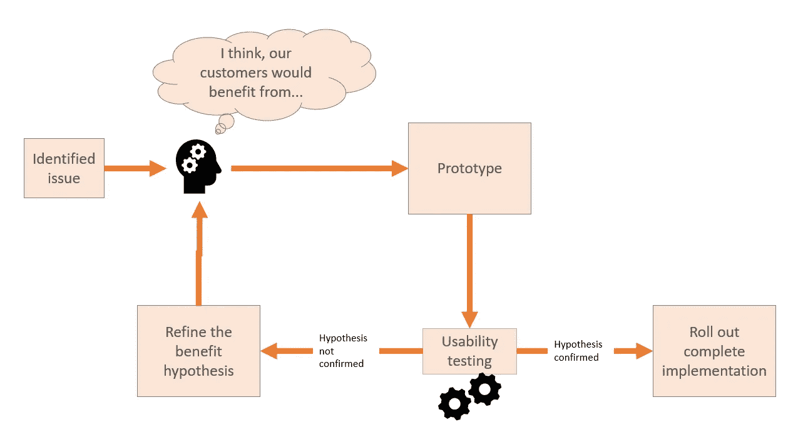

# 这四个原因决定了你的 Scrum 团队的失败

> 原文：<https://betterprogramming.pub/these-4-reasons-seal-your-scrum-teams-failure-c6a38a39979f>

## 如何创造一个尊重和有益的环境

由 [Unsplash](https://unsplash.com?utm_source=medium&utm_medium=referral) 上的 [Parabol](https://unsplash.com/@parabol?utm_source=medium&utm_medium=referral) 拍摄

我花了八年时间才不再讨厌 Scrum，并开始享受它。在这八年中，我目睹了压力过大的开发人员、不知所措的产品负责人和咄咄逼人的 scrum 大师。

去年年底，我的公司想要引入 SAFe，这意味着所有的开发团队都需要在一个敏捷的环境中工作(主要是 Scrum)。

起初，我很不情愿，但随着我接受的每一次训练和每一次疯狂学习机械之后，我的怨恨融化了，我敞开了心扉。我以 scrum 大师的身份建立了两个敏捷团队，最后成为了产品负责人。

结果是第一个敏捷团队成为了我喜欢的一部分。

我将与你分享在我的经历中是什么让所有敏捷团队崩溃，以及我和我的团队是如何解决这些问题的。

# 1.日报是施压的工具，而不是交流的工具

你看过查理·卓别林的《T4 摩登时代》吗？在这部电影中，他在传送带上辛苦工作，执行着同样的任务，似乎永远都是如此。

你可以猜到会发生什么:老好人查理跟不上节奏，开始犯错。他的同事无情地盯着他，因为他的成功对他们的至关重要。压力太大了。

同样的事情也发生在 Scrum 团队中。就像工厂工人一样，开发者不是机器。我们都有巅峰时刻和低谷时期。有了日报，开发人员每天早上都会成为焦点。他们必须每天都表现出进步。

但是说实话:谁没有在工作中花一两天时间拖延而不是交付有价值的东西呢？如果你是其中之一:恭喜！我希望你不会很快筋疲力尽。对于所有其他人:祝贺你，你是人类！

日报的目的是创造透明度，而不是压力。确保这一点的最佳方式是一个称职的 scrum 大师。他们必须消除障碍，使他们的团队能够实现他们的承诺。上面提到的压力可能是一个巨大的障碍。

如果你是一个 scrum 大师，有几件事你应该在日常工作中做:

*   如果你需要批评某人，不要在日报上做。始终提供面对面的评论！
*   以我的经验，有些团队成员想通过吹成绩来打动同行。这会给其他团队成员带来压力，他们会觉得自己做得不够。不要低估这种现象:它会导致恶性循环。日报不是一个炫耀的平台，而是报告你的状态和正在发生的障碍的平台。作为一个 scrum 大师，你应该主持会议以避免自吹自擂。
*   不要用 100%的能力来计划。给你的团队成员一些喘息的时间，例如，给一般任务留出缓冲时间:我们都需要检查邮件、保持上网等。
*   每当你觉得每日报告给团队带来压力时，问问他们是否愿意每隔一天而不是每天进行一次每日报告。

这些只是几个例子，说明了日常工作会带来很多不必要的压力。

警惕的 scrum 大师总是密切关注他们的团队，确保每个人都以他们理想的速度工作。理想的步伐并不总是与公司的一致。

你不是 scrum 大师？没问题。作为一名开发人员，你应该和你的 scrum 大师一起解决这些问题。如果他们工作做得好，他们会认为你的反馈是一个障碍，并欢迎你的倡议。

这就是 scrum 团队的全部理念。如果公开提供反馈是你的团队的一个问题，也许匿名反馈渠道是建立信任的一个好的开始。

 [## 为什么反馈渠道在工作场所很重要

### 伟大的经理会倾听他们的员工，即使他们保持沉默

better 编程. pub](/great-managers-listen-to-their-staff-even-if-they-dont-say-anything-90a58c398fe4) 

# 2.系统演示是一个执行的地方

让我们回到吹嘘同事的话题上。在他们的 scrum 大师限制了他们在日常工作中的发言时间后，他们大放异彩的时刻终于来临了:系统演示。

当大多数人背诵几行代码并严格遵循“告诉别人不要展示”的方法时，Frank 表现出色。他准备了一个令人印象深刻的演示，展示了他的团队的实力和对技术的理解。

*在最后一个功能成功发挥其魔力后，弗兰克急切地等待着敬畏的观众的反应。*

*相反，产品经理向他连珠炮似地询问独特的卖点和其他营销内容。*

其他开发人员似乎对此不以为然。他们怀疑解决方案，并立即拆除实现。主要是为了维护统治地位。

不要误解我的意思:系统演示最重要的一个方面是从不同的涉众那里收集反馈。但是有价值的反馈总是值得尊重的。

以下是主持人在每次系统演示开始时应该建立的一些健康心态:

*   所有的反馈提供者都需要将他们的反馈建立在一个简单的假设上:
    我们假设团队尽了最大努力来达到最好的结果。没有人因为选择而表现不佳。仅仅这个假设就避免了大量的激烈讨论，这些讨论与团队如何改进解决方案无关，而是旨在质疑其能力。
*   反馈不应该是关于团队的能力，而是演示本身。像“你把这里的表演搞砸了”这样的话。
    取而代之的是参考演示，例如“软件似乎需要一段时间才能启动。有没有可能改善启动时间？”
*   总是在演示中发现积极的一面。即使是最糟糕的解决方案通常也有可取之处。在您对不成功的地方提供反馈之前，请强调这一点。这有助于避免在不知不觉中侮辱收件人，并增加您的后续反馈被听到的机会。
*   好的反馈总是包括反建议。批评总是容易的，但要自己做得更好就难多了。如果您有如何改进解决方案的想法，请提出您的建议。如果没有，那么你有两个选择:
    要么你认为你的批评放错了地方，要么你恭敬地问整轮人是否有改进的想法。承认你已经做得不能再好了，这是一种尊重的表现，也能避免给人一种自以为无所不知的感觉。
*   最后但同样重要的是:即使你没有收到反馈，一点点掌声也是一种很好的表达感激的方式，不管是虚拟的还是现实生活中的。

所有这些技巧都应该成为每个开发团队 DNA 的一部分。它们可能听起来微不足道，但是根据我的经验，几乎没有任何团队坚持这些社会标准。

是时候在你的公司里提升他们了。

# 3.无尽而无益的史诗

愿景很重要。它们揭示了公司的长期目标，这是创造有吸引力的产品所必需的。

但是当产品经理将一个愿景分解成一年的史诗时，开发人员可能会感到沮丧——更不用说它们与敏捷方法相抵触了。

如果一个开发人员在同一项任务上工作了一段时间而没有成就感，他们会感到厌烦。他们不觉得自己贡献了什么，因为预期的结果似乎永远不会发生。

最重要的是，一部冗长的史诗可能会在完成后变得过时。到目前为止，所有投入的工作都付诸东流。

产品经理和产品所有者应该关注[精益 UX 方法](https://www.interaction-design.org/literature/article/a-simple-introduction-to-lean-ux)。

精益 UX 计划。作者图。

以下是对这些步骤的简短说明:

1.  无论何时出现问题，例如，由于客户反馈，产品经理都应该调查问题并制定一个效益假设。他们应该包括客户、他们的团队或其他利益相关者，以了解问题及其根源。
    效益假设是产品经理对如何解决问题的理解。
2.  如果你幸运的话，开发团队和你的 UX 设计师会开发出一个原型。该原型不是一个成熟的解决方案，但提供了足够的功能来展示该解决方案。
3.  通过可用性测试，您可以确定提议的原型是否能解决问题。理想情况下，你和实际用户一起进行可用性测试。
    如果原型解决了最初的问题，您可以假设您的收益假设是正确的，并推出整个实现。
4.  如果可用性测试揭示原型并没有改善用户的情况，你应该投入更多的工作去理解这个问题并重新制定你的利益假设。循环重新开始。

这种方法确保长期的任务不会白费，因为你很早就失败了。它强化了开发人员的感觉，即他们开发了有价值的东西。

如果你发现你的假设是正确的，确保将你的史诗和故事分成易于管理的部分:故事应该适合一次冲刺。根据我的经验，史诗不应该超过六次冲刺。

# 4.咄咄逼人的产品经理和产品所有者

我们可能都听说过 SMART 目标。目标应该是具体的，可测量的，可实现的，合理的，有时间限制的。

当目标偏离轨道时，产品经理和所有者应该总是考虑可达性。为什么？因为这是大多数项目经理和项目官员最容易忘记的方面。

想象一个由五名开发人员组成的团队。基于过去冲刺的数据，scrum master 预测接下来三次冲刺的速度都是 10 个故事点。在接下来的三次冲刺中，团队承诺了总共 30 个故事点的故事。

PO 很高兴，因为团队在 sprint 规划中考虑了他们的优先级。他们趾高气扬地向客户承诺令人兴奋的功能，并保证仅在六周内发布。

团队在做出承诺时不知道的是:

*   卡罗尔会递交辞呈，并在完成第一次冲刺后离开。她不得不用完剩下的假期和加班，所以剩下的时间不多了。
*   冠状病毒对该团队的打击也很大。在接下来的三次冲刺中，史蒂文和马克各有一半时间会生病。

这给团队留下了 20 个故事点的容量。合理的做法是调整承诺的目标，使其再次可实现，也就是说，将一些故事放入待办事项中。

或者，PO 和团队可以重新表述故事，向客户提供价值，同时尊重减少的容量。采购订单的工作是向客户传达这一转变，并做出合理的妥协。

但是我们骄傲的阿宝不能在顾客面前丢脸。因此，他们敦促团队成员通过加班来弥补产能损失。你可以猜到这对团队的士气有什么影响。

最重要的是，它打乱了团队的速度 KPI。如果 scrum 大师不考虑在即将到来的冲刺中稳定速度的特殊情况，团队将会以非常不合理的速度为基准。

我想说的是:POs 需要在他们的请求中是现实的。考虑挑战和压倒团队之间的区别。

# 摘要

最后，敏捷团队需要定义它的框架。对一个团队有效的东西对另一个团队可能是冲突的来源。

每个团队都需要通过公开缺点并创造性地改进它们来找到自己。这是整个团队的任务。

以上所有要点都可以归结为所有利益相关者之间的尊重行为。当以一种文明的方式使用时，日报和系统演示可能是强大的工具。

仅仅因为你作为 PM 或 PO 的角色是专注于产品，并不意味着你应该忽视团队的工作。保护它免受不合理的要求，并润色你的史诗和故事，使其变得可及和有价值。

为了你的团队着想。毕竟只有健康的团队才会出健康的产品。