# 这 5 个 Chrome 扩展使工作更好

> 原文：<https://betterprogramming.pub/these-5-chrome-extensions-make-work-better-7c1b310097f0>

## 让你的生活每一天都更轻松

照片由[晨酿](https://unsplash.com/@morningbrew?utm_source=medium&utm_medium=referral)在 [Unsplash](https://unsplash.com?utm_source=medium&utm_medium=referral) 拍摄

如果你使用**谷歌 Chrome** 浏览网页——大多数人都这样做——这些扩展或插件可以帮助你更好地工作。

*免责声明:我不隶属于或赞助以下任何扩展。大多数——如果不是全部的话——都是免费的，没有膨胀，没有广告，也没有不必要的权限。我喜欢在日常生活中使用它们，希望你也能发现它们有用。*

排名不分先后，以下是我的五大 Chrome 扩展。我在图片下面添加了一个链接，这样就可以很容易地找到了。

# 1)整页截屏

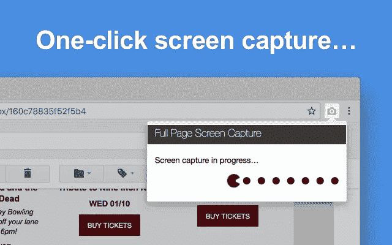

[整页截屏](https://chrome.google.com/webstore/detail/full-page-screen-capture/fdpohaocaechififmbbbbbknoalclacl?hl=en)

“整页截屏”这个名字已经说明了一切，我还能说什么呢？它非常容易使用，在捕捉超过一页长的截图时非常棒。不再需要截图、滚动和拼接图像。只需点击相机图标即可开始。

您可以下载 PNG、JPG 和 PDF 格式的结果。

# 2)动量

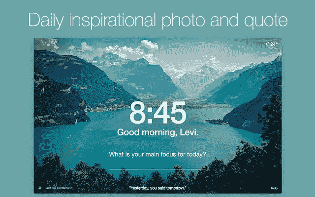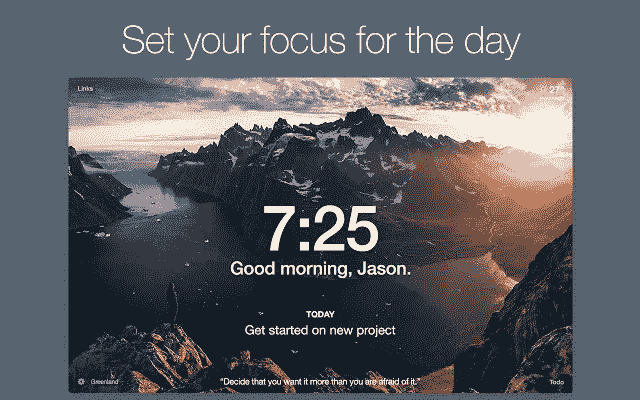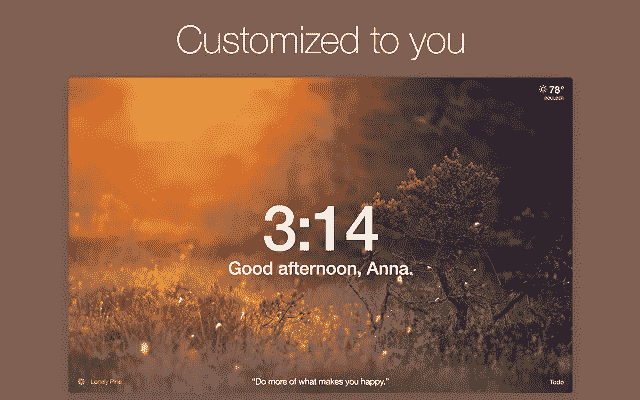

[气势](https://chrome.google.com/webstore/detail/momentum/laookkfknpbbblfpciffpaejjkokdgca?hl=en)

如果你没有使用动量，你就错过了。每当我启动浏览器或打开一个新标签时，这是我看到的第一个页面，这是有原因的。

这个极简扩展中有一些功能非常强大，但是我使用这个扩展的主要原因是待办事项列表。一天中有太多的事情要做，所以在每个新标签上有一个非侵入性的清单会使新老任务的优先排序更容易管理。更不用说每天励志的照片和语录，可以把一个枯燥、静态的主页变成一个生动活泼的主页。

保持专注，保持动力。

# 3)气泡

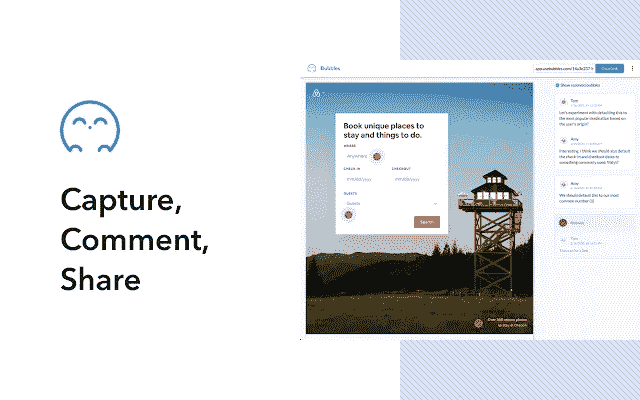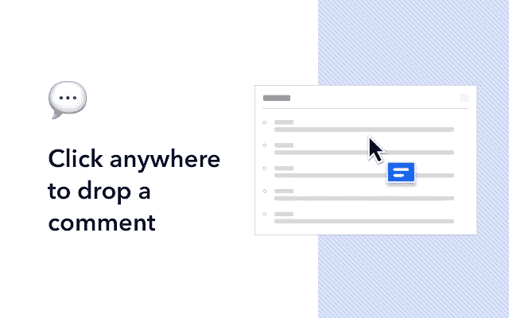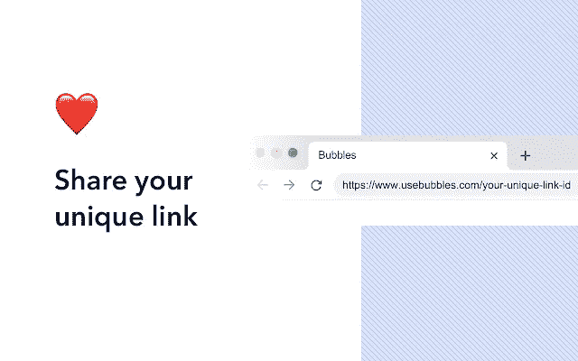

[泡泡:视频和截图协作](https://chrome.google.com/webstore/detail/bubbles-video-and-screens/ppbfhhgcdehhbjigifndnfmcihegokbb?hl=en)

Bubbles 是一个低调的扩展，非常适合前端团队、QA、pm 和 UX/UI 设计师。类似于整页截屏，但是包含了更多的功能，我使用这个工具快速截屏，突出显示关键区域，并通过一个独特的链接与其他人分享。

你也可以用这个来记录你的屏幕。

# 4)邮件跟踪器

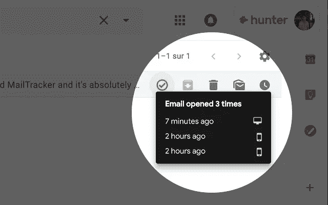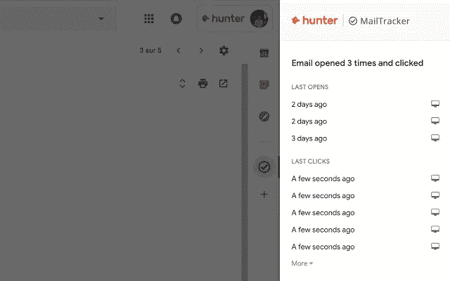

[mail tracker:Gmail 的免费邮件跟踪器](https://chrome.google.com/webstore/detail/mailtracker-free-email-tr/pgbdljpkijehgoacbjpolaomhkoffhnl?hl=en)

使用 MailTracker 了解你的电子邮件何时被打开。说够了。安装、激活并授予权限(是的，我知道，但是这个*需要*访问 Gmail 才能工作)。也没有讨厌的签名，你必须支付删除。

# 5)语法上

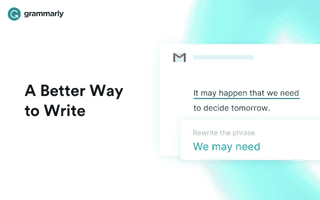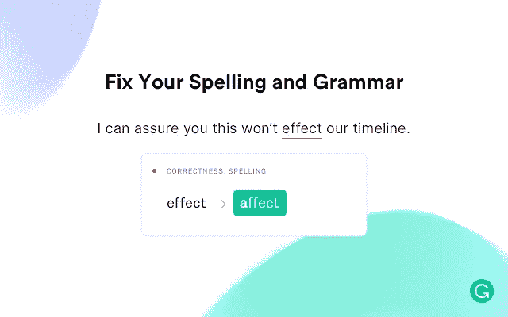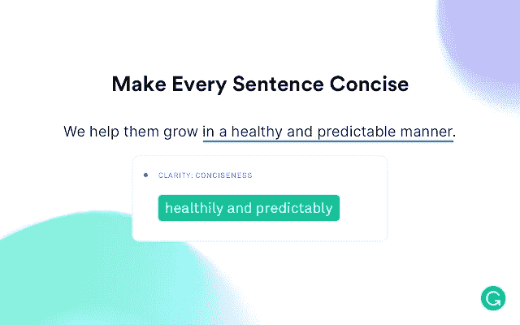

[语法上为 Chrome](https://chrome.google.com/webstore/detail/grammarly-for-chrome/kbfnbcaeplbcioakkpcpgfkobkghlhen?hl=en)

语法帮助你写得更好。

从语法和拼写到风格和语气，这个工具可以帮助你消除写作错误，找到表达自己的完美词汇。在 Chrome 上，你几乎可以在任何地方找到建议。

这是一个虚拟的写作助手，你解雇和忘记。它一直在后台运行，我的意思是这是一种好的方式。事实上，当我写这篇文章的时候，我正在使用语法。它节省了我无数次发送有错误的电子邮件和发布容易出错的内容。

这是我最喜欢的五个 Chrome 扩展，它们让工作变得更好。你正在使用上面的扩展吗？你有没有上面没有提到的扩展，你想包括在内？请在下面的评论中告诉我你的想法。

感谢阅读！