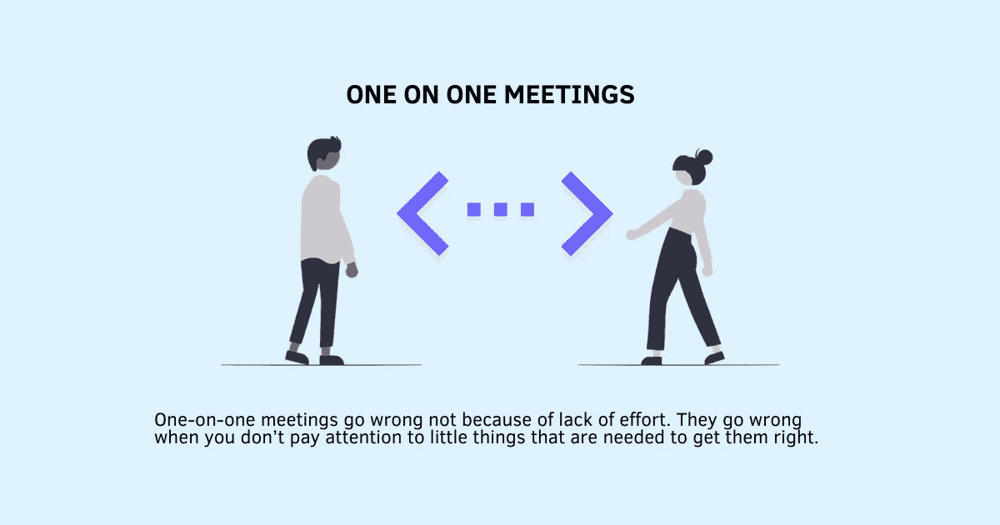

# 这些一对一的会议错误正在伤害你的团队

> 原文：<https://betterprogramming.pub/these-one-on-one-meeting-mistakes-are-hurting-your-team-a5678349bef6>

## #3 为他们思考

鸣谢:作者

你是否定期会见你的员工，给他们建议，帮助他们成长？你可能做了很多正确的事情，但是你是否也花时间去分析那些会让你的一对一会议变得无效并让你的人感到不满的错误？

我从经验中知道，我们非常注重完善可见的东西(议程、反馈、[策略](https://www.techtello.com/strategy-vs-tactics/)、问题)，而经常忽略或很少或根本不注意不可见的部分(你的身体语言、态度、行为)，这些会把一次完美的一对一会议变成一次糟糕的经历，让人们感到被评判、被忽视和恼火。

经常和你的人交谈是保持联系、解决他们的问题和发现需要你注意的问题的好方法。但是仅仅花费时间或者完成一个议程并不能衡量你给你的团队带来的价值。你可能每周都有一对一的会议。但是，当你的员工把它当作一种义务，而不是认为它是对他们时间的最佳利用时，这有什么意义呢？

一对一的会议出错不是因为缺乏努力。当你不注意那些使它们正确的小事情时，它们就会出错。

不要说你尽了最大努力，或者假设你做的每件事都是对的，要注意这些常见的错误。你可能不是故意这样做的。但无意识地做这些也不是借口。一旦你开始注意这些错误，你的一对一会议的质量不仅会提高，还会让你和你的人更好地沟通，感觉更满意。

# 一对一会谈中的 6 个常见错误

## **1。启动错误**

作为经理你可能太忙了。随着[太多的会议](https://www.techtello.com/too-many-meetings-at-work/)占用你的时间和注意力，当你在一对一的会议中迟到时，你会注意到吗？更糟糕的是，你有没有养成为迟到道歉然后继续前进的习惯？

让我们面对现实吧。不是所有的会议都值得你花时间。做好你的一对一将会是你时间投资的最大回报。

对你来说，这可能只是许多谈话中的一次，但对他们来说不是。当你没有准时参加一对一的会议时，这表明它在你心目中的重要性降低了。

另一个错误是未能关闭你一天中的挫折或失望，并带着这些负面情绪开始会议。当你没有意识到改变你的心态时，你会被旧的想法所困，很可能会开始抱怨你的烦恼。

大声说出你的问题可能会让人感到安慰，但是从你和你的问题开始会转移讨论的焦点，甚至在讨论开始之前。它是关于你而不是他们的。

纠正这个一对一会议的错误:

开始为接下来的对话设定积极的基调时，你需要做两件事:

*   准时参加会议。
*   有意识地计划如何开始对话。

如果你不确定开始时该说些什么，这里有几个话题供你参考:

*   询问他们一天过得怎么样。他们今天面临的最大挑战是什么？
*   和他们谈谈他们在上次讨论中提出的一个问题。他们现在过得怎么样？他们都做了什么？什么奏效了？什么没有？
*   如果有影响他们的重要公告或变化，告诉他们并解决他们的问题。
*   问一问自从你们上次见面以来，他们脑子里想的是什么。
*   你甚至可以从总结上次会议的笔记开始，分享你的行动项目的更新。

正确地开始会议很重要。除非你一开始就计划好要说什么，并准时开始会议，否则你做不到这一点。

## **2。用言语填补沉默**

沉默让人不舒服。你的第一反应是用语言来填充它吗？你脑海中的声音是否喊着“说点什么……随便说点什么”？

安静地坐着并不容易。用更多的问题和信息填充它，有时甚至与上下文无关，这是没有帮助的。它带走了鼓励他人思考和说话所需的空间。

用语言打破沉默确实会让你感觉更好。但是这样做只会让你重复你已经知道的事情，而不会获得关于你需要学习的信息的新见解。

纠正这个一对一会议的错误:

> “听从你手下的人。认真听。不要表现得好像你在听，让它从一个耳朵进，从另一个耳朵出。装病还不如根本不做。”—罗伯特·萨顿《好老板，坏老板》

为了保持对话有效，拥抱沉默。[多听少说。提问。问题越来越多。表现出好奇心去更好地了解他们——他们如何思考，他们关心什么，什么困扰着他们？](https://www.techtello.com/effective-listening-makes-better-leaders/)

有时候沉默可能会导致更多的沉默，他们可能什么也不说。在这种情况下，鼓励他们在一对一的会议中说出以下内容:

*   慢慢来。想听听大家的看法。
*   对此你有什么要说的？
*   我想听听你的意见。
*   如果你没准备好也没关系。我们可以再见面讨论一下。

让他们觉得敞开心扉很重要。如果大部分时间都是你在说话，你就做不到这一点。

## **3。替他们思考**

当他们分享他们在工作中遇到的问题、挑战或难题，并向你寻求建议时，你会给他们解决方案还是帮助他们自己解决？

有可能你以前已经解决了这个问题。你甚至可能在他们完成问题之前就知道答案了。毕竟你也曾处在他们的位置上，目睹了这一切。

解决另一个人的问题确实令人兴奋。让你觉得自己很重要，证明你配得上你的职位。但是不管你多么想给他们解决方案，不要。

不要替他们思考。不要说你会处理这个问题，尤其是当它涉及到与另一个人或团队的冲突时。[指挥和控制](https://www.techtello.com/decision-tree-for-making-better-decisions/)是有区别的。

通过给他们解决方案，你阻止他们自己解决未来的问题。通过控制，你让他们变得依赖。当你一直替他们思考时，你就阻止了他们为自己思考。参与每一个小问题和每一个小决定可能会给你一种控制感，但也会阻碍你的团队成长。

纠正这个一对一会议的错误:

> “与告诉人们该做什么相比，老板取得成果的能力更多地与倾听和寻求理解有关；更多的是辩论而不是导演；更多的是促使人们做出决定，而不是成为决策者；与其说是发号施令，不如说是劝说；更多的是学习，而不是知道。”—金·斯科特，《彻底的坦诚》

为了帮助你的团队应对工作环境中的挑战和动态，让他们建立创造性的思维技能。蔻驰教他们建立自主决策所需的知识和技能。

当他们遇到问题时，询问他们对问题的理解，并通过以下问题帮助他们找到解决方案:

*   他们认为问题有多大？
*   为什么他们认为被解决很重要？
*   他们尝试了哪些解决方案来解决这个问题？
*   他们下一步能做什么？
*   他们从别人那里寻求了什么样的帮助？
*   如果它继续存在，最坏会发生什么？

通过帮助你的团队成员发展解决问题和自己做决定的视角，你让他们从感觉[无能为力和无助](https://www.techtello.com/learned-helplessness-vs-learned-optimism/)转变为感觉在掌控之中。

## **4。严格遵守议程**

你可能有一个你想在会议上谈论的事情的清单，但是如果事情没有按计划进行呢？如果他们想谈论不在议程上的事情怎么办？如果他们想在某个特定主题上花更多的时间，而为议程上的其他项目留出更少的时间，该怎么办？

许多经理在要求员工坚持议程或匆忙完成讨论要点时犯了错误。没有停下来观察会让你忽略重要的行为和情境线索。你可能无法评估形势的需要。你的一对一会谈不应该仅仅是议程。如果你不灵活地适应或者错过了需要你注意的部分，那么它是无效的。

纠正这个一对一会议的错误:

放慢谈话速度。你可以从一个议程开始，但是让谈话的流程来引导它如何进行。如果一个话题需要更长时间的讨论，就不要匆匆而过。如果他们脑子里想的是什么，他们想先得到解决，那就这样做。

为了确保你没有走得太快或者忽略了需要你注意的部分，问这些问题:

*   你有什么重要的事情想先讨论一下吗？
*   我错过了我们需要讨论的话题吗？
*   我们是否清楚接下来的步骤，还是需要进一步讨论？

了解议程有助于进行富有成效的对话。然而，对它的执着会限制和约束讨论。

## **5。允许分心来吸引你的注意力**

在你们一对一的会面中，你感觉自己有多活跃，有多在场？你是专注于讨论还是[被你的想法](https://www.techtello.com/managing-distractions/)和你周围的事情分散了注意力？

我见过的许多经理在 1-1 时间内处理电话，一边打电子邮件一边假装在听，试图一心多用，有些人被时间分散了注意力。他们可能有事情要做，并继续检查时间。

当你不在场时，不仅会让对方感到讨厌，还会让他们觉得自己不那么重要。当你更关心你的干扰而不是他们的问题时，为什么他们会告诉你真正的问题？当你甚至不能专注于讨论时，他们为什么要相信你能帮助他们成长？你看起来越心烦意乱，就越能说服他们闭嘴，停止浪费时间。

纠正这个一对一会议的错误:

> “对一个想法保持良好的专注，与其说是通过你如何专注，不如说是通过你如何抑制错误的事情成为焦点。”—大卫·洛克，“你的大脑在工作”

换句话说，找出让你分心的东西，并有意识地摆脱它。

如果你的人没有在一对一的会议上发言，或者你很难赢得他们的信任，注意你的想法和肢体语言:

*   你被你的想法分心了吗？你经常走神吗？
*   你有检查笔记本电脑、手机或手表的倾向吗？
*   你会避免目光接触吗？
*   你的肢体语言怎么样？这表明你在关注他们还是远离他们？

身体上和精神上的当下需要有意识的努力。排除杂念让你不仅能倾听他们的话语，还能留意他们的肢体语言。当你参与讨论时，会建立起信任，让他们觉得进行诚实的对话很舒服。

## **6。忽略反馈回路**

你的员工对你的一对一会议有什么看法？你要求反馈了吗？有真实数据吗？

了解你的员工在[分享批评](https://www.techtello.com/how-to-deal-with-criticism/)时的真实感受可能会令人失望。然而，不知道自己在做什么更糟糕。没有反馈，你就失去了调整和适应的机会。不知道他们觉得哪些部分有用，哪些部分应该避免，你最终会强行进行对话，而没有努力进行富有成效的讨论。

做出假设或凭直觉行事往往会误导人。不可能知道别人脑子里在想什么。你也不可能完全分析你的行为对他人的影响。你感受不到他们的情绪。你看不到他们看到的。

纠正这个一对一会议的错误:

埃隆·马斯克说:“有一个反馈回路非常重要，在这个回路中，你会不断地思考你已经做了什么，以及如何才能做得更好。”

让你的一对一会谈变得更好的唯一方法是克服你的不适，[寻求反馈](https://www.techtello.com/getting-feedback/)，找出能让他们期待这些讨论的变化，然后一步一步地实施它们。

要获得一对一会议的反馈，请提出以下问题。他们第一次可能不会说出来。给他们时间。鼓励他们诚实。向他们展示他们可以信任你:

*   在我们的一对一会谈中，你觉得哪些部分有用？
*   你认为什么是浪费时间？
*   在 1-5 分的范围内，您认为这些讨论的效果如何？
*   我们在一起可以做得更好吗？
*   怎样才能让这些会议最大限度地利用你的时间？
*   哪一个变化能让你对我们的讨论感到兴奋？

# 摘要

1.  一对一的会议可能不会因为缺乏努力而出错。当你不去注意那些必须避免的小错误时，它们就会变得毫无成效。
2.  会议的开始和结束一样重要。准时开始会议，转移你的思维模式，用有用的信息或问一个有力的问题来开始对话，以此来表示尊重。
3.  闭嘴，拥抱沉默。你不能一直说，还指望他们分享有用的信息。
4.  引导和训练他们独立思考。不要替他们思考。
5.  你的会议应该有一个议程，但这不应该让你不灵活地调整和适应。留意线索，集中注意力。根据需要放大和缩小。
6.  活在当下，集中注意力，而不是被你的想法或你周围的事情分散注意力。你不能在分心的同时进行富有成效的谈话。
7.  不要对你的表现做假设，而是寻求反馈。寻求反馈并将其纳入一对一的会谈中，将会建立信任，让他们期待这些讨论。

在 Twitter 上关注我，了解更多故事。

*这个故事最初发表于*[*【https://www.techtello.com】*](https://www.techtello.com/one-on-one-meeting-mistakes/)*。*