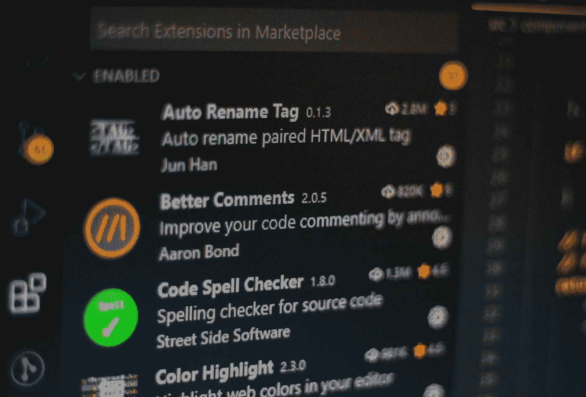
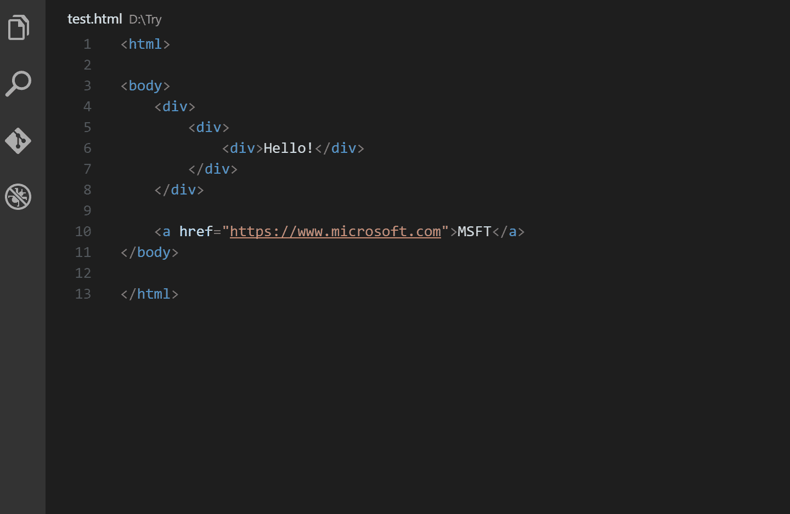
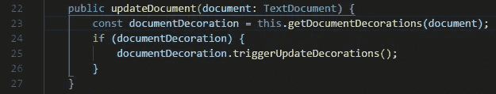
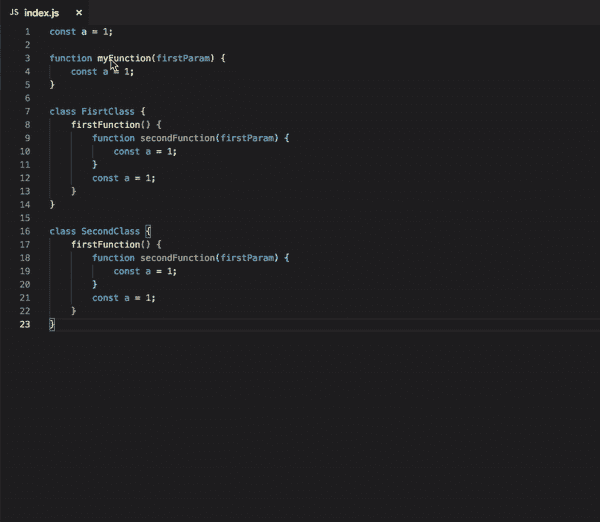

# 这些 VS 代码扩展对你来说非常有用

> 原文：<https://betterprogramming.pub/these-vs-code-extensions-can-be-super-useful-for-you-24797e64f2c5>

## 我一直都在用它们



费伦茨·阿尔马西在 [Unsplash](https://unsplash.com?utm_source=medium&utm_medium=referral) 上的照片

市场上有如此多的代码编辑器。他们中很少有人在 dev 社区非常受欢迎；其他人不是。其中一个流行的代码编辑器是 Visual Studio Code，它被称为 VS Code。这个编辑器是大多数像我这样的开发者的首选。我非常喜欢这个工具。

默认情况下，它提供了许多在编码时非常有用的特性。但是，作为人类的天性，我们对任何事情都期望很少，即使是 VS 代码。然后，您尝试扩展该工具提供的功能，并意识到有一些扩展可以用来改进您的日常工作流程。

> “VS 代码扩展允许您向安装中添加语言、调试器和工具，以支持您的开发工作流。VS 代码丰富的可扩展性模型允许扩展作者直接插入 VS 代码 UI，并通过 VS 代码使用的相同 API 贡献功能。”— [VS 代码文档](https://code.visualstudio.com/docs/editor/extension-marketplace)

在本文中，我们将讨论一些我日常使用的扩展，它们对你也很有用。如果你不知道如何在 VS 代码中搜索和安装扩展，可以关注[这个链接](https://code.visualstudio.com/docs/editor/extension-marketplace)。

# 1.自动重命名标签

顾名思义，[自动重命名标签](https://marketplace.visualstudio.com/items?itemName=formulahendry.auto-rename-tag)在第一个标签更新时重命名第二个标签，反之亦然。当我们重命名一个 HTML 或 XML 标签时，它会自动重命名成对的标签。



作者照片

要阅读更多关于这个扩展的内容或了解如何进行一些配置更改，请遵循[官方文档](https://marketplace.visualstudio.com/items?itemName=formulahendry.auto-rename-tag)。

# 2.括号对着色机

这个扩展允许用颜色来标识匹配的括号。[括号对着色程序](https://marketplace.visualstudio.com/items?itemName=CoenraadS.bracket-pair-colorizer)允许查看 CSS ID 和类字符串，作为从 HTML 文件到相应 CSS 的定义。它允许查看并转到定义。



作者照片

在截图中我们可以看到，所有匹配的左右括号都是相同的颜色。因此，识别一个板块在哪里关闭是相当容易的。

我们实际上可以为这个扩展改变一些设置，比如我们可以定义匹配哪些字符，使用哪些颜色。要了解我们如何进行这些配置更改，请点击[链接](https://marketplace.visualstudio.com/items?itemName=CoenraadS.bracket-pair-colorizer)。

# 3.吉特朗斯

这张是我最喜欢的一张。为什么？因为它多次帮助我证明我没有添加那几行代码。

我们知道在我们的日常事务中使用了多少 Git。而且 VS 代码实际上有内置的 Git 能力。但是这个扩展提供了一些有用的见解，这些见解是 VS 代码的内置功能所不能提供的。

GitLens 只是帮助我们更好地理解代码，以及何时进行这些更改。它可以快速向我们显示由谁、为什么以及何时添加或更改了一个代码块或一行代码。我们甚至可以回顾提交历史，以进一步了解代码是如何以及为什么演变的。


作者照片:修订导航


作者图片:电流线怪

这个扩展有很多功能。我强烈推荐浏览一下[官方文档](https://marketplace.visualstudio.com/items?itemName=eamodio.gitlens)，看看所有的特性以及它们如何在开发过程中帮助你。

# 4.CSS Peek

CSS Peek 允许窥视 CSS ID 和类字符串，作为从 HTML 文件到相应 CSS 的定义。它允许你偷看和去定义。

> “这个扩展扩展了 HTML 和 ejs 代码编辑，增加了对源代码字符串中 css/scss/less(类和 id)的`Go To Definition`和`Go To Symbol in Workspace`支持。”— [VS 代码文档](https://marketplace.visualstudio.com/items?itemName=pranaygp.vscode-css-peek)


作者照片

它没有更多的功能可以提供。想了解更多，请点击[链接](https://marketplace.visualstudio.com/items?itemName=pranaygp.vscode-css-peek)。

# 5.波拉科德

拍摄好看的代码截图可能是一个挑战。但是不用担心。Polacode 将会改变这一切。Polacode 允许你创建独特的和可共享的代码截图。使用 Polacode 时，它会保留您现有的主题和字体，并呈现出令人惊叹的布局。


作者照片

Polacode 没有更多的功能。想了解更多，请关注[官方文档](https://marketplace.visualstudio.com/items?itemName=pnp.polacode)。

# 6.涡轮控制台日志

我们知道控制台对我们有多重要。每当我们必须调试某个东西时，我们更喜欢使用`console.log`并在控制台中打印值。但是有时，编写所有这些日志语句会变得有点麻烦。在这些情况下，涡轮控制台日志会非常有用。

Turbo Console 日志通过自动编写有意义的日志消息，使调试变得更加容易。

一旦你安装了这个扩展，你只需要遵循这两个步骤:

*   选择作为调试主题的变量
*   按下`ctrl` + `alt` + `L`

日志消息将插入与所选变量相关的下一行，如下所示:

```
console.log(“SelectedVariableEnclosingClassName -> SelectedVariableEnclosingFunctionName -> SelectedVariable”, SelectedVariable)
```



作者照片

有关该扩展的更多信息，请遵循[官方文档](https://marketplace.visualstudio.com/items?itemName=ChakrounAnas.turbo-console-log)。

# 结论

VS 代码是一个很棒的工具。这些扩展使这个 IDE 更加强大。该列表不仅限于这些扩展名。有成千上万的扩展可以在你的日常生活中超级有趣地使用。

让我知道你日常用的是哪个，你最喜欢哪个。

这就是这篇文章的内容。我希望你今天学到了一些新东西。想看更多这样的文章，敬请期待！

感谢阅读！