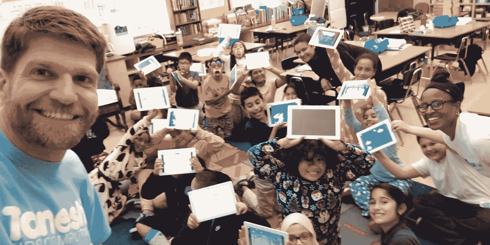

# “他们在这里不欣赏你”

> 原文：<https://betterprogramming.pub/they-dont-appreciate-you-here-as-a-black-woman-how-i-became-a-tech-founder-96629021aa8d>

## **作为一名黑人女性，我是如何成为一名科技创始人的**

Tanoshi 团队与 Daymond John 在鲨鱼池上达成协议(图片来源:[商业资讯](https://www.businesswire.com/news/home/20200507005327/en/Tanoshi-Wins-500K-Deal-Shark-Tank)

经常有人问我这样一个问题:作为一名黑人女性科技创始人，你是如何走到今天这一步的？

我实话实说。创业之旅并不适合所有人。然而，另一方面，企业界也不是这样。

创业是你血液里的东西。你要么喜欢冒险，不断体验惊险刺激的过山车之旅——你是扭曲的巨人类型。或者你想稳扎稳打，需要公司工作的稳定性。在这种情况下，你可以在你的余生坐在旋转木马上。

两种性格都很好。然而，你只需要知道你自己和你能处理什么。

我一直知道我想自己创业。在读研期间，我当时的想法是给美国公司十年的时间。我想学习建立自己的帝国所需的技能，然后继续前进。好吧，10 年变成了 15 年，不知不觉 20 年过去了。

然后…嘭！我的整个生活都变了。

我在同一家公司工作了九年。在我的工作情况发生重大转变之前，我一直在稳步前进。

我现在的经理是公司的首席财务官，他要离开了。在他离开之前，我们进行了一次推心置腹的讨论。他让我知道将要发生的事情，这将对我在那家公司的职业生涯产生负面影响。

这位首席财务官透露，我的新经理将是一名外部承包商——在公司的许多项目上向他汇报的人。他非常了解该承包商的个性和职业道德，但不认为该承包商适合该公司。首席财务官向高管们解释了他不赞成任命他为我老板的决定，但他们不听。

你看，首席财务官是我的拥护者。他认为我的附加值、出色的表现以及九年来对公司的奉献应该得到一个更高级别的职位。

在 90 分钟的谈话中，我永远不会忘记他对我说的一句话:“他们在这里不欣赏你。”当他说出那些原话时，我惊讶得目瞪口呆。这是我一直以来都知道的。他对高级管理层的想法和基本原理有内部独家报道，这给我已经知道的东西带来了新的意义。

他告诉我的是，在那家公司，我永远不会被邀请坐在白人男孩的公司桌旁。

几周后，我开始向我的新经理汇报工作。我们第一次见面时，他就向我明确表示，他希望我出局。结果，当我在教他如何做好自己的工作时，他却想尽一切办法让我的生活变成人间地狱。接下来的两年压力非常大，精神消耗很大，以至于我开始去看心理医生。

最后，他赢了！他把我赶出去了。我在那家公司总共工作了 11 年，从它的早期阶段就开始帮助它建设。建立了许多记忆，但不幸的是，我在过去两年中经历的痛苦和屈辱最为突出。

离开后，我四处摸索，试图重新找到自己。过去的经历给我造成了精神创伤，我不想涉足另一个公司职位。是时候开始我自己的事情了——这是我十年前就应该做的事情，但我已经变得太自满了。我开始和一些创业公司合作，但是没有什么是真正坚持下来的。

直到一天晚上。

一个好朋友拉我去加州奥克兰的卡普尔中心参加投球比赛。当企业家们在推销时，有一个特别引起了我的注意。一名身材高大的白人男子站起来，做了 90 秒钟的推销，介绍一款名为 Tanoshi 的新型儿童电脑。这个项目非常有趣，因为它针对的是得不到充分服务和代表不足的孩子。那时，我正在帮我妈妈安装打字应用程序，所以当他展示他孩子的电脑时，绿灯开始在我脑海中闪烁。

*旁注:多年来，我和我妈妈一起开发儿童教育材料。我妈妈在洛杉矶联合学区教了 50 年书。她在洛杉矶中南部教书，在那里她创作了自己的教育材料，会引起学生的共鸣。她创作了歌曲、韵文和书籍。后来我们一起开发了应用程序，用的是她在课堂上教学时非常成功的材料。*

推介结束后，我立即走向那个名叫[布拉德·约翰斯顿](https://thriveglobal.com/stories/brad-johnston-tanoshi-are-a-good-leader-does-not-give-up-when-times-are-tough-or-look-for-others-to-blame/)的高大白人，并做了自我介绍。我祝贺他的推销，并告诉他我和我妈妈的打字项目。

我们立刻一拍即合。

快进到今天。与 Brad 和 Tanoshi 团队合作已经将近三年了。我不得不说，尽管创业是一段艰难的旅程，但它非常值得。Tanoshi 是一个充满热情的团队，致力于为每个孩子提供公平的成功机会。具有讽刺意味的是，这是我一直以来想从美国公司得到的一切。然而，美国企业辜负了美国黑人。

在 Tanoshi，有许多挑战。我们并不总是在每一项努力上都意见一致，但我认为这让我们更加强大。都是关于沟通，倾听，尊重对方的意见。我和许多创业公司合作过，坚信你的团队就是一切——他们会成就你，也会毁掉你。

我现在是 CMO 的联合创始人，也是 Tanoshi 的董事会成员。从第一天起，我们的目标就是创建一个多元化的团队，反映我们国家的各种文化。我会确保这一切发生。

我认为我的故事是一个异常。来了解一下，我不是一个人。这些年来，我遇到了许多黑人社区分享的关于他们工作经历的故事。可悲的是，当我听到一些人所经历的事情时，就好像我又一次经历了我的噩梦。

当我回顾这些年来——我的成长，我的成就和挫折，我的毅力和自满，以及我一路上流下的所有眼泪——我知道我在我应该在的地方，一个黑人女性科技创始人！

对于那些现在可能正经历困难时期的人来说，真的有希望。试着不要内心太痛苦，以至于看不到人们好的一面——不管他们是什么种族。继续往前推。与此同时，要愿意倾听那个指引你走向隧道尽头光明的微弱声音。

这是我的故事和#ActionMustHappen。

Tanoshi 团队在东奥克兰教一个五年级的班级编程(图片来源: [Tanoshi](https://tanoshikidscomputers.com/pages/about-tanoshi)

感谢阅读！