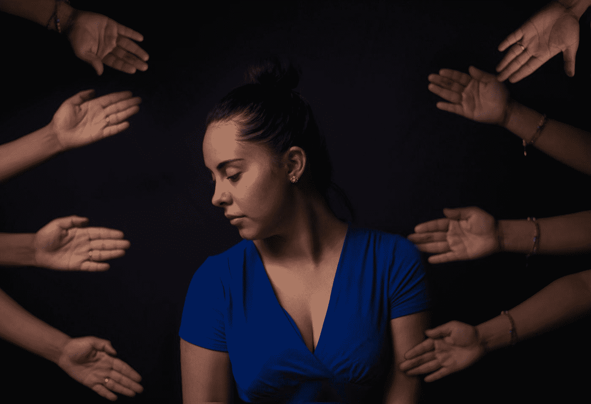
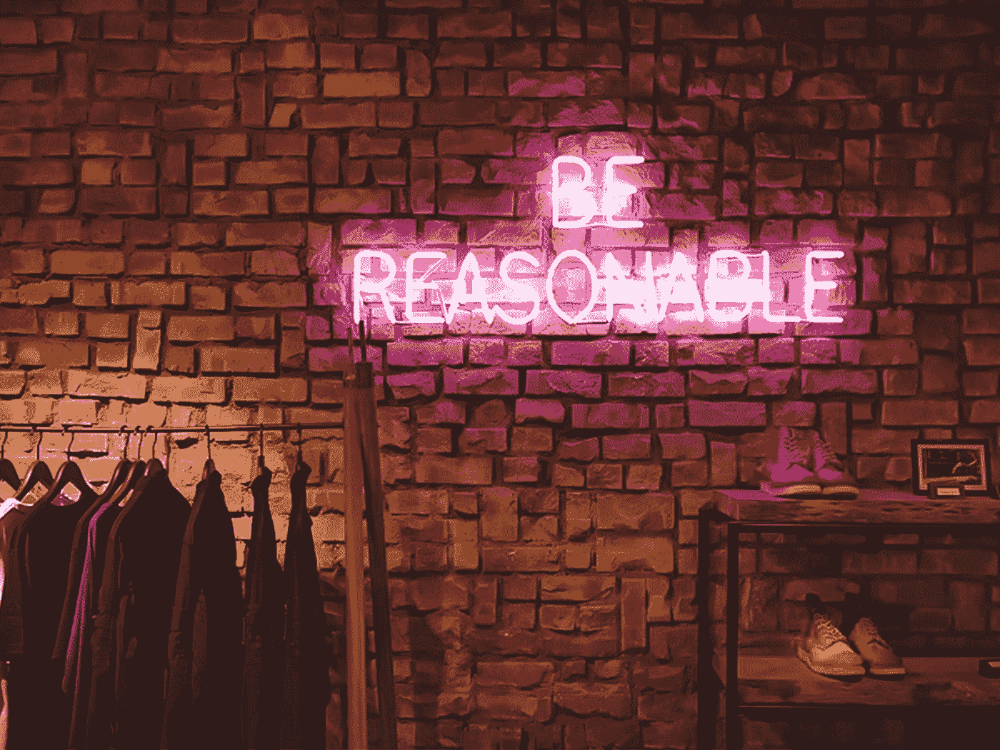

# 我希望在开始编码之前就知道的事情

> 原文：<https://betterprogramming.pub/things-i-wish-i-knew-before-i-started-coding-5f7f97e11873>

## 在开始编码之前，您应该了解以下内容

托马斯·Q 在 [Unsplash](https://unsplash.com?utm_source=medium&utm_medium=referral) 上的照片

学习编码是我一生中非常积极的经历。我相信编码极大地培养了我深入思考问题并将问题分解成可解决和可消化的部分的能力。

在这篇文章中，我会在开始编码之前告诉自己。我希望你能利用我的一些想法和建议。

# 寻求帮助是可以的

编程有时极具挑战性，尤其是在刚开始的时候。不要因为寻求帮助而感到难过。这就是创造良好工作环境的要素——拥有可靠友好的同事，你可以随时向他们寻求支持，反之亦然。

一个伟大的团队会交流想法和问题，以及解决方案。

照片由[克里斯蒂安·纽曼](https://unsplash.com/@cristian_newman?utm_source=medium&utm_medium=referral)在 [Unsplash](https://unsplash.com?utm_source=medium&utm_medium=referral) 上拍摄

# 学会多说“不”——知道自己的极限

编码就是尽可能高效快捷地解决问题。很容易过度承诺和低估事情需要的时间。

我建议不要把自己分散得太开——能在截止日期前完成项目是件好事。一般来说，你应该少表达，多表达。

[维克多](https://unsplash.com/@victor_g?utm_source=medium&utm_medium=referral)在 [Unsplash](https://unsplash.com?utm_source=medium&utm_medium=referral) 上拍摄的照片

当你在为当地动物收容所开发移动应用程序时，有人向你提出开发下一个大项目的请求，在人手已经满满的情况下，接受这样一个艰难的冒险有意义吗？

放下你的脚，学会多说“不”——但是你仍然应该倾听好的想法(你永远不知道)。很难掌握什么时候说是和不是，但随着时间的推移会有的。不过，你不应该对任何事情都说不。

一些最好的想法毫无疑问是从疯狂的想法开始的——例如，以 Airbnb 为例。现在我身上没有一根骨头怀疑 Airbnb 的天才——但当创始人刚刚起步时，这听起来很可怕。你想邀请陌生人到你家睡在充气床垫上，并为他们提供早餐？但结果对他们来说很棒。

# 你的家人和朋友会认为你是个电脑奇才(“你会帮我修打印机吗？”)

我参加了一个庆祝生日的家庭聚会，很快，我被要求我查看设备的问题淹没了。

我坐在沙发上，带着两台笔记本电脑和两部手机。幸运的是，这并没有造成灾难，因为我非常喜欢电脑和电子产品。

# 休息片刻来充电，避免精疲力竭

这是我个人非常纠结的事情。我更倾向于工业领域——这让我有日夜工作的冲动。谢天谢地，我意识到这肯定不是一种可持续的生活方式。我费了几番周折才最终明白了这一点。

为了克服这一点，我和自己达成了协议，我允许自己在周六和周日休息。周六我被允许做兼职项目，而周日我甚至不被允许打开代码编辑器。

这是马拉松，不是短跑。人们已经编程几十年了——成为伟人没有捷径可走。精通和自信需要很长很长的时间。

# 结论

感谢阅读，我希望你喜欢这篇文章。

保持酷劲，快乐编码！