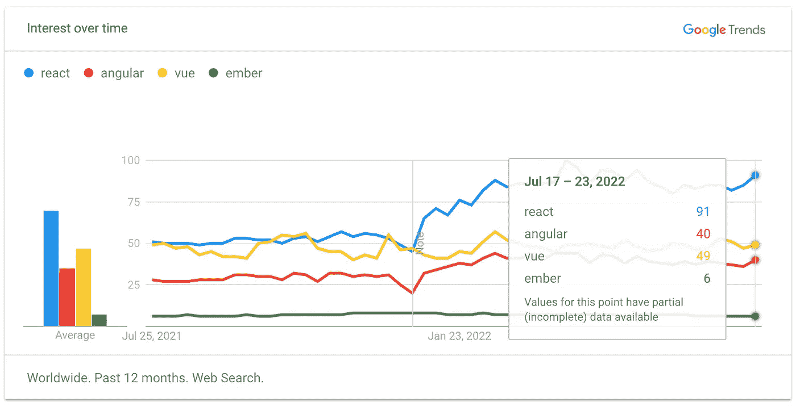

# 在过去六年的 React 工作中，我学到了 8 件事

> 原文：<https://betterprogramming.pub/things-ive-learned-over-the-last-6-years-working-with-react-f01a8f02146b>

## React 是一个库，不是框架

照片由[劳塔罗·安德烈亚尼](https://unsplash.com/@lautaroandreani?utm_source=medium&utm_medium=referral)在 [Unsplash](https://unsplash.com?utm_source=medium&utm_medium=referral) 上拍摄

时光飞逝。五年前，我们在团队中评估了 React、Angular 和 Vue，并决定使用 React。

今天，看起来我们做出了正确的选择。React 仍然存在——与许多其他 JavaScript 库不同，Google Trends 取得了成功。

在过去的六年里，我学到了一些重要的东西:

# 1.React 是一个库，不是框架

例如，Angular 是一个框架，而 React“仅仅”是一个库。虽然 Angular 带来了实现和维护复杂业务应用程序所需的许多东西，但 React 侧重于 GUI 组件的实现。

用于表单、验证、国际化等。在 React 应用程序中，必须使用第三方库。这带来了大量的自由，但也可能导致依赖地狱和错误的选择。

如果您不想构建自己的 React 堆栈，当然可以使用众多 React 框架中的一个:

[next . js](https://nextjs.org/)

[**Vite**](https://vitejs.dev/)

[**混音**](https://remix.run/)

# 2.不要使用另一个库来解决所有问题

向项目中添加新库时，请务必小心。相信我，如果你想保持你的依赖关系是最新的，并且在项目中使用许多库，这些库要么没有被维护，要么经常包含不兼容的变更，那么你最终会陷入混乱。

当您添加一个新的库时，您应该通过查看 GitHub 上的以下几点来检查它的质量:

*   上一个版本是几岁？
*   该库使用了多少依赖项，它们是最新的吗？
*   项目有多少星级、下载量、开放问题和开放拉动请求？

特别是如果涉及到样式，我建议创建一个定制的组件，而不是使用一个现有的复杂的可配置的组件，它的样式必须被覆盖，这很无趣！

# 3.如果您使用组件库，请使用无头组件

如果您觉得工作量太大，或者可以理解您不想实现自己的日期选择器或下拉组件，那么您应该寻找“无头组件”这些组件涵盖了必要的功能和 UX，但没有样式。开发人员可以根据自己的需要设计这些组件的样式。

这里有几个我可以推荐的无头组件库:

*   [无头 UI](https://headlessui.com/)
*   [原语——基数 UI](https://www.radix-ui.com/)
*   [GitHub —降档-js/降档](https://github.com/downshift-js/downshift)

# 4.不需要用 Redux

React 不是一个框架，所以你很快就会得出结论，你仍然需要一个数据管理或状态管理的主干。

我们知道的有用户交互的应用程序的经典模式是 MVC——模型视图控制模式。脸书给了我们一个选择:[通量](https://facebook.github.io/flux/docs/in-depth-overview/)。

对于这种方法，现在有许多 React、Angular 和其他 UI 解决方案的采用和实现。

最流行的状态管理实现是 redux，但是你不需要使用 Redux。花些时间为您的应用找到合适的解决方案。除了 Redux，还有一些替代品——我可以推荐 [Zustand](https://github.com/pmndrs/zustand) 。

您也可以保持简单，只使用组件的状态，并使用属性将其传递给子组件。这适用于很多情况。对于数据，您需要跨应用程序并希望在应用程序级别进行管理，如用户会话，您可以使用 React Context API。

我主要使用下面的模式来创建一个上下文，并在使用自定义钩子的组件中使用它。

创建一个包含用户上下文本身、提供者和访问上下文的快捷钩子函数的文件。方法如下:

将提供者放在组件树中尽可能高的位置。下面是实现这一点的代码:

最后，使用以下代码访问任何组件中的用户上下文:

# 5.正确使用 PropTypes

> 随着应用程序的增长，你可以通过类型检查发现很多错误。对于某些应用程序，您可以使用 JavaScript 扩展，如 [Flow](https://flow.org/) 或 [TypeScript](https://www.typescriptlang.org/) 来对整个应用程序进行类型检查。但是，即使您不使用这些，React 也有一些内置的类型检查功能。
> 
> [https://reactjs.org/docs/typechecking-with-proptypes.html](https://reactjs.org/docs/typechecking-with-proptypes.html)

正如 React 的文档所说，使用 prop-types 库可以防止类型错误，尤其是在不使用 typescript 或 flow 的情况下。

这相对来说很容易也很好。只是我的一个小建议:

不要用合适类型来描述一般的数据结构，要用它们来定义你对组件的期望。否则，您将最终得到对多个组件有效的大形状，增加了耦合性并容易出错。

# 4.保持你的组件小

为 React 组件找到合适的尺寸是最困难的事情之一。组件越大，维护和测试就越复杂。另一方面，太小的组件会使你的代码难以阅读——也难以维护。

我的建议是使用标准的软件开发模式来分离组件。与 React 相关的最重要的功能如下:

*   [构成 vs 继承](https://reactjs.org/docs/composition-vs-inheritance.html)
*   [关注点分离](https://en.wikipedia.org/wiki/Separation_of_concerns)
*   [不要重复自己](https://en.wikipedia.org/wiki/Don%27t_repeat_yourself)

永远记住，你不是在为自己或编译器/浏览器写代码。你是在为别人写代码，所以尽量坚持鲍勃大叔的[干净代码](https://cleancoders.com/)哲学。

# 7.将组件库分成至少两个模块

这是一个真实的故事。在我的团队中，我们是公司中第一个使用 React 的人。因此，我们必须实现许多布局 React 组件，以遵循公司的风格指南。

当第二个团队开始使用 React 时，该团队当然不想在 React 中再次实施公司风格指南，并要求我们提供 React 组件。

不幸的是，将它从我们的项目中分离出来几乎是不可能的，因为它非常强烈地依赖于我们的业务逻辑。

我的建议是从一开始就创建自己的 UI 组件库，不包含任何业务逻辑。这使得在团队或项目之间共享这些组件变得更加容易，使得测试和处理组件变得更加容易和有趣，当然，也使得以后的重新设计变得非常容易。

对于 UI 组件的实现，像 [Storybook](https://storybook.js.org/) 这样的解决方案是不错的选择。

为了不陷入内部依赖广告版本的地狱，请为您的应用程序和库使用 monorepo。NX 可以帮你做到这一点。

# 8.编写测试

我也被称为 100%先生，因为我认为你的单元测试报告应该有 100%的覆盖率。在测试覆盖率中明确忽略部分代码比说 80%的覆盖率就足够了要好。这样的话，你就冒了重要部分没有被测试的风险。

我测试 React 应用程序的首选测试设置包括作为测试运行器的 [Jest](https://jestjs.io/) 、作为 React 组件单元和集成测试框架的 [React 测试库](https://testing-library.com/docs/react-testing-library/intro/)以及用于完整端到端测试的 [Cypress](https://www.cypress.io/) 或[剧作家](https://playwright.dev/)。

感谢阅读。