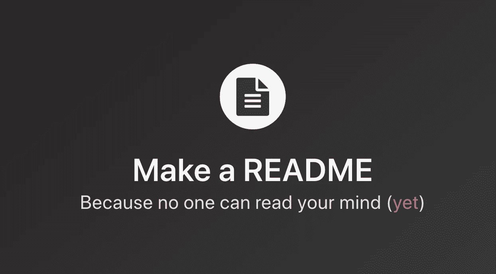

# 新开发人员在将代码推向生产时容易忘记或忽略的事情

> 原文：<https://betterprogramming.pub/things-that-new-developers-tend-to-forget-or-neglect-when-pushing-code-to-production-fb32d9d01519>

## 新开发人员在将代码投入生产之前的清单

马特·拉格兰在 [Unsplash](https://unsplash.com/s/photos/productivity?utm_source=unsplash&utm_medium=referral&utm_content=creditCopyText) 上拍摄的照片

向公众发布代码很可怕，但也不尽然。如果用户界面崩溃或者有人入侵数据库怎么办？幸运的是，我们可以采取一些对策来减轻启动项目带来的一些麻烦。

这里有一个清单，任何新开发人员在向公众发布他们的代码之前都可以把它划掉。事不宜迟，清单如下。

# 将密钥和令牌置于版本控制之外

有两种类型的密钥和令牌，它们是`secret`和`public`密钥。`secret`和`public`的区别如下:

*   `secret`钥匙应该而且必须藏起来。一般来说，他们不应该离开你的私人服务器(或服务，如 Netlify 或 Travis CI)。密钥通常用于数据库或 API 连接。
*   `public`密钥可自由共享，并包含在浏览器请求中。公钥通常用于分析服务、崩溃报告分析等。

# 安全处理秘密

遵循这些步骤来消除代码中的秘密泄露 **:**

*   用环境变量替换硬编码的键，例如`process.env.SECRET_API_KEY`。*环境变量*是一个变量，其值在程序之外设置，通常通过操作系统或微服务内置的功能来设置。
*   使用类似`[dotenv](https://github.com/motdotla/dotenv#dotenv)`的库创建一个`.env`文件。将您之前硬编码的秘密添加到`.env`文件中。
*   最后但同样重要的是，将`.env`添加到您的`.gitignore`文件中。

# 拥有一个自动化的生产管道，并确保它运行您的测试

为了确保最高等级的代码质量，我们需要对每个提交/拉取请求进行多次检查。当您在团队中工作并确保每个人都遵循最佳和最新的实践时，运行代码检查尤其有用。

我们在谈论什么样的支票？首先，运行我们的单元测试以确保一切都通过，构建并捆绑我们的前端以确保构建不会在生产中失败，并运行我们的 linters 以执行标准。

如果你想了解更多关于 React 的持续集成，我之前写过一篇文章:“[如何用 React、CircleCI 和 GitHub](https://medium.com/better-programming/how-to-setup-continuous-integration-ci-with-react-circleci-and-github-e0efd5040b03) 设置持续集成(CI)。”

# 避免在下午 3 点后投入生产

明智的做法是避免在下午 3 点之后进行任何代码部署。如果出现任何问题，在一天的早些时候将代码投入生产会让您有足够的时间来诊断或恢复更改。

这条规则很有用，因为不管一天中的哪一天，在大约 15 个小时内中断所有事情都是不可接受的，同时，它使在星期五部署变得安全，就像在其他任何一天一样。

唯一的例外是修复导致应用程序崩溃的关键错误。有时我们被迫尽快推出补丁。

# 制作生产数据库的备份(奖励:测试从备份中恢复的尝试)

如果数据库非常重要，需要放在生产服务器上，那么它就是生产质量的数据库，应该有备份。如果你真的很聪明，你甚至应该有备份的备份。

几年前，[有一次，一名初级开发人员不小心删除了生产数据库，结果立刻被解雇了。](https://www.reddit.com/r/cscareerquestions/comments/6ez8ag/accidentally_destroyed_production_database_on/)老实说，这不是初级开发人员的错，因为没有一家合适的公司将其生产密钥用于入职流程和文档。

# 拥有易于遵循的项目设置说明

优秀的文档是项目成功的关键。拥有可访问的文档使人们能够了解您的项目。

记录项目的两种常用方法是自述文件和 wikis:

*   对于其他用户来说，文件是了解你的工作的一种快速而简单的方式。

[自述网站](https://www.makeareadme.com/)

*   GitHub 上的 Wikis 可以帮助你以一种有用的方式展示关于你的项目的深入信息。

至少为你的项目准备一份自述文件是个好主意，因为这通常是许多人第一次发现你的项目时会阅读的第一件事。

# 结论

感谢阅读，我希望你学到了新的东西。请记住，将代码部署到实际的产品服务器上并不可怕。保持高效，快乐编码！

了解我最新内容的最好方式是通过我的[简讯](https://wholesomedev.substack.com/welcome)。成为第一个得到通知的人。

我的[简讯](https://wholesomedev.substack.com/welcome)。成为第一个得到通知的人。