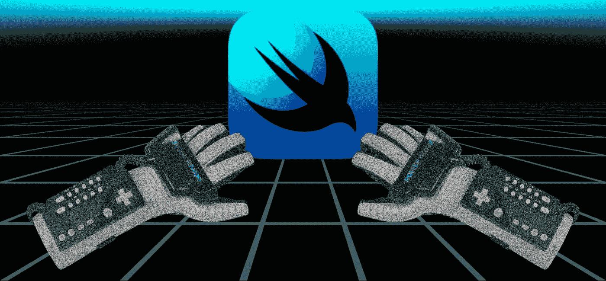
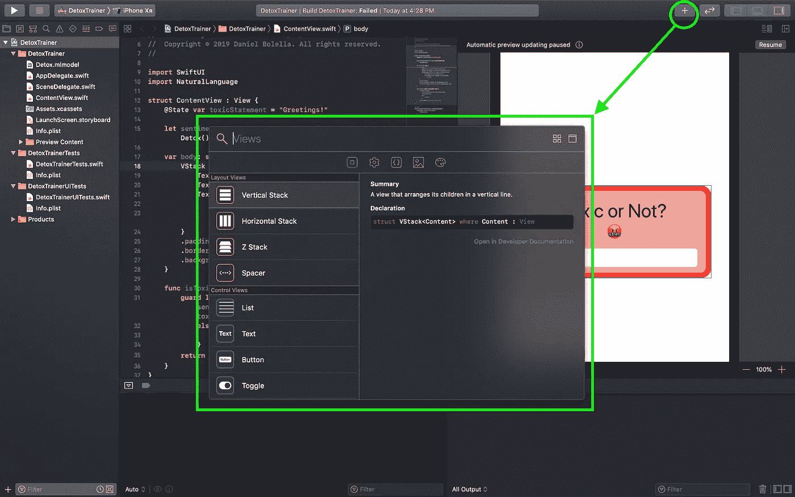
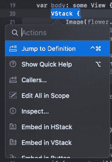
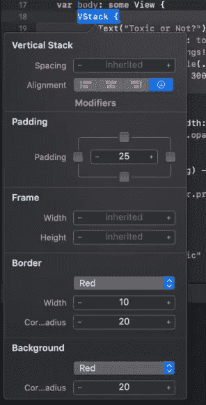

# 在 SwiftUI 中编码时要知道的事情

> 原文：<https://betterprogramming.pub/things-to-know-when-coding-in-swiftui-33a6ce5e2fc4>

## *我在 SwiftUI 项目中发现的我将来肯定会用到的东西*

[SwiftUI](https://developer.apple.com/xcode/swiftui/) 让我相当兴奋。

主要是因为我已经使用其他反应式框架有一段时间了，我理解了这个概念，但也因为我已经看到了故事板/ [IB](https://developer.apple.com/xcode/interface-builder/) 及其背后的视图控制器的好处。

而且，虽然我已经掌握了自动布局和约束，但如果 SwiftUI 能够真正掌控方向盘，我会更愿意挂上那个徽章。

在闲逛的时候，我记下了一些我意识到对未来非常有用的事情(或者提前知道会很好)。

一些是关于 Xcode 和编辑器的，另一些是关于 SwiftUI 和它是如何工作的。对于 Xcode 用户来说，这里的内容并不一定都是新的，可能看起来很初级。

不过，如果它在这里，那就意味着我发现 SwiftUI 值得一提，特别是因为我相信有些人可能会使用新的框架进行编码。

让我们开始吧…

# 右上角的+

“+”对 Xcode 来说不一定是一个新东西，到现在为止，你甚至可能根本不会使用它。

但是，如果您不确定 SwiftUI 中哪些视图和控件是现成可用的，或者在使用 Interface Builder 或 storyboards 时曾经使用过 controls 菜单，那么请将它作为您的指南。

这里列出了所有包含的 SwiftUI 视图，以及它们各自的描述。在下一个选项卡上，也有这些视图的修改器列表。

这也是您可以签出代码片段、图像引用和颜色的菜单。

# CMD+单击 SwiftUI 视图

很多好东西，有些我会在下面解释

CMD+点击东西已经不是什么新鲜事了。然而，当你正在使用一个新的框架来组成你的 UI 时，它可能是值得重新审视的。在这种情况下，它确实是。

弹出的菜单确实为您提供了您想要在特定视图中深入了解的一切。我确实喜欢标准的“定义”和“调用者”选项，但是其他一些选项可能会为您的代码带来您可能没有意识到或忽略的机会。

我会在列表中更深入地挖掘一些选项，但这是在 Xcode 中编辑时必须使用的。

# 在预览中有效地测试导航

预告很牛逼。这可能是你对使用 SwiftUI 感到兴奋的主要原因之一(或者不是，这是你的选择)。对我来说，它是 SwiftUI 开发核心的一部分，这也是它不在这个列表中的原因。

但是，关于预览最酷的部分之一是设置测试数据和条件，这样预览就有工作可做了。

当使用导航时，特别是详细页面，在导航流中测试页面的一个好的技巧是在导航视图中包装它。

这可能看起来很奇怪，因为你是从上一页开始设置你的导航位置，或者任何其他细节，但是没关系。你**在这里定义**那个。我们只想知道我们的页面在这个流中是什么样子，剩下的就要靠我们自己去处理和观察了。

# 测试数据不必留在预览中

虽然我们的主题是测试和预览，但这更多的是一个现实检查，而不是一个功能。

你可能已经观看了 [WWDC 2019 SwiftUI 集合](https://developer.apple.com/videos/)中的所有视频，并看到他们谈论在预览方法中提供测试数据，以及这有多棒。的确如此。

但不要忘乎所以。这不是全部，是全部。仍然值得测试你的应用程序，用传统的方式编译和运行它，在这种情况下，你可能希望测试数据超出预览的范围。

或者，如果这只是一个演示或 POC 应用程序，真的要考虑一下情况，问问自己:“我真的需要在预览中保留它吗？”

仅仅因为它可用并不意味着它是唯一的方法或最好的方法。不要觉得局限于新的特性或模式。它仅仅是一个工具和选择。

# 身体视图没有任何属性

在我用 SwiftUI 构建了一个实验性的应用程序后，我想尝试的第一件事就是美化我的实际 UI。

为什么不从改变应用程序的背景颜色开始呢？对吗？因此，我去编辑最外层视图的背景属性，也就是 body 被设置为的那个。

这时我得到了一个“预期声明”错误。

这里的视图是一个希望被填充的协议，而不是一个可编辑的视图本身。它将我们放入其中的视图和控件传递给`ContentView`来显示。

# 状态存在于内容中

SwiftUI 的一个巨大特点是数据现在如何与您的 UI 同步。

特别是，我发现新的`@State`标签使用起来非常简单有效。(你可以在我的文章[shoe horning swift ui and Create ML—第 2 部分](https://medium.com/better-programming/shoehorning-swiftui-and-create-ml-part-2-a8932075e09a)中查看我是如何使用它的)。

我对`@State`变量的了解是，它们需要存在于你计划使用它们的内容中，它们不是全局的。

当您在计划使用它的内容之外声明它时，会出现编译器错误。这实际上很好，因为`@State`是为包含的 UI 定义的，而不是为整个应用程序定义的。

这也意味着内容范围之外的方法不能设置状态。您需要让该方法返回一个可以在内容内部识别的结果，这样就可以确定和设置一个合适的状态。

如果该方法是内容专有的，您可以将该方法放在内容的范围内，并从内部轻松引用和设置`@State`。

# 检查:懒惰的风格

当我使用故事板时，我通常会打开右侧面板来修改我的 UI 视图和控件。

对于 SwiftUI，该菜单仍然非常有用，因为它反映了您当前关注的视图的可用修饰符。另外，当您进行修改时，它会自动将其添加到您的代码中。

然而，尤其是当您使用预览窗口时，Xcode 会变得非常拥挤。

如果是这种情况，CMD+click 提供“Inspect ”,它会在我们的编辑器中弹出我们的修改菜单，就像侧面板一样工作。我更喜欢这种方法，因为我也专注于特定的视图，我的屏幕不会感觉太忙或混乱。

当你纠结于在哪里放置房产时，这是一个很好的指南。

SwiftUI 属性的工作原理是它们可以影响视图的层次结构。如果您感到困惑，使用检查器至少可以帮助处理属性，并在预览中查看它们如何立即影响您的 UI。

# 学习通过提取定制视图来制作它们

提取子方法几乎是重构的一个标准。我们这样做是为了保持代码的整洁，有时是为了保护代码，有时甚至是为了重用。

在 SwiftUI 中，这些好处延续了下来，并真正有助于使您的 UI 代码可读性更好，更简洁。

这就是为什么我会说提取视图是 SwiftUI 中必须开发的规程。

从短期来看，养成这个习惯会让你的视图层次结构不会变得笨拙。但是，从长远来看，它还允许您将这些子视图作为自定义视图在其他地方使用，或者直接引用它们，或者通过将它们复制粘贴到其他地方来作为起点。

为了说明我的观点，这在故事板/IB 中并不总是简单的。

假设您想要为一个`TableView`复制一个单元格。这几乎总是感觉像一场赌博——要么顺利，要么对你的约束和出路造成严重破坏。

然而，在 SwiftUI 中使用提取的单元格就像直接引用它一样简单，或者像普通方法一样复制粘贴、编辑和使用它。

# 重构现在比以后更好

重构特性(特别是在 CMD+click 菜单中)非常好……但是可能不会马上显现出来。

我不想这么说，但这是编辑器的弱点。这是因为您实际上不能重构多行视图，只能重构您单击的视图。

让我来解释为什么这可能令人沮丧，但也可以避免。

假设您有一个视图集合，为了整洁和重用，您想将它提取到一个子视图中。

这里的关键是它们需要被封装在一个视图中(可以是视图、栈、`NavigationButton`等)。)因为你在做一个`Sub**View**`。感觉是不能 CMD+点击一组视图的原因之一。

但是，在`<Embeddable View>`特性中使用嵌入，然后*再*提取，这不是很好吗？

同样，你只能关注你点击的视图，所以如果你走这条路，你仍然需要将其他视图移动到你的新嵌入中。正是这种缺点让原本很好的重构工具集黯然失色。

# 结论

这些只是我在测试版中发现的一些乱七八糟的东西，我确信还有其他的金块和宝石可以被发现。

我也确信，当 Xcode 11 成为金色的时候，其中一些很可能会改变。

记住这些提示的最大好处是，它可以帮助您进入 SwiftUI 呼吁开发人员具备的新心态。

苹果本质上是在宣布，他们已经接受了反应式 UI 开发是新的标准。

如果你来自 Angular、React 或 [Flutter](https://flutter.dev/) 的世界，你在某种意义上已经接触到这种心态。但我确实喜欢苹果对它的态度和它的精致。

我的最后一个技巧是:去获取测试版，亲自尝试一下！