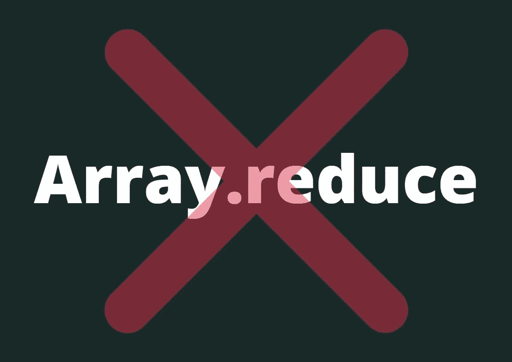

# 避免使用 Array.reduce 的 4 个理由

> 原文：<https://betterprogramming.pub/think-again-before-you-use-array-reduce-28f785b5aea9>

## 不用它编写更可读的 JavaScript

作者照片。

随着函数式编程(FP)范式的兴起，我们构建 JavaScript 应用程序的方式每年都在变化。由于这个原因，数组方法非常流行，因为你可以将它们链接起来(例如`map.filter.map.flatMap`)。一些开发人员认为使用标准的`for`或`while`循环是老一套。

其中一个方法是`Array.reduce.`它不像其他标准数组方法那样简单，例如:`Array.filter`或`Array.map.`在本文中，我想谈谈`Array.reduce`的潜在缺点，并向您展示您可能不需要使用它。我们开始吧。

# 1.Array.reduce 可能很难理解

[如果你在 Medium](https://medium.com/search?q=Array.reduce) 上搜索 `[Array.reduce](https://medium.com/search?q=Array.reduce)` [，大部分文章都侧重于解释它是如何工作的。当我在私人窗口中谷歌“Array.reduce explain”(不带引号)，我得到](https://medium.com/search?q=Array.reduce)[190 万个结果](https://www.google.com/search?q=Array.reduce+explain)，但当我做同样的搜索“Array.filter explain”，我得到[93 万个结果](https://www.google.com/search?q=Array.filter+explain)。这表明`Array.reduce`不像其他数组方法那样简单。

乍看起来,“累加器”变量背后的推理并不简单。如果你不懂`Array.reduce`，我建议先看其中一篇文章再继续。我会等的。

如果你来自函数式编程(FP)背景，你可能已经对使用`Array.reduce`感到很舒服了。但是，尽管 JavaScript 提供了必要的内置来支持 FP，大多数 JavaScript 开发人员(还)不熟悉它。我和许多有才华的 JavaScript 开发者一起工作过，他们都在为`Array.reduce.`而奋斗

因此，在使用`Array.reduce`之前，考虑以不同的方式编写相同的逻辑。尽管不同的版本不能保证更好的可读性，但它给了你一个比较的机会。这可能有助于未来的读者更容易理解它。

# 2.可选初始值参数的搜索

不看剩下的代码能告诉我`acc` 持有什么吗？

要理解`acc`是什么，你需要出去搜索一下。你要么需要定位`Array.reduce`的最后一个参数，要么从 reducer 函数中推断出来。

但是您的搜索可能不会产生任何结果，因为初始值是一个可选参数。这使得搜索变得更加困难，因为你可能在寻找不存在的东西。

在我看来，这是一个奇怪的 API 设计。累加器参数实际上可以是任何东西或者数组中的第一项。其他面向 FP 的语言很好地解决了这个问题，例如，Scala 有单独的`[.reduce](https://www.scala-lang.org/api/current/scala/collection/immutable/List.html#reduce[B%3E:A](op:(B,B)=%3EB):B)` 和`[.fold](https://www.scala-lang.org/api/current/scala/collection/immutable/List.html#fold[A1%3E:A](z:A1)(op:(A1,A1)=%3EA1):A1)`方法。前者不接受初始参数，而后者明确要求一个参数作为第一个参数。

当 reducer 函数的主体不仅仅是几行时，弄清楚`acc`包含什么变得更加具有挑战性。一种解决方法是提取 reducer 函数，以便于定位初始值参数。

# 3.你是减少，过滤，还是映射？

`Array.reduce`是一个强大的方法，您可能会无意中误用它，使代码更难阅读。你可以错误地使用`Array.reduce`来模仿现有的内置数组方法。

看看下面的例子，其中误用了`Array.reduce`而不是`Array.filter`:

这里有一个误用`Array.reduce`而不是`Array.map`的例子:

尽管人们总是可以误用任何方法，但我相信`Array.reduce`的灵活性增加了机会。

# 4.您总是可以用不同的方式编写相同的代码

这是一个主观的论点，所以不要全信。可读性是一个非常主观的体验，因人而异。开发人员使用 FP 方法越多，回读起来就越容易。

我在这方面的经验是，许多前端开发人员还没有完全适应`Array.reduce`。

`Array.reduce`的唯一功能是累积东西(数字、字符串、数组等。).您还可以使用它来展平嵌套数组，但由于有了`Array.flat`，这不再是必要的了。没见过其他实际用法。而且你总是可以用一种更易读的方式来编码“积累”的东西。

让我们看几个例子，从初级到高级。

## 聚合数字

让我们从一个教科书用例开始。当您想从数组中创建一个聚合时,`Array.reduce`非常有用。下面的示例计算数组的总和:

下面的代码执行同样的计算:

那么，这里有什么不同呢？两个版本几乎相同，除了`Array.reduce`方法没有创建可变变量(`total`)。对于重视不变性的工程师来说，这是一个很大的缺点。另一方面，后一个版本可以被高年级和低年级学生轻松阅读。在某些情况下，你可以选择其中之一。

## 从数组构建对象

`Array.reduce`不仅用于原始值。您也可以用它来生成对象和数组。下面是从嵌套数组对创建对象的代码:

事实上，这个例子来自于过去`Object.fromEntries`还不存在的时代。否则，您可以像下面这样写:

## 分组对象

下面是一个基于函数对元素进行分组的函数:

好吧，如果你已经做到这一步，我希望你明白其中的逻辑。如果你不知道，这里有一个更简单的版本:

# 外卖食品

*   `Array.reduce`通常服务于一个目的，即从数组中累加单个值。您通常可以使用其他数组方法，如`Array.forEach`、`Array.filter`或`Array.map`，以更易读的方式编写这样的逻辑。考虑用一个手动定义的临时“累加器”变量来代替——特别是当你的 reducer 函数很长的时候。
*   要弄清楚累加器变量包含的内容，需要确定是否提供了可选的初始值参数。它可能在那里，也可能不在那里。弄清楚这一点很有挑战性——尤其是对于长减速器函数。
*   `Array.reduce`容易被误用。reducer 函数可用于提供其他内置数组方法的功能，如`Array.filter, Array.map or Array.indexOf`。

本文中的论点并不意味着你应该不惜一切代价放弃`Array.reduce`，而是提醒你考虑替代方案。`Array.reduce`在各种情况下都非常有用，我将在以后的文章中介绍它们，敬请关注。

你对`Array.reduce`还有其他创造性的使用案例吗？请在评论中告诉我。

感谢阅读！

注意:我编辑了这篇文章，里面有来自不同人的有用的评论。