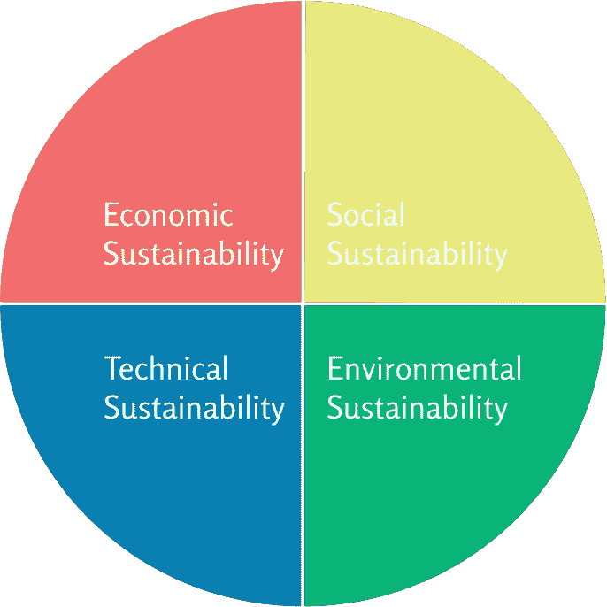

# 可持续地思考软件

> 原文：<https://betterprogramming.pub/thinking-about-software-sustainably-ebdc0d9b0f23>

## 我知道你在想什么:“我们又开始谈论可持续发展了，”但是请听我说完

由 [Alexander Abero](https://unsplash.com/@alexabero?utm_source=medium&utm_medium=referral) 在 [Unsplash](https://unsplash.com?utm_source=medium&utm_medium=referral) 上拍摄的照片。

可持续发展不仅仅是保护环境。那只是一部分。

根据世界环境与发展委员会的一份报告，可持续性是关于持续的能力。这是美国软件开发者应该非常感兴趣的事情。我们是问题解决者和建设者。当然，我们希望我们的创造——或者至少是我们的工作——能够持久。

思考我们如何构建可持续的软件是一个很好的方法。

> “一个系统的可持续性描述了即使环境可能发生变化，该系统继续存在和运行的情况。”—贝克尔等人。艾尔。

我们软件开发人员的问题是，我们如何设计和构建软件，使其能够应对变化？

这也是为什么我们已经开始关注构建可持续的软件。通过努力确保可维护性、可伸缩性和所有其他因素，我们试图创建能够经受时间考验的软件。这只是很好的感觉。然而，除了技术上的可持续性，还涉及更多的观点。

各种学术论文实际上已经确定了可持续软件的四种观点:

*   经济可持续性
*   环境可持续性
*   社会可持续性
*   技术可持续性

这些可能不是包罗万象的，但是它们涵盖了大多数与软件相关的可持续性问题。

# 经济可持续性

如果您正在构建一个企业级的应用程序，那么您很可能以前处理过这个透视图。这都是关于底线或燃烧率。你如何长期保存资本和资源？

最有可能的是，这种观点已经被考虑了。这只是良好的商业意识。

如果你的软件没有提供价值，它不会持续很久。

## **要考虑的事情**

*   项目的相关成本是多少？ide、许可证、文档等？
*   运行这个东西的成本会毁了这个行业吗？
*   应用赚钱了吗？
*   你如何优化资源，包括人和机器？

# 环境可持续性

这是大多数人在听到术语软件可持续性时考虑的领域。关于环境可持续性有几种不同的观点。

首先，您的资源使用对环境的直接影响(例如，服务器的功耗)。

关于如何对环境可持续性产生积极影响，还有许多研究要做，因为试图降低环境影响可能意味着成本效益或性能的权衡。这不是我们想要的。你不应该因为选择了更环保的选择而受到惩罚。

然而，找到解决方案说起来容易做起来难。研究正在进行中。例如，微软正在试验将服务器浸入海洋中冷却。

第二个观点是关于在使用你的软件的环境中的间接影响。

影响和影响的规模非常依赖于领域。在优步，污染是一个问题，因为该软件鼓励更多的汽车上路。

对于一些软件公司来说，甚至可能不会对环境产生间接影响。

## **要考虑的事情**

*   使用您的软件对环境的影响
*   用电量
*   资源的有效利用

# 社会可持续性

这个领域从用户的角度处理可持续性。你的软件会对将要使用它的人或群体产生什么样的影响？

以 Instagram 为例，你有一个连接数百万人的应用程序，允许他们分享自己生活的照片。然而，它对许多用户也有负面影响，因为花在平台上的时间会导致[更高水平的焦虑和不适应](https://time.com/4793331/instagram-social-media-mental-health/)。

随着时间的推移，如果不加以处理，这可能会开始损害业务。

社会可持续性的困难之处在于其影响需要很长时间才能显现出来。不过，这是值得深思熟虑的。如果你从一开始就考虑你希望你的软件对你的用户有什么影响，那么控制结果就容易得多。

## **要考虑的事情**

*   这将如何影响系统的用户？
*   这将如何影响社区/社会？
*   软件符合用户的价值观吗？

# 技术可持续性

这个领域处理软件本身和围绕它的过程。它是关于确保软件能在不断变化的环境中运行。作为软件开发人员，这是我们每天都要处理的事情。

架构能处理不断变化的需求吗？规模大吗？

敏捷软件方法是技术上可持续实践的一个很好的例子，因为它允许团队快速迭代和响应需求的变化。

## **要考虑的事情**

*   属国
*   维护
*   技术债务
*   提高流程效率

# 结论

但是，你不能简单地给一个软件项目贴上“可持续发展”的标签，就认为你的工作已经完成了。实际上，我认为没有可持续软件这样的东西——只有比其他软件更可持续的软件。从这个意义上来说，可持续发展是你可以不断努力但从未真正实现的事情，因为上述领域经常相互冲突。

例如，如果你专注于构建技术上更可持续的软件，经济可持续性将会受损。通过构建环境可持续的软件，可用性可能会降低并损害社会可持续性。

因此，由公司来决定什么对他们来说是重要的，并努力取得与他们的目标一致的平衡。

积极尝试构建更具可持续性的功能可以积极地影响从您的业务到您的用户和我们的环境的一切。

感谢您的阅读！

# **资源**

*   [世界环境与发展委员会的报告:我们共同的未来](https://sustainabledevelopment.un.org/content/documents/5987our-common-future.pdf)
*   克里斯托弗·贝克尔、斯蒂芬妮·贝茨、鲁赞娜·奇钦、莱蒂西亚·杜博克、史蒂夫·伊斯特布鲁克、比尔吉特·彭岑斯塔德勒、诺贝特·塞夫和科林·文特尔斯。需求:可持续性的关键
*   [纳蒂克项目](https://natick.research.microsoft.com/)
*   [https://time . com/4793331/insta gram-社交-媒体-心理-健康/](https://time.com/4793331/instagram-social-media-mental-health/)