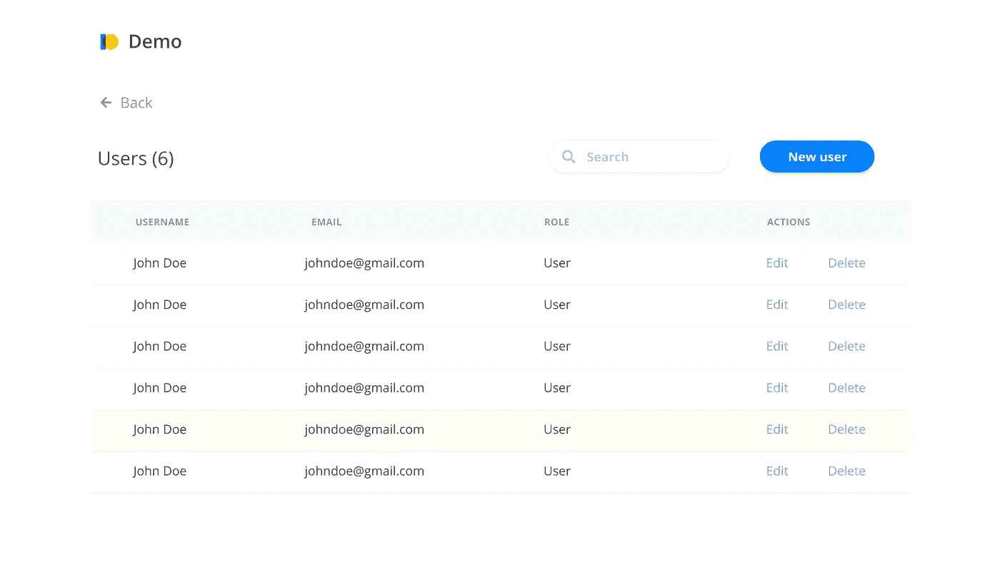
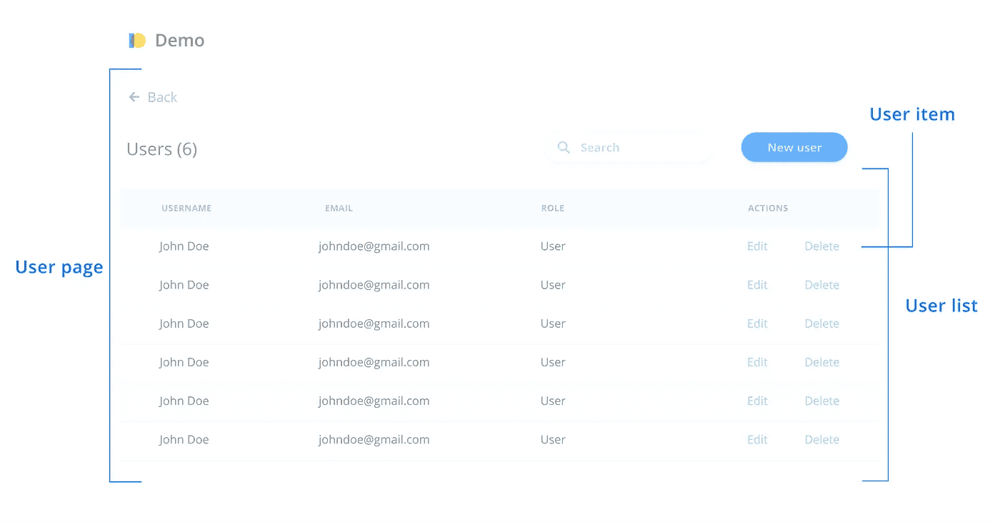
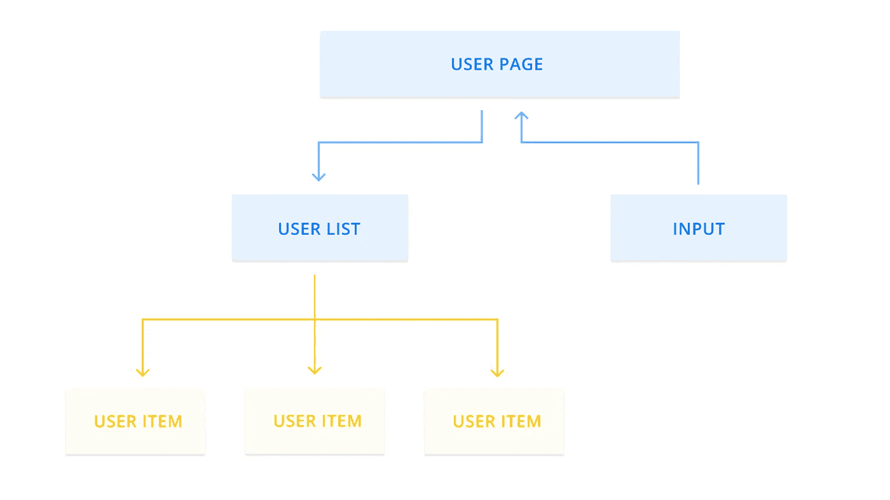
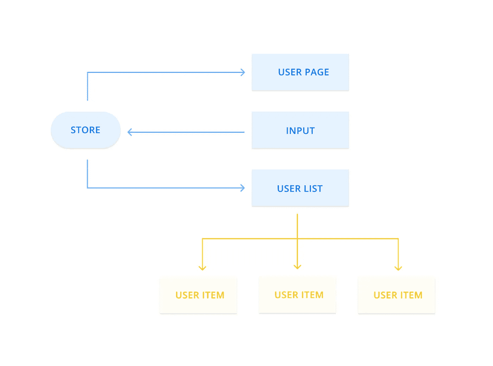

# 组件思维

> 原文：<https://betterprogramming.pub/thinking-in-components-d57418c5f923>

## 我是如何看待编写用户界面的

[绿色变色龙](https://unsplash.com/@craftedbygc?utm_source=medium&utm_medium=referral)在 [Unsplash](https://unsplash.com?utm_source=medium&utm_medium=referral) 上的照片。

上周，我收到一个问题，是关于我如何将一个页面分成多个组件，并组织它们的状态。当给我这个任务时，我决定是时候详细说明我的思考过程了。

在本文中，我将通过一个真实的例子来指导您，以及我将如何建议组织它所包含的组件。

# 这个例子

假设我的任务是构建一个界面，管理员可以在其中管理应用程序的用户。应该可以查看基本信息，创建一个新用户，编辑或删除当前的用户。最重要的是，搜索功能必须包括在内，以便更容易找到用户。

总而言之，这是一个基本的 CRUD 示例，您可以在大多数应用程序中找到。在下图中，您可以大致了解这种情况:

示例应用程序。

# 画出组件草图

所以我要做的第一件事是记下这个应用程序可能由哪些主要组件组成。记笔记可以快速启动思考过程，让你更容易在早期做出重大改变。如果我们已经开始编码了，我们可能需要重构几次。这可以通过首先完成思考过程来避免。

这些是我看到的主要组件:

*   用户页面
*   用户列表
*   用户项目

你可能会问，“搜索输入、按钮和反向链接呢？”这些同样重要，但是我认为这些是可重用的组件。扫描设计很重要，因为我们想让它们足够抽象，这样我们也可以在其他地方使用它们。在撰写此页面之前，我们可能需要先创建这些内容。

分成主要部分的示例。

# 责任

让我们从主要的“业务”组件开始。我说“业务”是因为，在我看来，这些最有可能只在这个页面中使用。

## **用户页面**

这是一个主容器，所有其他组件都将嵌套在其中。其目的是通过包含其他组件来创建某种结构。它还将负责获取用户。因为用户页面和用户列表都需要访问这些数据，所以将它们放在顶层是有意义的。

## **用户列表**

该组件负责显示用户列表。

## **用户项目**

该组件显示用户的详细信息，并处理编辑和删除操作。

# 数据流

在我们开始编程这个用户界面之前，让我们先考虑一下这个页面中的数据流。下面是我建议数据如何通过应用程序的可视化:

示例应用程序中的数据流。

您可能已经注意到，数据流在两个方向上都是单向的，这意味着用户从父组件传递到不同的子组件。反过来，输入将其值传递给用户页面，用户页面将过滤用户。这种单向流动有几个好处:

*   它不容易出错。
*   更容易调试。我们可以跟踪数据是如何通过每个组件的。

您可能会问自己，为什么没有一个状态管理框架来管理用户数据。在我看来，这个例子不够复杂，不足以包含一个。我认为选择一个的临界点是当更多的子组件需要用户数据时。如果是这种情况，那么我们需要将用户数据向下传递几次。这也称为支柱钻孔。

## 用户动作呢？

现在让我们考虑位于用户项中的编辑和删除操作。在这种情况下，我们有两种选择来处理它们:

*   用户项本身的句柄。
*   从用户页面传递一个将被调用的函数。

我倾向于在用户项本身中处理编辑和删除。为什么？否则，我们需要将它向下传递两层到用户项。这很容易出错(支柱钻孔)。我们必须在用户列表和用户条目中为此命名一个属性，但是当我们重命名它们的时候呢？嗯，这有可能会出错。

另一个原因涉及到责任:用户项不应该负责处理用户记录的编辑和删除吗？如果您担心用业务逻辑膨胀组件的危险，这可以通过将逻辑移入钩子或服务层来解决。

# 状态管理

如果这个页面继续增长并包含更多同样需要访问用户数据的子组件，该怎么办？这是添加库来管理这种状态的转折点。

数据流可能看起来像这样:

带有状态管理的数据流。

所有组件都与状态连接的原因是为了减少道具钻取(向下传递多级道具)。此外，出于性能原因，这在大多数库中被认为是最佳实践。[当数据改变时，需要重新渲染](https://redux.js.org/style-guide/style-guide/)的组件更少。

注意:此处的示例仅用于教育目的。在现实生活场景中，在状态管理工具不可避免之前，组件树应该更复杂。

# 结论

希望这篇文章能让您对我如何确定应用程序中的组件和状态有所了解。

如果从这篇文章中只有一点可以学到的话，那就是在编写 UI 应该如何组成的程序之前，总是试着想象并记笔记。

# 资源

*   [https://kentcdodds.com/blog/prop-drilling](https://kentcdodds.com/blog/prop-drilling)
*   【https://redux.js.org/style-guide/style-guide/ 号