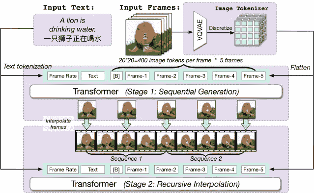
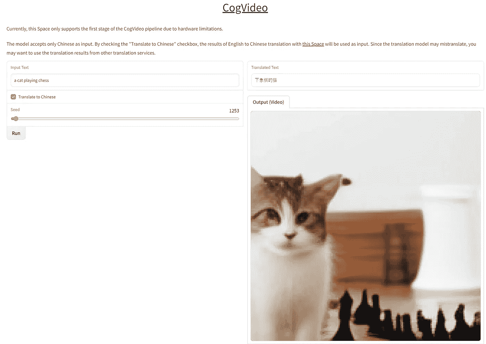
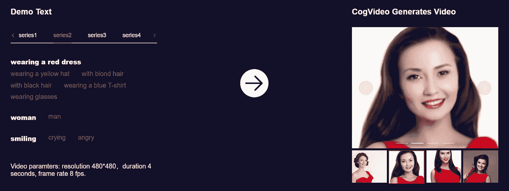

# 这个人工智能可以从文本提示创建视频

> 原文：<https://betterprogramming.pub/this-ai-can-create-video-from-text-prompt-6904439d7aba>

## 文本到图像和图像到文本的生成器工具已经越来越流行。视频转文字怎么样？


Elena Mozhvilo 在 [Unsplash](https://unsplash.com?utm_source=medium&utm_medium=referral) 上的照片

革命性的文本到图像人工智能生成器 [Dall-E2](https://openai.com/dall-e-2/) 和[midway](https://www.midjourney.com/app/)发布才几个月。

那么视频呢？

显然，有一个全新的(很可能是)第一个开源的大规模预训练文本到视频的模型，叫做 [CogVideo](https://github.com/THUDM/CogVideo) 。

简单说就是一个不需要实际拍摄就能制作视频的 AI 工具！

我们来详细说说:

*   什么是 CogVideo？
*   它是如何工作的？
*   目前的局限性是什么？
*   下一步是什么？

# 什么是 CogVideo？

直接来自他们的[演示网站](https://models.aminer.cn/cogvideo/)，这是对 CogVideo 的描述:

> CogVideo 是通用领域中最大的用于文本到视频生成的预训练转换器，具有 94 亿个参数。

它采用多帧速率分层训练技术，优雅而有效地改进了预训练的文本到图像生成模型(CogView2 ),用于文本到图像的制作。

这听起来很拗口，但是看看这个来自他们官方 [GitHub repo](https://github.com/THUDM/CogVideo) 的拼贴演示。


截图来自 [CogVideo Github](https://github.com/THUDM/CogVideo)

很棒，对吧？这些视频看起来像是直接从电视广告中截取的。

# 它是如何工作的

下面是 CogVideo 中的多帧率分层生成框架。



CogVideo [方法学](https://deepai.org/publication/cogvideo-large-scale-pretraining-for-text-to-video-generation-via-transformers)

输入序列包括帧速率、文本和帧标记。输入帧是一个分隔符标记，从 CogView2 继承而来。

**阶段 1:** 在帧率和文本的条件下，依次生成帧。

**阶段 2:** 生成的帧作为双向注意区域被重新输入，以递归内插帧。在这两个阶段都可以调整帧速率。双向注意区域用蓝色突出显示，单向区域用绿色突出显示。

有一个简单的网络应用程序…

你可以用于测试目的的[网络应用](https://huggingface.co/spaces/THUDM/CogVideo)被整合到拥抱面孔机器学习应用程序库中。

用户界面相当简单；它由一个“运行”按钮、“种子”滑块控件和一个“输入文本”字段组成，您可以在该字段中输入文本描述。

就是这样。这里有一个来自 web 工具的小截图，带有一只猫下棋的小样本提示。



[CogVideo](https://github.com/THUDM/CogVideo) 文本到视频网络工具

**什么是“种子”？**

种子为随机数生成器提供了一个起点。例如，使用-1 作为缺省值会导致它选择一个随机种子。这意味着即使所有其他值都相同，输出也会每次都不同。通过输入一个数字，您允许生成器复制以前的结果。

好吧，如果你只是想留下深刻印象，并尝试各种文本提示，CogVideo 发布了另一个演示 web 应用程序，你可以在这里访问。

```
Prompt: A smiling woman wearing a red dress.
```



[CogVideo](https://github.com/THUDM/CogVideo) 演示网络应用

这是实际效果。


一个穿着红色裙子的微笑的女人

这不是令人印象深刻吗？这是一个超现实的视频，一个穿着红色裙子的微笑的女人。

# 当前的限制

尽管 CogVideo 的最新进展已经非常令人印象深刻，但仍有许多障碍需要克服:

*   AI 模型只能生成 480x480 的分辨率，4 秒的时长，8 fps 的帧率。
*   由于该模型是使用 90 亿个数据集训练的，从零开始在计算方面会非常昂贵。
*   还挺年轻的。由于文本-视频数据集的缺乏和较差的相关性，该模型不能理解复杂的运动语义。到目前为止，只有 41，250 个视频组成了最大的带注释的文本视频数据集。
*   该模型只接受中文作为输入。当输入到提示符中时，英文输入必须翻译成简体中文。

如果你想自己尝试，你可能要等很长时间(大约一个小时)才能生成视频，因为容器是 63GB，运行在 NVidia A100 GPU 上。

# 下一步是什么？

虽然 CogVideo 仍处于起步阶段，它可以生成的视频有点短，但这项技术的潜力是巨大的。

首先，它可以为电影和视频游戏创造更真实、更逼真的角色动画。

此外，它可以用于创建教育视频或从文本文章中自动生成视频内容。

几年后，这将允许人们从文本中创建视频，而不需要拍摄或编辑。其影响是巨大的——这可能会永远改变我们创作和消费视频内容的方式。

# 最后的想法

总的来说，CogVideo 有潜力成为一个强大的工具，帮助企业在不产生高制作成本的情况下制作视频。随着技术的发展，看看它的表现如何以及它可能用于哪些其他应用将是一件有趣的事情。

但有一点是肯定的:人工智能视频生成器已经出现，并且即将改变视频的格局，我迫不及待地想看看接下来会发生什么。