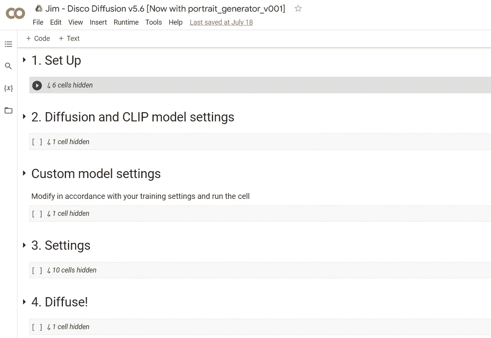
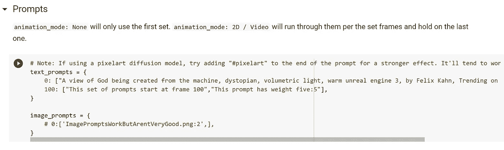
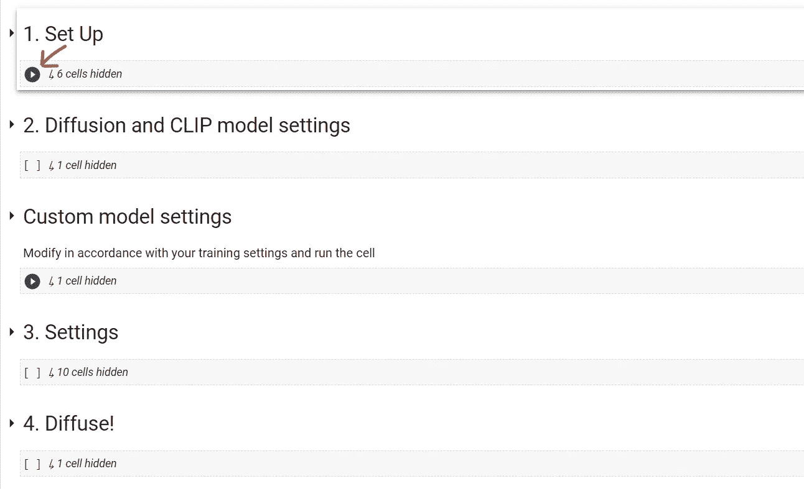
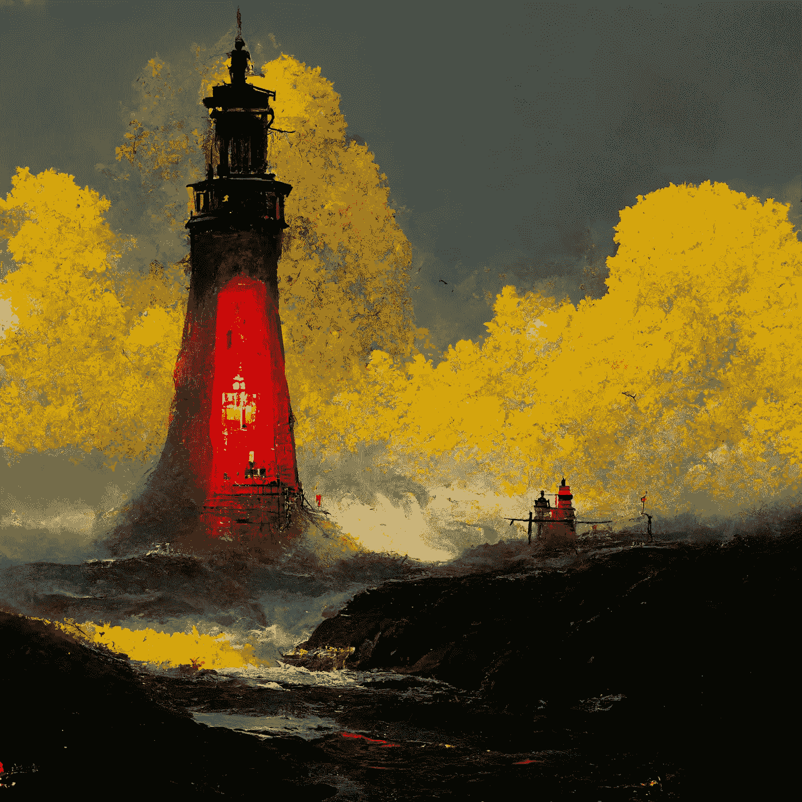
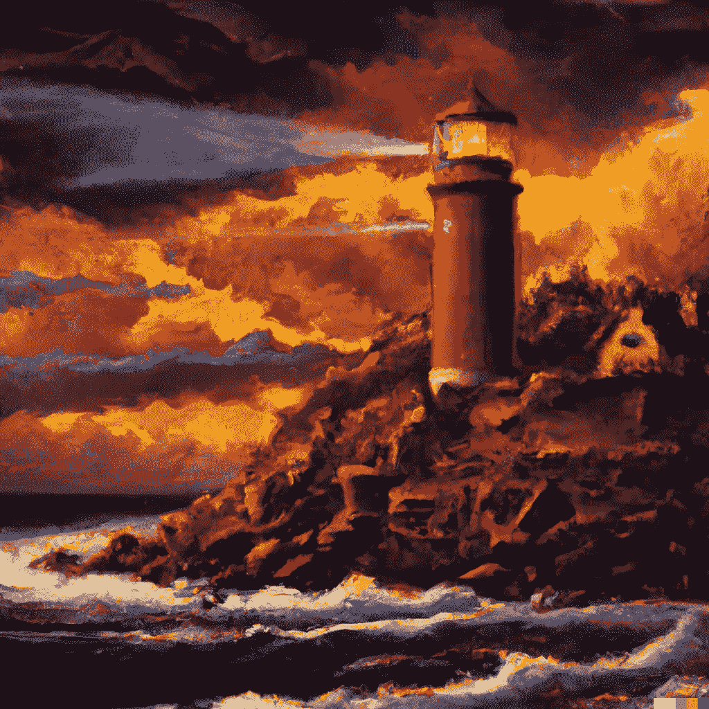

# 这个人工智能工具从文本描述中创造了令人惊叹的绘画

> 原文：<https://betterprogramming.pub/this-ai-tool-creates-stunning-paintings-from-text-descriptions-9d9288719465>

## 它对公众开放


图片由作者提供—由 AI 生成

文本到艺术的人工智能工具是新的酷孩子。

通过使用先进的算法，他们可以将任何文本转换成一件艺术品。他们已经被用于创造从肖像到风景画的一切。结果往往令人印象深刻——有时甚至与人类艺术家创作的作品难以区分。

今天最流行的两个人工智能工具是 OpenAI 的 Dall-E2 和 T2 的 MidJourney。

两者都非常强大，可以产生一流的图像，但不幸的是有自己的访问限制。Dall-E2 不公开，MidJourney 的免费层仅提供 25 张图片。

幸运的是，两天前，一位读者在我的一篇文章的[上留下了评论，提到了迪斯科扩散。这是一个相当于 MidJourney 的高性能文本到艺术的生成器，而且是完全免费的。](https://medium.com/mlearning-ai/midjourney-ai-is-now-publicly-accessible-dont-miss-it-c4c6bb77c375)

当我自己尝试迪斯科扩散并看到我的第一个生成的图像时，我惊呆了。

大家说说吧。

# 什么是迪斯科扩散？

Disco Diffusion 是一个用 Python 编写的小软件，打算在 Google Colab 中运行。

这是一个免费的工具，你可以用它从简单的文本描述中创建人工智能生成的艺术甚至视频。

# 你需要什么

一切都发生在浏览器中，所以你只需要这三个。

1.  Chrome 浏览器
2.  谷歌账户
3.  GoogleDrive 帐户

你也可以使用其他浏览器，但是如果你按照本教程学习的话，我推荐你使用 chrome。

好吧，让我们做些艺术吧！

# 1.访问迪斯科扩散谷歌 Colab 工具

您可以在此访问工具[。](https://colab.research.google.com/github/alembics/disco-diffusion/blob/main/Disco_Diffusion.ipynb)



图片由[作者](https://medium.com/@jimclydemonge)提供——Google Colab

在 Colab 仪表板中将有四个阶段，你所要做的就是按下小播放按钮来执行下面的 python 代码。

但是在你这样做之前，我们需要*描述*我们希望工具创建什么样的绘画。

# 2.添加文本提示

展开设置(3)阶段以显示子设置。

在“提示”部分，用您希望工具绘制的任何内容来更改文本提示。



作者图片

# 3.生成图像

最后一步是按照从上到下的顺序运行各个阶段。简单地按下下图中的播放按钮。



作者图片

就是这样。

您需要做的最后一件事是等待图像结束。在此期间你可以做些别的事情。

在 Colab 工具的免费版本中，1028x768 的图像完全渲染大约需要 10 分钟。

所有图片都会自动保存在你的 google drive 里。

```
<Root>\AI\Disco_Diffusion\images_out\TimeToDisco\*
```

# 迪斯科扩散对比 Dall-E2 对比 midway

现在让我们来看看它与其他流行的文本转艺术工具——Dall-E2 和 mid journey——相比如何。

我给所有三个工具都提供了类似的提示。

> 提示:格雷格·鲁特考斯基和托马斯·金凯德创作的一幅美丽的油画，描绘了一座独特的灯塔，它的光芒照耀着红色的海洋，黄色配色。artstation 上的趋势。

## 迪斯科扩散


图片由[作者](https://medium.com/@jimclydemonge)—Disco Diffusion AI 生成的图片

## 中途



图片由[作者](https://medium.com/@jimclydemonge) —中途 AI 生成的图片

## Dall-E2



图片作者[作者](https://medium.com/@jimclydemonge) —图片由 OpenAI Dall-E2 生成

从文字描述上你觉得谁做的图像最好看？

IMHO Disco 扩散的结果对 Dall-E2 和 MidJourney 看起来最美。

# 最后的想法

由于这些免费的文本到艺术的人工智能工具，艺术现在对普通人来说触手可及。

你不再需要多年的训练和稳定的手来创作一幅杰作。只要打出你想要的，剩下的就让人工智能来做。

但对人类艺术家来说是祸是福呢？

这个问题没有简单的答案。虽然人工智能文本转艺术对人类艺术家来说是一个有用的工具，但如果使用不当，它也可能是一个诅咒。

所以，如果你今天有创造力，为什么不试一试呢？