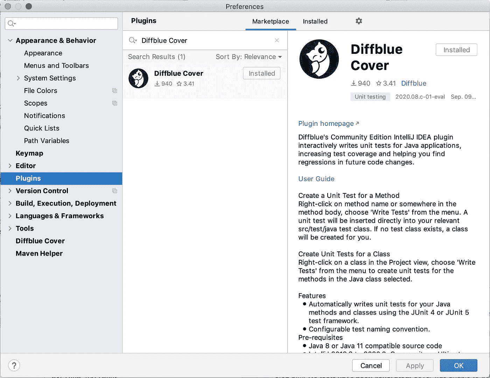
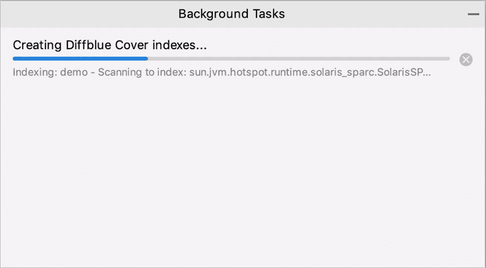
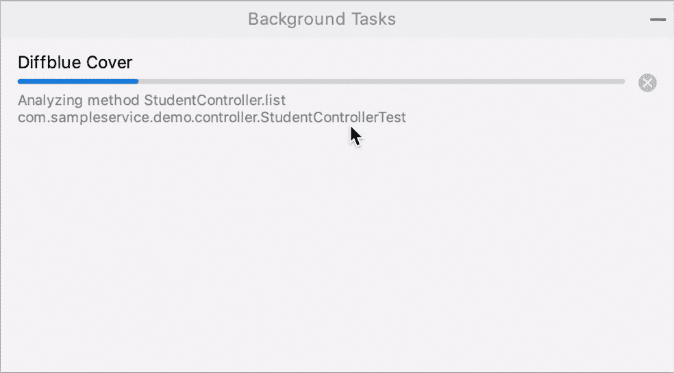
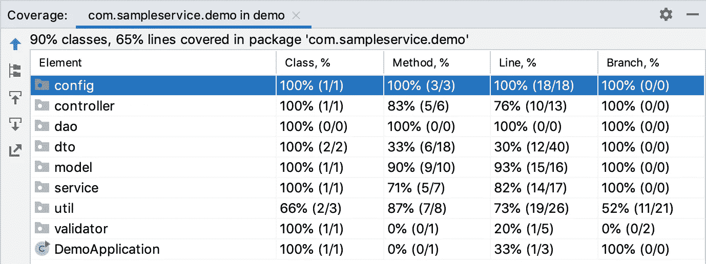

# 使用人工智能工具编写你的单元测试

> 原文：<https://betterprogramming.pub/this-ai-tool-write-great-unit-tests-acfbfab53c09>

## 如何使用人工智能驱动的插件生成单元测试


自动化测试-Credit:[https://www . help systems . com/resources/articles/5-tips-automated-web-Testing](https://www.helpsystems.com/resources/articles/5-tips-automated-web-testing)

在本文中，我们将为 IntelliJ 使用一个 AI 驱动的插件来自动生成单元测试。

*在我们谈论这个插件和它背后的公司之前，值得一提的是，我和这家公司及其员工没有任何关系。然而，我曾经在牛津大学工作，所以看到这样一个有趣的创新来自一个有很多回忆的地方是令人兴奋的。*

# 第一步。安装插件并导入项目

IntelliJ IDEA 插件对于开源开发是 100%免费的。要安装插件，进入 IntelliJ IDEA **偏好设置，**，从那里，找到左边的**插件**，搜索 **Diffblue Cover，**，如下所示。



在 IntelliJ IDEA 中安装 Diffblue 封面插件

一旦安装了插件，如果在 IntelliJ IDEA 中导入了现有的项目，那么插件将开始索引和分析整个代码库(例如，类、依赖项等)。)作为后台任务。这可能需要一些时间，取决于代码库的大小和复杂程度。



Diffblue 封面索引项目

*您还可以进一步配置 Diffblue Cover 插件，从 IntelliJ IDEA 设置中根据您的需要对其进行微调。*

如果你想玩玩，我建议你从基础项目开始。下面是一个示例 spring boot 项目，它包含控制器、服务层、使用 spring 数据的存储库和内存数据库:

```
git clone [https://github.com/rhamedy/sample-rest-service.git](https://github.com/rhamedy/sample-rest-service.git)
```

请随意克隆[库](https://github.com/rhamedy/sample-rest-service.git)并使用它。

# 第二步。简短的项目演练

如果您克隆了上面链接的示例项目，那么请按照这一节的内容进行操作，因为我将简要地向您展示我们将要为其生成单元测试的类。

## 控制器层

下面是我们将要测试的弹簧引导控制器的样子:

如上所示，我们有几个端点来获取学生列表、添加学生、按 id 获取学生以及按 id 删除学生。

## 服务层

服务层将控制器与存储库层连接起来，存储库层是大多数逻辑驻留的地方。

我们将尝试使用 Diffblue Cover 插件为上述类生成单元测试。

# 第三步。使用人工智能驱动的插件生成单元测试

这是激动人心的部分，所有的奇迹都发生在这里。换句话说，人工智能驱动的插件介入并为我们自己生成单元测试，没有任何帮助。


Diffblue Cover 插件—编写测试以生成单元测试

如果你已经安装了插件，右击`StudentController`并从动作菜单中选择**写测试**选项，如上所示。



学生控制器的 Diffblue Cover 插件生成单元测试

如上所示，插件将开始分析控制器及其每个方法。最后，它为每种方法生成单元测试。

*生成单元测试确实需要一点时间——Diffblue Cover 正在分析这个类及其方法。但是与实际编写测试的人相比，所花的时间是很少的。*

下面是 Diffblue Cover 生成的`StudentControllerTest`。

我不知道你怎么想，但是我对生成的测试印象深刻。它们似乎坚如磐石，并遵循 spring boot 测试的最佳实践。

您可以在[这个拉请求](https://github.com/rhamedy/sample-rest-service/pull/1)中找到生成的单元测试的完整源代码。

# 第四步。生成的单元测试的测试覆盖率

一个代码或者测试覆盖工具将会指出被测试覆盖的代码的百分比。

让我们对生成的测试运行代码覆盖工具，以了解测试覆盖了多少百分比的代码。



生成单元测试 JaCoCo 代码覆盖率。

那看起来一点也不差。对于我们已经生成测试的类，例如控制器、服务和实用程序包，覆盖率相当高。

*值得一提的是，这是一个超级简单的代码库，没有复杂的代码或逻辑，插件似乎在生成一些可靠的单元测试方面做得相当不错。对于代码非常复杂的遗留代码或代码库，插件的行为可能会有所不同。*

在这个视频中，我快速地讲述了如何使用 AI 驱动的 Diffblue Cover 插件生成单元测试。

# 使用 Diffblue Cover 生成单元测试的演示

对于那些感兴趣的人，我还准备了一个快速演示，从安装插件到生成测试以及生成测试的覆盖范围，你们都可以观看。

如何使用 Diffblue Cover 插件生成单元测试的演示

如何使用 Diffblue Cover 插件生成 java 单元测试的快速演示

# 自动化单元测试生成的缺点

不反对 Diffblue 封面插件。尽管与生成单元测试相关的优点很多，但是也有一些缺点，我很想快速地谈一谈。

首先，我相信编写单元测试的开发人员比不编写单元测试的开发人员要好。

其次，在我看来，单元测试间接影响了我们如何编写代码。如果我们写的代码设计得不好，那么单元测试会变得更加痛苦。让我们举一个例子，一个方法做十种不同的事情，有许多嵌套的条件和一些非常复杂的逻辑。编写覆盖这些方法的所有执行路径的测试将是一个挑战。

从前，当我提倡单元测试时，一个开发人员告诉我。

> 我花 20%的时间写代码，80%的时间写代码的单元测试。

如果你写的代码不容易阅读和理解，并且是耦合的和不连贯的，那么单元测试将是一个非常耗时和低效的过程。

# 结论

总的来说，我对这个插件在我们的示例项目中的表现和生成的单元测试的质量印象深刻。

然而，我注意到插件不能为某些类生成测试，在某些情况下会跳过执行路径(分支)，查看上面的 youtube 视频演示以了解更多信息。

感谢你的时间，我希望你喜欢这篇文章。敬请关注更多有见地的内容。