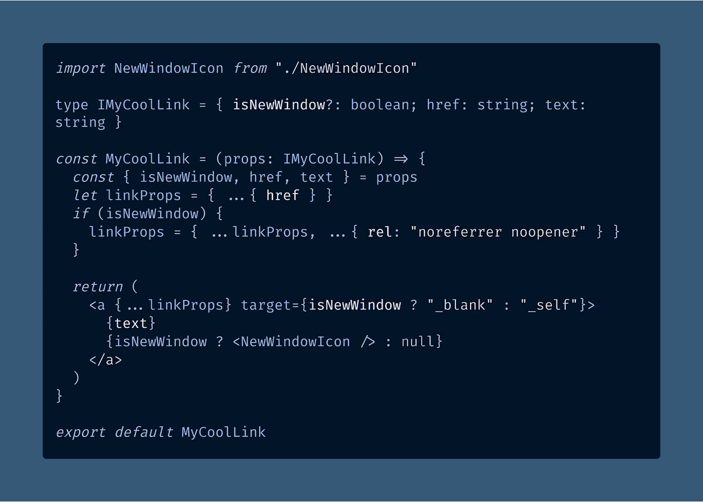
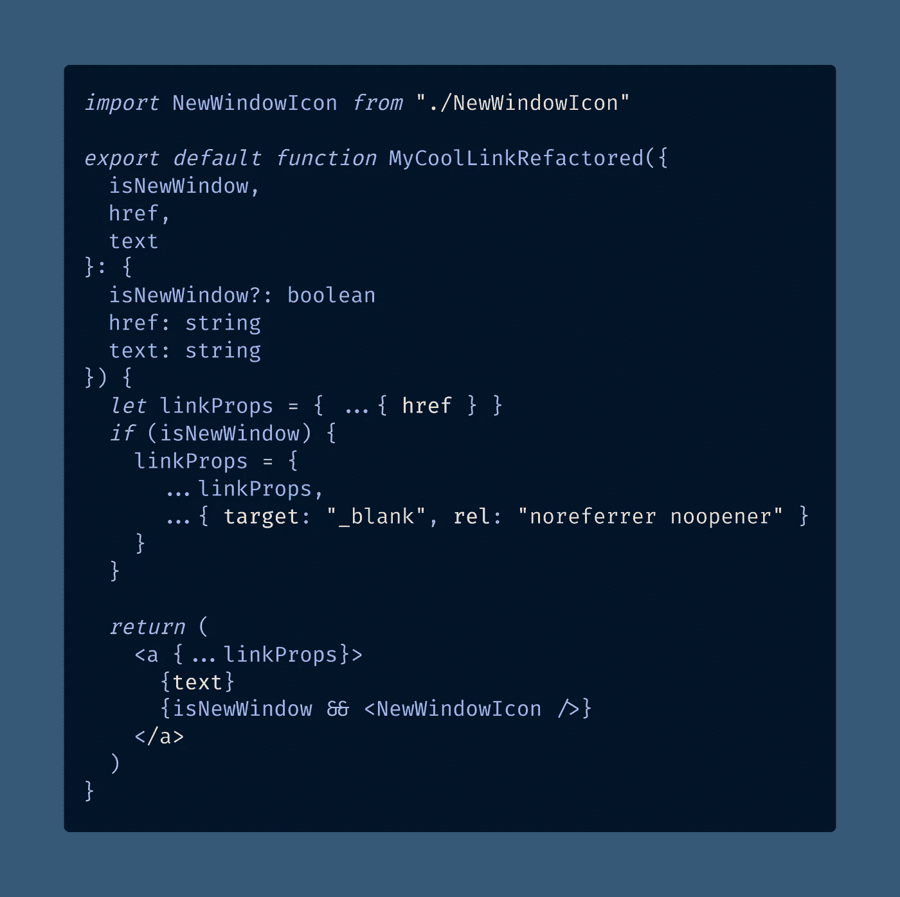
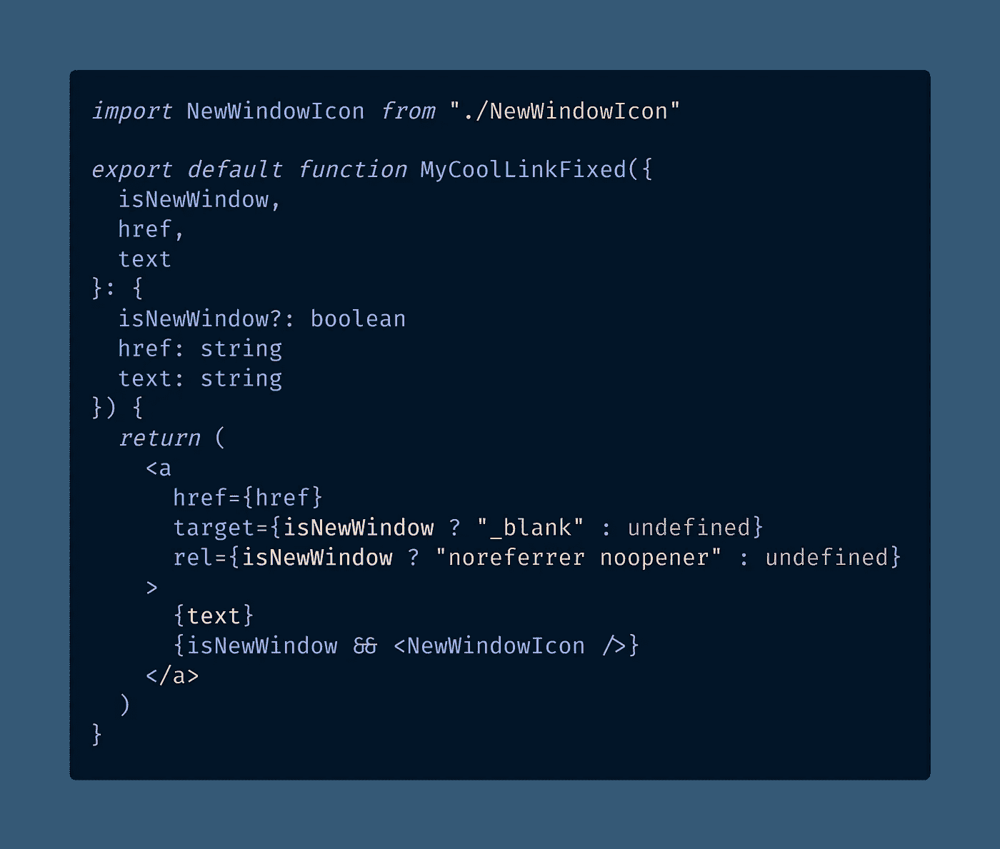

# React 的这个隐藏特性对 DOM 隐藏了 HTML 属性

> 原文：<https://betterprogramming.pub/this-hidden-feature-of-react-hides-html-attributes-from-the-dom-325a4df09c38>

## 如何在 DOM 中隐藏 React JSX 元素的属性，比如当你使用可选道具或条件渲染时？它不在 React 文档中，但是你可以这样做

托马斯·博尔曼斯在 [Unsplash](https://unsplash.com?utm_source=medium&utm_medium=referral) 上拍摄的照片

我最近实现了一些代码，使用一个可选的`isNewWindow`属性来决定一个链接是否应该在一个新窗口中打开。

目前的解决方案是可行的，但是每次我读代码的时候，我都觉得一定有问题。这是不必要的复杂。

给你，看一下。这个 TypeScript 代码示例对您有意义吗？

[在 CodeSandbox 查看原始代码](https://codesandbox.io/s/this-hidden-feature-of-react-hides-html-attributes-from-the-dom-oky3k?file=/src/MyCoolLink.tsx)

好吧，其实我有很多话要说。谁写的这些垃圾？(*让我查一下*`[*git blame*](https://medium.com/@drdmason/git-blame-all-the-way-back-62957f8407)`*——哎呦，原来是我！！* [*该死的*](https://www.urbandictionary.com/define.php?term=damn) *。*)

首先，当我们可以在函数声明中直接析构属性时，为什么在函数组件前有一个命名类型？

第二，我比较懒，用`export default function ...`比用 [const](https://javascript.plainenglish.io/how-to-use-let-var-and-const-in-javascript-cdf42b48d70) 少一行代码。这是个人喜好，但是嘿。

第三，我不认为你真的需要指定`target="self"`，因为它是默认值。为什么要让事情变得不必要的混乱？

> ”`[**target**](https://developer.mozilla.org/en-US/docs/Web/HTML/Element/a#attr-target)`
> 
> 在哪里显示链接的 URL，作为一个*浏览上下文*(一个标签、窗口或`[<iframe>](https://developer.mozilla.org/en-US/docs/Web/HTML/Element/iframe)`)的名称。以下关键字对于加载 URL 的位置具有特殊的含义:
> 
> `_self`:当前浏览上下文。(默认)
> 
> 通常是一个新标签，但是用户可以配置浏览器打开一个新窗口。"— [MDN Docs for < a >:锚元素](https://developer.mozilla.org/en-US/docs/Web/HTML/Element/a)

第四，最后还有一个不必要的[问号](https://javascript.plainenglish.io/what-does-the-question-mark-mean-in-javascript-code-353cfadcf760) `[?](https://javascript.plainenglish.io/what-does-the-question-mark-mean-in-javascript-code-353cfadcf760)` [【三元运算符】](https://javascript.plainenglish.io/what-does-the-question-mark-mean-in-javascript-code-353cfadcf760)，这里`<NewWindowIcon>`可以用`[&&](https://developer.mozilla.org/en-US/docs/Web/JavaScript/Reference/Operators/Logical_AND)`(逻辑与)进行[条件渲染](https://reactjs.org/docs/conditional-rendering.html)而不是`? : [null](https://javascript.plainenglish.io/how-to-check-for-null-in-javascript-dffab64d8ed5)`模式。

我很快对代码进行了重构，以获得更好的结果:

[在 CodeSandbox 上查看原始代码](https://codesandbox.io/s/this-hidden-feature-of-react-hides-html-attributes-from-the-dom-oky3k?file=/src/MyCoolLinkRefactored.tsx:0-451)

然而，仍然有一个巨大的、突出的问题让我每次看代码时都感到困惑:那就是`linkProps`部分。

这是我见过的可读性最差的代码，每次我试图解析它的时候，我都能听到大脑里发出“沉闷的声音”。

我想修复它，但是我有一个棘手的问题——如何在 React 中创建一个隐藏在 [DOM](https://developer.mozilla.org/en-US/docs/Web/API/Document_Object_Model) 中的“可选属性”?

# 可选属性和条件呈现

因为我不记得可选属性是如何工作的，所以我快速浏览了一下 React 文档，但是我没有发现太多。

> “`&&`逻辑 AND 运算符之所以有效，是因为在 JavaScript 中，`true && expression`总是计算为`expression`，而`false && expression`总是计算为`false`。
> 
> 因此，如果条件为`true`，紧接在`&&`之后的元素将出现在输出中。如果是`false`，React 会忽略并跳过。[…]
> 
> 在极少数情况下，您可能希望一个组件隐藏自己，即使它是由另一个组件呈现的。为此，返回`null`而不是它的渲染输出。”— [根据条件渲染对文档做出反应](https://reactjs.org/docs/conditional-rendering.html)

我有一个想法，你也许可以使用 falsy 值在 React 中选择性地渲染道具，但我需要确认一下。

我喜欢使用 CodeSandbox 伟大的 [React.new](https://React.new) 服务对 React 进行这种快速测试。

如果你从未尝试过，那就点击链接吧，它不会咬人的。您将直接进入 React 的新代码沙箱。

也许有一天我们会将 React 内置到浏览器控制台中，但是如果你曾经想测试 React 的一个快速功能，React.new 是很难被击败的。

我有一个想法，你可以使用 [falsy 值](https://medium.com/coding-at-dawn/what-are-falsy-values-in-javascript-ca0faa34feb4)来使道具可选，类似于`null`在 React 中对 DOM 不渲染。

React 文档中没有记录这种行为，它也不像我预期的那样工作。这是我发现的。

# React 中的假值和条件渲染

正如您可能会怀疑的那样，在 React JSX 中将 falsy 值作为 HTML 元素的属性值传递给[会在 DOM 中隐藏该属性。](https://medium.com/coding-at-dawn/what-are-falsy-values-in-javascript-ca0faa34feb4)

属性的行为类似于条件呈现——试图将一个 falsy 值“直接”传递给 DOM。

当您从 React 组件返回`[null](https://levelup.gitconnected.com/how-to-check-for-an-object-in-javascript-object-null-check-3b2632330296)`、`[undefined](https://medium.com/coding-at-dawn/how-to-check-for-undefined-in-javascript-bcedd62c8ad)`、`[false](/making-sense-of-vs-in-javascript-f9dbbc6352e3)`或空的[字符串](https://javascript.plainenglish.io/how-to-check-for-a-string-in-javascript-a16b196915ff)、`""`时，您在 DOM 中得不到任何呈现。

然而，falsy 值`0`、[负零(](https://medium.com/coding-at-dawn/is-negative-zero-0-a-number-in-javascript-c62739f80114) `[-0](https://medium.com/coding-at-dawn/is-negative-zero-0-a-number-in-javascript-c62739f80114)` [)](https://medium.com/coding-at-dawn/is-negative-zero-0-a-number-in-javascript-c62739f80114) 和`[NaN](https://medium.com/coding-in-simple-english/how-to-check-for-nan-in-javascript-4294e555b447)`将在 DOM 中显示为文本，即使它们是 falsy。这是一种反应。™ 😂

这种行为实际上导致了一个常见的错误，Kent C. Dodds 已经在他的博客上讨论过了(尽管我更喜欢他的技巧):

 [## 在 JSX 使用 ternaries 而不是&。

### 这个代码有什么问题？不确定？我再问你一个问题。如果…上面的代码会怎么样

kentcdodds.com](https://kentcdodds.com/blog/use-ternaries-rather-than-and-and-in-jsx) 

简而言之，React 表达式`{count} {count && " messages"}`将返回文本“0”而不是文本“0 messages”或者什么都不返回。

我们很快就会看到，可选属性的行为是相似的，尽管无论属性是否需要值，行为都会略有不同。

# 在 HTML 中，布尔属性不需要值

您可能还记得，[HTML 元素的某些属性是布尔型的](https://developer.mozilla.org/en-US/docs/Web/HTML/Attributes#boolean_attributes)，这意味着它们可以带值使用，也可以不带值使用。

例如，`<a>`锚标签元素可以采用布尔属性`download`，而带有`type="checkbox"`的`<input>`可以采用`checked`的布尔属性。这些布尔属性不需要值。

> ”`[**download**](https://developer.mozilla.org/en-US/docs/Web/HTML/Element/a#attr-download)`
> 
> 提示用户保存链接的 URL，而不是导航到它。可以带值使用，也可以不带值使用:
> 
> 如果没有值，浏览器将建议从各种来源生成的文件名/扩展名[…]
> 
> 定义一个值建议将其作为文件名。
> — [MDN Docs for < a >:锚元素](https://developer.mozilla.org/en-US/docs/Web/HTML/Element/a)

您可以向 DOM 传递不带值的布尔属性，浏览器会将它们解释为 true 或 enabled。

对于`<a>`要记住的是`download`的行为与`href`不同，因为`href`需要一个值，而`download`不需要。

# 如何在 React 中隐藏 DOM 中的属性

要在 React 的 DOM 中隐藏 HTML 元素的属性，需要传递 false、undefined、null 作为该属性的值。

与需要值的属性(如`<a>`上的`href`)相比，布尔属性(如`<a>`上的`download`)的行为会发生变化。

如果你指定了一个布尔属性，但是没有给它一个值，它将会不带任何值的出现在 DOM 中。常规属性不会出现在 DOM 中。

根据我的测试，以下是 falsy 值的完整列表，以及它们在 React 中用作属性值时的行为:

*   *无参数* = >非布尔属性(需要值的属性)根本不会出现在 DOM 中。一个布尔属性(不需要值的属性)将出现在没有值的 DOM 中。
*   `{true}` = >与无参数相同，除了非布尔属性会在控制台中生成警告消息。
*   `""` *(空字符串)* = >属性出现在 DOM 中没有值，不管它是否需要值。
*   属性根本没有出现在 DOM 中。
*   属性根本没有出现在 DOM 中。
*   属性根本没有出现在 DOM 中。
*   `{0}` *(零)* = >无论是否需要值，该属性都以值“0”出现。
*   `{NaN}` *(非数字)* = >无论是否需要值，该属性都以值“NaN”出现。生成控制台警告。

现在我们知道了如何可选地呈现某些属性，我们可以返回并从代码示例中重构掉`linkProps`。

# 如何在 React 的新窗口中打开链接

为了在新窗口中打开一个链接，我们将使用`isNewWindow`属性有条件地设置`target`和`rel`属性的值。

对于应该在当前浏览器选项卡中打开的普通链接，我们根本不想将`target`或`rel`呈现到 DOM 中。下面是怎么做的。

[在 CodeSandbox 上查看原始代码](https://codesandbox.io/s/this-hidden-feature-of-react-hides-html-attributes-from-the-dom-oky3k?file=/src/MyCoolLinkFixed.tsx:0-402)

当我们将`undefined`传递给`target`或`ref`时，React 简单地从 DOM 中完全删除这些属性。这就是我们隐藏属性的方式。

从技术上讲，您可以使用`&&`(逻辑 AND)来代替`?`，但是这给了我一个 ESLint 警告，提示`false`对于这些属性无效。

# 结论:隐藏 DOM 中的可选道具

在最初的代码示例中`linkProps`让我感到困扰的是，我不知道道具将会被改变。

如果我查看代码的开头，我可以解析出会有一些普通的道具，比如`href`和`text`。

然后，如果我看一下代码的结尾，我可以看到`target="_blank"`根据`isNewWindow`属性被可选地设置。

然而，每次我看代码的时候，我都认为`rel`属性已经被遗忘了，除非我回头看看中间。

既然你应该包括`rel="noopener noreferrer"`，至少对于老版本的浏览器，我一直在想我需要添加它。代码太复杂了。

> “当您使用`target="_blank"`属性链接到另一个网站上的页面时，您的网站可能会面临性能和安全问题:
> 
> 另一个页面可能与您的页面在同一进程上运行。如果另一个页面运行大量 JavaScript，您的页面的性能可能会受到影响。
> 
> 另一个页面可以使用`window.opener`属性访问您的`window`对象。这可能允许其他页面将您的页面重定向到恶意 URL。
> 
> 将`rel="noopener"`或`rel="noreferrer"`添加到`target="_blank"`链接中可以避免这些问题。
> 
> 从 Chromium 版开始，带有`target="_blank"`的锚点默认自动获得`[noopener](https://www.chromestatus.com/feature/6140064063029248)` [行为](https://www.chromestatus.com/feature/6140064063029248)。`rel="noopener"`的明确规范有助于保护传统浏览器的用户，包括 Edge Legacy 和 Internet Explorer。“—[web . dev](https://web.dev/external-anchors-use-rel-noopener/)的“跨起点目的地的链接不安全”

我坚信，在 React 中处理传递给子组件的道具的最佳位置是在 return 语句中，而不是在其他地方。

虽然很“可爱”但你可以用`[...](https://medium.com/coding-at-dawn/how-to-use-the-spread-operator-in-javascript-b9e4a8b06fab)`[展开符](https://medium.com/coding-at-dawn/how-to-use-the-spread-operator-in-javascript-b9e4a8b06fab)来调整一些`linkProps` [对象](https://levelup.gitconnected.com/how-to-check-for-an-object-in-javascript-object-null-check-3b2632330296?gi=f235dad84669)到时候[析构](https://javascript.plainenglish.io/destructure-react-props-with-es6-object-destructuring-for-cleaner-code-3984453e484d)，很难读懂。

因为我们可以像有条件地渲染组件一样有条件地渲染 React 道具，所以这是我们应该使用的解决方案。

编码快乐！！

德里克·奥斯汀博士是《职业规划:如何在 6 个月内成为成功的 6 位数程序员》一书的作者，该书现已在亚马逊上出售。