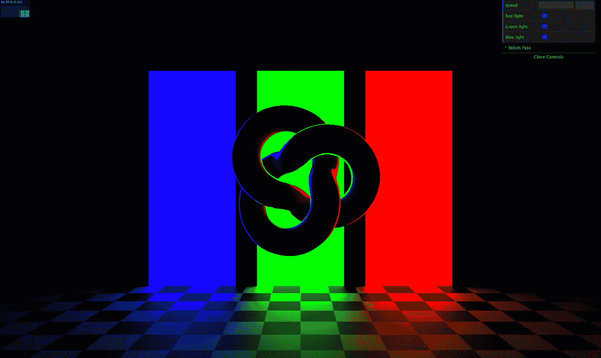

# 这是一个简单而强大的 Three.js 样板文件

> 原文：<https://betterprogramming.pub/this-is-a-simple-yet-powerful-three-js-boilerplate-cbf8ee968c26>

## 使用我的开源库，在您的项目中轻松使用 Three.js



*该样板文件使用的样本场景*

当您开始一个新的 Three.js 项目时，您通常会厌倦复制粘贴所有样板文件来做相同的场景、摄像机等设置。我完全理解，因为这也是我的故事。这就是为什么我开始开发我自己的 Three.js 样板代码，感觉就像在家里一样。

我将分享一个我正在使用并且还在完善的。一开始你可能会觉得有点难以理解，但是如果你花时间去理解它，并且多使用几次，你会发现开始一个新的 Three.js 项目毫不费力！

# 该样板文件的主要特点

*   为您执行所有常用的 Three.js 设置代码，以便您可以专注于自己的场景和对象。
*   使用 async/await 加载纹理/图像，这样场景只有在所有资源都加载后才会显现。你再也不会看到像纹理这样的东西突然出现在你的物体上了！
*   使用配置最少的包裹，因此您不需要关心设置捆扎机。

# 我的 GitHub 回购

[https://github.com/franky-adl/threejs-starter-template](https://github.com/franky-adl/threejs-starter-template)是回购的链接。随意叉或者拉请求！

要在本地运行 repo，请按顺序执行以下命令。构建在几秒钟内完成后，将会为您打开一个新的浏览器选项卡:

1.  `npm i`
2.  `make dev`

# 包裹

在我的旧版本 Three.js 样板文件中，我使用了`webpack`作为捆绑工具。它是一个多用途和受欢迎的捆绑器，但我认为它的构建时间较慢，并且对于简单的项目来说太复杂了。

最近我开始用[包](https://parceljs.org/)，用起来真的很简单。几乎没有入门成本，跟着用 Parcel 构建 web apps 的教程走；只需要五分钟就能上手！

Parcel 会为您完成所有的 JavaScript 传输配置。您需要指定您希望您的应用程序在什么目标浏览器上运行。例如，在您的`package.json`文件中提供这一行，package 会为您完成所有的脏工作:

```
"browserslist": "> 0.5%, last 2 versions, not dead"
```

# 样板代码解释

这会有点长。如果您更喜欢亲自动手，只需阅读代码中的文档字符串并尝试一下！无论如何，我将解释的大部分内容都记录在代码中。

我不会在`index.html`文件上花太多时间，因为这只是导入`index.js`文件的标准设置。我添加的一个额外的东西是面纱，只有当所有耗时的资源(例如，图像/纹理)都加载到场景中时，它才会揭开面纱。

`index.js`文件是你放置大部分场景构建代码的地方。这个样板文件的本质是我在`core-utils.js`中写的便利方法，这些方法被`index.js`使用。`index.js`文件有三个主要部分，您也可以在代码中通过编号的注释部分看到:

1.  正在初始化核心 Three.js 组件
2.  构建您的场景
3.  运行应用程序

还有第 0 部分，你可以为你的场景定义可调整的参数，这些参数也可以在右上角的 GUI 控制面板中进行调整。例如，如果我想改变一种特殊的颜色或材料的粗糙度/金属度，我喜欢把参数分组放在那里，这样我就不必在整个代码中滚动查找它们。

# 第 1 部分—初始化 Core Three.js 组件

这里我们使用`core-utils.js`中的以下便利方法(如果没有参数传递给它们，则设计为使用默认值)来创建基本的 Three.js 组件:

*   `createRenderer(rendererProps, configureRenderer)`，默认为你设置像素比例和渲染器大小。您可以在第一个参数(例如`{ antialias: true}`)传递额外的配置属性，并在第二个参数传递一个回调来进一步配置渲染器。
*   `createCamera(fov, near, far, camPos, camLookAt, aspect)`，默认情况下，它使用`PerspectiveCamera`并为您设置相机的位置和观察点。如果您没有传入这些参数中的任何一个，您也可以看到默认的摄像机值。
*   `createComposer(renderer, scene, camera, extraPasses)`，默认情况下，它会创建`EffectComposer`并为您添加`RenderPass`，因此您只需关注您想要通过`extraPasses`回调添加什么后处理走刀即可。

# 第 2 部分—构建场景

我们需要用一个`initScene`方法定义一个`app`对象。这里的对象结构与样板代码非常紧密地耦合在一起，但是我发现一旦您习惯了它，它会非常方便。如果你的场景需要动画，定义一个额外的`updateScene`方法来托管你的动画代码。

*   `initScene()`:这个函数在一个基本的 Three.js 环境建立之后被调用，这样你就可以放置你的场景构建代码(例如，添加`OrbitControls`、添加灯光、添加球体或盒子、GUI 控件、FPS 统计等等)。)在这里。注意这个函数有`async`前缀，所以你可以在其中使用`await`来加载纹理和耗时的东西。这里的默认模板机制只会揭开你的场景，一旦你在`initScene`中的所有东西被同步加载，就开始制作动画。这一点很重要，因为我们不希望渲染的对象在纹理突然出现之前必须等待一两秒钟，这看起来很不专业。
*   `updateScene(interval, elapsed)`:这是你设置场景动画的地方(例如，更新轨道控制，更新 FPS 统计，旋转/移动你的网格)。注意，您不需要调用`requestAnimationFrame`方法，因为它在`core-utils.js`中处理。您还有两个与时间相关的参数可以使用:
    1。`interval`:两帧之间经过的时间
    2。`elapsed`:应用程序启动后经过的总时间

# 第 3 部分—运行应用程序

最后，在第 3 节中，您调用`runApp`来启动应用程序，以在浏览器中显示渲染的场景。在运行`app.initScene()`和稍后的动画之前，这将为您设置通常的 HTML 容器、窗口调整监听器和鼠标移动/触摸监听器。

如果你的场景是静态的，你不希望应用程序每秒运行 60 次无用的帧重绘，你可以跳过定义`app.updateScene`并将`false`传递给`runApp`处的`enableAnimation`参数。

这就是所有的解释和展示。如果你一直读到这一行，我真的很感激！老实说，我认为初学者一开始会发现这个样板文件非常复杂。

我总是乐于接受建议和改进！

希望你喜欢，觉得有用💪🏼。