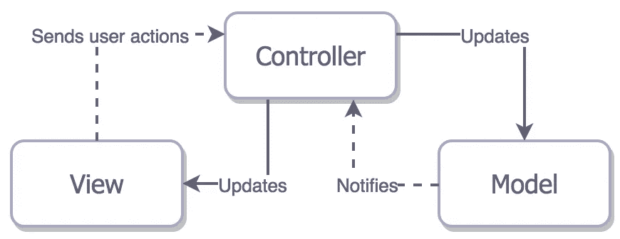
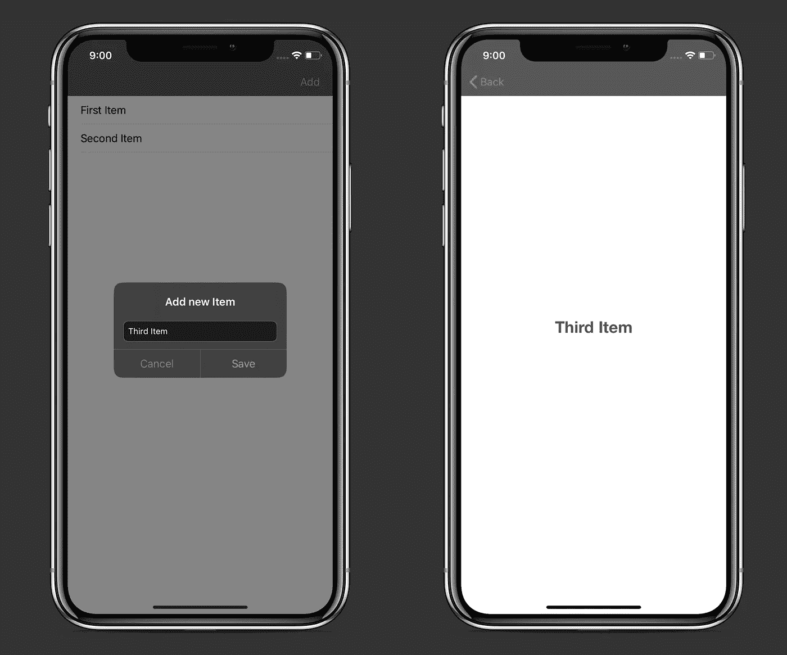
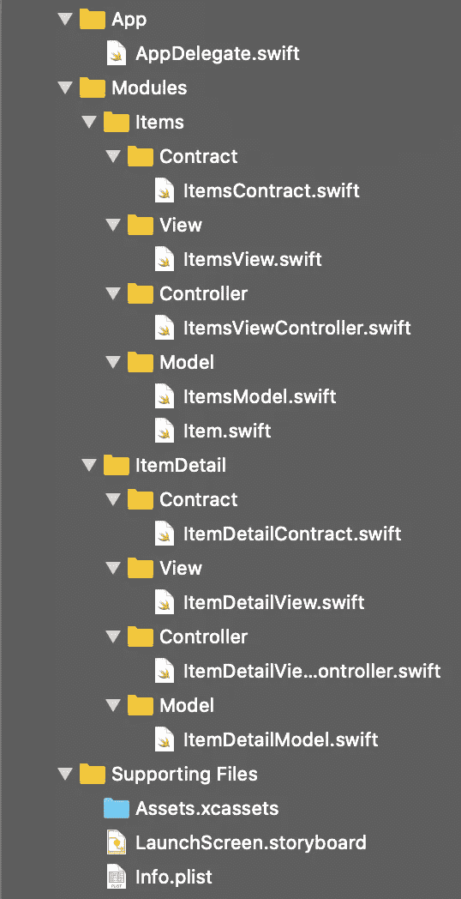

# 新 MVC:单一责任原则和委托

> 原文：<https://betterprogramming.pub/this-is-how-you-implement-mvc-architecture-in-2020-b39d65b4212f>

## 在你的 iOS 应用中实现 MVC 的不同方式

照片由[里卡多·戈麦斯·安吉尔](https://unsplash.com/@ripato?utm_source=medium&utm_medium=referral)在 [Unsplash](https://unsplash.com?utm_source=medium&utm_medium=referral) 拍摄

上周末，我正在修补 iOS 应用程序中正确的 MVC 架构实现的想法。听到许多开发人员抱怨 Apple 建议的设计模式，我决定提出自己的解决方案，试图解决这些常见问题:

*   臭名昭著的“海量视图控制器”
*   职责划分模糊。
*   控制器和视图之间的紧密耦合。
*   一个几乎什么都不做的愚蠢而简单的模型。

有了与 [MVP](https://medium.com/better-programming/implement-a-model-view-presenter-architecture-in-swift-5-dfa21bbb8e0b) 、 [MVVM](https://medium.com/better-programming/reactive-mvvm-and-the-coordinator-pattern-done-right-88248baf8ca5) 和 [VIPER](https://medium.com/better-programming/how-to-implement-viper-architecture-in-your-ios-app-rest-api-and-kingfisher-f494a0891c43) 的实践经验，我可以看到一种改进 MVC 设计模式的方法，记住这些架构的细微差别。

# 我们开始吧

让我们来看看这张图表:

理想的 MVC 应该是这样实现的。我们可以清楚地看到，每个组件执行自己独特的任务，然后向另一个组件发送消息来执行不同的任务，循环往复。总的来说，它代表了双向数据流:

*   `View`向`Controller`发送用户动作。
*   `Controller`告诉`Model`根据用户动作执行某个任务。
*   `Model`将任务结果转发回`Controller`。
*   `Controller`将可显示的结果发送回`View`，后者用新数据刷新自己。

# 示例项目

示例项目是一个简单的应用程序，允许您向列表中添加项目，在`UITableView`中显示它们，并使用[领域数据库](https://github.com/realm/realm-cocoa)对它们执行`Create`、`Read`和`Delete`操作。

该应用的源代码可在 GitHub 上[获得。](https://github.com/zafarivaev/MVC-Delegates)

# 项目结构

项目的根分为三个文件夹:`App`、`Modules`和`Supporting Files`。`App`包含`AppDelegate.swift`文件，而`Supporting Files`文件夹有`Assets.xcassets`、`LaunchScreen.storyboard`和一个`Info.plist`。这里我们主要关注的是`Modules`文件夹。

每个模块的组成如下:

*   `Contract`有一个包含`View`、`Controller`和`Model`符合的四个协议的文件。每个协议定义了`Model`、`View`和`Controller`的职责。
*   `View`包含了从`UIView`继承而来的所有 UI 元素。它所做的只是执行其子视图的布局，等待`Controller`的新数据响应，然后用该数据刷新自己。
*   `Controller`包含一个`UIViewController`子类，它是`View`和`Model`之间的中介。它的职责是通过触发`Model`中的相关方法来响应 UI 事件，从`Model`接收结果，然后将其转换为 UI 可显示的格式并发送回`View`。
*   `Model`包含简单对象，负责对它们执行操作。它并没有假设这些对象将如何被转换为视图中的布局。在它完成一个需要的操作之后，比如从数据库中获取，它将原始结果发送给`Controller`。

清楚了这一点，让我们在实践中探索架构。

# 项目合同

让我们定义四个协议来描述`Model`、`View`和`Controller`将遵循的所有规则:

## ItemsContract.swift

下面是对每个协议的详细描述:

*   `ItemsViewInput`包含了`ItemsView`为了响应用户动作或其生命周期事件而触发的方法。`ItemsViewController`会遵守这个协议。
*   `ItemsControllerInput`拥有将运行的方法来响应`ItemsViewInput`。例如，当一个`View`加载时，它触发`onViewLayout()`方法，这导致`Controller`触发`retrieveItems()`方法。`ItemsModel`将符合本协议。
*   `ItemsModelOutput`由方法组成，当`ItemsModel`完成其任务时将被触发。例如，当运行`retrieveItems()`方法并获取项目时，它运行`onItemsRetrieval(**_** items: Results<Item>)`方法，将原始结果发送回`ItemsViewController`。`ItemsViewController`将符合本协议。
*   `ItemsControllerOutput`有一些方法，当`ItemsViewController`接收到来自`ItemsModel`的结果并将其转换成适合`ItemsView`显示的格式时，这些方法将被调用。`ItemsView`将符合本协议。

注意，`Controller`有对`View`和`Model`的强引用，而`View`和`Model`都有一个`weak`控制器属性。这样我们可以避免潜在的内存泄漏。

# 应用委托

让我们为`window`创建并设置`rootViewController`:

# 项目视图

我们在这里创建所有的 UI 元素。

## ItemsView.swift

下面是当视图为`layout`时，我们如何向控制器发送消息:

让我们仔细看看`ItemsControllerOutput`协议一致性:

正如我之前所写的，当`ItemsModel`向其发送特定结果时，这些方法将在`ItemsViewController.swift`文件中被触发。

# ItemsViewController

这里要符合两个协议:`ItemsViewInput`和`ItemsModelOutput`。我们将通过`ItemsViewInput`接收用户动作，在`ItemsModel`中调用需要的方法，然后通过`ItemsModelOutput`接收结果。

## ItemsViewController.swift

首先，我们将控制器的`view`属性分配给`ItemsView`:

现在，让我们来探索如何处理用户操作:

如您所见，当用户点击“添加”工具栏按钮时，`ItemsView`触发`onAddTap`方法，该方法向`ItemsViewController`发送信号以显示警告。或者，当点击警报上的“保存”按钮时，`ItemsViewController`告诉`ItemsModel`将带有标题的项目保存在`Realm`数据库中。

这就是我们如何处理`Model`的操作结果:

`onItemsRetrieval`方法是结果转换并将其转发给视图的一个例子。我们从`ItemsModel`接收一个项目对象列表，将其转换成一个`String`的数组，并将该数组发送给`ItemsView`。

`onUUIDRetrieval`方法也有意思。在这里，我们不希望`ItemsView`做任何事情。我们所关心的是导航到显示所选项目的`title`的新屏幕。我们简单地构建一个新模块，并将`ItemDetailViewController`推送到导航栈中。

# 项目模型

我们需要在这里创建一个`Item`对象，并提供使用它的方法。

## Item.swift

代表一个简单的`Realm`对象:

## ItemModel.swift

这是所有与`Item`互动的地方:

我们可以看到`ItemsModel`负责获取、添加和删除项目。每个任务完成后，它调用`ItemsViewController`中的一个相关方法:

因此，我们有以下工作流程:

*   `ItemsView`加载并触发`layoutSubviews()`方法。
*   `ItemsView`谓`controller?.onViewLayout()`。
*   `ItemsViewController`通话`itemsModel?.retrieveItems()`。
*   `ItemsModel`从`Realm`数据库中检索商品，然后调用`controller?.onItemsRetrieval()`，将商品属性作为参数传入。
*   `ItemsViewController`将`items`转换为`String`的数组，然后调用`itemsView?.onItemsRetrieval()`作为参数传入标题数组。
*   `ItemsView`通过分配 titles 属性并重新加载`tableView`来对`onItemsRetrieval()`方法中的新数据做出反应。

至此，我们已经完成了`Items`模块。

# 项目详细信息

这里的实现非常相似。

## ItemDetailContract.swift

如前所述，我们为我们`ItemDetailView`、`ItemDetailViewController`和`ItemDetailModel`定义了四个协议以符合:

## ItemDetailView.swift

类似于我们在`ItemsView`中所做的，这里`ItemDetailView`使用`onItemRetrieval`方法等待`ItemsDetailViewController`的 ss 响应:

## ItemDetailViewController.swift

等待`ItemDetailView`输入和`ItemDetailModel`输出:

## ItemDetailModel.swift

`Model`接收`Controller`的命令，进行取物，然后将结果返回给`Controller`:

# 包扎

因此，我们将应用内部的职责划分为三个部分:

*   `View`发送用户动作，并根据`Controller`的响应更新自身。
*   `Controller`接收`View`输入，并根据该输入告诉`Model`做什么，之后接收`Model`响应，将其转换为适合视图的格式，并将其发送回`View`。
*   `Model`执行所需的业务逻辑任务，将原始结果发送回`Controller`。

注意，要设置一个新模块，我们必须重复一些步骤。为此，我创建了一个 Xcode 文件模板来生成 MVC 模块。如何将其添加到 Xcode 的说明在本报告的`README.md`文件中有所描述:

 [## zafarivaev/MVC-代表-模板

### 用于生成 MVC 模块的 Xcode 文件模板。通过创建…为 zafarivaev/MVC-Delegates-模板开发做出贡献

github.com](https://github.com/zafarivaev/MVC-Delegates-Template) 

如果你对不同的建筑模式感兴趣，请随意查看我的其他相关作品:

 [## 反应式 MVVM 和协调模式做对了

### 使用 Swift 5、RxSwift 和 RxDataSources

medium.com](https://medium.com/better-programming/reactive-mvvm-and-the-coordinator-pattern-done-right-88248baf8ca5)  [## 在 Swift 5 中实施模型-视图-演示者架构

### 使用领域数据库作为业务逻辑层

medium.com](https://medium.com/better-programming/implement-a-model-view-presenter-architecture-in-swift-5-dfa21bbb8e0b)  [## 如何使用 Swift 5 在您的 iOS 应用中实现 VIPER 架构

### 使用方便的 Xcode 模板和参考报告

medium.com](https://medium.com/better-programming/how-to-implement-viper-architecture-in-your-ios-app-rest-api-and-kingfisher-f494a0891c43)  [## 在 Swift 5 中实施面向服务的架构

### 为什么只用 MVC/MVVM/蝰蛇还不够

medium.com](https://medium.com/better-programming/implement-a-service-oriented-architecture-in-swift-5-fc70b8117616) 

感谢阅读！