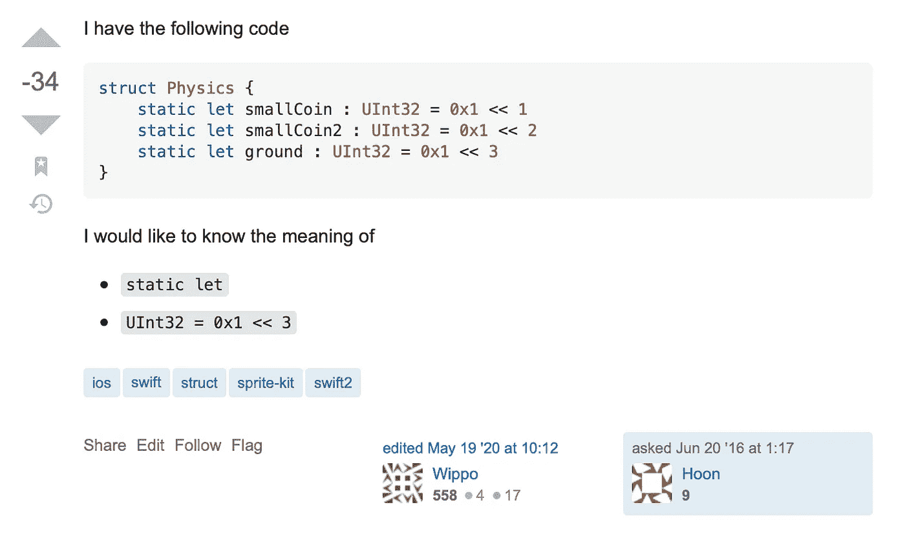
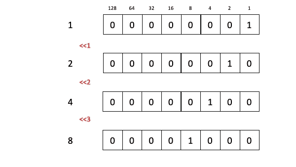

# 这是 Stack Overflow 投票最多的 Swift 问题

> 原文：<https://betterprogramming.pub/this-is-stack-overflows-most-downvoted-swift-question-a300826bd776>

## 公平不公平？


由[卡莱布·塔普](https://unsplash.com/photos/J59wWPn09BE)在 [Unsplash](https://unsplash.com/) 上拍摄。

本周，有一个特别的问题引起了我对堆栈溢出的注意。这是:



作者截图。

这恰好有一个- *34* 的范围，使得它成为目前栈溢出中关于 Swift 投票最多的问题。

让我们一起探索到底发生了什么！

# 这个问题

该问题有一个评论，它代表了“标准的、记录良好的 Swift 语法|”这很可能是真的。然而，值得看看这个问题和这里问的是什么。

```
struct Physics {
    static let smallCoin : UInt32 = 0x1 << 1
    static let smallCoin2 : UInt32 = 0x1 << 2
    static let ground : UInt32 = 0x1 << 3
}
```

使用了 struct(它是一个值类型)和`static`，这意味着属性与声明它们的类型相关联，而不是与实例相关联。在这种情况下，有三个属性，它们都是表示不同值的无符号整数。

创建这个结构的一个实例，然后读出属性，这是很有用的，这可以用 Swift 来完成。

```
print (Physics.smallCoin) // 2
print (Physics.smallCoin2) // 4
print (Physics.ground) // 8
```

因此，我们可以说，每个属性都是一个值，它是通过使用 Swift 的高级运算符[的一个位移而得到的。](https://docs.swift.org/swift-book/LanguageGuide/AdvancedOperators.html)

# 回答问题所需的知识

## 为什么？

看起来这个问题可能来自于物理模拟需要一些常数。整数可能代表吸引力(或类似的东西)或世界上的一组项目，这很好。

这就引出了问题的第一部分。

## 静态 let

有几个原因可以让你使用属性的`static let`:

*   对常数和类似的配置使用静态属性。
*   对昂贵的对象使用静态属性，这样只需为该类型创建一次实例，而不必为每个实例创建一次。
*   一个[工厂](https://stevenpcurtis.medium.com/the-factory-pattern-using-swift-b534ae9f983f)可以使用静态方法创建复杂的对象。

我们将集中讨论第一个问题。

这个问题是关于一个结构的，这个结构可以很好地表示类似常量的东西。我在我的许多项目中都使用了这种方法，尽管我通常使用 enum，而不是下面这种格式的建议结构:

要了解 struct 和 enum 之间的区别，请看一下本文。

这就导致了这样一种情况，我们将`smallCoin`、`smallCoin2`和`ground`的值表示为`struct`中的`static let`。

## UInt32 = 0x1 << 3

The type given here is [UInt32](https://medium.com/@stevenpcurtis.sc/int-uint8-or-uint16-swift-im-confused-bbb19f28e4ad) ，这意味着该值是一个无符号的[整数](https://stevenpcurtis.medium.com/what-is-an-integer-1a26cdd18d68)。然后，根据我们所指的属性，该值被给定为`0x1 << 1`、`0x1 << 2`或`0x1 << 3`。

要理解这一点，我们需要认识到`0x1`是[十六进制](https://medium.com/@stevenpcurtis.sc/hexadecimal-in-programming-691ffe32f707)，代表 *1* 的十进制值。从那里，我们使用[位移运算符](https://docs.swift.org/swift-book/LanguageGuide/AdvancedOperators.html):



由 *1* 进行的 *1* 位移位的初始值产生值 *2* 。 *1* 的初始值通过 *2* 的位移位产生值 *4* 。 *1* 的初始值通过 *3* 的位移产生值 *8* 。

现在，我们为什么需要像这样对单个值进行比特移位还不完全清楚。

# 成本

提出这个问题的人从来没有问过另一个问题，或者在堆栈溢出时自己回答过一个问题。这可能意味着此人不再在 Swift 中编码，或者可能根本不再编码。

公平的问题在这里可能是有限的，因为反对票的人力成本和这样一个负分可能给人的感觉。这真的不好。

# 结论

堆栈溢出可能是一个很难提问的地方，而且要想出一个紧迫的问题需要的所有行为方式可能很棘手。

如果你想要这篇文章的视频版本，请到 YouTube 上查看。

感谢阅读。