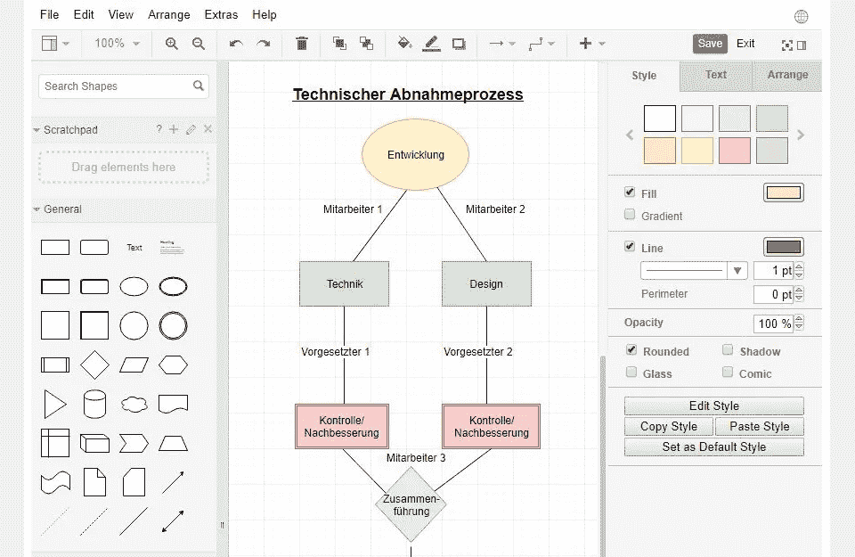
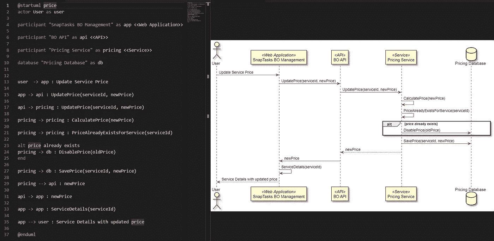

# 这就是为什么大多数软件工程师不写文档

> 原文：<https://betterprogramming.pub/this-is-why-most-software-engineers-dont-write-documentation-670ceecb6a21>

## 不仅仅是因为技能，实际上是因为缺少好的文档工具

照片由[西格蒙德](https://unsplash.com/@sigmund?utm_source=medium&utm_medium=referral)在 [Unsplash](https://unsplash.com?utm_source=medium&utm_medium=referral) 拍摄

无论你是在一家小公司还是大公司工作，当涉及到你的服务或项目的好的、有价值的文档时，很可能会有巨大的缺口和需求。

这可能会影响组织的多个部分，从决定实现目标的最佳途径的论坛，到需要增加系统结构和相互通信知识的新同事的加入。

但是，如果每个人都感觉这个问题就在他们的皮肤上，为什么这些天还会发生这种情况呢？

# 为什么文档如此重要？

## 会议

如果你曾经参与过一个新的、即将到来的项目的讨论，该公司需要找出如何适应其当前的代码库，你知道在那些会议期间被分析的想法、建议和解决方案的数量。根据参加会议的人数，这个数字会呈指数级增长。

每一个解决方案的提议通常都有在会议中讨论的优点和缺点。

现在想象一下，你结束了会议，然后去做你的日常工作(编写一个特性或者其他什么)。当有人在几周/几个月后问你，你相信你能记得讨论过的提议，每个提议的利弊，哪些被放弃了，以及为什么——或者甚至为什么做了一个给定的决定而不是另一个决定？你真的认为你能提供这些答案吗？

你不会的。认识到这个“弱点”并不会让你看起来很糟糕——恰恰相反。知道自己的弱点会让你变得强大。这是减少他们影响的唯一方法。

那么，你应该做些什么来避免浪费你生命中的一个小时、你同事的时间和公司的钱呢？你最好把会议记录下来。

创建会议记录，以便同事在需要时可以查阅，这是跟踪会议情况的一个很好的方法。你可以在会议期间或会后做笔记。不要在会议和发表你的笔记之间浪费太多时间。否则，你会记不住发生的事情的一半。

确保写下主要的谈话要点、每个人讨论的提议、每个提议的利弊、做出的决定和行动项目。

## 时间旅行

一个很有哲理的标题，但也不完全是假的。

如果事情进展顺利，你的业务在新需求方面有所增长，你一年前做出的决定很可能会对新需求产生负面影响。

在这一点上，你需要向高层管理人员解释为什么事情会这样发展。你猜怎么着？你不会记得的。

如果你有会议记录，知道你何时以及为什么做出这个决定，你(和你的经理)会记得你做出这个决定是因为公司必须完成一个严格的、有时间限制的最后期限，或者任何其他原因。

## 辩论观点

在办公室工作时(哦，过去的好时光)，工程师们经常围着白板讨论想法，我们在白板上画画并解释我们的建议。这通常是通过 UML 图来完成的。

如果你足够幸运还能这样做，在离开前拍几张董事会的照片。你不希望下一个团队用黑板擦掉你和另外五个人花了两个小时讨论的内容。

但是，如果您需要这样做，并且您正在远程工作，该怎么办呢？

当我第一次面对这个问题时，人们只是试图用语言来解释他们的意思。问题是，自然语言是可以解释的，我从一个给定的句子中理解的可能不完全是你想说的。

我对这个案子的建议？使用任何绘图或 UML 工具并共享您的屏幕。让人们看到你从对话中理解了什么，并让每个人在对话中保持一致。

乍一看，这可能看起来比较慢，因为你需要几秒钟来理解人们在说什么，但这将使沟通更加有效，因为我们至少消除了部分翻译差距。

## 入职

培养一个新的团队成员总是一个挑战。你需要回到基础，解释你的系统是做什么的，以及每个拼图块如何适合整体架构。

如果每次有人进入公司，你都需要这样做，这可能是一项耗时(因此也是耗钱)的活动。

如果你有解释你的系统基础的文件，它可能帮助你给新来者提供一些自主权。

要有创意！如果做得好，创建一个入职计划可以节省你很多时间去做其他的任务，而且，通常，一个计划不需要太多的维护。

设计一些图表和方案，直观地展示事物是如何工作的。做个视频。利用这个任务来提高自己的某些方面。

# 设计不仅仅是软件架构师的事情

如果你职业生涯的大部分时间都在一家大企业工作，那么设计系统以及它们如何相互通信就不是你工作描述的主要部分。你的公司有软件架构师来做这项工作。他们不写代码行，而是设计线条和箭头，指出你应该如何构建服务。

有一种诱惑是躺着依赖他们的文件。问题是你的架构团队的文档将更多的是你的系统的宏观视野。它不会有你的边界或服务的特定逻辑。你和你的团队知道它在微观层面上是如何运作的。

通过提供更多细节来扩展现有文档。这些细节可能是做一个好的决定和做一个坏的决定之间的差别，你只有在几个月后才会发现。

另外，通过这样做，你将训练你的架构和系统设计技能，这对任何软件工程师来说都是一件好事。

# 大多数设计工具都很糟糕

我们来谈谈系统设计工具，好吗？

我遇到的大多数工具都是极度视觉驱动的。我这么说是什么意思？大多数都需要你画出线条和方框来表达你想要的东西。

人们太关注事物的外观，而不是关注一个易于创建、更改和维护的图表。

如果你设计一个类图，比如在 [Draw.io](https://app.diagrams.net/) 上，你需要搜索你想要的项，拖拽，连接，写出它的含义。你需要意识到这些线条是否好看，以及你是否能正确理解它们。您需要检查图表看起来是否“良好”

从 BlueSpice.com[取回的 Draw.io】](https://bluespice.com/draw-io-for-mediawiki-and-bluespice/)

假设您需要更改这个图并添加更多的组件。要做到这一点，您需要重新安排一切以适应并确保图表仍然看起来不错。将此乘以您需要更新图表的次数。

**像这样的工具不是为开发者设计的。它们可能对产品经理、设计师和高层管理人员有用，但对开发人员没用，因为他们没有考虑到我们天生的懒惰，这让我们构建东西更有效率。**

然而，至少有一种工具是以不同的方式构建的。

## PlantUML

我第一次接触 [PlantUML](https://plantuml.com/) 是在大学的时候。我们需要设计一些图表，教授要求我们使用这个工具。当时，我们从未使用过这样的东西。我们当时使用的主要工具是[可视化范例](https://www.visual-paradigm.com/)，这是另一个可视化工具。

那时候我对 PlantUML 不是太喜欢。为什么？简单:我不知道语法和如何使用它。现在，我非常感谢那些向我介绍这个了不起的工具的教授们。

*好，我们明白了。你喜欢那个工具。但是它和其他的有什么不同呢？*

一切。

首先，你不画任何东西。你写代码。编译后输出图像的代码。这允许您更快地设计，从其他图中复制例子，并使它们适应新的图以保持版本控制。

代码和输出序列图示例

在上图中，你可以查看我为硕士论文制作的图表示例，其中有一个计算服务价格的序列图。正如你所看到的，我没有得到指令来改变这个图的视觉效果。我陈述了每个组件之间的相互作用。其他一切都由 PlantUML 来处理。

我将这段代码保存在 Git 存储库中，在这里我可以控制更改，接受更新的合并请求，并像管理其他代码一样管理它。

# 软件工程文档工具的未来

我真的相信，如果我们希望开发人员为他们所做的事情制作文档，我们需要更多像 PlantUML 这样的工具。我们喜欢编码。浪费时间摆弄小盒子和彩色按钮对我们任何人都没有好处。

然而，即使有了 PlantUML，仍然有改进的空间。使用 PlantUML 时最让我恼火的一件事是，没有办法让多个页面访问相同的代码来编译 UML。我需要通过不同的页面复制代码，每次我做了更改，我都需要更新每个页面。让页面用代码访问 Git 存储库，下载它，然后编译它并生成图像，将进一步提高这些图的可维护性。

另外，PlantUML 生成的图像看起来完全过时了。我知道我说过开发者不在乎视觉，但是拜托…我们现在是材料设计的时代，不是 HTML 1.0。

有了这两点，开发新的文档将是一件幸事，将单调的拖放任务变成编码图表的乐趣。

# 心态问题

大多数情况下，理解好的、最新的文档的价值与一个人的心态紧密相连。如果我们不习惯这样做，就很难改变习惯。

开始为你觉得有用的东西创建文档。与他人分享。渐渐地，鼓励其他人也这样做。不可能让每个人都做自己的文档，但是我们需要从某个地方开始。

建立这种心态，承认设计和文档是软件开发的一部分。在你的同龄人中成为这种思维方式的大使。

感谢您阅读我的文章。

如果您有任何问题或主题想要进一步讨论，请留下回复。我很乐意谈论他们！