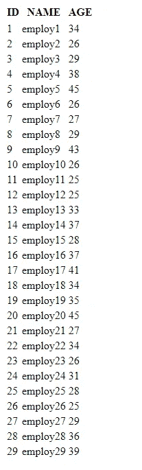

# 这就是为什么您应该在 Python 项目中使用 Tortoise-ORM

> 原文：<https://betterprogramming.pub/this-is-why-you-should-use-tortoise-orm-in-your-python-projects-a3897dc5309e>

## 像老板一样管理您的数据库！


图片由[沃尔夫冈·哈塞尔曼](https://unsplash.com/@wolfgang_hasselmann)在 [unsplash](https://unsplash.com/) 拍摄

将关系数据库集成到我们的代码中可能会很麻烦，但是使用 ORM 会更容易。

在本文中，我将向大家介绍一个名为乌龟 ORM 的前沿 Python ORM 包，并给出一个实际操作的例子。

# 为什么是 ORM？

对象关系映射将关系数据库表结构映射到对象中。

这使得我们可以避免在代码中编写显式的 SQL 查询，而这些查询可能很难阅读、调试和维护。

在这个简单的例子中，我们创建一个名为`db1`的`sqlite`数据库，然后创建一个名为 employees 的表，该表有三个字段:`ID`、`NAME`和`AGE`，然后我们在这个表中插入一行，提交更改并关闭连接。

现在，我们可以在 Visual Studio 代码的 SQLite 扩展中查看表格内容:


所以，这段代码可以工作，但是维护起来很糟糕。

尤其是当有几十个表，它们之间有复杂的关系，并且它们经常被修改并需要迁移时。

使用 ORM 将会用对象和函数调用代替所有的查询，这将会带来更好的组织和可读性。

# 为什么是乌龟？

乌龟 ORM 的关键优势是它对 asyncio 的本地支持。大多数其他 Python ORM 包需要一些变通方法来使用 asyncio 代码。对乌龟来说，这是天生的！

这太棒了，不是吗？

因此，让我们重构上面的例子来处理乌龟和 asyncio！

现在代码的可读性大大提高了！

# 并发

如上所述，Tortoise ORM 支持原生异步。

大家好好利用一下:)。

因此，在这个例子中，我创建了 30 个用户，同时，我执行了 10 秒钟的睡眠(这可以是任何其他有意义的任务)。

因此，如果这是一个常规的顺序代码，我们应该预计运行时间为 300 秒。

但是对于并发，这只需要 10 秒钟:)

让我们看看输出:

```
total_time= 10.03 seconds
```

现在，让我们看看这张表:



太好了！

# 更多精彩内容！

Tortoise 很容易集成到异步 web 服务器框架(ASGI)中，例如 fastapi、quart 或 Starlette。

它可以在运行时轻松地从 ORM 模型中创建 pydantic 模型。

它带有一个内置的迁移工具来跟踪数据库的变化；它支持事务、触发器(称为信号)甚至路由器将查询路由到不同的数据库实例。

它为数据库管理和操作带来了完整的工具链，并提供了令人惊叹的开发人员体验。

*感谢阅读。敬请关注更多内容。*