# 了解 Dtale——一个 Python 库，可以像 Excel 一样交互地分析数据

> 原文：<https://betterprogramming.pub/this-library-can-analyze-data-interactively-like-excel-d1d89fe80a5a>

## 用 Dtale 详细分析


肖恩·奥尔登多夫在 [Unsplash](https://unsplash.com/s/photos/magnifying-glass?utm_source=unsplash&utm_medium=referral&utm_content=creditCopyText) 上拍摄的照片

Python 是一种编程语言，可以用于很多情况，其中之一就是分析数据。Python 能够大规模地分析数据，这是电子表格软件(如 Microsoft Excel 和 Google Sheets)所不具备的。

虽然像 Pandas 这样的库已经足够用来分析数据了，但是像电子表格软件这样的交互式数据分析在某些情况下仍然很有帮助。在本文中，我将向您展示如何使用名为 [Dtale](https://github.com/man-group/dtale) 的库来交互式地分析数据。事不宜迟，我们开始吧！

# 履行

## 安装库

在我们可以使用这个库之前，我们需要做的第一步是使用 pip 安装这个库。下面是执行该操作的命令:

```
**pip install dtale**
```

## 数据源

对于数据源，我们将以 gapminder 数据为例。Gapminder 提供全球每个国家的人口数量、人均 GDP 和预期寿命等数据。你可以从 Kaggle 下载数据，我把链接 [**放在这里**](https://www.kaggle.com/datasets/tklimonova/gapminder-datacamp-2007?resource=download) 。


截图为作者截图。

让我们打开数据。要使用 dtale 访问数据，您可以编写以下代码:

```
**import dtale
import pandas as pd****df = pd.read_csv('your_data_path')
d = dtale.show(df)
d**
```

这样，它将显示如下界面:

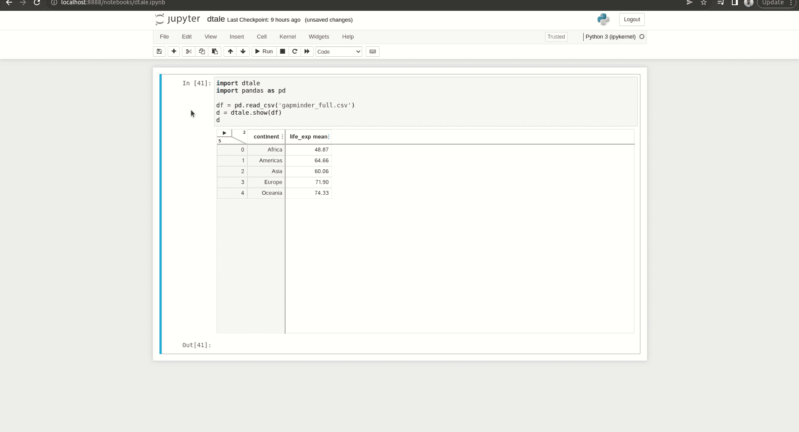

## 数据操作

你已经打开了数据集，但是你能用它做什么呢？使用 dtale，您可以像处理熊猫一样处理数据。先做过滤吧。假设我们想要过滤 2007 年的数据。为了做到这一点，下面是展示这一过程的 GIF:

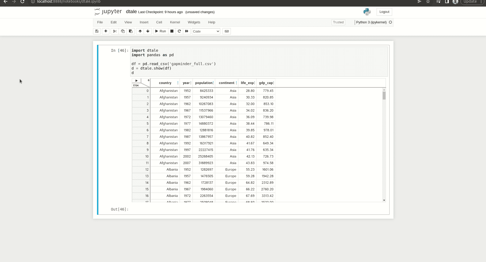

我们还可以通过单击特定的列并为其设置参数来对数据进行排序。假设我们根据人均 GDP 从最高到最低对数据进行排序。下面是展示这个过程的 GIF:

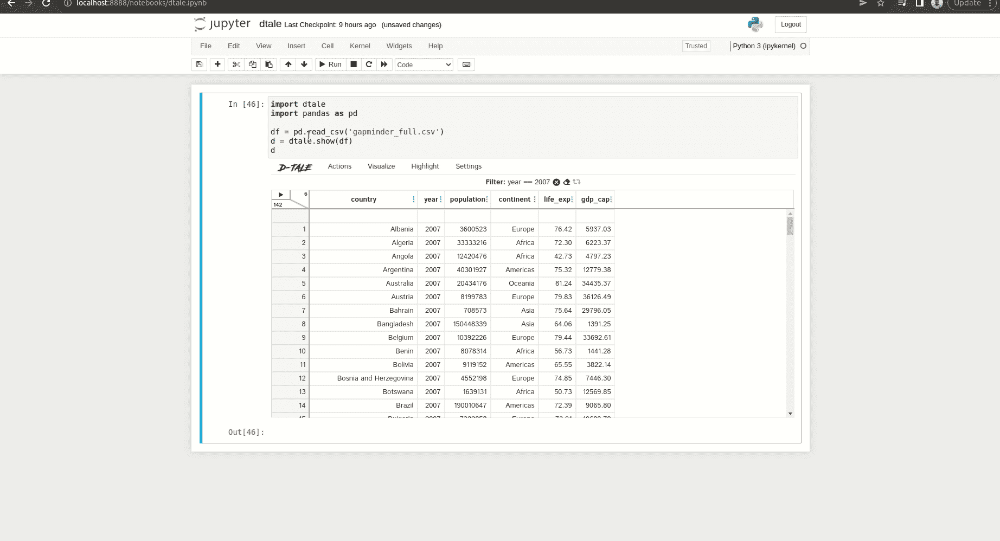

最后，我们可以使用库来聚集数据。比方说，我们用平均值来汇总各大洲的预期寿命。为此，你可以在下面的 GIF 中看到这个过程:

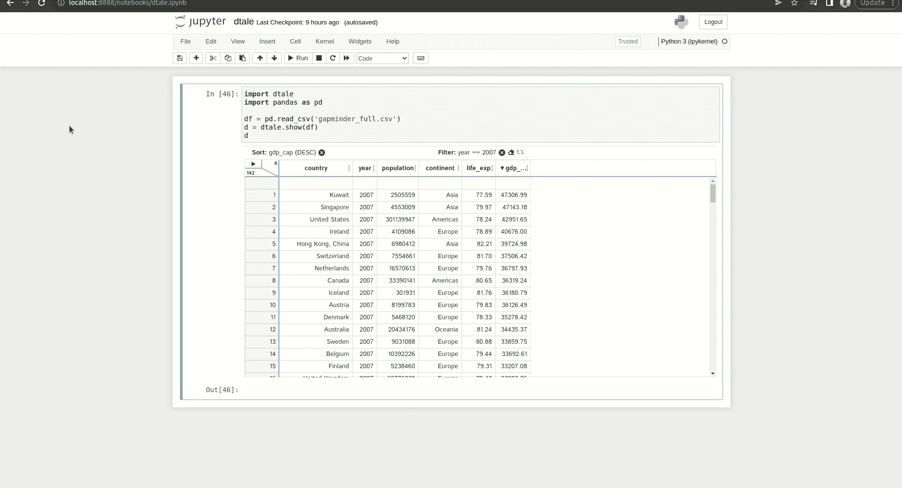

## 探索性数据分析

有了 dtale，你可以做不同种类的可视化。如果您想分析每一列，您可以使用库中的“描述”功能。

要访问该功能，您可以悬停在界面的顶部，然后选择可视化>描述如下:

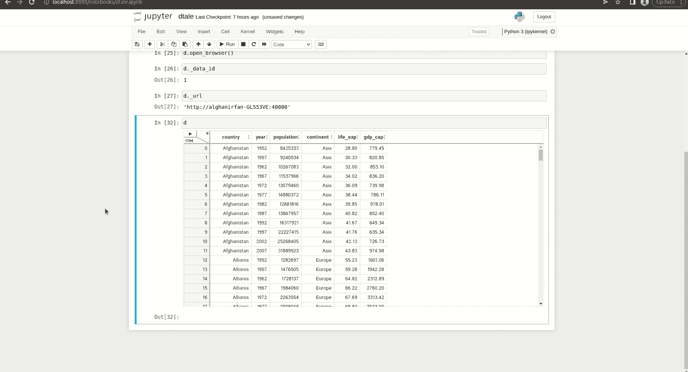

在页面上，您可以检查和分析每一列。让我们看看预期寿命一栏。在顶部，您可以看到显示不同可视化效果的选项卡。在下方，您可以看到诸如唯一值、异常值和列内值之间的差异等信息。这是描述页面的预览:


现在让我从顶部开始给你解释每个标签。第一个选项卡是 describe 选项卡，它包含所选列的统计摘要。它还显示列中的盒状图。

第二个选项卡是直方图选项卡，它显示一个列的直方图。您可以通过更改条柱的数量或基于特定列对数据进行分组来调整直方图可视化。

第三个选项卡是 grouping 选项卡，它显示一个基于分类列聚合列值的条形图。你可以看到我汇总了各大洲的预期寿命值。我们还可以改变聚合方法，无论是使用平均值还是中位数。

最后一个选项卡是 Q-Q 图。这个图基本上告诉了我们列的分布情况。你可以看到一条直线和它里面的数据点。数据点越接近直线，分布就越正常。

## 数据可视化

除了分析列，我们还可以使用库进行更多的可视化。你只需将光标悬停在界面顶部，然后单击可视化>图表，如下所示:

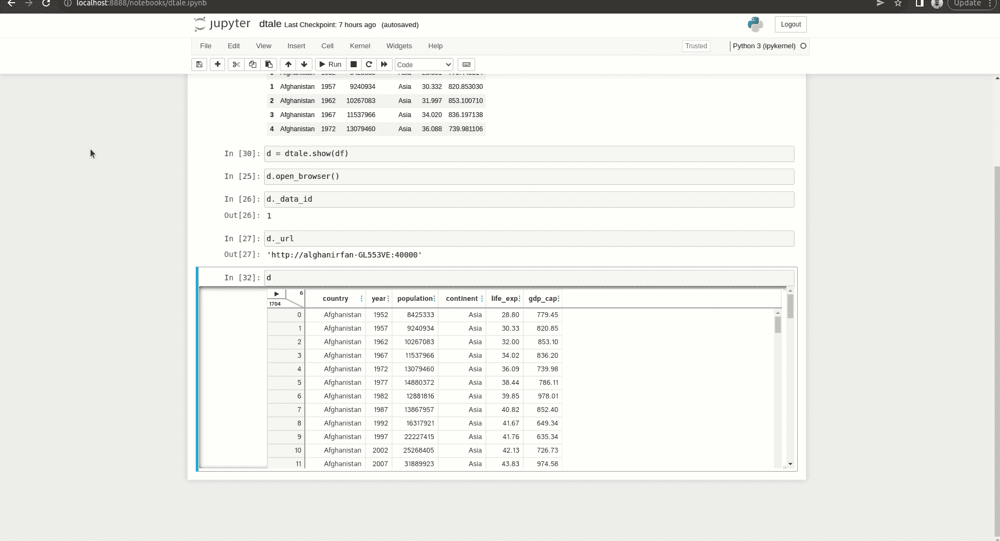

使用这个特性，我们可以创建折线图、散点图，甚至可以使用地图创建可视化效果。

为了创建可视化流程，您需要设置变量和聚合方法等参数。以下是创建可视化效果的截图:

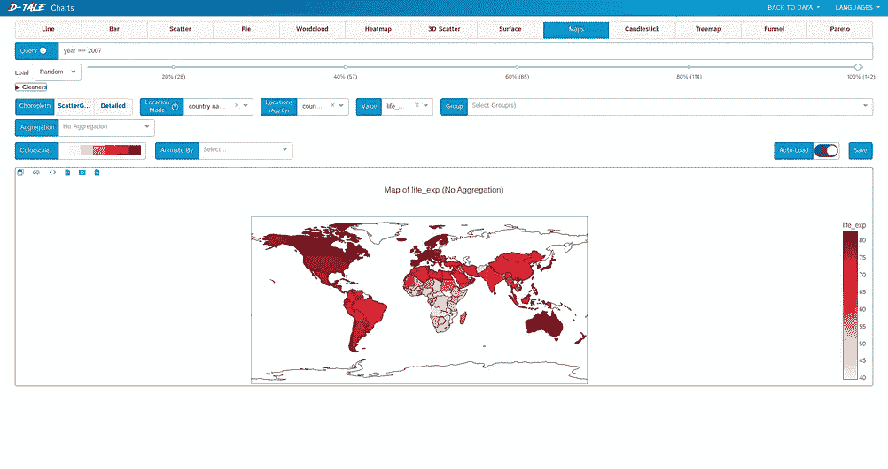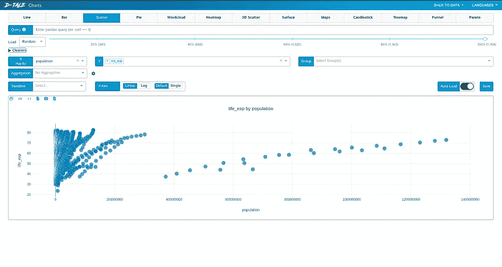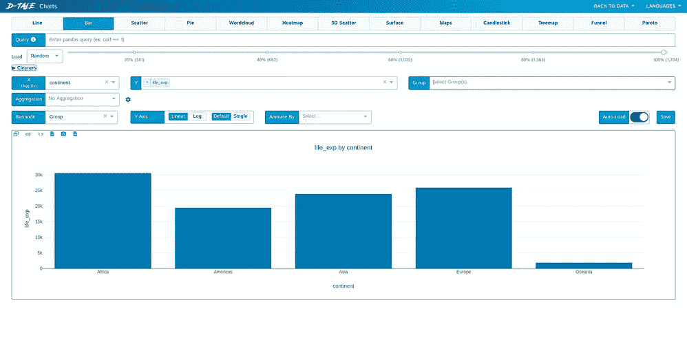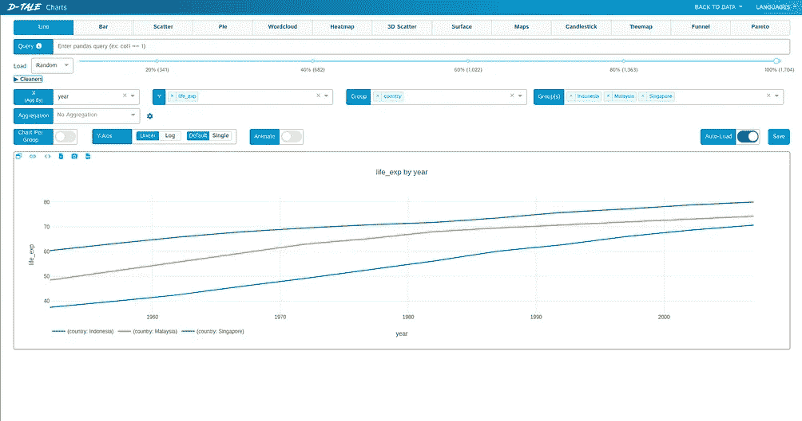

从左上(顺时针):地图，散点图，条形图，折线图

## 缺失数据分析

使用 Dtale 库，您还可以通过可视化来分析缺失的数据。与上一部分不同，让我们使用 Kaggle 的泰坦尼克号数据集，你可以在这里 访问 [**。以下是缺失分析特征的 GIF:**](https://www.kaggle.com/c/titanic)

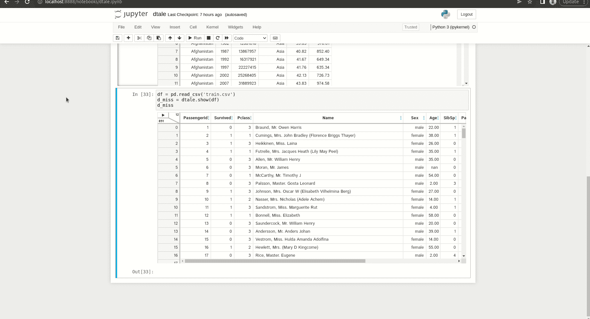

我们可以做几个形象化的例子。

*   Matrix 是第一个显示每列缺失数据位置的可视化工具。
*   如果一个值的存在会影响另一个值，则关联热图会显示关联。
*   树状图比热图更能显示每个变量的相关性。
*   条形图显示每列中未丢失数据的数量。随着标杆越来越高，意味着丢失的数据越来越少。

## 导出代码

因为这是一个 Python 库，所以我们可以将我们的处理步骤转换成代码。让我们以各大洲的总预期寿命为例。我们以前做过这个，但是现在让我们把它转换成代码。下面是过程的 GIF:

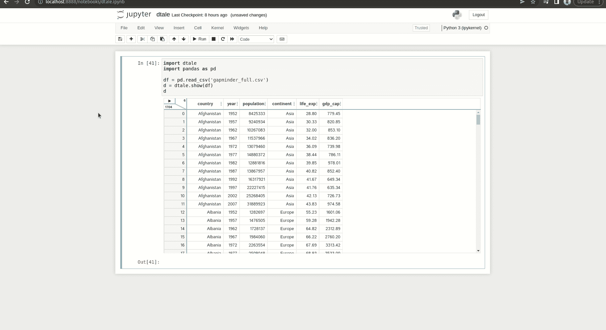

干得好！现在您已经了解了 Dtale 库。有了这个交互式用户界面，我希望它能帮助你更容易地分析数据。

感谢您阅读我的文章。

## 参考

[1] GitHub。[https://github.com/man-group/dtale](https://github.com/man-group/dtale)

另一篇你可能喜欢的相关文章:

[](https://towardsdatascience.com/d-tale-one-of-the-best-python-libraries-you-have-ever-seen-c2deecdfd2b) [## D-Tale:你见过的最好的 Python 库之一

### 以下是我对这个必备 Python 库的看法，以及为什么你应该试一试

towardsdatascience.com](https://towardsdatascience.com/d-tale-one-of-the-best-python-libraries-you-have-ever-seen-c2deecdfd2b) 

```
**Want to Connect?**If you have any questions, you can contact me via [LinkedIn](https://www.linkedin.com/in/alghaniirfan/).
```