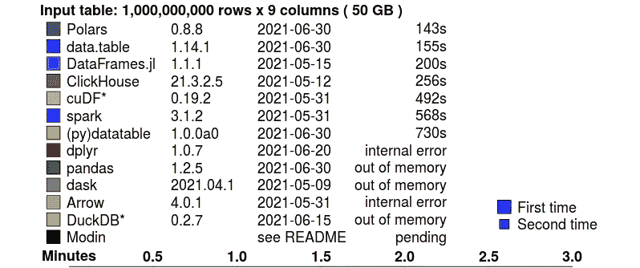
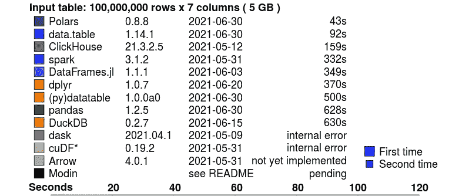

# 这个图书馆比熊猫快 15 倍

> 原文：<https://betterprogramming.pub/this-library-is-15-times-faster-than-pandas-7e49c0a17adc>

## Polars 简介:一个用于操作数据的 Python 库


汉斯-尤尔根·马格在 [Unsplash](https://unsplash.com/s/photos/polar-bear?utm_source=unsplash&utm_medium=referral&utm_content=creditCopyText) 拍摄的照片

准备数据集是我们在数据科学过程中需要完成的步骤之一。Pandas 是准备和分析表格数据最受欢迎的库选择。但是有一个问题。这个库很慢，尤其是在较大的数据集上。

令人欣慰的是，如此多的开发人员开发了能够以指数级速度更快准备数据的库。其中一个图书馆叫做[极地](https://www.pola.rs/)。

Polars 是一个使用 Rust 语言实现的库。此外，它是为 Python 语言创建的。它很快，因为它使用了计算机上的所有内核。除此之外，他们还使用自己的算法优化了数据处理过程。

但是 Polars 的速度有多快，和熊猫有什么区别？

在本文中，我将带您了解 Polars 的细节，从为什么应该使用它们到如何使用这个库。我们开始吧！

# 为什么是 Polars？

## 它很快。我是说非常快。

H2O.ai 对所有用于数据操作的库进行了基准测试。已经完成的测试是聚合数据和连接两个不同的数据集。这些测试是在从 0.2 GB、5 GB 到 50 GB 的三种不同的数据集大小上进行的。你可以在这里看到关于实验[的细节。](https://h2oai.github.io/db-benchmark/)

在聚合任务上，Polars 遥遥领先于所有竞争对手。他们在 143 秒内聚合了 50 GB 的数据集。熊猫甚至不能完成这个过程，因为它们没有内存。您可以在下面的图表中看到详细信息:



图表摘自 H2O.ai [基准测试结果。](https://h2oai.github.io/db-benchmark/)

在连接两个数据集的任务中，Polars 在 43 秒内完成了。同时，熊猫用了 628 秒。我们可以看到 Polars 几乎比熊猫快 15 倍。您可以在下面的图表中看到详细信息:



图表摘自 H2O.ai [基准测试结果。](https://h2oai.github.io/db-benchmark/)

## 它很容易使用

除了速度快，这个库也很容易使用。与熊猫相比，Polars 有一个写得很好的代码。

对于那些已经在 R 语言中使用过 dplyr 这样的库的人来说，你会感到惊讶，因为语法真的很相似。

让我们以 iris 数据集为例。您可以通过此处的链接[访问数据集。这是数据集的预览:](https://www.kaggle.com/uciml/iris)

在这个数据集中，我们想做一个简单的任务。任务是过滤萼片长度大于 5 的数据。

然后，我们使用 sum 基于其种类聚集数据。在熊猫身上，这个过程可以用这些代码行来完成。此外，您可以看到下面的结果:

现在让我们将同样的任务应用于极坐标。首先，我们必须使用 pip 安装库。下面是实现这一点的代码:

为了解决这个问题，Polars 语法非常简单。它有一个声明性的属性。因此，我们可以通过声明所需的函数来完成这项工作。下面是这样做的代码和结果:

正如你从上面看到的，Polars 的结果与熊猫相似。此外，我们有一个简单易学的语法，同时我们在更大的数据集上有很大的性能改进。

我已经给你们展示过极化器了。我希望你能从这里学到新的东西。

此外，我希望本文能帮助您解决操作大型数据集的问题。因此，你不必担心内存和计算资源。

```
**Want to Connect With the Author?**Hit them up on [LinkedIn](https://www.linkedin.com/in/alghaniirfan/).
```