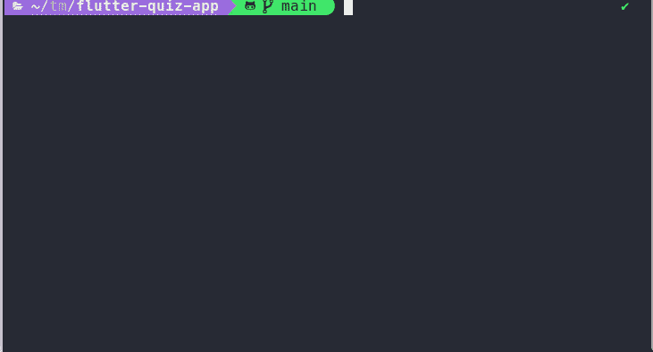
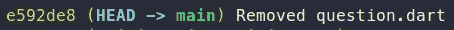
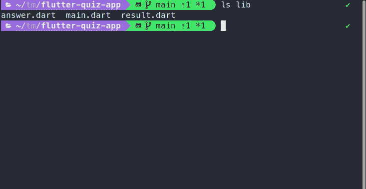

# 这个强大的命令行工具可以用 Git 撤销您的错误

> 原文：<https://betterprogramming.pub/this-powerful-command-line-tool-undoes-your-errors-with-git-a14fd8470dc5>

## ugit 是通用的“git undo”工具


由[莎拉·基利安](https://unsplash.com/@rojekilian?utm_source=unsplash&utm_medium=referral&utm_content=creditCopyText)在 [Unsplash](https://unsplash.com/s/photos/oops?utm_source=unsplash&utm_medium=referral&utm_content=creditCopyText) 拍摄的照片

Git 几乎是版本控制系统的标准解决方案。还有其他的，比如 Perforce，但是绝大多数开发人员使用 git。这是一个简单易学但很难掌握的工具。

基础很容易掌握。您将更改添加到临时区域，将它们添加到提交树，并将它们推送到远程存储库。如果出了问题你会怎么做？“取消提交”不是一件事。git 中没有通用的撤销。

这是“难以掌握”的部分。要更改提交消息，您必须改变基础或使用 amend。不小心删除了一个标签？你“只是”要用[三个命令](https://dzone.com/articles/git-tip-restore-deleted-tag)才能拿回来。撤消不需要的更改可能会让您付出很大的努力。

Ugit 是一个命令行工具，可以帮助你交互式地撤销你的错误。

# 装置

在我们安装 ugit 之前，我们需要先安装 [fzf](https://github.com/junegunn/fzf) ，因为 ugit 正在内部使用它。Fzf 是另一个很酷的工具，一个命令行模糊查找器，我将在另一篇文章中介绍它。我们可以简单地用默认的包管理器安装它。和往常一样，我测试了你在 Ubuntu 22.04 LTS 版上看到的所有东西。

```
sudo apt install fzf
```

另一方面，Ugit 不能通过包管理器获得。您可以克隆[存储库](https://github.com/Bhupesh-V/ugit)并运行安装脚本，或者您只需使用以下命令:

```
sh -c "$(curl -fsSL [https://raw.githubusercontent.com/Bhupesh-V/ugit/master/install](https://raw.githubusercontent.com/Bhupesh-V/ugit/master/install))"
```

但是，我强烈建议不要直接运行任意的、未经检查的脚本！前往 GitHub，克隆[库](https://github.com/Bhupesh-V/ugit)，首先查看脚本，然后运行它。

# Ugit 在行动

安装后，只需在终端中输入`ugit`并按下`Enter`。



ugit 接口

Ugit 可以撤销许多不同的 git 命令。您可以使用箭头键选择合适的选项。让我们添加一个提交并立即撤销它。


撤消提交

这相当于`git reset HEAD~`。拥有这一点很好，但是您可能已经记住了这个命令，因为撤销提交并不罕见。让我们看另一个例子。

如果我们不小心删除了一个文件，该怎么办？我们不想恢复提交，我们只想取回文件。



我的天啊。提交操作`e592de8`也意外删除了`quiz.dart`！Ugit 前来救援:



恢复已删除的文件。

顺便说一下，在这里你可以看到另一个有用的功能。您无需滚动列表，只需点击即可找到您想要的命令。

我相信你同意 ugit 是一个非常有用的工具。我不会展示它可以(不可以)做的所有事情，但是作为参考，下面是完整的列表:

Ugit 可能会撤消以下操作:

*   `git commit`
*   `git add`
*   `git push`
*   `git branch -D`
*   `git pull`
*   `git reset`
*   `git tag -d`
*   `git stash apply`
*   `git stash pop/drop/clear`
*   意外删除文件
*   `git merge`
*   `git cherry-pick`
*   `git tag`

最后，提醒一句:像 ugit 这样的工具很方便，因为人不可能记住所有的东西。但是完全依赖它是有风险的。Ugit 隐藏了 git 的复杂性。如果我们不了解 git 的基础知识，我们可能会对存储库造成损害。否则，就像在没有任何数学知识的情况下使用计算器一样。看看 ugit 作者的这个页面,它列出了 ugit 用来撤销事情的确切命令。

# 概述

Ugit 帮助我们快速撤销 git 中的错误。这是一个很好的记忆辅助工具，但是我们仍然应该知道 git 的基础知识。

文中提到的所有链接:

*   [恢复已删除的标签](https://dzone.com/articles/git-tip-restore-deleted-tag)
*   [GitHub 上的 FZF](https://github.com/junegunn/fzf)
*   GitHub 上的 UGIT
*   [Git 撤销命令详细内容](https://til.bhupesh.me/git/how-to-undo-anything-in-git)

感谢您的宝贵时间！

```
**Want to Connect?**Subscribe to my newsletter and never miss a new post:
[https://verbosemode.dev/subscribe](https://verbosemode.dev/subscribe).
```