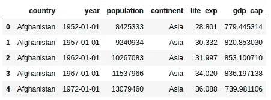
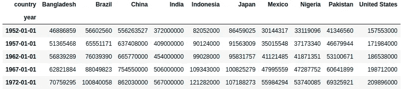
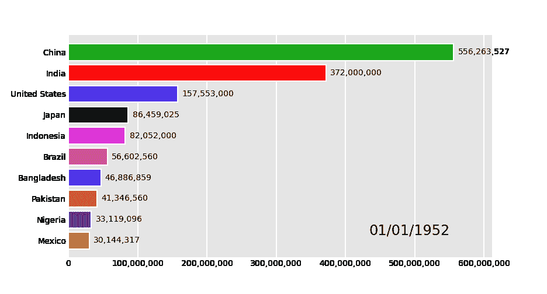
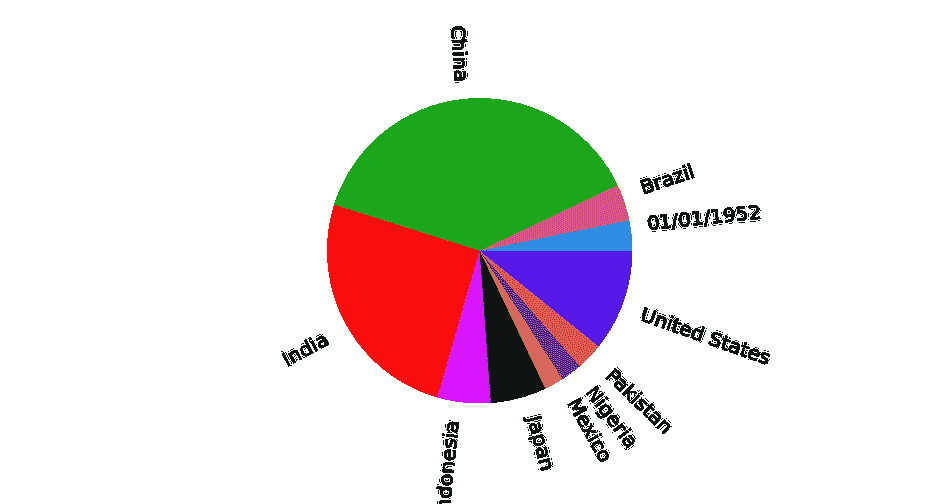
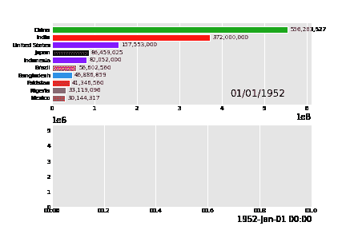

# 这个 Python 库可以制作图表动画

> 原文：<https://betterprogramming.pub/this-python-library-can-animate-your-charts-a7c0a98b3463>

## 熊猫图书馆简介


Pawel Czerwinski 在 [Unsplash](https://unsplash.com/s/photos/dark-abstract?utm_source=unsplash&utm_medium=referral&utm_content=creditCopyText) 上的照片

# 介绍

您想创建动画图表吗？活着的熊猫可能是你的解决方案。这篇文章将向你展示如何使用 Pandas Alive 库制作图表动画。整个过程只用一行代码就可以完成。事不宜迟，我们开始吧！

# 履行

## 安装库

在我们可以使用库之前，我们需要做的第一步是安装库。该过程可以通过使用 pip 命令来完成，如下所示:

```
! pip install pandas_alive
```

## 数据集

对于数据集，我们使用 Kaggle 的 gapminder 数据集。Gapminder 是一个数据集，包含从 1962 年到 2007 年世界各国的 GDP、预期寿命和人口数量的信息。更多详情，可以在 这里看链接 [**。**](https://www.kaggle.com/datasets/tklimonova/gapminder-datacamp-2007)


让我们使用下面这些代码行来加载数据:

```
import pandas_alive
import pandas as pddf = pd.read_csv('data.csv', encoding='iso-8859-1', parse_dates=['year'])
df.head()
```

以下是数据预览:



# 准备数据

为了使图表更加方便，我们需要对数据进行预处理。首先，我们根据世界上人口最多的国家过滤数据。下面是实现这一点的代码:

```
**# Input: Data -> Grouping based on country -> 
# Take the max value -> Sort by largest populations first -> 
# Output: the countries' name**
most_pop = df.groupby('country').max().reset_index().sort_values('population', ascending=False).country[:10].tolist()most_pop**>>> ['China', 'India', 'United States', 'Indonesia', 'Brazil',
 'Pakistan', 'Bangladesh', 'Nigeria', 'Japan', 'Mexico']**
```

然后，我们使用 pivot_table 函数透视该表，将 year 列设置为行索引，将 population 列设置为列索引。下面是代码及其输出:

```
**# Filter based on most populous country**
df = df[df.country.isin(most_pop)]**# Pivot the table**
df_pivot = df.pivot_table(values='population', columns=['country'], index=['year'])df_pivot.head()
```



## 创建图表

有了数据后，我们可以创建动画图表。生成图表很容易。这个过程可以在一行代码中完成。

让我们以创建条形图为例。要创建它，我们可以使用这样一行代码:

```
df_pivot.plot_animated('bar-chart.gif')
```

这是结果:



多酷啊。！我们还没完。假设我们想要创建一个基于不断增长的人口数量的折线图。下面是实现这一点的代码:

```
df_pivot.diff().fillna(0).plot_animated('line-chart.gif', kind='line')
```

如您所见，我们通过添加 kind 参数调整了 plot_animated 函数。下面是代码的结果:


现在让我们创建饼图。我们还希望图表在值改变时改变旋转。要生成图表，我们可以使用如下代码行:

```
df_pivot.plot_animated('pie-chart.gif', kind='pie', rotatelabels=True)
```

以下是最终结果:



最后，我想给你看熊猫图书馆的一个很棒的特色。我们可以一次可视化多个动画图表。

我们需要做的就是创建图表，并将它们放到 animate_multiple_plots 函数中。下面是实现这一点的代码:

```
anim_bar = df_pivot.plot_animated()
anim_line = df_pivot.diff().fillna(0).plot_animated(kind='line', period_label=False, add_legend=False)pandas_alive.animate_multiple_plots('multi-chart-1.gif', [anim_bar, anim_line], enable_progress_bar=True)
```

这是最终的结果:



# 最后的想法

干得好！您已经学习了如何使用熊猫馆创建动画图表。我希望它能帮助你不用花太多时间在代码上就能生成一个很棒的图表。谢谢你看我的文章！

## 参考

[1]活着的熊猫。[https://github.com/JackMcKew/pandas_alive](https://github.com/JackMcKew/pandas_alive)