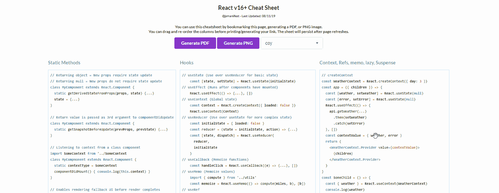
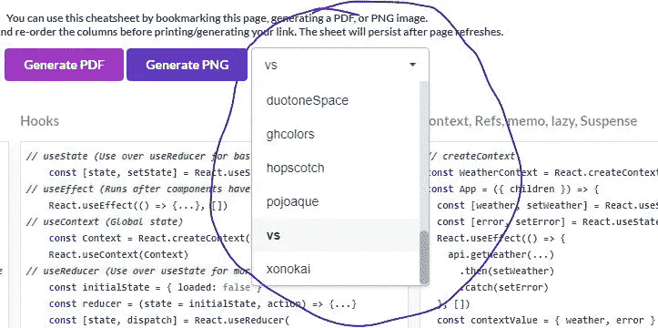

# 这里有一个 React v16+备忘单(PDF/JPG/自定义主题)

> 原文：<https://betterprogramming.pub/this-react-cheat-sheet-includes-all-of-v16-63efc739ad88>

## 使用 React 备忘单为自己节省一些时间

由[micha Kubalczyk](https://unsplash.com/@rev3n)在 [Unsplash](https://unsplash.com/@rev3n) 拍摄的照片

[点击这里查看备忘单。](https://jsmanifest.com/react-cheatsheet)

有时，使用 React 创建一个快速界面可能需要 30 分钟。但其他时候，可能需要几个小时。

如果您经常忘记方法、属性或它们所提供的功能的名称，仅仅为了一个 Google 搜索就不得不离开您的代码编辑器，这可能会变得令人恼火。你可能会想，输入几个字母并得到你想要的答案真的那么难吗？嗯，绝对不行。但是如果这种情况发生不止一次，那么也许是时候获取一个备忘单了，这样你就不必再离开代码编辑器了。从长远来看，在你身边放一张小抄肯定会节省你一些时间。

这里有一张你可以使用的备忘单:

点击这里查看备忘单。

当您查看备忘单时，请记住您可以:

1.将备忘单生成为可下载的 PDF/JPEG 格式，或者您可以将该页面标记为书签，以后再回来查看。

2.如果您不喜欢列的排序方式，您可以在生成备忘单之前拖动并重新排序它们。

3.您可以在选择框中选择任何代码语法主题，以在备忘单中生成(大约有 25 种主题可供选择):

如果有人需要的话，我会把它放到公共回购中。我也是昨天才开始写的，所以它可能还不是一个完美的备忘单。

此外，我的目标是将所有这些内容放在一个页面中，但是信息太多了。如果有人对更换/移除哪些部件有任何建议，请随时告诉我。

关闭浏览器后，这些更改也会保留下来，这样您就不必重做所有操作。这里是到目前为止备忘单的完整列表(我会随时更新备忘单)。

# 碎片

# 返回类型

# 错误边界(React v16.0)

# 静态方法

# 组件状态

# 渲染组件

# 默认道具

# 其他反应出口

# 进口

# 指针事件(React v16.4)

# React 悬念/懒惰(React v16.6)

# React 分析器(React v16.9)

# 同步/异步`act`测试实用程序(React v16.9)

点击这里查看备忘单。

# 结论

这个帖子到此结束！我希望你发现这是有用的，并期待在未来更多！