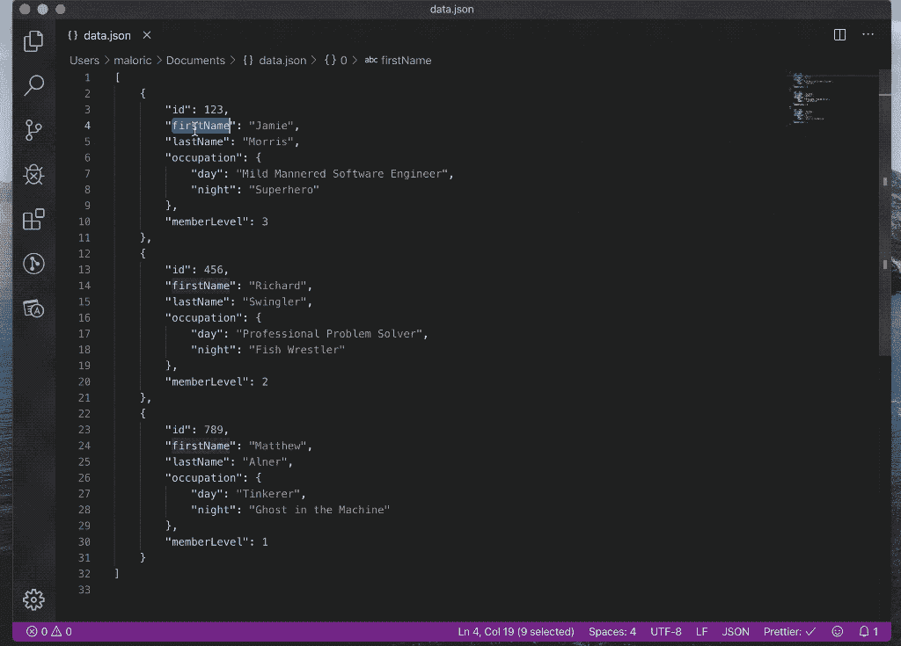
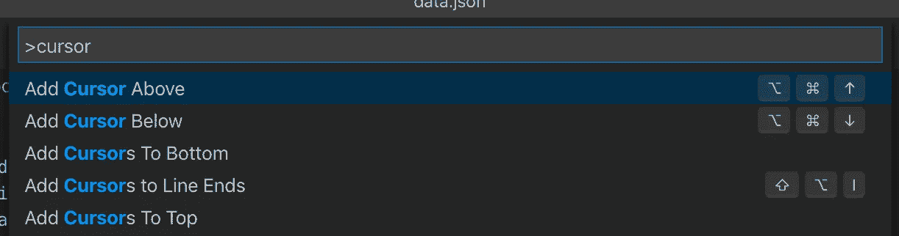

# 这个 Visual Studio 代码快捷方式改变了我的生活

> 原文：<https://betterprogramming.pub/this-visual-studio-code-shortcut-changed-my-life-f6f18be7b1bb>

## 无需点击即可快速创建多个光标

图片来源:作者

我不喜欢夸张，但这可能是自原子分裂以来最大的突破。它甚至不是新的，但我经常与从未听说过它的开发人员交谈。见鬼，它甚至不仅仅是为开发人员准备的——每个人都应该使用这种快捷方式，这也是我推荐 Visual Studio 代码而不是 Notepad++作为临时笔记记录者的原因之一。

注意 IntelliJ 中也有类似的快捷方式，尽管我无论如何也想不起它是什么。第一个在回答中留下评论的人值得称赞。

你们当中不耐烦的人可能已经看过这张照片，并为自己尝试了捷径。如果你兴奋过度，我会暂停一会儿，让你冷静下来…

完成了吗？那我就继续。

我想我应该告诉你这是什么和它的作用。

我不确定具体动作的名称是什么，但它是 Visual Studio 代码和其他一些 ide 所具有的多光标功能的一部分。这种功能允许您在文档中放置多个光标，这些光标同时接受来自键盘的输入。这意味着你可以在多个地方写同样的东西。VSCode 提供了几种放置光标的机制，但这是我用得最多的一种:**Ctrl+D**(Mac 上的 **Cmd + D** )。

它的功能有点像查找/替换。你高亮显示一些文本，然后按下 **Ctrl + D** 。编辑器在文档中找到该字符串的下一个实例，并突出显示它。您也可以按住它来选择同一字符串的更多实例。你可能想知道为什么我不直接使用查找/替换？毕竟，有了使用正则表达式查找或替换的能力，您可以做一些非常强大的事情。

但是正则表达式很复杂，自从发现这个捷径后，我发现我很少需要它们。让我给你举个例子。

# 一个例子

假设您有以下 JSON 数据，并且需要向每条记录添加一个新的 email 字段。电子邮件前缀由小写的名和姓组成，用点分隔。每封邮件都发自同一个域名:my-company.com。

我知道这听起来有些做作，但是这种技术的应用相当普遍。你用得越多，它就变得越有价值，因为随着它变得越来越熟悉，它是一个你会一次又一次使用的工具。

更强大的是，每个光标可以维护一个单独的剪贴板。因此，如果您在选择多个光标的情况下复制文本，向下移动一行并粘贴，每个光标都会粘贴上一行的内容。对于结构化数据的操作，这可能非常有用，我在编写应用程序时经常使用它。

在上面的例子中，有三条记录，所以您可以手动完成。如果你有几百张唱片，情况就不同了。这是我为上面的例子添加电子邮件地址的片段。

很整洁，是吧？有几个你应该熟悉的快捷方式可以让你充分利用它。

**跳过整个单词:**首先你应该习惯用箭头键导航——鼠标很慢，而且不准确。但是一次跳过一个字符也很慢。相反，在使用箭头键导航时，按住 **Ctrl** 键(Windows)或 **Alt** 键(Linux / Mac)。这将跳过整个单词而不是单个字符。

**高亮显示:**按住 **Shift** 键，同时按下箭头键，高亮显示光标移动到的文本。如果您将此与上面的跳过整个单词快捷方式结合使用，您可以高亮显示整个单词。这对于多个光标尤其有用，因为您突出显示的单词可能长度不同。你可以在上面的例子中看到这种效果。

**Home/End:** 在 Windows 和 Linux 上这些是专用键，但是在 Mac 键盘上你需要按住 **Cmd + left/right** 。同样，您可以将此功能与高亮快捷方式结合使用，将高亮从光标处扩展到行首或行尾。

# 创建多个游标的其他方法

虽然 **Ctrl + D** 是我最喜欢的创建多个快捷方式的方法，但也有其他有用的方法可以做到这一点:

**Ctrl + Shift + L** 选择高亮字符串的所有实例。如果有很多匹配，这比按住 **Ctrl + D** 要快。

**Alt +鼠标左键点击**在你点击的地方创建一个新的光标。这可能很笨拙，但如果数据不是可预测的形状，这比用箭头键摸索要精确得多。

**Ctrl + Alt + Up/Down** 在当前光标的上方或下方创建一个新光标。

**Shift+Alt+I** 将光标添加到当前选择的每一行的末尾。这可能是我最喜欢的——非常感谢 Eddy 在评论中指出了这一点。

还有一些其他的，当然，确切的快捷方式将取决于您的操作系统。如果你不确定，你可以通过输入**Ctrl+Shift+P**(Mac 上的 **Cmd + Shift + P** )和输入*光标*找到其中的几个快捷键。

# 结论

这真的是一个有用的捷径，让单调的任务变得简单。试试看，让我知道你是否同意！