# 阿帕奇卡夫卡的全面介绍

> 原文：<https://betterprogramming.pub/thorough-introduction-to-apache-kafka-6fbf2989bbc1>

## 深入探究作为许多公司架构核心的系统

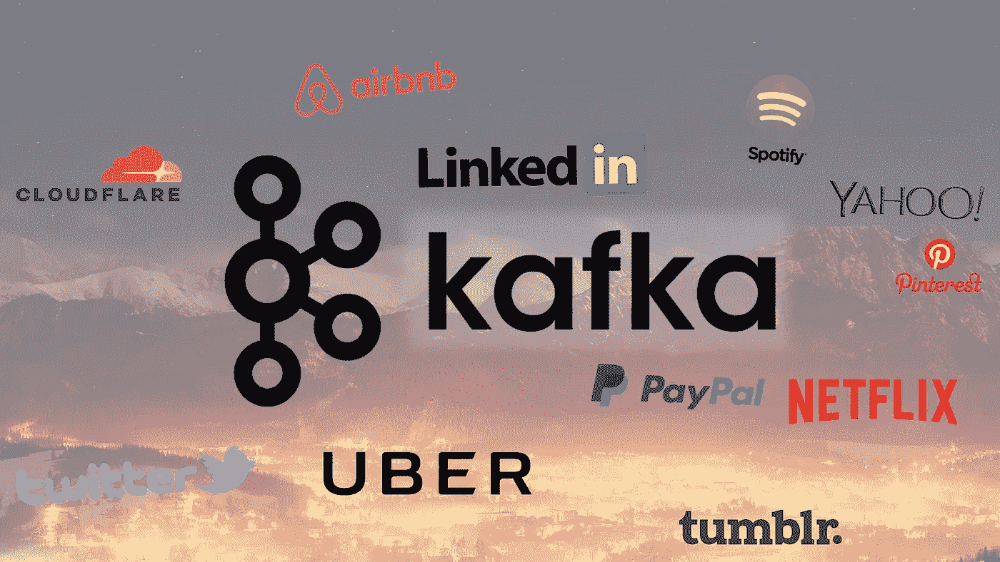

一些使用阿帕奇卡夫卡的巨石柱

# 介绍

卡夫卡是一个如今经常听到的词。很多领先的数字公司似乎都在使用它。但实际上是什么呢？

Kafka 最初是 2011 年在 LinkedIn 开发的，之后改进了很多。如今，它是一个完整的平台，允许您冗余地存储荒谬的数据量，拥有巨大吞吐量(百万/秒)的消息总线，并对一次通过的数据使用实时流处理。

这一切都很好，但从核心来看，Kafka 是一个分布式的、可水平伸缩的、容错的提交日志。

那些是一些新奇的词，让我们一个一个地看它们是什么意思。之后，我们将深入研究它是如何工作的。

## 分布的

一个*分布式*系统是一个被分割成多个运行机器的系统，所有这些机器在一个集群中一起工作，对最终用户来说就像一个单独的节点。Kafka 是分布式的，它在不同的节点上存储、接收和发送消息(称为*代理*)。关于这一点，我也写了一篇[全面的介绍](https://hackernoon.com/a-thorough-introduction-to-distributed-systems-3b91562c9b3c)。

这种方法的好处是高可伸缩性和容错性。

## 水平可伸缩

让我们首先定义术语*垂直可伸缩性*。比方说，您有一个传统的数据库服务器，它开始过载。解决这个问题的方法是简单地增加服务器上的资源(CPU、RAM、SSD)。这被称为*垂直扩展*——向机器添加更多资源。向上扩展有两大缺点:

*   存在由硬件定义的限制。你不能无限扩大规模
*   这通常需要停机，这是大公司无法承受的

*水平可伸缩性*通过投入更多的机器来解决同样的问题。添加一台新机器不需要停机，对集群中的机器数量也没有任何限制。问题是并不是所有的系统都支持水平可伸缩性，因为它们不是为在集群中工作而设计的，那些支持水平可伸缩性的系统通常更复杂。

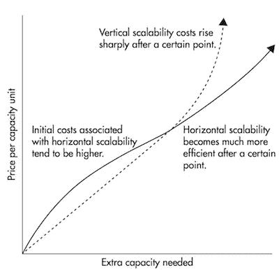

在某个阈值之后，水平缩放变得便宜得多

## 容错的

非分布式系统中出现的一个问题是它们具有单点故障(SPoF)。如果您的单个数据库服务器因为任何原因而失败(就像机器一样)，您就惨了。

分布式系统被设计成以一种可配置的方式来适应故障。在 5 节点 Kafka 集群中，即使其中两个节点出现故障，您也可以让它继续工作。值得注意的是，容错与性能是直接平衡的，因为系统的容错能力越强，性能就越差。

## 提交日志

*提交日志*(也称为*预写日志*或*事务日志*)是一种持久有序的数据结构，只支持追加。您不能修改或删除其中的记录。它从左到右阅读，并保证项目排序。

提交日志的示例图，取自[这里的](https://engineering.linkedin.com/distributed-systems/log-what-every-software-engineer-should-know-about-real-time-datas-unifying)

> “你是在告诉我，卡夫卡就是这么简单的数据结构？”

在很多方面，是的。这种结构是卡夫卡的核心，是无价的，因为它提供了有序性，而有序性反过来又提供了确定性的处理。这两者都是分布式系统中的重要问题。

Kafka 实际上将其所有的消息存储到磁盘上(稍后将详细介绍)，在结构中对它们进行排序可以让它利用顺序磁盘读取。

*   读取和写入是一个恒定的时间 O(1) *(知道记录 ID)* ，这与其他结构在磁盘上的 O(log N)操作相比是一个巨大的优势，因为每个磁盘寻道都是昂贵的
*   读和写互不影响。写作不会锁定阅读，反之亦然(与平衡树相反)。

这两点具有巨大的性能优势，因为数据大小与性能完全无关。无论您的服务器上有 100 KB 还是 100 TB 的数据，Kafka 都具有相同的性能。

# 它是如何工作的？

应用程序*(生产者)*向 Kafka 节点*(代理)*发送消息*(记录)*，并且所述消息由称为*消费者的其他应用程序处理。*所述消息存储在*主题*中，消费者订阅该主题以接收新消息。

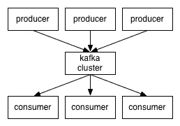

由于主题可能会变得很大，它们会被分割成更小的*分区*以获得更好的性能和可伸缩性。(例如，假设您正在存储用户登录请求。您可以通过用户名的第一个字符来分割它们。)

Kafka 保证一个分区中的所有消息按照它们进来的顺序排序。区分特定消息的方法是通过它的*偏移量*，您可以将它看作一个普通的数组索引，一个序列号，它随着分区中每个新消息的增加而增加。

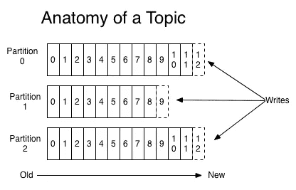

卡夫卡遵循愚蠢的经纪人和聪明的消费者的原则。这意味着 Kafka 不会跟踪消费者阅读了哪些记录，然后删除它们。相反，它将它们存储一段时间(例如，一天)或直到达到某个大小阈值。消费者自己在卡夫卡身上寻找新的信息，并说出他们想要阅读的记录。这允许他们按照自己的意愿增加/减少偏移量，从而能够重放和重新处理事件。

值得注意的是，消费者实际上是内部有一个或多个消费流程的消费群体。为了避免两个进程两次读取相同的消息，每个分区只绑定到每个组的一个消费者进程。

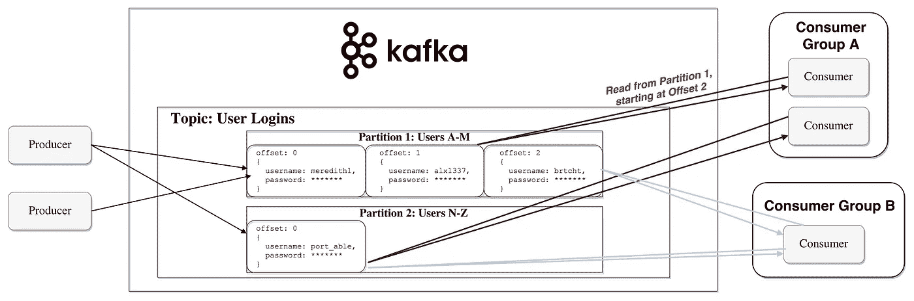

数据流的表示

# 磁盘持久性

正如我前面提到的，Kafka 实际上将其所有记录存储在磁盘上，而不在 RAM 中保存任何内容。你可能想知道这怎么会是一个明智的选择。这背后有许多优化，使其可行:

*   卡夫卡有一个将信息组合在一起的协议。这允许网络请求将消息分组在一起，并减少网络开销；反过来，服务器一次保存大量消息，消费者一次获取大量线性消息。
*   磁盘上的线性读/写速度很快。现代磁盘慢的概念是因为大量的磁盘寻道，这在大型线性操作中不是问题。
*   所述线性操作由操作系统通过*预读*(预取大块倍数)和*后写*(将小逻辑写入分组为大物理写入)技术进行了大量优化。
*   现代操作系统将磁盘缓存在空闲 RAM 中。这被称为*页面缓存。*
*   由于 Kafka 在整个流程中以标准的二进制格式存储消息(生产者➡经纪人➡消费者)，它可以利用*零拷贝*优化。这时，操作系统将数据从 pagecache 直接复制到一个套接字，有效地完全绕过了 Kafka broker 应用程序。

所有这些优化使 Kafka 能够以接近网络的速度传递消息。

# 数据分发和复制

先说 Kafka 是如何实现容错的，如何在节点之间分配数据。

## 数据复制

分区数据在多个代理之间复制，以便在一个代理死亡时保留数据。

在任何时候，一个代理*都拥有*一个分区，并且是应用程序通过其对该分区进行写/读的节点。这被称为*分区领导者。*它将接收到的数据复制给 *n* 其他经纪人，称为*跟随者。*它们也存储数据，并准备好在领导节点死亡的情况下被选举为领导节点。

这有助于您配置任何成功发布的邮件都不会丢失的保证。有了更改复制因子的选项，您可以根据数据的关键程度，用性能换取更强的耐用性保证。

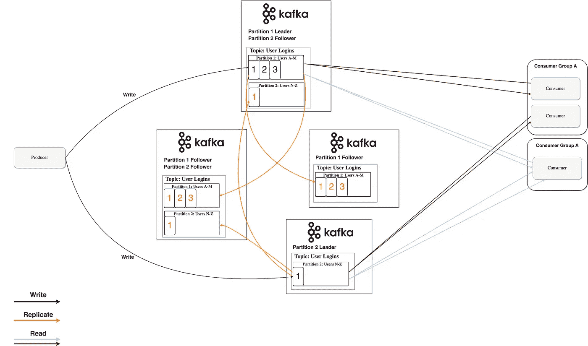

四个复制因子为 3 的 Kafka 经纪人

这样，如果一个领导者失败了，一个追随者可以代替他。

不过，你可能会问:

> "生产者/消费者如何知道分区的领导者是谁？"

对于生产者/消费者来说，从一个分区写/读，他们需要知道它的领导者，对吗？这些信息需要从某处获得。卡夫卡将这些元数据存储在一个名为 Zookeeper 的服务中。

## **什么是动物园管理员？**

*动物园管理员*是一个分布式键值存储。它针对读取进行了高度优化，但写入速度较慢。它最常用于存储元数据和处理集群机制(心跳、分发更新/配置等)。

它允许服务的客户(Kafka brokers)订阅，并在发生变化时将变化发送给他们。这就是代理如何知道何时切换分区领导者。《动物园管理员》还具有极强的容错能力，这是应该的，因为卡夫卡非常依赖它。

它用于存储各种元数据，例如:

*   每个分区的用户群偏移量(尽管现代客户端在单独的 Kafka 主题中存储偏移量)
*   访问控制列表(ACLs 用于限制访问/授权
*   生产者和消费者配额—最大消息/秒界限
*   分区领导及其健康

## *生产者/消费者如何知道分区的领导者是谁？*

生产者和消费者过去常常直接连接并与 Zookeeper 对话来获得这些(以及其他)信息。Kafka 一直在远离这种耦合，分别从 0.8 和 0.9 版本开始，客户端直接从 Kafka 经纪人那里获取元数据信息，Kafka 经纪人自己与 Zookeeper 对话。

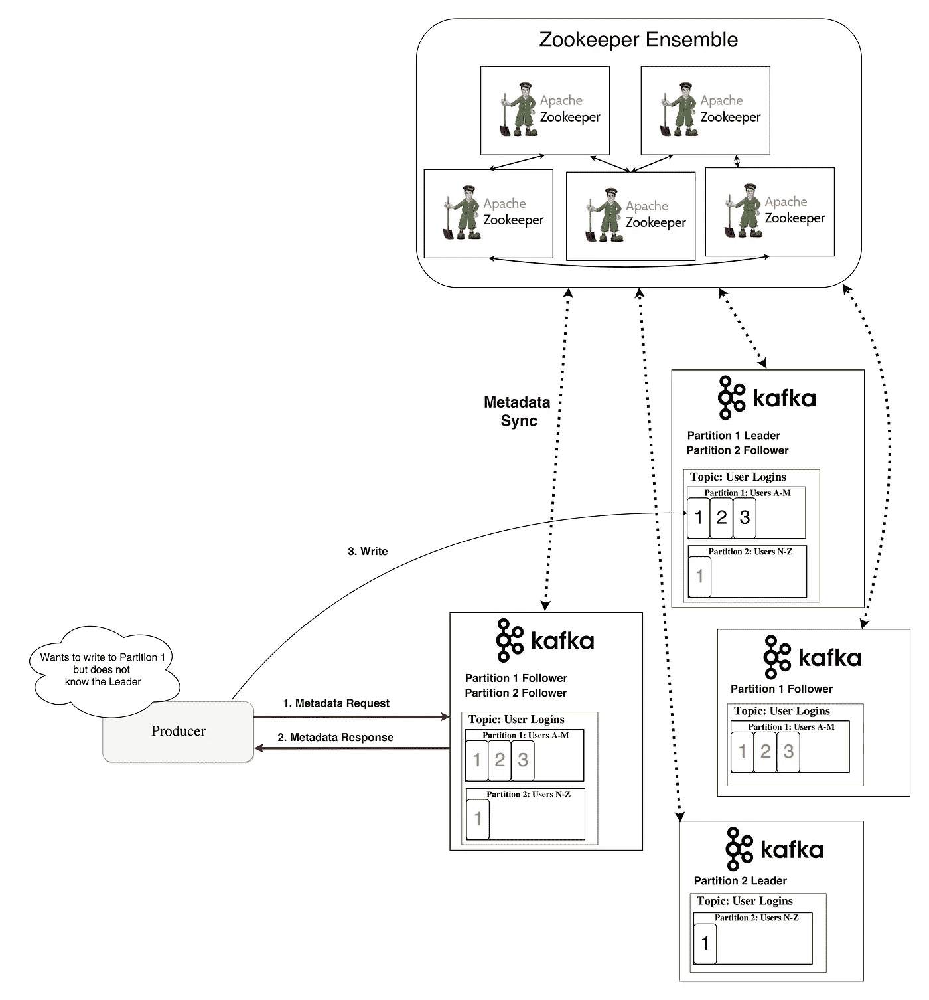

元数据流

# 流动

在 Kafka 中，流处理器是从输入主题中获取连续的数据流，对该输入进行一些处理，并产生输出主题的数据流(或者外部服务、数据库、垃圾桶——实际上是任何地方)。

可以直接用生产者/消费者 API 进行简单的处理；然而，对于更复杂的转换，比如将流连接在一起，Kafka 提供了一个集成的[流 API](https://www.google.bg/url?sa=t&rct=j&q=&esrc=s&source=web&cd=1&cad=rja&uact=8&ved=0ahUKEwiG1fu-oYDYAhVCCewKHeZMDfEQFggsMAA&url=https%3A%2F%2Fkafka.apache.org%2Fdocumentation%2Fstreams%2F&usg=AOvVaw30e_Zle1rMLJugJuCTx9tx) 库。

该 API 旨在用于您自己的代码库中——它不是在代理上运行的。它的工作方式类似于消费者 API，并帮助您将流处理工作扩展到多个应用程序(类似于消费者组)。

## 无状态处理

流的无状态处理是不依赖于任何外部事物的确定性处理。您知道，对于任何给定的数据，您总是会产生相同的输出，而不受任何其他因素的影响。这方面的一个例子是简单的数据转换——向字符串`"Hello"` ➡ `"Hello, World!"`添加内容。

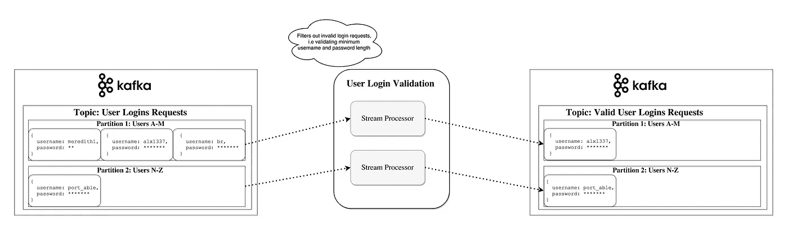

## 流表二元性

重要的是要认识到流和表本质上是相同的。流可以解释为表，表可以解释为流。

## 作为表的流

流可以被解释为一系列的数据更新，其中聚集是表的最终结果。这种技术叫做 [*事件源*](https://martinfowler.com/eaaDev/EventSourcing.html) *。*

如果您看看同步数据库复制是如何实现的，您会发现它是通过所谓的*流复制实现的，*表中的每个更改都被发送到副本服务器。事件来源的另一个例子是区块链分类帐——分类帐也是一系列的变更。

卡夫卡的作品也可以用同样的方式来解读——事件积累起来就形成了最终的状态。这种流聚合保存在本地 [RocksDB](https://github.com/facebook/rocksdb/wiki/rocksdb-basics) (默认)中，称为 *KTable。*

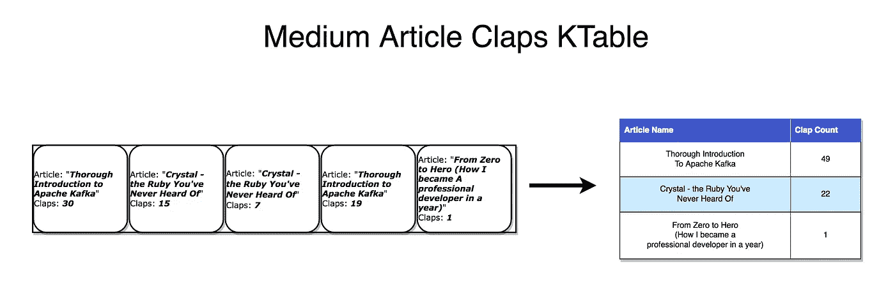

每条记录都会增加总计数

## 作为流的表

一个表可以被看作是一个流中每个键的最新值的快照。与流记录可以生成表一样，表更新也可以生成 changelog 流。

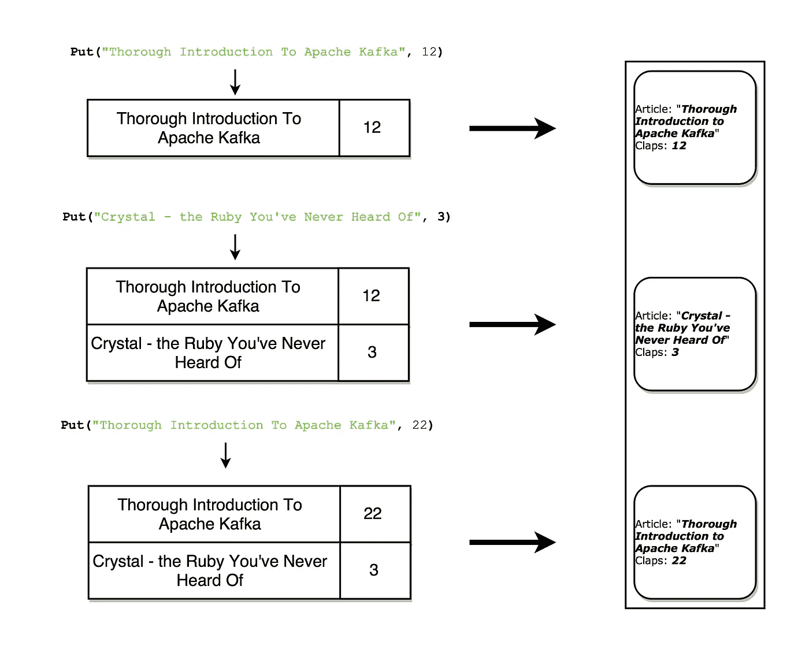

每次更新都会在流中产生一个快照记录

## 有状态处理

一些简单的操作，像`map()`或`filter()`，是无状态的，不需要你保存任何关于处理的数据。然而，在现实生活中，你要做的大多数操作都是有状态的(例如，`count()`)，因此，需要你存储当前累积的状态。

在流处理器上维护状态的问题是流处理器可能会失败！为了使这种状态具有容错性，您需要在哪里保持这种状态？

一种简单的方法是将所有状态存储在远程数据库中，并通过网络连接到该存储。这样做的问题是没有数据的局部性和大量的网络往返，这两者都会大大降低应用程序的速度。

一个更微妙但重要的问题是，您的流处理作业的正常运行时间将与远程数据库紧密耦合，并且作业不会是独立的(另一个团队对数据库的更改可能会中断您的处理)。

那么什么是更好的方法呢？

回想一下表和流的二元性。这允许我们将流转换成与我们的处理放在一起的表。它还为我们提供了一种处理容错的机制——通过将流存储在 Kafka 代理中。

流处理器可以将其状态保存在本地表(例如 RocksDB)中，该表将从输入流中更新(可能在一些任意转换之后)。当进程失败时，它可以通过重放流来恢复其数据。

您甚至可以让一个远程数据库成为流的生产者，有效地广播一个 changelog，用它在本地重建表。

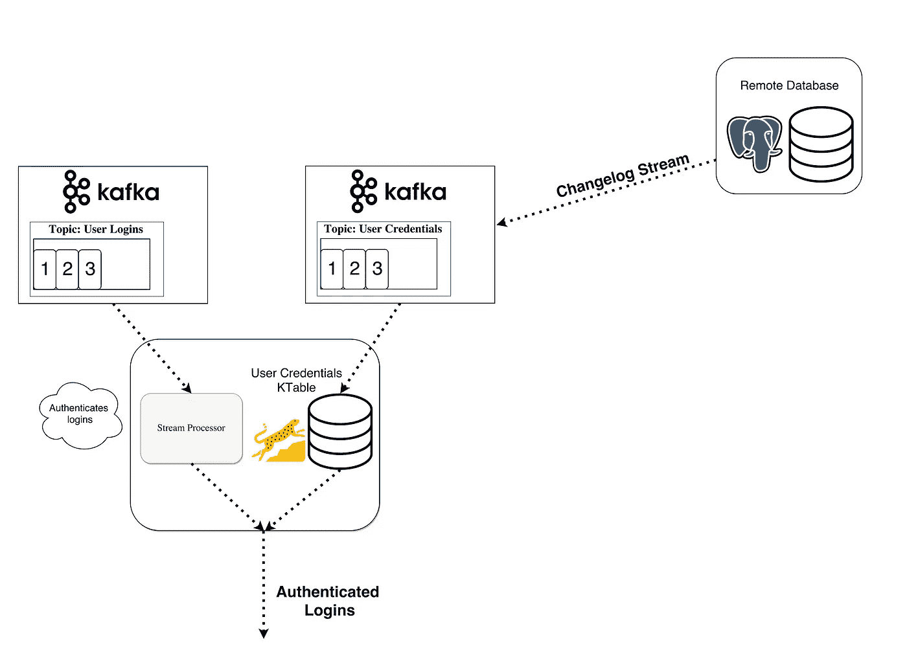

有状态处理——用 KTable 连接 KStream

## KSQL

通常，您会被迫用 JVM 语言编写您的流处理，因为这是唯一的官方 Kafka Streams API 客户端。

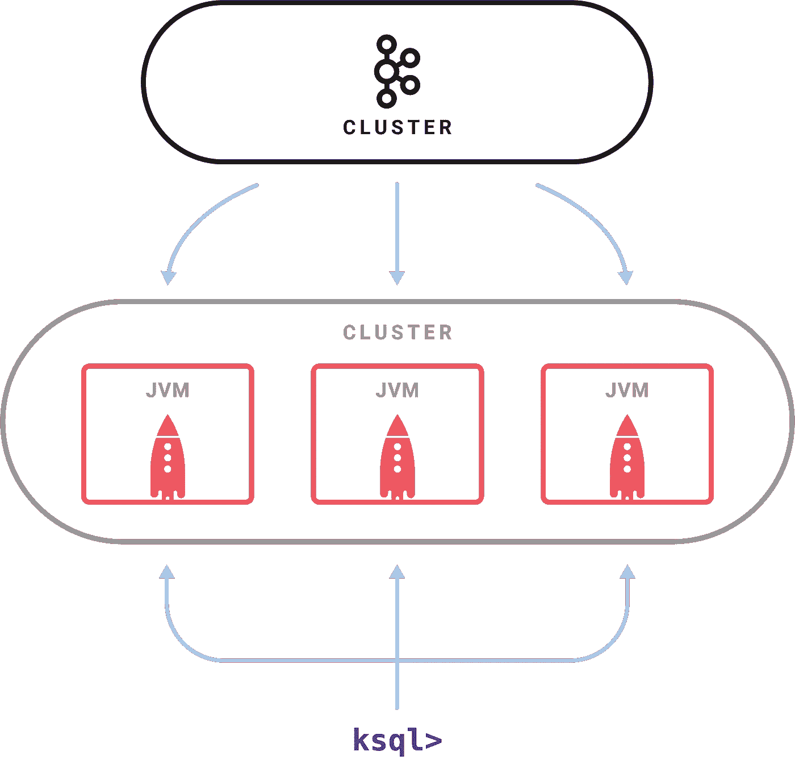

示例 KSQL 设置

[发布于 2018 年 4 月](https://www.confluent.io/blog/confluent-platform-4-1-with-production-ready-ksql-now-available/)、[、 *KSQL* 、](https://www.confluent.io/blog/ksql-open-source-streaming-sql-for-apache-kafka/)是一项功能，可以让你用熟悉的类似 SQL 的语言编写简单的流作业。

您设置了一个 KSQL 服务器，并通过一个 [CLI](https://en.wikipedia.org/wiki/Command-line_interface) 交互查询它来管理处理。它使用相同的抽象(KStream 和 KTable)，保证了 Streams API 的相同优势(可伸缩性、容错性)，并极大地简化了流的工作。

这听起来可能不多，但是在实践中，它对测试东西更有用，甚至允许开发之外的人(例如，产品所有者)参与流处理。[我鼓励你看一看快速入门视频，看看它有多简单](https://www.youtube.com/watch?v=A45uRzJiv7I&t=2m13s)。

## 流媒体替代品

卡夫卡溪流是力量和简单的完美结合。可以说，它们拥有市场上最好的流工作能力，并且它们比其他流处理替代产品更容易与 Kafka 集成( [Storm](https://storm.apache.org/) 、 [Samza](https://samza.apache.org/) 、 [Spark](https://spark.apache.org/) 、 [Wallaroo](https://github.com/WallarooLabs/wallaroo) )。

大多数其他流处理框架的问题是它们使用和部署起来很复杂。像 Spark 这样的批处理框架需要:

*   在一个机器池中控制大量作业，并在集群中高效地分配它们
*   为了实现这一点，它必须动态打包您的代码，并将其物理部署到将执行它的节点(连同配置、库等)。)

不幸的是，解决这些问题使得框架变得相当具有侵略性。他们希望控制代码如何部署、配置、监控和打包的许多方面。

Kafka Streams 让您在需要时推出自己的部署策略，无论是 [Kubernetes](https://kubernetes.io/) 、 [Mesos](https://mesos.apache.org/) 、 [Nomad](https://www.nomadproject.io/) 、 [Docker Swarm、](https://github.com/docker/swarm)还是其他。

Kafka Streams 的潜在动机是让您的所有应用程序都能够进行流处理，而无需运行和维护另一个集群的复杂操作。唯一潜在的缺点是它与 Kafka 紧密结合，但在现代世界中，大多数(如果不是所有)实时处理都是由 Kafka 驱动的，这可能不是一个大缺点。

# 你什么时候会用卡夫卡？

正如我们已经讨论过的，Kafka 允许你通过一个集中的媒介传递大量的信息并存储它们，而不用担心性能或数据丢失之类的问题。

这意味着它非常适合用作系统架构的核心，充当连接不同应用程序的集中媒介。Kafka 可以成为事件驱动架构的核心，并允许您真正实现应用程序之间的解耦。

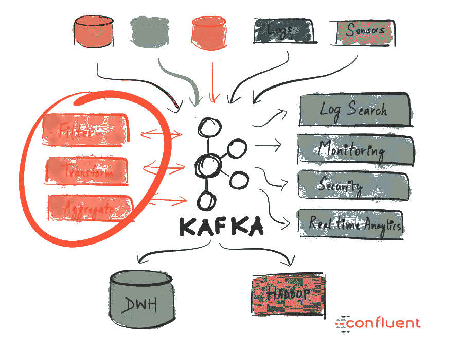

Kafka 允许您轻松地分离不同(微)服务之间的通信。有了 Streams API，现在比以往任何时候都更容易编写业务逻辑，为服务消费丰富 Kafka 主题数据。可能性是巨大的，我敦促你探索公司是如何使用卡夫卡的。

# 为什么它有如此多的用途？

高性能、可用性和可伸缩性本身并不足以成为公司采用新技术的充分理由。还有其他拥有类似特性的系统，但没有一个得到如此广泛的应用。这是为什么呢？

Kafka 越来越受欢迎(并继续如此)的原因是因为一个关键的事情——现在的企业从事件驱动的架构中受益匪浅。这是因为世界已经发生了变化——许多不同的服务(物联网、机器学习、移动、微服务)正在产生和消费大量(且不断增长)的数据。

具有持久存储的单个实时事件广播平台是实现这种架构的最干净的方式。想象一下，如果流入/流出每个服务的数据流使用专门迎合它的不同技术，那将是一种什么样的混乱。

这一点，加上 Kafka 为这种通用系统提供了适当的特征(持久存储、事件广播、表和流原语、通过 KSQL 的抽象、开源、积极开发)，使其成为公司的明显选择。

# 摘要

Apache Kafka 是一个分布式流媒体平台，每天能够处理数万亿个事件。Kafka 提供低延迟、高吞吐量、容错的发布和订阅管道，并且能够处理事件流。

我们讨论了它的基本语义(生产者、代理、消费者、主题)，了解了它的一些优化(页面缓存)，了解了它如何通过复制数据来容错，并了解了它不断增长的强大流功能。

卡夫卡已经被全球数千家公司大量采用，包括财富 500 强中的三分之一。随着 Kafka 的积极开发和最近发布的第一个[主要版本 1.0](https://www.confluent.io/blog/apache-kafka-goes-1-0/)(2017 年 11 月 1 日)*，*有预测称，这个流媒体平台将像关系数据库一样成为数据平台的核心。

我希望这篇介绍有助于您熟悉 Apache Kafka 及其潜力。

# 进一步的阅读资源和我没有提到的东西

兔子洞的深度超出了本文的范围。以下是我没有机会提及的一些特性，但了解这些特性非常重要:

*   [控制器代理，同步副本【Kafka 保持集群健康并确保足够的一致性和持久性的方式](https://medium.com/@stanislavkozlovski/apache-kafkas-distributed-system-firefighter-the-controller-broker-1afca1eae302)
*   [连接器 API](https://www.confluent.io/blog/announcing-kafka-connect-building-large-scale-low-latency-data-pipelines/) :帮助您将各种服务连接到 Kafka 的 API，作为源或汇(PostgreSQL、Redis、Elasticsearch)
*   [日志压缩](http://cloudurable.com/blog/kafka-architecture-log-compaction/index.html):减少日志大小的优化。在变更日志流中非常有用。
*   [恰好一次消息语义](https://www.confluent.io/blog/exactly-once-semantics-are-possible-heres-how-apache-kafka-does-it/):保证消息恰好被接收一次。这是一件大事，因为很难实现。

## 资源

*   [“Apache Kafka 的分布式系统消防员——控制器代理](https://medium.com/@stanislavkozlovski/apache-kafkas-distributed-system-firefighter-the-controller-broker-1afca1eae302)”:这是我的另一篇博客文章，在这篇文章中，我深入探讨了代理之间的协调工作以及更多内容
*   [“卡夫卡式的解释](https://medium.com/better-programming/kafka-acks-explained-c0515b3b707e)”:我的一篇短文，解释了普遍混淆的`acks`和`min.isr`设定
*   [“Kafka 不需要看守人](https://www.infoq.com/presentations/kafka-zookeeper/)”:Colin McCabe 关于 Apache Kafka 如何基于 Raft 实现自己的元数据共识算法的精彩演讲
*   汇流博客:关于阿帕奇卡夫卡的丰富信息
*   [卡夫卡文档](https://kafka.apache.org/documentation/):伟大、广泛、高质量的文档
*   [卡夫卡峰会 2017 视频](https://www.confluent.io/kafka-summit-sf17/resource/)

感谢您花时间阅读本
如果您喜欢，测试一下您能点击多少次👏五秒钟后。这对你的手指来说是很好的有氧运动，并且会帮助其他人看到这个故事。
你可以在 Twitter 上关注我，地址是 [@StanKozlovski](https://twitter.com/StanKozlovski) ，谈论编程、技术、初创企业、健康、投资，还可以看看什么时候有新文章发布！