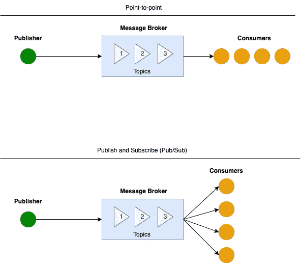
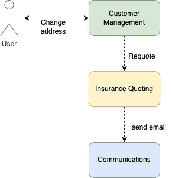
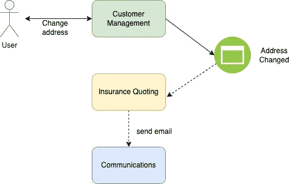
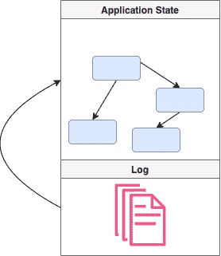
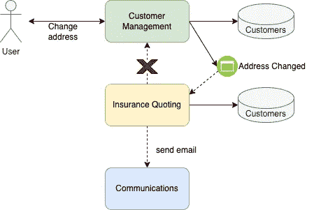
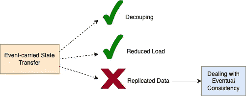

# 关于事件驱动架构的思考

> 原文：<https://betterprogramming.pub/thoughts-about-event-driven-architectures-6ce12d8d525e>

## 了解 EDA 的基础知识及其缺点

Marc-Olivier Jodoin 在 [Unsplash](https://unsplash.com?utm_source=medium&utm_medium=referral) 上拍摄的照片

我最近在思考事件驱动架构，它们的优点、缺点和最常见的用例。

我们都熟悉微服务之间不同的通信风格，其中两个值得注意的是:基于消息传递和事件驱动通信的同步请求-响应调用和异步交互。

所以，我们可以问自己的最明显的问题是，在什么情况下应用什么样的沟通方式？

为了回答这个问题，让我们简单回顾一下什么是事件驱动架构。

# 事件驱动架构基础

当跨多个微服务传播变更时，通常使用异步消息传递和事件驱动的通信。

最简单地说，当微服务“A”执行微服务“B”可能感兴趣的动作时，它向消息代理发布一个事件。遵循众所周知的发布-订阅设计模式，微服务“A”是发布者，微服务“B”是订阅者，它处理从代理收到的事件。

更明确地说，大多数消息代理支持两种消息传递模式:队列和发布/订阅。不同之处在于，对于队列，事件由一个消费者处理，而对于 pub/subs，多个消费者可以订阅特定类型的事件，并在必要时消费它们。

来自 AMQ/JMS [教程](https://www.tomitribe.com/blog/author/rmonson/)的下图描述了这些差异:

除非另有说明，所有插图均由作者创作

在我们开始讨论事件驱动架构的优点和缺点之前，让我们定义一下“事件”是什么，以及它与“命令”有什么不同。

在他精彩的关于事件驱动架构的意义的[演讲](https://www.youtube.com/watch?v=STKCRSUsyP0)中，Martin Fowler 给出了一个“客户管理”服务的例子，该服务与下游的“保险报价”服务交互，通过直接调用它或发出“地址已更改”事件来触发重新报价流程，如下所示:

直接服务呼叫

事件通知

马丁提出了一个有趣的问题:我们什么时候有*事件*或*命令*？

在“*命令*语言的情况下，意图可能是“客户管理”服务指示“保险报价”服务重新报价保险。这意味着“客户管理”系统知道应该做什么，并且明确地告诉“报价”系统该做什么。

当我们把它框定为一个“*事件”*时，语义发生了变化:“客户管理”系统通知了“地址变更”,并且不一定期望任何响应。

因此，归根结底，我们需要通过正确命名来准确描述系统的工作方式，然后将其转换为正确的交流方式。

正如我们所看到的，基于事件的通信有许多潜在的好处:

*   **可扩展性—** 我们可以在“客户管理”服务不知道的情况下，通过监听`addressChanged`事件来轻松连接其他服务。这是一种非常有吸引力的能力，尤其是如果我们想要集成的服务是由另一个团队、部门甚至公司开发的。
*   **弹性—** 我们可以通过添加或删除生产者和消费者来调整系统吞吐量，以处理所需的负载。这种能力对于可伸缩性和成本效益至关重要。
*   **弹性:**如果一个事件消费者暂时停止工作，那么当消费者恢复工作时，事件可以被保留并重新消费。在同步请求-应答的情况下，我们需要开发全面的“重试”机制来实现这一点，而在事件驱动的情况下，大多数事件代理都提供现成的这种功能。
*   **分析:**由于服务之间的交互被生成并记录为“事件”，我们可以在感兴趣的地方添加日志记录，并从中提取有用的见解。我记得有一个案例，我和我的团队为每个事件添加了一个简单的日志消息，稍后由 [Logz.io](https://logz.io/) 系统提交和处理，为我们提供系统使用统计和商业智能。
*   **一致性:**我们可以持久化事件流，并通过“重放”过去的事件来重建最新的系统状态。在此查看“事件采购”模式[。](https://martinfowler.com/eaaDev/EventSourcing.html)

我们都非常熟悉基于事件源的系统——版本控制:)

你可以在这里找到一个非常有趣的讨论。

# 事件驱动架构(EDA)的缺点

好了，现在我们对 EDA 有了一些了解，让我们来谈谈在选择使用 EDA 时应该记住的权衡和缺点。

*   首先，根据我过去设计的相对较大的事件驱动系统的经验，很难理解系统中发生了什么。这是使用事件通知的服务之间的松散依赖的副作用:您实际上需要监视事件和系统行为，深入研究作为事件消费及其处理的结果而触发的流。这使得仅仅通过阅读代码来理解系统变得非常困难。
*   EDA 可能使之更加困难的另一件事是管理整个系统状态。有些情况下，我们可以选择在每个事件通知中将服务“A”的状态传递给服务“B ”,这样服务“B”就可以复制它，从而避免它们之间额外的通信。这种复制有许多好处，例如提高了性能、系统吞吐量及其可用性。

事件携带状态转移

这当然会迫使我们处理数据一致性问题、冲突解决和其他与数据相关的复杂性。

*   接下来，我想让大家思考的是，我们实际上是如何组织我们的活动的。一方面，我们有一种足够普通的紧张感，另一方面，我们希望它们传达尽可能多的信息和背景。在“事件源”的情况下，我们需要能够通过重放我们持久保存的事件来重建应用程序状态，这反过来要求它们包含信息，这是这种“重放”所必需的。
*   你会问还会有什么问题？事件修改和版本控制。当我们改变一个方法名或者通过改变它的签名来重构它时，我们被迫遍历所有引用同一个方法的地方并改变它。事件不是这样的。对于事件，我们需要开始寻找相关队列和主题的所有订阅者，并逐个了解他们是否受到相同变更的影响。这在基于“事件源”的系统中尤其具有挑战性，因为用不同版本重放事件可能会使事情变得非常棘手。
*   最后，我想谈谈同步流。我从在实时应用程序(命令和控制系统)中使用事件驱动架构得出的结论是，当您有一个方法调用流，分布在不同的服务中，并且您真的希望确保该流以“全有或全无”的方式运行时，促进这种同步行为将非常困难。在这些情况下，我们可以转向常规的 REST 或 gRPC 调用，并将它们与系统的事件驱动部分结合起来。

最后，我要说的是，与任何其他模式一样，我们应该小心谨慎，只有当事件驱动架构适合手头问题的性质和需求时，才使用它。

否则，我们可能会以“工具法则”[陷阱](https://en.wikipedia.org/wiki/Law_of_the_instrument#:~:text=From%20Wikipedia%2C%20the%20free%20encyclopedia,reliance%20on%20a%20familiar%20tool.)告终，该陷阱指出:

> *如果你只有一把锤子，你会把每个问题都看成钉子*
> 
> *——亚伯拉罕·马斯洛*