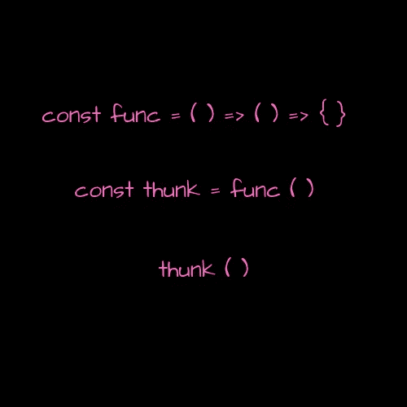

# 关于 JavaScript Thunks 的思考

> 原文：<https://betterprogramming.pub/thoughts-on-javascript-thunks-fa25e38fb55>

## JavaScript 如何处理异步并发行为？



JavaScript 是一种单线程同步语言，然而处理异步行为是开发的一大部分。如果我们不考虑以下因素，作为 web 开发人员，我们如何能够创建真正交互式的动态用户体验:

*   我们如何处理一个函数中的值依赖于前一个函数的值的执行的功能
*   每种异步模式都存在的问题
*   是否有更好的工具

JavaScript 如何处理异步并发行为(多个任务在同一时间段内发生)？在语言中有一些处理并发的模式，但是哪一个是最好的工具呢？Thunks 是管理并发性的一种手段。我们如何使用它们，它们带来了什么？

# Thunks 是什么？

Thunks 是一种用于处理异步行为的模式，表示为回调函数的变体。为了理解为什么使用 thunks 作为模式是必要的，我将首先带您进入一个小兔子洞，涵盖回调函数试图解决的异步编程问题之一——推理异步逻辑的能力。

## 【JavaScript 如何处理异步行为？

*事件循环*是 JavaScript 采用的一种模型，用于区分任务评估如何处理回执行线程的优先级，由*调用堆栈*、*微任务*和*回调队列*组成。虽然这可能是一件很难解释的事情，但这里有一个真实世界的例子，展示了这些不同的部分如何使用事件循环一起工作。

让我们使用机场登机流程。票证有三层，每层都有相应的行:第一层、第二层和第三层分别为调用堆栈、微任务和回调票证持有者保留。上飞机只有一条路可走:通过为呼叫堆栈持票人保留的线路。空服员宣布飞机准备登机，每个有呼叫堆栈票的人都有优先权。一旦所有的呼叫栈票持有者登机，每个持有微任务票的人被要求进入呼叫栈线以进入飞机。一旦完成，那些持有回拨票的人被要求做同样的事情。当呼叫堆栈持票人进入飞机时，空姐看起来有点紧张——有几个人不见了，她继续检查微任务线。唉！有几个持有微任务票的人迟到了。她停止回叫票持有者登机，处理微任务票持有者，并允许他们在恢复其余回叫票持有者登机之前使用调用堆栈线路登机。一旦所有持票人登机，舱门关闭，飞机起飞。

也许这个例子有点做作。然而，这是一个基于事件循环的并发模型的高级示例，其中 JavaScript 的运行时环境通过协调在特定时间范围内执行的任务的响应来确保无阻塞 I/O，以给出同时(并行)执行多个任务的感觉。

现在你可能会问:

*   我们如何管理这些并发响应的输出？
*   随着这些响应的复杂性增加，我们管理并发响应的方式如何扩展？

## **回调**

管理并发最常见的解决方案是回调；接受额外参数的函数，即回调函数。初始函数的执行启动了一些异步操作，其返回值用于回调的执行。

```
const request = require('request');const asyncWork = request('someAsyncWork', (err, response) => { *// Handle error
  // On success, handle results* });
```

使用回调时，有几个问题到了紧要关头。*控制反转*和随着代码变得更加复杂而对其进行推理是我所知道的两件事。控制反转是指我们隐式地信任第三方工具以我们想要的方式使用我们的回调，这显然不会总是发生。但这是另一篇文章的主题。

当我们开始在应用程序中引入新的异步依赖关系时——回调的执行依赖于之前异步调用的返回值——推理每段代码在做什么变得越来越困难，因为回调通过嵌套来表达异步依赖关系的执行。

嵌套回调的一个问题是我们如何处理作用域。局部变量只存在于声明它们的函数体的上下文中。当函数在其他函数中被调用时，变量移出上下文，当函数返回时，变量移回作用域。在考虑如何处理范围以管理并发请求时，要考虑的两个因素是时间和持久状态。

*   我们如何处理范围外的变量和异步依赖？
*   我们如何持久化数据？

```
const request = require('request');const asyncWork = ('someAsyncWork', (err, resOne)=> {
  if (err) {
    *//Handle Error* } else {
    request(`someMoreAsyncWork/${resOne}`, (err, resTwo)=> {
      if (err) {
        *//Handle error* } else {
        request(`andMoreAsyncWork/${resTwo}`, (err, resThree)=> {
              if (err) {
                *//Handle error* } else {
                 *//Notice the horror yet?* }
            });
          }
        });
      }
    });*//But wait! What if I not only needed the values returned to do other asynchronous work, but also to build some data.**//insert work here**const cache = //...*
```

我们需要一种方式来表达异步代码，这样就可以更容易地对其进行推理。回调模式的一个演变是… thunks。

# **Thunks**

thunk 是某个状态周围的容器。同步 thunks 不接受参数，并通过使用闭包来包含状态—它是一个返回函数的函数，因此可以通过其词法环境(在变量环境上是封闭的)访问一些私有状态，即使该函数是在词法范围之外执行的。

```
const func = () => {
  *//Can instantiate some variable here* return () => {
    *//Access to closed over variable environment* console.log('This is a thunk');
  };
};const thunk = func();
const result = thunk();
```

*异步 thunk*非常类似于同步 thunk。关键的区别在于异步 thunks 将回调值作为参数。通过以这种方式定义异步函数，我们能够:

*   将某些功能推迟到以后
*   使用封闭可变环境提供的状态

```
const request = require('request');const func = asyncVariable => {
  let input;
  const cache = {};
  request(`someAsyncWork/${asyncVariable}`, (err, res) => {
    *//Handle Error* input = res;
  });
  return cb => {
    const results = cb(input);
    *//Use the cache available in closed over variable environment to      build results* return cache;
  };
};const thunk = func('someInput');
const cachedResult = thunk(cb);
```

在使用 thunks 管理并发性时，我们能够利用使用闭包创建的词法环境，并创建封装来持久化状态和组合值。我们的代码也变得稍微更容易推理，不那么笨拙。

# **结论**

思考不是最终的答案。随着应用程序变得越来越复杂，它们朝着管理并发性的更好工具的方向迈进了一步。然而，仍然存在回调产生而 thunks 没有解决的问题，比如控制反转。但是谁知道呢？随着我们生成更复杂的解决方案，很可能会有更好的方法来管理并发性。

# **资源**

*   Will Sentance，“JavaScript 的难点:异步和承诺”
*   Kyle Simpson，“重新思考异步 JavaScript”

感谢阅读。