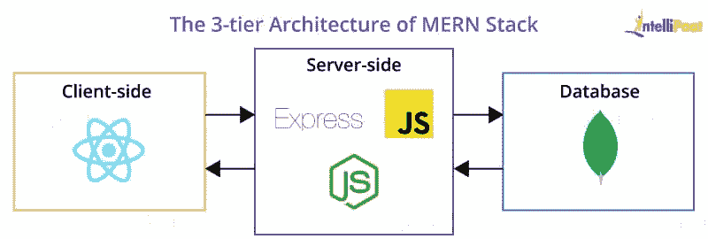
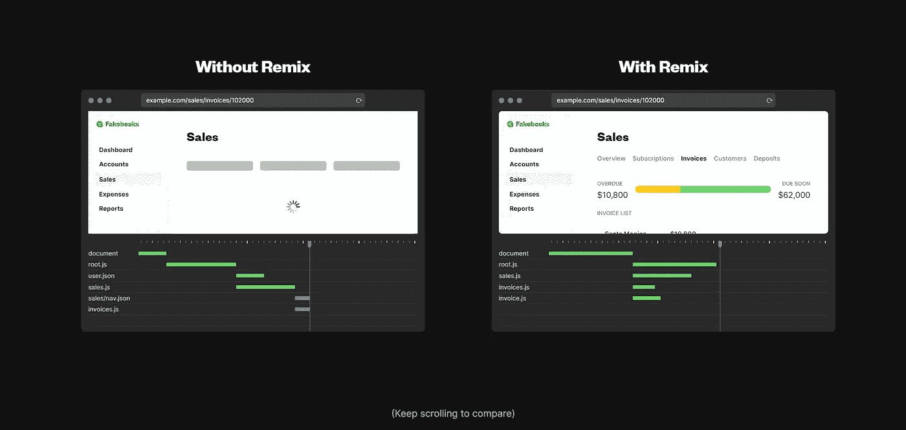

# 关于混音的思考:它将如何改变全栈工程的方法

> 原文：<https://betterprogramming.pub/thoughts-on-remix-how-it-might-change-the-approach-to-fullstack-engineering-15ccb2fcfa63>

## 端到端思考


Remix，React 的全栈 SSR 框架

软件工程可能是世界上变化最大(如果不是最大的话)的领域之一:每天都有越来越多的解决方案和技术从聪明的头脑中涌现出来，令人惊讶的框架/库正在被发布，并且不断受到限制以达到性能、可伸缩性和开发体验之间的最佳平衡。随着我们任务的发展和变得更加艰难，我们克服它们的方法也随之而来。

在这种几乎混乱的无尽洪流中，由于我在初创公司的一项任务，我遇到了一个相对较新的 React 框架: **Remix** 。JavaScript 几乎是臭名昭著的，因为永无止境的框架和库版本，是的，但这一次，我想我遇到了一个明显的科洛桑创新。

在最基本的层面上，我们知道现代 web 应用程序基本上由三个主要结构组成:

*   在后面，有一个数据库，比如 MongoDB 或 PostgreSQL，用来存储所有的持久数据和托管模型，
*   在浏览器端，SPA 框架(如 React、Vue)创建高度高级的界面，提供流畅的用户交互，
*   最后，一个位于浏览器和数据库之间的 RESTful API 不断地监听请求，并按照一定的逻辑在这两端之间导航工作流。

让我们通过考虑我们可以用 MERN 堆栈做的最简单的 CRUD 应用来使它变得更加清楚。想象一个简单的面板，我们在其中管理系统中的用户:您已经用 React 编写了这个页面。当您填写所需的信息并单击“Create new User”按钮时，您很可能会向与 Express server 一起运行的 API 中的/user 路由发送一个 POST 请求。

控制器充当 MongoDB 和用户请求之间的交通警察，检查和验证从前端发送的数据，并将其添加到数据库中的用户集合中。

在另一个页面上，当您想要访问系统上的所有用户时，您可能会向同一个/user 路由发出 GET 请求，控制器将再次满足您的请求；分析一下，如果请求能通过必要的检查，这一次控制器从数据库中取出所有用户的数据，带回前端，供你使用。



MERN 是如何运作的

由于将前端直接连接到数据库而不使用任何后端控制器被认为是一个主要的安全弱点(由于凭证的暴露)，在这个系统中，我们习惯于在完全独立的 repos 中编写前端代码和后端代码，您在它们之间安装一个 API 层来执行甚至最简单的操作。

对于在其职业生涯中一直使用这种方案的前端开发人员来说，基本上，相同的循环会重复:

1.最有可能的是，准备模拟数据，

2.编写页面外观、动画和功能的代码，

3.如果后端准备好了，向相关的端点发送必要的请求，以获取您将使用的数据(或者发布、修补、上传等。修改现有数据)

4.编辑您的代码以处理真实数据。

在这里，您几乎不会深入研究 PostgreSQL 或 MongoDB:您关注的是正确使用现成的东西。

那么 **Remix** 改变了什么呢？

Remix 允许你编写后端代码，并在你熟悉的 React 代码旁边直接查询你的数据库，你可以指定你的页面如何出现在浏览器端。它允许你用 Mongoose 或 Prisma 这样的 ORM 工具编写 Node.js 代码，就像你在后端 repo 中一样！

为了实现这种全栈环境，它使用了两种结构:“Action”和“Loader”函数。loader 函数是从外部数据源获取数据的函数。这可以是对另一个 API 的请求，但是更有趣的是，正如我所说的，您也可以通过连接到您的数据库本身来使用 ORM。此外，Remix 还提供了出色的支持，让我们能够及时了解这些请求的进展情况。在最原始的情况下，当使用外部 API 时，我们会手动定义和管理像*正在加载*或 *isError* 这样的状态。Tanner Linsley 编写的 **React Query** 库在这方面也提供了很大的便利；它还成功地保持请求的状态，并提供高效的缓存。根据我们的经验，由于 RQ 足以管理所有服务器状态，我们甚至不需要使用 Redux，因为这种应用程序范围的缓存机制:除了少数客户端状态，所有的重量都在 RQ 的肩上。现在，混音可以更进一步。虽然它提供了与 RQ 类似的状态支持，但这也意味着您可以直接连接到数据库并编写后端。在代码的前端部分，您获取通过 useLoaderData()返回的数据，并像平常一样使用它:

```
export const **loader**: LoaderFunction = async ({ params}) => {return json(                                ** // query your db here**await db.product.findMany({where: { categoryId: params.categoryId }}));};export default function ProductCategory() {**const products = useLoaderData();            // get the result**return (<div><p>{products.length} Products</p>            **// use it**</div>);}
```

如果你要在某个地方写数据而不是获取数据，这次你使用**动作**。检查通过表单传输的数据是如何写入数据库的:

```
export action: ActionFunction = async ({request}) => {

  const formData = await request.formData()  **// catch the sent data**
  const amount = Number(formData.get('amount')) **// get the fields**
  .
  . **// use them however you like with or ORM or sth** return json({ amount})
}<Form method="post">
      <input type="number" name="amount"/>
      <button>Create Cart</button>
</Form>
```

当然，在代码太长的情况下，你可以打开单独的文件，用后缀 *.server.js* 命名，只用于后端代码，而不是将所有内容都写在同一个文件中。

Remix 是由 React 路由器团队开发的，它在各个方面都有许多令人兴奋的创新/功能。本文的目的不是教 Remix，而是指出它如何改变软件开发过程。因为在这种情况下，没有一个前端人员严格地从后面请求和使用数据，也没有一个后端人员只编写 API。Remix 推动你成为全栈。在同一个文件中，用 Prisma 查询 PostgreSQL，并用下面的 framer-motion 制作动画。:)



Remix 在数据获取方面的创新防止了瀑布

我问自己:如果我完全接受 Remix，我不会再使用任何纯后端 API 吗？此时，我想到了其他现代技术，如 Golang 和 gRPC。

在一个屋檐下，我完全可以在全栈混音中处理我通常的 CRUD 操作。除此之外，对于我的特定服务，应该为非常高的计算效率而定制，然后可能我可以使用不同的和专门的后端解决方案。当我观察高科技公司如何使用 Go 时，我看到了类似的关键任务。优步的 GPU-power 分析引擎设置，Twitch 的低延迟系统……在任何其他场景下，我相信用 Remix 编写后端对于处理开发者舒适度和开发速度是重中之重的情况来说都绰绰有余。

与 Next.js 相比，Remix 是一个更新的解决方案，它被比作 SSR。随着时间的推移会有更新，改进将随着反馈的增加而进行。然而，无论如何，习惯这种全栈框架意味着摆脱更单调的例行程序，能够进行端到端的思考。

在这方面，我相信看一眼 Remix 对任何一个软件工程师都是有提升的。