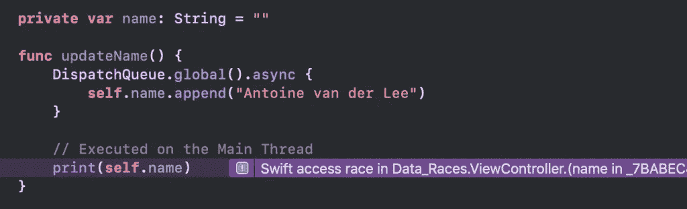
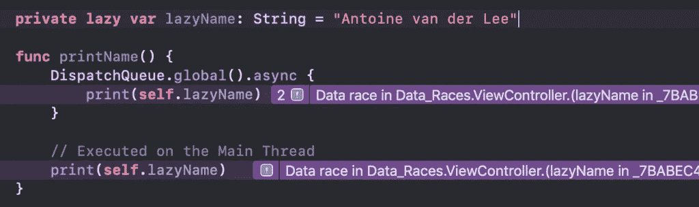

# 线程清除器解释:Swift 中的数据竞争

> 原文：<https://betterprogramming.pub/thread-sanitizer-explained-data-races-in-swift-768e1a1efe61>

## 修复古怪的测试、exc_bad_access 和奇怪的崩溃


阿什利·朱利斯在 Unsplash[拍摄的照片](https://unsplash.com/s/photos/data?utm_source=unsplash&utm_medium=referral&utm_content=creditCopyText)

Thread Sanitizer，也称为 TSan *，*，是一个基于 LLVM 的工具，用于审计您的 Swift 和 C 语言编写的代码中的线程问题。它最初是在 Xcode 8 中引入的，可以作为一个很好的工具来发现代码中不太明显的问题。

在 WeTransfer，Thread Sanitizer 帮助我们解决了古怪的测试和奇怪的崩溃，我们无法真正查明特定的原因。这个工具的作用和工作原理可能有点不清楚。因此，是时候深入解释如何使用线程杀毒器改进代码了。

# 什么是数据竞争？

在我们开始研究消毒剂之前，我们首先需要知道我们实际上在寻找什么。我们将解决一个叫做*数据竞赛*的问题。

当多个线程在不同步的情况下访问同一个内存，并且至少有一次访问是写操作时，就会发生数据争用。数据竞争会导致几个问题:

*   不可预知行为
*   内存损坏
*   古怪的测试
*   奇怪的撞车

由于数据竞争是不可预测的，所以在测试应用程序时，它可能会不一致地发生。您可能会在启动时崩溃，但第二次启动应用程序时不会再次发生。如果是这种情况，您可能正在处理一场数据竞赛。

# Swift 中的数据竞争示例

一旦你知道了什么是数据竞争，你就可以更好地检测代码中的潜在问题。然而，有时代码可能会导致数据竞争这一点不太清楚。这里有几个例子向您展示什么是数据竞赛。

在下面这段代码中，两个不同的线程访问同一个`String`属性:



线程清除器捕获的数据竞争示例

由于后台线程正在写这个名字，我们至少有一个写权限。这种行为是不可预测的，因为它取决于首先执行的是 print 语句还是 write 语句。这是一个由线程杀毒器确认的数据竞争的例子。

## 懒惰变量导致的数据竞争

惰性变量将实例的初始化延迟到第一次被调用的时候。这意味着数据写入将在第一次访问惰性变量时发生。当两个线程第一次访问同一个惰性变量时，可能会发生数据竞争:



懒惰变量导致的数据竞争

# 使用线程清除器检测数据竞争

上面的例子告诉我们，数据竞争很容易发生。在小段代码中，您可能能够捕捉到这一点，但是随着项目的增长，这将变得更加困难。因此，是时候通过使用线程清除器获得一些帮助了。

您可以对您的测试方案做同样的事情，这是一种捕捉数据竞争的有效方法。

## 螺纹消毒剂是如何工作的？

启用线程杀毒器后，您的应用将从头开始重建。将在每个内存访问周围添加代码，以检查某个访问是否参与竞争。上面的代码示例经过编译器转换后将如下所示:

```
func updateName() {
    DispatchQueue.global().async {
        self.recordAndCheckWrite(self.name)
        self.name.append("Antoine van der Lee")
    }

    // Executed on the Main Thread
    self.recordAndCheckWrite(self.name)
    print(self.name)
}
```

`recordAndCheckWrite`方法将为杀毒程序用来检测数据竞争的每个访问和每个线程存储一个时间戳。

## 如何启用线程杀毒器

可以从方案配置中启用线程杀毒器:


可以从方案配置中启用线程杀毒器

您可以对您的测试方案做同样的事情，这是一种捕捉数据竞争的有效方法。

## 螺纹消毒剂有什么限制吗？

线消毒剂有一些限制:

*   它仅支持 64 位 macOS 和 64 位 iOS 和 tvOS 模拟器
*   不支持 watchOS
*   您不能在设备上使用 TSan

## 性能影响

正如从[苹果文档](https://developer.apple.com/documentation/code_diagnostics/thread_sanitizer)中引用的，使用 TSan 会导致性能下降:

> “在启用线程清除器检查的情况下运行您的代码可能会导致 2⨉到 20⨉的 CPU 速度降低，以及 5⨉到 10⨉.的内存使用量增加您可以通过在-O1 优化级别进行编译来提高内存利用率和 CPU 开销。— Apple Thread Sanitizer 文档

# 如何解决数据竞赛

在您了解了什么是数据竞争以及如何检测它们之后，是时候写一个解决方案了，这样它们就不会再发生了。以上述示例为例，我们可以编写如下解决方案:

```
private let lockQueue = DispatchQueue(label: "name.lock.queue")
private var name: String = "Antoine van der Lee"

func updateNameSync() {
    DispatchQueue.global().async {
        self.lockQueue.async {
            print(self.name)
        }
    }

    // Executed on the Main Thread
    lockQueue.async {
        // Executed on the lock queue
        print(self.name)
    }
}

// Prints:
// Antoine van der Lee
// Antoine van der Lee
```

使用锁队列，我们同步了访问，并确保 name 变量一次只被一个线程访问。

# 结论

就是这样！深入探讨 Swift 中的数据竞争。希望您可以开始捕获 bug 并修复一些在您的代码中存在了很长时间的崩溃。

如果您有任何额外的提示或反馈，请随时留下您的评论。

谢谢！