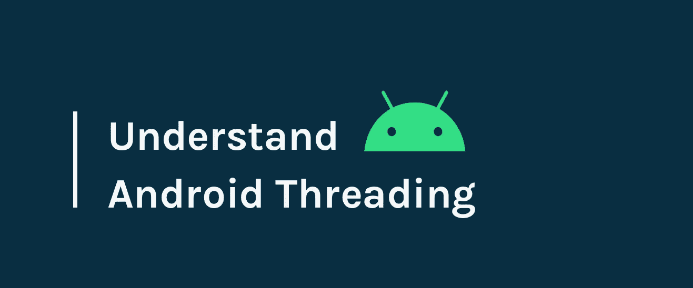

# Android 中的线程

> 原文：<https://betterprogramming.pub/threading-in-android-129b8688436a>

## Android 线程的详细演练



# 介绍

每个 Android 开发人员都需要在应用程序中处理线程。默认情况下，线程做三件事:启动、做一些工作和终止。

它适合于小块工作，但不适合于长任务，在长任务中线程继续执行任务。

当一个线程在完成一些工作后死亡，我们需要在线程上运行某种循环来保持它的活力。但是我们应该能够在需要的时候终止它们。

此外，我们可能需要一种队列，循环可以从中提取工作进行处理。此外，我们可能需要一些其他的线程来创建工作包，并将它们推入队列以供执行。

做所有这些事情并维护它们的状态会产生很多不确定性。然而，Android 提供了一组类来做这些事情。

# Android 线程类

当一个应用程序启动时，Android 会创建自己的 Linux 进程。除了这个系统之外，它还为应用程序创建了一个执行线程，称为*主线程*或 *UI 线程*。主线程只是一个处理程序线程。主线程负责处理来自整个应用程序的事件，比如与生命周期信息相关的回调或来自输入事件的回调。它还可以处理来自其他应用程序的事件。

任何需要运行的代码块都被推入工作队列，然后由主线程提供服务。由于主线程要做这么多的工作，最好把更长的工作交给其他线程，这样就不会打扰 UI 线程的渲染工作。重要的是避免使用主线程来执行任何可能导致它被阻塞从而导致 ANRs(应用程序不响应)的操作。

网络操作或数据库调用或某些组件的加载是当它们在主线程上执行时可能导致主线程阻塞的一些例子。它们是同步执行的，这意味着在任务完成之前，UI 将保持完全无响应。为了避免这种情况，它们通常在单独的线程中执行，这样可以避免在执行任务时阻塞 UI。这意味着它们是从 UI 异步执行的。

Android 提供了许多创建和管理线程的方法，并且有许多第三方库使得线程管理更加容易。每个线程类都有特定的用途；然而，选择一个适合我们需求的是非常重要的。

可用的不同线程类别有:

**AsyncTask:** 帮助完成 UI 线程的工作

**HandlerThread:** 回调线程

运行大量并行工作

**IntentService:** 帮助从 UI 线程中获取意图

# 异步任务

AsyncTask 支持正确、轻松地使用 UI 线程。此类允许您在不使用线程或处理程序的情况下，在 UI 线程上执行后台操作和发布结果。

AsyncTask 被设计为围绕`[Thread](https://developer.android.com/reference/java/lang/Thread.html)`和`[Handler](https://developer.android.com/reference/android/os/Handler.html)`的助手类，并不构成通用线程框架。理想情况下，异步任务应该用于短时间的操作(最多几秒钟)。)如果你需要长时间保持线程运行，强烈推荐你使用`java.util.concurrent`包提供的各种 API，比如`[Executor](https://developer.android.com/reference/java/util/concurrent/Executor.html)`、`[ThreadPoolExecutor](https://developer.android.com/reference/java/util/concurrent/ThreadPoolExecutor.html)`和`[FutureTask](https://developer.android.com/reference/java/util/concurrent/FutureTask.html)`。

执行异步任务时，该任务会经历四个步骤:

1.`onPreExecute()`:任务执行前在 UI 线程上调用。这一步通常用于在任务开始之前做一些事情——例如，简单地在用户界面中显示一个进度对话框。

2.`doInBackground(Params…)`:在`onPreExecute()`执行完毕后，在后台线程上调用。此步骤用于执行可能需要很长时间的后台计算。异步任务的参数被传递到这个步骤。这个步骤必须返回计算结果，并将结果发送给`onPostExecute()`。这一步也可以使用`publishProgress(..)`来发布一个或多个进度单元。

3.`onProgressUpdate(Progress…)`:调用`publishProgress(..)`后在 UI 线程上调用。此方法用于在后台计算仍在执行时，在用户界面中显示任何形式的进度。例如，它可以用来制作进度条动画或在文本字段中显示日志。

4.`onPostExecute(Result)`:后台计算完成后，在 UI 线程上调用。背景计算的结果作为参数传递给该步骤。

可以通过调用`cancel(boolean…)`随时取消任务。我们需要通过检查任务是被取消还是正在运行来做到这一点。

## 履行

```
private class AsyncTaskRunner extends AsyncTask<String, String, String> {@Override  protected void onPreExecute() {
  progressDialog.show();
 }@Override  protected String doInBackground(String... params) {          . doSomething();
  publishProgress("Sleeping..."); // Calls onProgressUpdate()
  return resp;
 }@Override   protected void onPostExecute(String result) {
  // execution of result of Long time consuming operation            . progressDialog.dismiss();
  updateUIWithResult() ;
 }@Override  protected void onProgressUpdate(String... text) {
 updateProgressUI();
 }}
```

## 何时使用 AsyncTask

AsyncTask 是快速结束需要频繁 UI 更新的短期工作的完美解决方案。

然而，如果您需要您的延迟任务在活动/片段的生命周期之外运行，那么异步任务是不够的。值得注意的是，即使像屏幕旋转这样简单的事情也会导致活动被破坏。

## 执行顺序

默认情况下，所有创建的 AsyncTasks 将共享同一个线程，并从单个消息队列中按顺序执行。同步执行会影响单个任务。

如果我们想让任务并行执行，我们可以使用`THREAD_POOL_EXECUTOR`。

# 手柄线程

处理线程是普通 Java 线程类的子类。处理程序线程是一个长期运行的线程，它从队列中获取工作并对其进行操作。它是其他 Android 原语的组合，即:

[**Looper**](https://developer.android.com/reference/android/os/Looper.html) **:** 保持线程活动并持有消息队列

[**message queue**](https://developer.android.com/reference/android/os/MessageQueue.html)**:**类，保存一个循环将要发送的消息列表

[**处理程序**](https://developer.android.com/reference/android/os/Handler.html) **:** 允许我们发送和处理与一个线程的 MessageQueue 相关的消息对象

这意味着我们可以让它在后台运行，然后一个接一个地向它提供越来越多的工作包，直到我们退出它。handler 线程在您的活动的生命周期之外运行，因此需要对它们进行适当的清理，否则就会出现线程泄漏。

创建处理程序线程有两种主要方法。

1.  创建一个新的处理器线程，并获得活套。现在，通过分配创建的处理程序线程的 looper 来创建一个新的处理程序，并在这个处理程序上提交您的任务。
2.  通过创建`CustomHandlerThread`类来扩展处理程序线程。然后，创建一个处理程序来处理该任务。如果您知道想要执行的任务，并且只需要传入参数，那么您会采用这种方法。例如，创建一个定制的`HandlerThread`类来下载图像或执行网络任务。

```
HandlerThread handlerThread = new HandlerThread("TesHandlerThread");
handlerThread.start();
Looper looper = handlerThread.getLooper();
Handler handler = new Handler(looper);
handler.post(new Runnable(){…});
```

当我们创建一个处理程序线程时，不要忘记设置它的优先级，因为 CPU 只能并行处理少量线程，所以设置优先级可以帮助系统知道在其他线程争夺注意力时调度这项工作的正确方法。

**注意:**当你完成后台线程或者活动的`onDestroy()`方法时，调用`handlerThread.quit()`。

我们可以通过使用本地广播或者通过用主循环创建一个处理程序来发布对 UI 线程的更新。

```
Handler mainHandler = new Handler(context.getMainLooper()); 

mainHandler.post(myRunnable);
```

**何时使用处理程序线程**

对于不需要 UI 更新的长期运行的后台工作，处理程序线程是完美的解决方案。

# ThreadPoolExecutor

## 什么是线程池？

线程池基本上是一个等待分配任务的线程池。分配给这些线程的任务将并行运行。当任务并行执行时，我们可能希望确保代码是线程安全的。线程池主要解决两个问题:

*   由于减少了每个任务的开销，提高了执行大量异步任务时的性能
*   一种在执行一组任务时绑定和管理资源(包括线程)的方法

让我们考虑一个例子:如果我们有 40BMP 要解码，其中每个位图需要 4ms 来解码，如果我们在单线程上完成，则需要超过 160ms 来解码所有位图。

然而，如果我们用 10 个线程来做，每个线程解码 4 个位图。因此，解码这 40 个位图所需的时间仅为 16ms。

这里的问题是如何将工作传递给每个线程，如何调度该工作，以及如何管理这些线程。这是一个非常大的问题。这就是`ThreadPoolExecutor`出场的地方。

## 什么是 ThreadPoolExecutor？

A `ThreadPoolExecutor` 是扩展**[abstract executorservice](https://docs.oracle.com/javase/7/docs/api/java/util/concurrent/AbstractExecutorService.html)的类。负责所有的线程。**

*   **它将任务分配给线程**
*   **这让他们活着**
*   **它终止线程**

**它的工作方式是将要运行的任务保存在一个工作队列中。每当线程池中的一个线程空闲或可用时，就从工作队列中向该线程分配一个任务。**

****可运行的****

**它是一个由类实现的接口，该类的实例由线程执行。简单来说:就是可以执行的命令或者任务。它经常用于在不同的线程中运行代码。**

```
Runnable mRunnable = new Runnable() {
    @Override
    public void run() {
        // Do some work
    }
};
```

****执行者****

**一个`Executor`是一个用来将任务提交和任务执行分离的接口。是执行`Runnable`的对象。**

```
Executor mExecutor = Executors.newSingleThreadExecutor(); mExecutor.execute(mRunnable);
```

****执行服务****

**管理异步任务的`Executor`。**

```
ExecutorService mExecutorService = Executors.newFixedThreadPool(10); mExecutorService.execute(mRunnable);
```

****ThreadPoolExecutor****

**将任务分配给线程池的`ExecutorService`。**

**更多的线程并不总是好的，因为 CPU 只能并行执行一定数量的线程。一旦超过这个数字，CPU 就必须进行一些昂贵的计算来决定哪个线程应该根据优先级被分配。**

**在创建`ThreadPoolExecutor`、**T22 的实例时，我们可以指定初始线程数和最大线程数。随着线程池中工作负载的变化，它将扩展活动线程的数量以与之匹配。****

**通常建议根据可用内核的数量来分配线程。这可以通过以下方式实现:**

```
int NUMBER_OF_CORES = Runtime.getRuntime().availableProcessors();
```

****注意:**这并不一定会返回设备上物理核心的实际数量。这可能是 CPU 可能会停用一些核心，以节省电池等。**

```
ThreadPoolExecutor(
   int corePoolSize,    // Initial pool size
   int maximumPoolSize, // Max pool size
   long keepAliveTime,  // Time idle thread waits before terminating
   TimeUnit unit        // Sets the Time Unit for keepAliveTime
   BlockingQueue<Runnable> workQueue)  // Work Queue
```

**这些参数是什么？**

1.  **`corePoolSize`:保留在池中的最小线程数。最初，池中没有线程。但是随着任务被添加到队列中，新的线程被创建。如果少于`corePoolSize` 个线程正在运行，`Executor`总是倾向于添加一个新线程，而不是排队。**
2.  **`maximumPoolSize`:池中允许的最大线程数。如果这超过了`corePoolSize`并且当前线程数是> = `corePoolSize`，那么只有当队列满时才会创建新的工作线程。**
3.  **`keepAliveTime`:当线程数大于内核数时，非内核线程(多余空闲线程)将等待一个新任务，如果在该参数定义的时间内没有获得新任务，它们将终止。**
4.  **`unit`:时间单位`keepAliveTime`。**
5.  **`workQueue`:任务队列，仅保存可运行的任务。它必须是一个阻塞队列。**

## **何时使用 ThreadPoolExecutor**

**`ThreadPoolExecutor` 是一个强大的任务执行框架，当需要并行执行大量任务时，我们可以使用它——因为它支持队列中的任务添加、任务取消和任务优先化。**

# **IntentService**

**`IntentService`是从`Service`继承的子类。要了解`IntentService`，我们需要了解`Service`。**

**`Service`是 Android 编程中非常重要的组件。有时，我们可能在应用程序关闭后还要执行一项任务。这是`Service`会更有帮助的场景。`Service`可以被`startService ()` / `stopService ()`调用和取消，长期在后台运行。也可以通过调用其中的`stopSelf()`来取消。**

**让我们看看一些有助于执行操作的重写方法**

**`onCreate()`:只调用一次，直到停止。**

**`onStartCommand()`:该函数第一次在`onCreate ()`之后被调用，但从第二次开始，当任何组件有意图地调用`startService()`时，该函数将被直接调用。**

**`onDestroy()`:停止服务时调用。**

**正常的服务流程是:**

```
onCreate() -> onStartCommand() -> onDestroy()
```

**回到`IntentService`，`Service`的启动方式与普通`Service`相同(从主线程调用`startService()`)。它在`onHandleIntent()`中处理每个意图，而不是`onStartCommand()`。它使用一个工作线程，并在工作耗尽时自行停止。要使用它，我们需要扩展`IntentService`并实现`onHandleIntent()`。**

****注意:** `IntentService`运行在单个工作线程上，`Service`运行在主线程上。一次只会处理一个请求。**

**`IntentService`受制于 Android 8.0 (API 等级 26)强加的所有[后台执行限制](https://developer.android.com/preview/features/background.html)。在大多数情况下，你最好使用`[JobIntentService](https://developer.android.com/reference/android/support/v4/app/JobIntentService.html)`，它在 Android 8.0 或更高版本上运行时使用作业而不是服务。**

## **何时使用 IntentService**

**`IntentService`按需处理异步请求。如果您不要求您的服务同时处理多个请求，这是最好的选择。**

# **结论**

**目前就这些。希望你从这篇文章中学到了一些东西。我将为上面指定的每个组件编写单独的部分。感谢阅读。**

## **参考**

**[“intent service](https://developer.android.com/reference/android/app/IntentService)”—Android 开发者文档**

**[“了解 Android 线程](https://www.youtube.com/watch?v=0Z5MZ0jL2BM)”—Android 性能模式第五季，Ep。2**