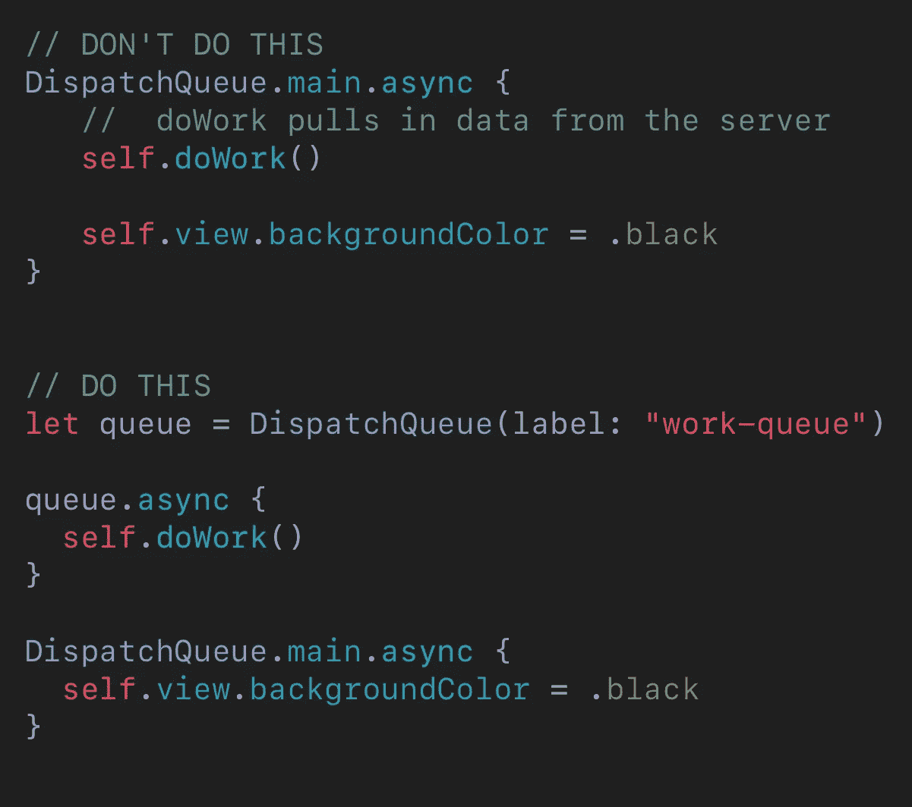
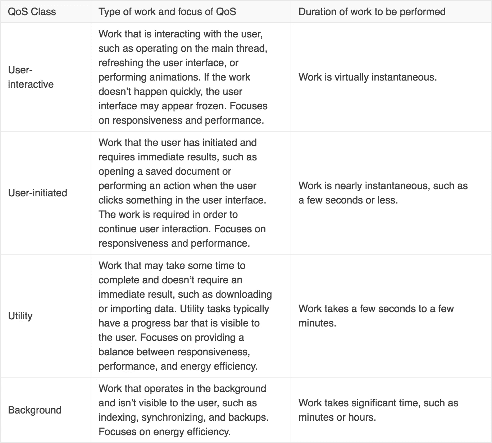
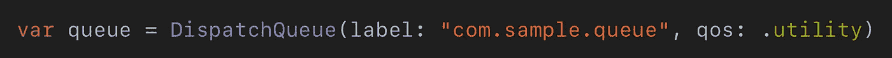
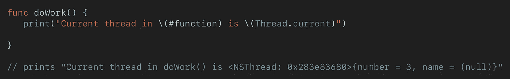
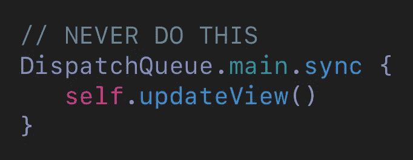

# Swift 中的穿线简单解释道

> 原文：<https://betterprogramming.pub/threading-in-swift-simply-explained-5c8dd680b9b2>

## 使用中央调度(GCD)来加速您的应用程序

照片由[奥列格·马尼](https://unsplash.com/@olegmagni?utm_source=unsplash&utm_medium=referral&utm_content=creditCopyText)在 [Unsplash](https://unsplash.com/search/photos/phone?utm_source=unsplash&utm_medium=referral&utm_content=creditCopyText) 上拍摄

如果你来自其他平台，或者你是 Swift 的初学者，iOS 中的线程可能很难理解。通过使用 GCD，这里有一些提示可以让您在线程化方面有一个良好的开端。

首先，作为先驱，线程化就是管理应用程序中工作的优先级。让你的代码执行得更快固然很好，但更重要的是用户感知你的应用成为*的速度有多快。*

作为一名开发人员，你的目标是优先考虑用户可以看到并与之交互的任何东西。它让你的应用程序感觉更快更敏捷。不要让用户等待加载他们没有注意到或关心的东西。

# 1-仅使用主线程更新视图

这是避免问题的最简单的方法。基本思想是确保所有视图和界面元素不会被主队列中的其他项目阻塞。

一个很好的例子:

通过只在主线程上执行与 UI 相关的工作，可以确保用户不会被阻止加载视图或退出视图。避免在主线程上加载数据、图像等有副作用的函数。

# 2 —了解不同的 GCD 服务质量(QoS)类型

在 iOS 中执行工作有几个不同的优先级。较高的服务质量被优先处理，而较低的服务质量在系统释放一些资源时被处理。

下面列出了从高到低排列的不同品质。

Apple 关于 QoS 的文档

创建您自己的具有服务质量的队列真的很容易。你只需要给它一个标签和一个 QoS。

# 3-知道你在做什么

找出当前线程是什么，在代码中的任何给定位置:`Thread.current`。

这样，您就可以确切地看到函数运行的优先级。

你也可以用`Thread.current.isMainThread`来检查你是不是专门在主线程上。

# 4 —几乎总是使用异步

这是线程化时最容易出错的地方之一，但也是最容易避免的。

在代码中使用 sync 有很多好处，一些特殊情况下需要它，但是对于刚开始 iOS 开发的人来说，最好避免使用它。

注意:**永远不要在主`DispatchQueue`上**调用 sync，如本例所示:

还要避免在`.userInteractive`队列上使用 sync，因为它与主队列处于相同的优先级。

# 线程资源

*   通过关于并发性的 [WWDC 视频](https://developer.apple.com/videos/play/wwdc2016/720/)深入探究。
*   如果你是视觉学习者，请阅读[这篇文章](https://www.appcoda.com/grand-central-dispatch/)。它真的帮助我理解了不同的服务质量水平是如何相互作用的，以及不同的优先级是如何被调用的。
*   [Ray Wenderlich](https://www.raywenderlich.com/5370-grand-central-dispatch-tutorial-for-swift-4-part-1-2) 也有关于线程的很好的指导