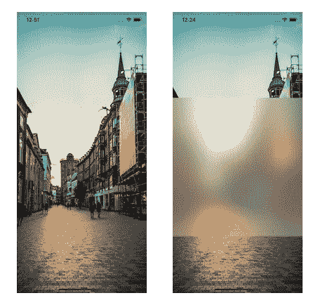
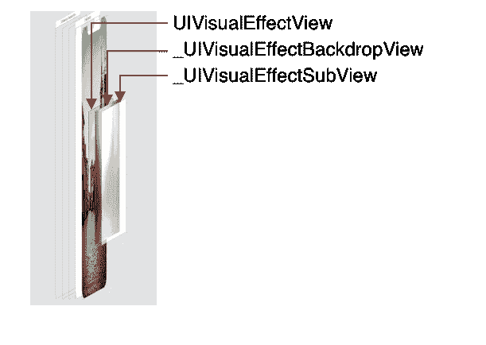
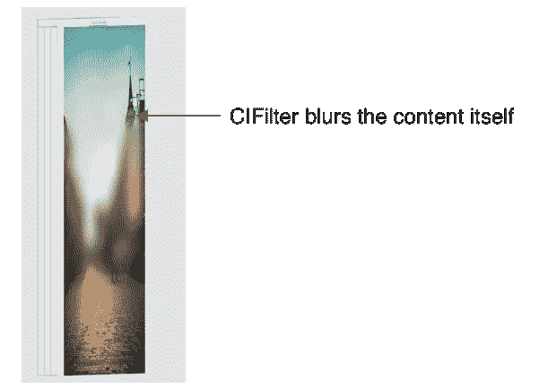
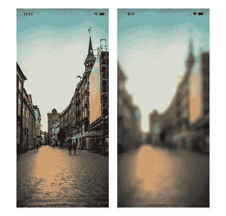

# 在 iOS 中应用模糊效果的 3 种方法

> 原文：<https://betterprogramming.pub/three-approaches-to-apply-blur-effect-in-ios-c1c941d862c3>

## 使用 UIBlurEffect、CIFilter 和 Metal 以及 GPU 加速

[文尼尔伦](https://unsplash.com/@wenniel?utm_source=medium&utm_medium=referral)在 [Unsplash](https://unsplash.com?utm_source=medium&utm_medium=referral) 上拍照。

对 iOS 内容应用模糊效果是一个相当常见的要求。本文通过使用三个不同的 iOS 框架介绍了三种不同的方法:`UIKit`、`CoreImage`和`Metal`。

# 1.使用 UIBlurEffect 模糊图像

`UIBlurEffect`是`UIKit`中设计简洁的 UI 元素。通过与`UIVisualEffectView`一起使用，在背景内容之上添加了一个视觉效果视图。

要添加模糊效果，请执行以下操作:

事情是这样的:

*   在`[UIBlurEffect.Style](https://developer.apple.com/documentation/uikit/uiblureffect/style)`中引入了很多模糊风格。我们在这个例子中使用了`.light`。
*   `UIVisualEffectView`的实例用特定的高度初始化，并以背景图像为中心。
*   我们添加`UIVisualEffectView`的实例作为图像视图的子视图。
*   我们在动画中应用了五秒钟的模糊效果。

杨梦前后的模糊效果

`UIVisualEffectView`包含了另外两个私有层(`UIVisualEffectBackdropView`和`UIVisualEffectSubView`)，探索起来会很有趣。

杨梦的 UIVisualEffectView 图层

## 赞成的意见

*   `UIBlurEffect`可以在背景内容上应用自定义模糊帧。
*   `UIBlurEffect`处于 UIKit 级别，无需担心更低级别的细节。

## 骗局

*   `UIBlurEffect`只有一堆内置的系统滤镜，不能自定义。
*   `UIBlurEffect`在背景内容之上添加附加层。它不会改变内容本身。
*   `UIBlurEffect`是一个使用 CPU 计算的 UIKit 框架——没有 GPU 加速。

# 2.对图像应用 CIFilter

CIFilter 是`Core Image`框架中的图像处理器。它有几十个内置的图像过滤器，并提供建立自己的自定义过滤器的能力。`Core Image`可以使用`OpenGL/OpenGL ES`实现高性能、基于 GPU 的实时渲染。如果不需要实时性能，它也可以使用石英 2D 基于 CPU 的渲染。

为了在这个例子中应用模糊效果，我们使用`CIFilter`和`CIGaussianBlur`类型:

*   为了在整个应用程序中易于重用，我们将`blurredImage`函数添加到了`UIImage`扩展中。
*   `CIContext`身高体重贵。建议只初始化一次。
*   `radius`是自定义模糊效果，可通过`kCIInputRadiusKey`键指定。
*   `atRect`指定模糊效果的位置和大小。
*   我们首先将`UIImage`转换成`CIImage`来使用`Core Image`框架。
*   我们用自定义框架裁剪新的`CIImage`。
*   高斯模糊滤镜被初始化并应用于裁剪后的图像，如`kCIInputImageKey`。
*   `composited`将模糊图像与原始图像合二为一。
*   从`CIImage`创建`CGImage`，然后转换为`UIImage`进行 UI 渲染。

杨梦之前和之后的滤镜模糊

## 赞成的意见

*   `CIFilter`有几十个内置的图像过滤器，并提供建立自己的自定义过滤器的能力。
*   `Core Image`可以通过基于 GPU 的渲染实现高性能。
*   `CIFilter`修改内容本身，可以应用于实时渲染。
*   `CIFilter`能够指定内容的模糊区域。
*   `CIFilter`可以被子类化以提供自定义和链式过滤器。

## 骗局

*   `CIFilter`暴露了`Core Image`的复杂性，难以管理。
*   `CIFilter`采用键值编码。有点容易出错。

杨梦的 CIFilter 模糊了内容

# 3.金属，GPU 加速方式

`Metal`允许我们直接使用 GPU 来执行计算和图形操作。这样做的同时，我们也释放了 CPU，使其可用于其他操作。GPU 针对高度并行的工作流进行了优化。它可以比 CPU 更快更有效地执行图形任务。包括`Core Image`在内的少数苹果框架使用`Metal`将图形工作负载委托给 GPU，而`Core ML`使用`Metal`在 GPU 上执行其底层操作。

*   为了使用`Metal`框架，我们首先初始化了用于呈现内容的`MTKView`实例。
*   `MTLDevice`的实例代表要使用的 GPU。
*   `MTLCommandQueue`在 GPU 上执行渲染和计算命令。
*   `MTLTexture`对象持有一个`Metal`纹理，该纹理包含要由过滤器处理的图像。
*   `CIContext`身高体重贵。建议在整个应用程序中使用一个通用实例。
*   我们对图像应用`CIGaussianBlur`滤镜。
*   我们使用`CGColorSpaceCreateDeviceRGB`作为输出图像颜色空间。

*   我们在`viewDidLoad()`初始化`device`和`commandQueue`。
*   `MTKTextureLoader`从`UIImage`创建`Metal`纹理。
*   我们用代理和设备设置了`MetalKit`视图。
*   通过使用与视图相同的`Metal`设备创建`CIContext`,节省了从独立的 CPU 或 GPU 内存缓冲区复制数据的性能成本。

*   我们实现了`MTKViewDelegate`的`draw(in:)`方法来对图像应用滤镜。
*   `.oriented(.down)`在这里起到重要作用，将图像旋转到正确的方向。
*   我们应用半径为 10 的过滤器，但它肯定是可以定制的。

杨梦前后的金属模糊

## 赞成的意见

*   `Metal`框架是高性能的，因为它使用了 GPU 并行计算。
*   `Metal`完全可定制，可以对内容应用不同的用户自定义过滤器。
*   `Metal Texture`可配置实时视频流。
*   `MTKViewDelegate`每秒执行 60 次绘制方法。我们可以利用这个机会随着时间的推移改变过滤器参数，以创建平滑的动画和实时过滤器。
*   `Metal`修改内容以应用过滤器。

## 骗局

*   `Metal`使用金属着色语言(MSL)时会比较复杂，该语言源自 C++。`.metal`代码运行在 GPU 上，被称为着色器。
*   使用顶点着色器和 3D 坐标时，学习曲线很陡。

# 结论

这篇文章提供了三种不同的方法来在 iOS 中给图像添加模糊效果。这些方法将模糊效果应用于任何`UIView`的实例。

还有很多潜力可以挖掘。感谢您的阅读。请在评论中留下你可能有的任何问题。

上面提到的所有代码都可以在这个 [GitHub repo](https://gist.github.com/ericleiyang/b0414e284db7e17e918d42ce5403e185) 中找到。