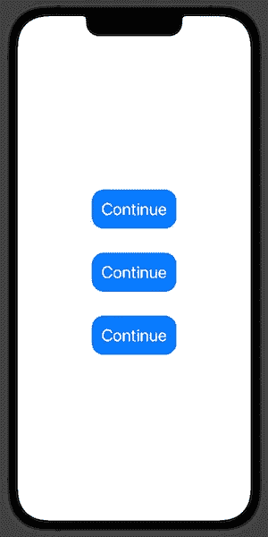

# 设计 SwiftUI 按钮的 3 种方式

> 原文：<https://betterprogramming.pub/three-brilliant-ways-to-style-button-with-swiftui-69add9e22cda>

## 使用视图修改器、自定义视图和样式


德里克·鲍姆加特纳在 [Unsplash](https://unsplash.com/?utm_source=medium&utm_medium=referral) 上拍摄的照片。

使用移动应用程序，我们可以导航到另一个视图，计算业务费用，或者通过点击按钮发送推文。SwiftUI 让构造一个按钮变得轻而易举。

这一次我们将从三个方面讨论如何做到这一点:

*   使用视图修改器方法
*   构建自定义视图修改器
*   应用按钮样式

我们将从最基本的 SwiftUI 按钮和样式开始。

```
Button("Continue", action: {})
```


# 使用自定义视图修改器

在 SwiftUI 中，视图修改器用于以某种方式改变视图。我们可以自己构建定制的视图修改器。我们将尝试构建一个自定义按钮。

首先，我们需要创建自定义修改器。为此，我们应该使用`ViewModifier`协议，该协议要求实现一个函数`func body(content: Content) -> some View`，该函数接收一个视图并生成该视图的不同版本。

```
struct CustomButtonModifier: ViewModifier {
  func body(content: Content) -> some View {
    content
      .font(.title)
      .foregroundColor(.white)
      .padding()
      .background(Color.blue)
      .clipShape(RoundedRectangle(cornerRadius: 20))
  }
}
```

我们可以将新制作的带有`.modifier`修改器的视图修改器应用到原始视图，但是我们可以创建对`View`协议的扩展。这将允许我们以更简便的方式使用它。

```
extension View {
  func customButton() -> some View {
    modifier(CustomButtonModifier())
  }
}
```

我们现在可以创建一个 SwiftUI 按钮视图，并应用我们新创建的视图修改器。

```
Button("Continue", action: {})
  .customButton()
```

# 构建自定义视图

现在让我们看看如何通过构建自定义视图来设计 SwiftUI 按钮的样式。我们需要创建一个自定义视图，当用`init(action: () -> Void, label: () -> Label)`初始化器构造按钮时，我们将把它传递给`label`参数。

```
struct CustomButtonView: View {
  var body: some View {
    Text("Continue")
      .font(.title)
      .foregroundColor(.white)
      .padding()
      .background(Color.blue)
      .clipShape(RoundedRectangle(cornerRadius: 20))
  }
}
```

现在我们有了自定义视图，我们可以使用它并创建按钮。

```
Button(action: {}, label: {
  CustomButtonView()
})
```

# 应用按钮样式

设计按钮样式的最流行的 SwiftUI 方法是应用自定义按钮样式。

SwiftUI 带有几个内置的按钮样式，但这次我们将创建自己的按钮样式。

要做到这一点，我们需要创建一个定制风格的结构，并符合应用标准交互行为的`ButtonStyle`协议，我们可以自己定制外观。

```
struct CusttomButtonStyle: ButtonStyle {
  func makeBody(configuration: Configuration) -> some View {
    configuration.label
      .font(.title)
      .foregroundColor(.white)
      .padding()
      .background(Color.blue)
      .clipShape(RoundedRectangle(cornerRadius: 20))
  }
}
```

现在我们已经定义了我们的自定义按钮样式，我们可以通过使用`.buttonStyle`视图修饰符来应用它。

```
Button("Continue", action: {})
  .buttonStyle(CusttomButtonStyle())
```

# 结果

让我们将`VStack`中的所有按钮一个接一个地放在一起，看看结果如何。所有的都应该一样。



# TL；速度三角形定位法(dead reckoning)

一个按钮是我们大多数应用功能的门户，如打开另一个视图、发送推文或电子邮件。使用 SwiftUI，我们可以通过各种方式创建按钮，如应用视图修改器、创建自定义视图以及使用自定义按钮样式对其进行样式化。

# 链接

*   [样本代码](https://github.com/fassko/SwiftUICustomButton)
*   [视图修改器文档](https://developer.apple.com/documentation/swiftui/viewmodifier)
*   [SwiftUI 按钮文档](https://developer.apple.com/documentation/swiftui/button)
*   [swift ui 中的主控按钮](https://swiftwithmajid.com/2020/02/19/mastering-buttons-in-swiftui/)
*   [SwiftUI 按钮样式](https://sarunw.com/posts/swiftui-buttonstyle/)
*   [定制按钮样式的按钮](https://www.hackingwithswift.com/quick-start/swiftui/customizing-button-with-buttonstyle)
*   [探索 SwiftUI 的按钮样式](https://www.fivestars.blog/articles/button-styles/)