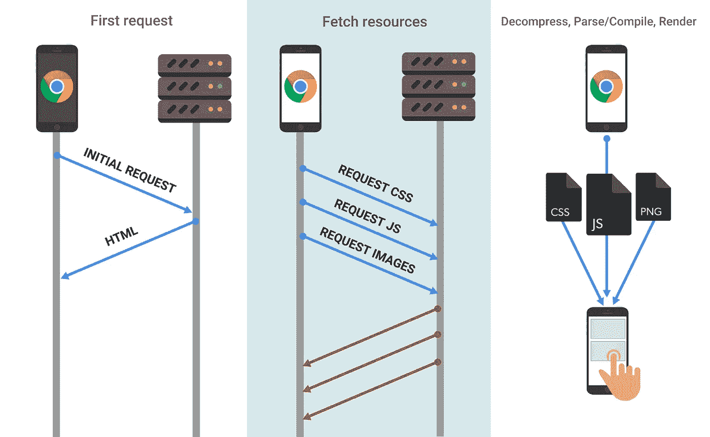
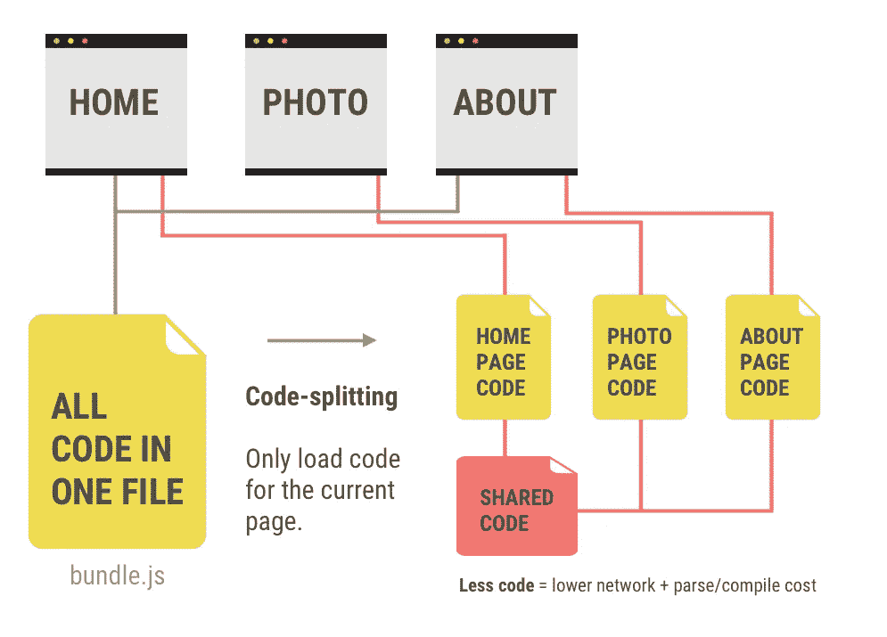
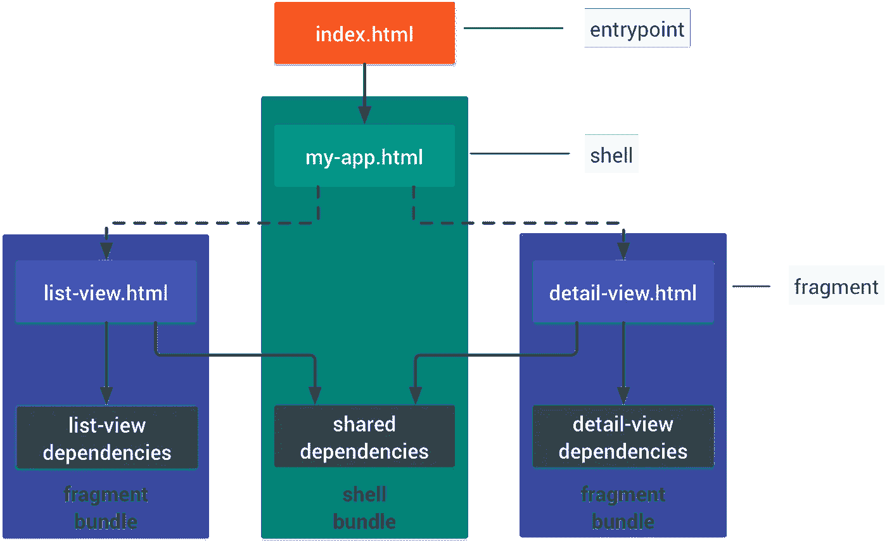

# 提高 Web 性能的三种简单方法

> 原文：<https://betterprogramming.pub/three-easy-ways-to-improve-web-performance-f9ca7e5caf32>

## 通过利用代码分割、PRPL 模式和延迟加载来提高效率

[JavaScript 下载和执行成本](https://developers.google.com/web/fundamentals/performance/optimizing-content-efficiency/javascript-startup-optimization/)

几周前，我参加了一个 meetup，有机会了解了一些不可思议的 Google Dev 工具，可以通过 Google Chrome 扩展、命令行或节点模块使用。这些工具中我最喜欢的一个是[谷歌灯塔](https://developers.google.com/web/tools/lighthouse/)，它对网页进行审计，并生成一份详细说明性能、可访问性、PWA 等等的报告。它还提供了具体的细节，如哪些因素影响了特定的分数，以及如何提高分数的清晰建议和文档。

在最近的一次工作面试之前，我在公司网站上运行了谷歌灯塔来检查他们的表现(希望能得到额外的印象分！).结果他们在网站性能上得了 27 分(满分 100 分)，这使他们进入了红色区域。大 OOF！

在审查该报告时，我们可以看到主要的罪魁祸首是:

*   主线工作
*   JavaScript 执行时间
*   巨大的网络负载

> “JavaScript 在主线程上被解析和编译。当主线程繁忙时，页面无法响应用户输入。[……]JavaScript 也在主线程上执行。”

根据 Google Lighthouse 的报告，主线程工作给加载时间增加了惊人的 10.2 秒。这个时间包括解析、编译和执行 JavaScript。此外，该网站的网络负载为**4327 KB**——肯定不是最佳的。JavaScript 量越大，下载时间越长，网络成本越大，不幸的是，用户体验越不愉快。

那么我们如何减少主线程工作的大小和时间呢？我们来看几个选项。

# 代码分割

[代码分割](https://developers.google.com/web/fundamentals/performance/webpack/)

如果你试着一次吃掉一整个三明治，可能会比你一次吃一小口并依次消化每一口花费更长的时间。类似地，如果您将所有的 JavaScript 放在一个大堆中，编译器将需要很长时间来读取所有代码，然后在执行环境中处理所有代码以呈现网页。[代码分割](https://developers.google.com/web/fundamentals/performance/optimizing-javascript/code-splitting/)是一种简单的方法，它以较小的包交付 JavaScript，以加快解析和编译时间，然后将每个包发送到执行环境。使用较小的 JavaScript 块，可以减少加载时间并提高 web 性能。

三种不同的代码分解方式:

*   **供应商分割**是将代码中任何你认为是“依赖”或第三方来源的东西分离到一个单独的文件夹中，通常是“*/供应商”*。如果您的应用程序代码或供应商代码有任何更改，它们可以单独处理，而不会干扰其他代码。
*   **入口点分割**推荐用于没有明确设置服务器端路由和客户端路由的应用程序。这意味着在最初构建依赖项时，使用像 [webpack](https://webpack.js.org/) 这样的工具来拆分代码。
*   **对于使用动态“*import()”*语句的单页应用程序，建议使用动态拆分**。

重建整个代码库来实现代码拆分似乎是一场磨难，但好消息是有大量工具可以让这个过程自动化( [Preact CLI](https://github.com/developit/preact-cli/) 、 [PWA Starter Kit](https://github.com/Polymer/pwa-starter-kit/) 等)。).但是如果你正在开发一个更小的特性、项目，或者刚刚起步，要知道手动代码分割是由 [React](https://reactjs.org/docs/code-splitting.html) 、 [Vue](https://vuejsdevelopers.com/2017/07/03/vue-js-code-splitting-webpack/) 和 [Angular](https://angular.io/guide/lazy-loading-ngmodules) 支持的。

# PRPL

*   **推送**初始 URL 路由的关键资源。
*   **渲染**初始路线。
*   **预缓存**剩余路线。
*   **延迟加载**并按需创建剩余路线。

构建代码的体系结构是一个很好的实践，这样您首先发送显示页面所需的最少量的代码。本质上，从发送骨骼开始，然后在后面添加肌肉、器官和衣服。这将大大提高你的互动时间。开发人员设计了 PRPL 模式来减少加载时间，并将移动网络的内存使用保持在最低水平。

[谷歌文档](https://developers.google.com/web/fundamentals/performance/prpl-pattern/)有效且高效地解释了 PRPL，但为了给你一个快速纲要，PRPL 最好与以下应用程序结构一起使用:

*   **入口点:**index.html——应该非常小，以最大限度地减少 RAM 的使用
*   **外壳:**顶层应用-逻辑、路由、主 UI、静态依赖
*   **片段:**在加载的 DOM 内容中不能立即看到的任何东西。这就是延迟加载发挥作用的地方。

您还可以定制您的非捆绑构建过程，并利用 [HTTP/2 Push](https://developers.google.com/web/fundamentals/performance/http2/#server-push) 或`[<link rel="preload">](https://developers.google.com/web/updates/2016/03/link-rel-preload)`来指示哪些代码片段对于框架框架是必不可少的。如果不支持这些特性，您可以将您的构建过程捆绑到 shell 和 fragment 包中。

减少有效负载的其他方法包括通过使用压缩器缩小 JS、HTML 和 CSS，使用文本压缩如 GZIP，以及选择最佳的图像文件类型和压缩级别。

# 惰性装载

当滚动到视窗中时，首先显示一个[占位符图像，并迅速替换为实际图像](https://developers.google.com/web/fundamentals/performance/lazy-loading-guidance/images-and-video/)

延迟加载就像它听起来的那样——它将准备好加载，但是在以后你需要它的时候。节省数据和处理时间的一个快速方法是推迟任何资源，直到它们进入视口。对于图像，可以使用事件处理程序，如 *"scroll"* 或 *"resize"* ，但是在更现代的浏览器上，可以使用[交叉点观察器 API](https://developers.google.com/web/updates/2016/04/intersectionobserver) 。

在这两种情况下，您都指定了某种类型的**指示器**来让代码知道资源何时在视窗中。你可以声明一个“懒惰”的图像 url，和实际的图像 url，只要给你的图像标签一个类*“懒惰”；*对于 div 的背景图像，使用类别*。懒惰-背景“*和*”。懒-background.visible”。*正如所料，这些[惰性加载库](https://developers.google.com/web/fundamentals/performance/lazy-loading-guidance/images-and-video/#lazy_loading_libraries)的存在有助于加速惰性加载的实现，因此您不必彻底调查幕后发生了什么。难道你不喜欢开发者让彼此的生活变得更容易吗？

# 结论

PRPL 模式是黄金标准，特别是对于移动开发来说，它可以最小化网络负载并有效地组织你的代码架构。这很大程度上意味着人们应该应用代码分割和延迟加载来获得最佳实践。**代码分割**对于将你的代码分解成便于执行环境处理的可管理的片段来说是很棒的，这样就可以理清主线程的工作。**延迟加载**通过仅在需要时调用资源片段，尤其是媒体文件类型，可以节省内存并减少加载时间。通过这三个简单的实现，您可以显著减少交互时间，从而创建更好的用户体验。

> 仅发送您的用户需要的代码。
> 
> 缩小你的代码。
> 
> 压缩你的代码。
> 
> **删除不用的代码。**
> 
> 缓存你的代码以减少网络行程。
> 
> ——[developers.google.com](https://developers.google.com/web/tools/lighthouse/audits/bootup?utm_source=lighthouse&utm_medium=extension)

# 资源

*   [*谷歌灯塔*](https://developers.google.com/web/tools/lighthouse/audits/bootup?utm_source=lighthouse&utm_medium=extension)
*   [*代码拆分*](https://developers.google.com/web/fundamentals/performance/optimizing-javascript/code-splitting/)
*   [*优化内容效率*](https://developers.google.com/web/fundamentals/performance/optimizing-content-efficiency/)
*   [*Javascript——什么是 Javascript，如何工作*](https://developer.mozilla.org/en-US/docs/Learn/JavaScript/First_steps/What_is_JavaScript)
*   [*网络有效载荷*](https://developers.google.com/web/tools/lighthouse/audits/network-payloads?utm_source=lighthouse&utm_medium=extension)
*   [*PRPL*](https://developers.google.com/web/fundamentals/performance/prpl-pattern/)
*   [*偷懒加载图片和视频*](https://developers.google.com/web/fundamentals/performance/lazy-loading-guidance/images-and-video/)
*   [*屏幕外图像*](https://developers.google.com/web/tools/lighthouse/audits/offscreen-images)