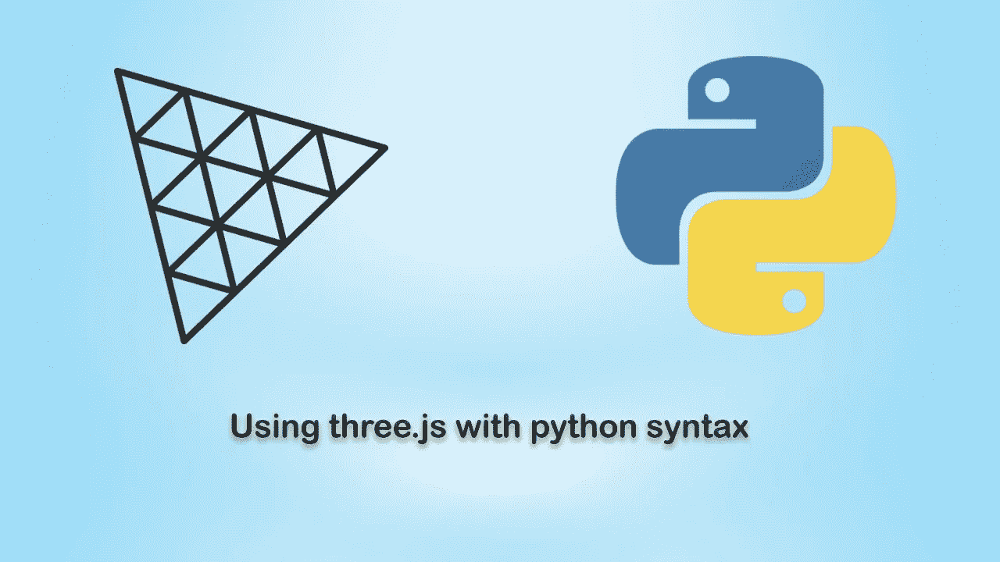
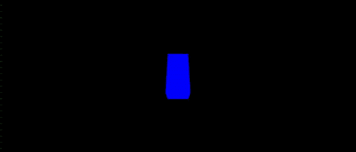

# 了解 py web 3d-three . js 的 Python 语法

> 原文：<https://betterprogramming.pub/three-js-with-python-syntax-pyweb3d-2152bed1a43d>

## 不使用 JavaScript 使用 Three.js



图片作者:logos 作者: [three.js](https://threejs.org/) 和 [python](https://www.python.org/)

在本文中，我将向您展示如何不用编写一行 JavaScript 就能使用 three.js 库。我们将使用 PyWeb3D，这是一个额外的层，用于使用 Brython 与 three.js 轻松交互。

## 什么是 [PyWeb3D](https://github.com/Bruno-Odinukweze/PyWeb3D) ？

简单来说，PyWeb3D 就是 Python 语法的 three.js。它是用 [Brython](https://brython.info/) 和 [three.js](https://threejs.org/) 构建的开源项目，旨在扩展 three.js 库，同时使用 python 语法与库进行交互。

本文是其系列的第一篇，所以我们将保持简单。下面是我们将在本文中创建的示例视频:



# 装置

不用安装任何东西就可以使用 PyWeb3D。

将必要的库和包添加到 HTML 文件的`<head></head>`标签中。

```
<script src="https://cdn.jsdelivr.net/npm/brython@3.10.7/brython.min.js"></script><script src="https://cdn.jsdelivr.net/npm/brython@3.10.7/brython_stdlib.js"></script><script src="https://unpkg.com/three@0.145.0/build/three.js"></script><script src="https://www.pyweb3d.org/pyweb3d/v1.0.0/pyweb3d.brython.js"></script>
```

# 你需要什么

创建一个文件夹，命名为`spinning_cube`。这将是我们的工作目录。

在你的工作目录中，创建一个`index.html`文件。这是我们所有代码的所在。

将以下代码粘贴到您的`index.html`文件中:

让我们回顾一下 HTML 文件，特别是`<head></head>`标签和`<body></body>`标签。

# 在`<head>`标签内

前两个`<script>`标签将加载 [Brython](https://brython.info/) (Brython 是用于客户端 web 编程的 Python 3 实现，旨在取代 JavaScript 作为 web 的脚本语言)。

第三个`<script>`标签将加载 [three.js](https://threejs.org/) (Three.js 是一个易用、轻量、跨浏览器、通用的 JavaScript 3D 库)。

最后一个`<script>`标签会加载 [pyweb3d](http://pyweb3d.org/) (PyWeb3D 是 python 语法的 three.js)。

# 在`<body>`标记内

注意开始的`<body>`标签中的`onload`属性。我们就是这样告诉浏览器在页面加载时调用`brython()`函数的。

最后是 `<script type=”text/python”> </script>`标签，我们的 python 代码将存放在这里

# 创建旋转立方体

这就是乐趣的开始。使用感觉自然的语言。

将下面的代码粘贴到`<body>`内的 `<script type=”text/python”> </script>`中:

让我们来看一下 Python 代码。

# 导入必要的模块和函数

```
from browser import document, windowfrom  pyweb3d.pyweb3d import *
```

*   第一行从 Brython 导入了`window`和`document`实例
*   第二行从 pyWeb3D 模块导入所有三个. js 类和函数。(这消除了额外的键入和格式化，使与 three.js 库的交互变得简单)

# 其余的内容

*   从第 5–7 行，我们创建了一个`scene`、`camera`和一个`renderer`
*   在第 9 行，我们设置了将要绘制形状的窗口或屏幕的大小
*   在第 10 行，我们将`renderer`添加到我们的 HTML 主体中
*   从第 12–15 行，我们创建了一个盒子形状，并将其添加到第 15 行的场景中
*   在第 17 行，我们将相机的位置向后移动，这样我们就可以从透视图中看到形状
*   从第 19–27 行，我们创建了一个动画循环，并在第 27 行将其命名为。注意传递给`animate`函数的参数和自变量吗？这对动画工作很重要

# 现在运行代码

在你的浏览器中打开`index.html`，你应该会看到一个漂亮的旋转立方体:)万岁！


感谢阅读。

源代码: [spinning_cube 示例](https://github.com/Bruno-Odinukweze/PyWeb3D/blob/main/examples/spinning_cube.html)

# 学分和参考

*   灵感来源于 [three.js](https://threejs.org/)
*   [布里森](https://brython.info/)
*   伊森

```
**Want to Connect?**Would you like to contribute PyWeb3D? Join me, and let’s create something awesome together. Follow me [here](https://github.com/Bruno-Odinukweze/PyWeb3D).
```