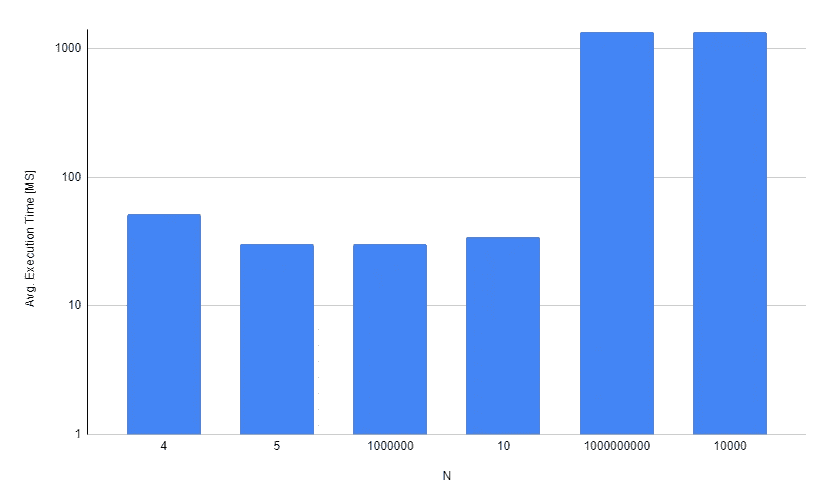
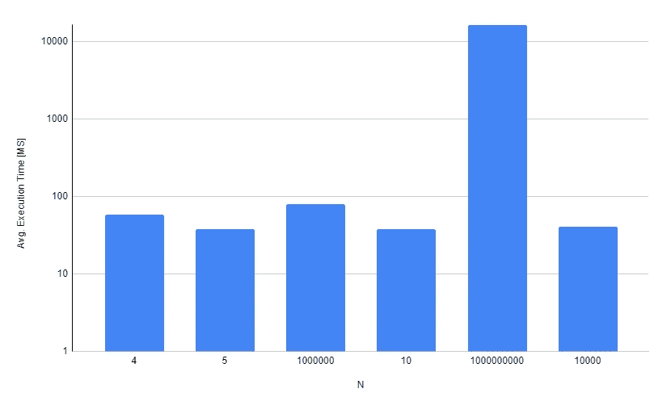
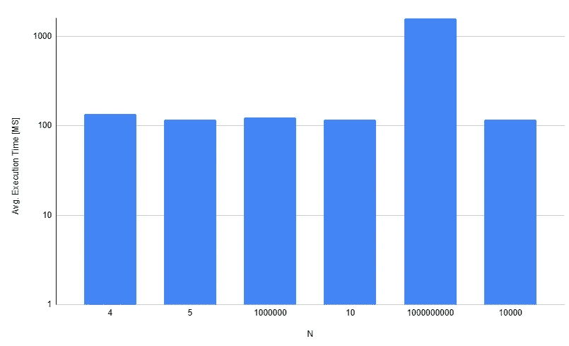
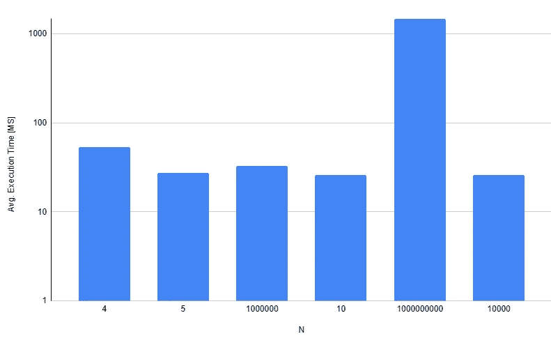

# 解决 Node.js 事件循环阻塞的 3 种策略

> 原文：<https://betterprogramming.pub/three-strategies-to-address-node-jss-event-loop-blocking-9dedd0a233ac>

## 任务划分、工作线程和集群 Express APIs


[亨利&公司](https://unsplash.com/it/@hngstrm?utm_source=medium&utm_medium=referral)在 [Unsplash](https://unsplash.com?utm_source=medium&utm_medium=referral) 上拍摄的照片

理解 Node.js 事件循环是如何工作的，对于改进我们编写打算在这个引擎上运行的 JavaScript 代码是至关重要的。了解事件循环所经历的不同堆栈和阶段，以及每一个堆栈和阶段中发生的事情，只是实现我们的代码应该如何构建以在该架构上平稳运行的基础。

这不仅仅是另一个 Node.js 事件循环指南(你可以很容易地在互联网上找到)，在本文中，我将试图让你大致了解阻止 Node.js 事件循环意味着什么，我们将看到克服它的三个最常用的策略。

# 陈述问题:事件循环阻塞示例

让我们从一个简单的阻塞应用程序的 Express API 示例开始。看一下下面的代码:

这个简单的 API 包含一个计算前 N-1 个整数的平方和的端点:

*   `GET /calculate/2`会给我们`{ “result": 1 }`
*   `GET /calculate/5`会给我们`{ “result": 30 }`
*   `GET /calculate/10`会给我们`{ "result": 285 }`

现在，为了使用这个端点，假设我们编写了一个客户端，它并行发送多个请求，并测量每个请求完成所需的时间:

现在，我们运行`node index.js`和`node client.mjs`。以下是输出结果:

```
node client.mjs
sending request #1 with n=4
sending request #2 with n=5
sending request #3 with n=1000000
sending request #4 with n=10
sending request #5 with n=1000000000
sending request #6 with n=10000
finished request #1, result for n=4 is 14, computed in 56 ms
finished request #2, result for n=5 is 30, computed in 36 ms
finished request #3, result for n=1000000 is 333332833333127550, computed in 37 ms
finished request #4, result for n=10 is 285, computed in 37 ms
finished request #5, result for n=1000000000 is 3.333333328333552e+26, computed in 1357 ms
finished request #6, result for n=10000 is 333283335000, computed in 1362 ms
```

注意`n=10K`的要求#6。它不应该比`n=1M`(请求#3)花费的时间更长，那么，发生了什么？

## 事件循环阻塞

当一个新的请求到达我们的 Express API 时，在事件循环中发出一个事件，一个新的回调实例被推送到回调栈。这个回调实例将进行平方和计算。由于只能同时运行一个回调函数(默认情况下，Node.js 只有一个执行线程)，其余的回调函数会排队等待，直到正在运行的回调函数结束。

我们的端点执行一个 CPU 密集型任务(不建议 Node.js 回调使用)。因此，回调实例可能需要很长时间才能完成，就像请求#5 那样。当请求#5 正在执行时，请求#6 正在等待下一个事件循环迭代，这在请求#5 的回调实例完成之前永远不会发生。

下图显示了在运行客户端脚本五次后，使用这种方法时每个请求的平均执行时间:



显示每个请求的平均执行时间的图表，以毫秒为单位(对数刻度)。

在真实的场景中，请求#6 可能代表一个关键的 API 客户端，它不应该等待很长时间才能得到响应。因此，我们希望通过使它们相互独立来最小化每个请求的执行时间。有几个策略可以实现这一点。我将重点介绍三种最常用的方法。

# 1.任务划分

当 N 是一个很大的数字时，处理请求回调必须经过大量的工作才能计算出最终的结果。当这个计算完全占用主 Node.js 执行线程时，它不能用于任何其他任务。然而，任务划分方法允许我们将大量 CPU 密集型工作分成一组工作块。

每个工作块在一次事件循环迭代中执行，因此允许主线程在完成每个块后执行其他排队的回调。当最后一块工作完成时，最终结果计算也就完成了。每个工作块都为下一次循环迭代安排下一个块的执行，从而允许主线程从队列中弹出回调实例，这些实例需要在运行的迭代中执行。

下面是这个版本的 API 的代码片段。我们将进一步了解它的工作原理:

`calculateResultPartitioned`函数返回一个`Promise`，其中包含给定`N`的最终计算结果。它定义了功能`computePartial`和`fn`。

*   `computePartial`通过计算`[0, N)`范围内的 100k 个数字来部分计算结果。
*   `fn`只是一个调度功能。它首先调用`computePartial`函数，然后使用`setImmediate`钩子调度下一次执行(计算下一个块)。一旦计算完所有的块(通过查看`previous`变量的值我们知道)，它就解析主`Promise`。

正如您可能已经猜到的，尽管这种方法非常流行，但由于它给代码带来的复杂性，它是最不可取的方法。但是，使用同一客户端执行此版本的 API 会返回以下输出:

```
node client.mjs
sending request #1 with n=4
sending request #2 with n=5
sending request #3 with n=1000000
sending request #4 with n=10
sending request #5 with n=1000000000
sending request #6 with n=10000
finished request #1, result for n=4 is 14, computed in 59 ms
finished request #2, result for n=5 is 30, computed in 39 ms
finished request #4, result for n=10 is 285, computed in 40 ms
finished request #6, result for n=10000 is 333283335000, computed in 46 ms
finished request #3, result for n=1000000 is 333332833333127550, computed in 80 ms
finished request #5, result for n=1000000000 is 3.333333328333552e+26, computed in 16437 ms
```

一方面，请求#6 比请求#5 更早更快地被执行和完成，这是所希望的。另一方面，request #5 现在比原始版本需要更长的时间来完成。请注意这是如何影响平均执行时间的，如下图所示:



显示每个请求的平均执行时间的图表，以毫秒为单位(对数刻度)。

由于在`N=1000000000`迭代中包含的 100k 大小的工作块的数量，请求#5 需要那么长时间才能完成。每次循环迭代都必须调度、排队和弹出回调，这给主线程增加了额外的开销，使它运行得更慢。请注意，您可以通过尝试不同大小的工作块来获得更平滑的结果(这里，我尝试 100k)。

# 2.工作线程

Node.js [Worker Threads](https://nodejs.org/api/worker_threads.html) 是一个现代特性，允许你轻松地并行运行任务。我们可以使用它，每次请求时启动一个新线程。该线程将专门用于计算特定值`N`的最终结果。Node.js 的子进程可以类似地使用。在这里，我更喜欢工作线程，因为它们是更简单、更轻量级的解决方案。

要使用工作线程，我们首先需要定义一个负责启动每个`worker`线程实例的`solveOperationAsync`函数。看起来是这样的:

这是一个非常简单的模块，它遵循两条执行路径，这取决于它是从父进程还是从 worker 执行:

*   当由父进程执行时，它创建一个新的工作线程实例，发送`N`值，并用最终结果解析一个`Promise`
*   当由工作线程执行时，它只接收`N`值并计算结果，在完成之前将结果发送回父线程

现在，我们的 Express API 将如下所示:

请注意，请求处理发生在父进程中，因此每次收到新请求时都会启动一个新的工作线程。由于我们使用了一个`Promise`来进行计算，它将在解决前一个请求的同时监听新的即将到来的请求，因此不会阻塞其他客户端。

理想情况下，应该使用工作线程池创建工作线程，限制运行线程的数量，从而防止我们的基础设施超出其资源限制。

这种方法比前一种快得多。看看我得到的结果:

```
node client.mjs
sending request #1 with n=4
sending request #2 with n=5
sending request #3 with n=1000000
sending request #4 with n=10
sending request #5 with n=1000000000
sending request #6 with n=10000
finished request #1, result for n=4 is 14, computed in 139 ms
finished request #2, result for n=5 is 30, computed in 119 ms
finished request #4, result for n=10 is 285, computed in 118 ms
finished request #6, result for n=10000 is 333283335000, computed in 119 ms
finished request #3, result for n=1000000 is 333332833333127550, computed in 124 ms
finished request #5, result for n=1000000000 is 3.333333328333552e+26, computed in 1601 ms
```



显示每个请求的平均执行时间的图表，以毫秒为单位(对数刻度)。

注意，每个请求根据其 N 值完成(值越小，完成得越早)，但是由于某种原因，现在需要更长时间来计算`N`何时是`4`、`5`或`10`。这可能是由于在执行之前设置每个工作线程需要额外的工作。

# 3.集群 Express API

[Node.js 集群](https://nodejs.org/api/cluster.html#cluster)特性允许您拥有同一个 Node.js 进程的多个并行实例，这些实例将根据应用程序的需求进行负载分配。与工作线程不同，集群进程相互隔离，因此有自己的调用堆栈、内存空间和线程。这使它们成为一个更健壮、更强大、更快速的解决方案。

让我们将 Node.js 集群添加到我们的 API 中，如下所示:

这段代码非常类似于 worker threads 方法，因为我们也有两条执行路径，这取决于执行它的进程。注意`cluster.schedulingPolicy = cluster.SCHED_RR`这一行，这在我的 Windows 上是必要的，因为它一开始使用了不同的策略，这使得它很慢。这告诉 Node.js 引擎在负载平衡时使用循环策略。

这个版本的 API 似乎比其他版本快得多。看一看结果:

```
node client.mjs
sending request #1 with n=4
sending request #2 with n=5
sending request #3 with n=1000000
sending request #4 with n=10
sending request #5 with n=1000000000
sending request #6 with n=10000
finished request #1, result for n=4 is 14, computed in 45 ms
finished request #2, result for n=5 is 30, computed in 27 ms
finished request #4, result for n=10 is 285, computed in 26 ms
finished request #6, result for n=10000 is 333283335000, computed in 27 ms
finished request #3, result for n=1000000 is 333332833333127550, computed in 33 ms
finished request #5, result for n=1000000000 is 3.333333328333552e+26, computed in 1490 ms
```



显示每个请求的平均执行时间的图表，以毫秒为单位(对数刻度)。

您可能已经注意到，这种方法正是我们所寻求的:

*   具有低值`N`的请求几乎立即完成，不到 50 毫秒
*   具有大值`N`的请求可能需要更长的时间才能完成，不会阻塞后面的请求，这些请求由不同的进程处理

# 结论

使用 Node.js 时，作为第一种工作方法，尽可能避免阻塞事件循环。要么避免高 CPU 使用率任务，要么使用工作环境完全异步地执行它们。这样做将消除采用任何这些模式的需要。

集群方法似乎是本文介绍的所有策略中最好的。如果并行进程需要互相通信，你最好试试 worker threads。这两种策略都允许您控制进程/线程如何被发送垃圾邮件，这可以通过实现按需创建和删除它们的池策略来解决。

任务划分方法似乎是最复杂和无用的方法。我建议不要使用它，因为它使事情更难理解。如果您不需要/不想发送比主进程更多的额外进程，并且 API 不太可能同时接收多个请求，请使用它。此外，还要考虑响应时间问题，因为这可能会使一些请求花费更长的时间。

希望本文通过具体的实例阐明了一些最常用的处理 Node.js 事件循环阻塞的策略。

感谢您的阅读。