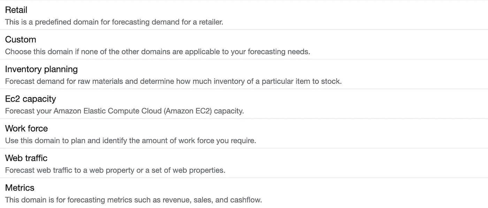

# AWS 上的三个令人惊叹的人工智能服务

> 原文：<https://betterprogramming.pub/three-stunning-ai-services-on-aws-51071c570170>

## 以及如何将它们应用到你的下一个应用中的想法


由 [fauxels](https://www.pexels.com/photo/top-view-photo-of-people-near-wooden-table-3183150/) 拍摄的照片

如今，机器学习正被应用于软件开发的许多领域。一开始，我们都对训练有素的模型如何识别图片印象深刻。但这只是起点。

然后就走偏了。有很多产品积极使用机器学习。最近发布的 [GitHub Copilot](https://github.com/features/copilot) 展示了人工智能如何帮助开发者。他们接受现成的智能代码完成和代码生成。

最好的部分是，我们不需要像过去那样持有博士学位就可以开始使用机器学习。许多平台通过 API 提供设计良好的解决方案。

让我们探索 AWS 的一些服务，看看我们如何让您的下一个应用程序由人工智能驱动。

# 预报

当企业对大量数据进行操作时，他们希望对这些数据做些什么。我们可以分析这些数据来发现模式和见解，还可以用它们来进行预测。

这对时间序列数据来说是准确的。AWS 有专门的服务。AWS [预测](https://aws.amazon.com/forecast/)被设计用于各种时间序列。对每个条目的强制要求是存在时间戳。



可能的预测域

该服务有一些预定义的培训和预测设置。这可以是零售销售、网站流量或库存计划。如果您有特定的需求，可以自定义域。

然后我们需要导入我们的数据，设置列，并开始训练。培训结束后，我们将收到我们领域的预测模型。

# 包含

AWS [领悟](https://aws.amazon.com/comprehend/)是一个自然语言处理服务。它可以从文本、句法和情感中识别关键短语。它在提供的文本上使用预先训练好的模型。此外，它可以找出文本的语言，并提取个人身份信息。

这项服务不需要额外的配置，随时可以使用。凭借其简单的 API，我们可以轻松地将其集成到应用程序中。你会如何使用它？

例如，如果我们需要确保文本不包含任何个人信息。或者当我们想看产品的评论并立即对负面评论做出反应时。

上面的例子展示了如何在 Python SDK 中使用 understand API。响应将包含情感摘要和分数。

对于这种特殊情况，情绪将是负面的，对它的评分将超过 0.99。我们可以将这一块集成到应用程序中。因此，当餐厅收到这样的差评时，我们可以立即通知客户成功团队。

# 重新认识

亚马逊在图像和视频识别方面取得了良好的进展。几年前，他们宣布了一项服务。它有许多特性和定制能力。

这项服务可以做标签、人脸识别、从图像中解析文本等等。它使用一组庞大的训练过的模型来完成不同的任务。


由 [Brooke Cagle](https://unsplash.com/@brookecagle?utm_source=unsplash&utm_medium=referral&utm_content=creditCopyText) 在 AWS 认可上拍摄的照片

我们可以使用 AWS 控制台来了解服务是如何工作的。上传图片后，我们在下一秒钟收到结果。处理完成的速度之快令人惊讶。

类似于 AWS 的理解，这个服务有一个简单的 API。几行代码，我们通过图像分析得到一个响应。这就是我们如何轻松地将图像识别应用到任何应用中。

这项服务的应用范围很广。如果我们需要自定义标签，Rekognition 会提供一个选项来训练您的模型。我们必须提供一个数据集，标记图像，然后开始训练。随着时间的推移，我们在 Rekognition 上获得了一个定制模型。

# 结论

像许多其他云提供商一样，AWS 在机器学习方面投入很多。每年开发者都乐于尝试新的服务。企业家产生了应用人工智能解决问题的新想法。

本文中的服务很容易上手。但是他们不是唯一的。他们有很多人。唤醒你的好奇心，探索它们吧！

```
**Want to Connect?**If you want to dip your toes into AWS, my book "[AWS Essentials](https://www.amazon.com/gp/product/B0BCHCYQWR)" is a great place to start with. This is the fastest way to familiarize yourself with AWS and understand the basics of cloud computing.
```