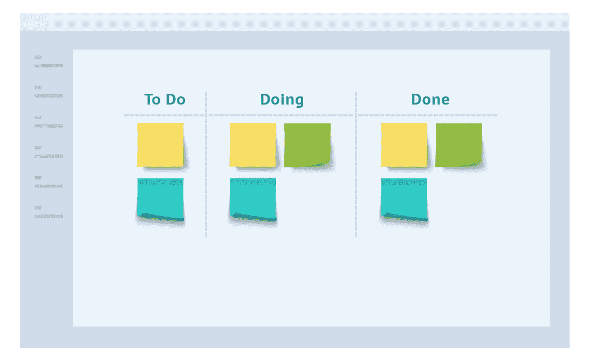
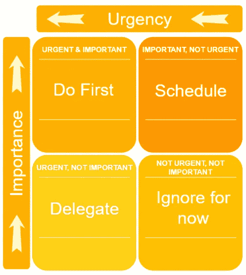

# 时间管理和优先级排序的三种技巧

> 原文：<https://betterprogramming.pub/three-techniques-for-time-management-and-prioritization-9df6dffe2ff1>

## 学习如何有效管理你的时间以获得职业成功

卢卡斯·布拉塞克在 [Unsplash](https://unsplash.com/search/photos/time-management?utm_source=unsplash&utm_medium=referral&utm_content=creditCopyText) 上的照片

> “我生命中最喜欢的东西不花钱。很明显，我们所有人最宝贵的资源是时间。”—史蒂夫·乔布斯

你最后一次考虑时间管理或优先级是什么时候？这通常不是人们积极思考的事情。然而，这是我们每天都在做的事情。从我们醒来的那一刻到我们上床睡觉的那一刻，我们不断地做出决定，并优先考虑我们下一步要做的事情。

在专业环境中，你会发现自己不断地对任务进行优先排序。会有一连串的电子邮件、会议邀请、聊天窗口、截止日期和待办事项，所有这些都在争夺你的时间和注意力。如果你能分清事情的轻重缓急，合理分配时间，迟早你会发现自己在公司的阶梯上步步高升。这通常是管理的一项重要技能。

# 入门指南

往往，最难的是迈出第一步；开始吧。人们很容易陷入日常生活的忙碌和没有结构的混乱的工作文化中。

> "明天通常是一周中最忙的一天。"—西班牙谚语

在这篇博客中，你将看到如何实现每一种技术并把它们结合起来，而不仅仅是介绍三种不同的时间管理技术。这会给你一套可以立即使用的工具。

# 列表

变得有条理和磨练你的时间管理技巧的第一个任务是了解和跟踪你所有未完成的任务。当列表很小的时候，不用写下来就很容易记住。然而，当你或你的团队有一个很大的任务列表时，你需要一种跟踪它们而不忘记任何事情的方法。

这就是为什么你必须列出所有未完成的项目，并简单地写下来。仅仅通过做这个任务，你就能确保你知道你所有的任务和它们相关的截止日期。

这可以是一张纸或一个项目的数字列表。我个人有几个不同的清单。我有个人待办事项清单，工作待办事项清单，团队待办事项清单。通常，当几个人受到影响或正在跟踪任务的进展时，使用在线列表是有意义的。我建议设立一个每个人都可以使用的看板。Trello 提供了一个简单而强大的数字看板软件:

 [## 特雷罗

### 无限灵活。非常容易使用。出色的移动应用。它是免费的。特雷罗记录一切，从…

trello.com](https://trello.com/) 

看板允许你定义代表工作状态的不同通道，你可以拖动你的项目，给每个人一个实时的视图。下面是看板板的一个例子:

digite.com 的问候

# 艾森豪威尔矩阵

如果你已经完成了前面的练习，你现在就知道你需要解决的所有问题。我们将把这个宇宙——所有不同的列表——称为你的工作积压。

我们现在可以处理这些积压的工作，对所有的工作项目进行分类和适当的优先级排序。方法之一是使用艾森豪威尔矩阵。

> “你可以拥有一切。只是不要一下子。”——奥普拉·温弗瑞

对于每一项，你需要仔细检查并做出两个选择。你需要决定它们是否紧急，或者是否重要。

如果一个项目是:

*   重要和紧急，那么它应该放在左上方的象限。
*   重要但不紧急，右上象限。
*   紧急但不重要，左下象限。
*   不重要也不紧急，右下象限。

根据每项任务的象限，您可以决定需要采取的行动。

对于那些单独开业并且没有人为你工作的人，你可能不能授权。在这种情况下，你可以先处理待办事项，然后再处理委托事项。另一个选择是考虑雇佣一个在线助手来帮助你。例如，像 [Upwork](https://www.upwork.com/hire/virtual-assistants/) 这样的平台。

# 优先处理紧急和重要的事情

艾森豪威尔矩阵允许根据优先级对任务进行分组，并确定应该分配给它们的高级行动。下一个任务是解决每个象限中的单个项目。

例如，看看紧急和重要象限。每一项都需要尽快解决。如何确定解决哪一个问题？首先，试着理解每一项都是关于什么的，并弄清楚完成每一项所涉及的工作。这可以让你知道每项任务需要多少时间。

[摄于](https://unsplash.com/@greenpjy123?utm_source=medium&utm_medium=referral) [Unsplash](https://unsplash.com?utm_source=medium&utm_medium=referral) 上的智妍公园

首先，尝试看看是否有任何快速成功的方法。这必须在任务级别上考虑，但也要考虑任务的分解。想象你有两项任务。一项任务可能需要一整天，另一项需要两个小时。最好从两个小时的任务开始，在进入更重要的任务之前把它做完。快速的胜利带来了良好的势头，增强了信心。

然而，你可能需要一些外界的输入来完成这个大任务，这需要你先发一封电子邮件或者打一个电话。这些行动比两个小时的小任务要快，如果提前完成，别人会在你进行另一项任务时向你发送你需要的信息。这也意味着一旦你完成了另一个任务，你就会准备好开始更大的任务，而不是无所事事地等待信息。

# 帕累托原则

最后要讲的是[帕累托原理](https://en.wikipedia.org/wiki/Pareto_principle)以及如何利用它为你服务。帕累托法则有很多名字，比如*80/20 法则*或者*关键少数法则*。这个原则本质上是说，对于给定的情况，80%的结果来自 20%的原因。

一个例子可能是 20%的媒体作者创作了 80%的(好的)内容。

知道了这个原理，就该学会应用了。让我们检查几个用例。

照片由[韩洲](https://unsplash.com/@indigofox?utm_source=medium&utm_medium=referral)在 [Unsplash](https://unsplash.com?utm_source=medium&utm_medium=referral) 上拍摄

## 用例 1: 20%的工作交付 80%的价值

根据艾森豪威尔矩阵和速赢，帕累托原则主要建议我们可以做 1/5 的工作，获得 4/5 的价值。这可能是通过仅仅处理积压工作的一个子集，或者通过部分地解决每个项目。也许你交付的工作处于草稿状态，而不是 100%完成。

## 用例 2: 20%的根本原因造成了 80%的问题

有时你可能会有一些任务似乎在重复。这可能是您一直在解决的问题类型，或者是造成大部分麻烦的同一群客户。

不管是什么，确定趋势并一劳永逸地解决问题是值得的。为了确定问题的根本原因，值得连续问五次为什么。最终的答案往往是问题的根本原因。

使用帕累托原则后，你就可以确定处理工作的最佳方式，以最大限度地利用你的一天、一周、一月或一年！

我希望你已经发现以上的一些或全部是有用的。希望你能把这些建议付诸实践，它们对你有用。每当你尝试一项新技术时，记得要坚持一段时间。掌握它需要一点时间。

如果你喜欢这篇博文，你可能也会喜欢:

 [## 用 Python 中的 PyAutoGUI 实现自动化 UI 测试

### 回归测试你的用户界面的一个快速简单的方法

towardsdatascience.com](https://towardsdatascience.com/automate-ui-testing-with-pyautogui-in-python-4a3762121973)  [## 你的投资组合回报是否反映了你所承担的风险？

### 了解如何优化您投资组合的风险回报状况

medium.com](https://medium.com/financeexplained/are-your-portfolio-returns-reflecting-the-risk-you-are-taking-36bfd84ef06a)  [## 如何在日常生活中使用敏捷

### 了解什么是敏捷，以及如何将它应用到你的生活中

medium.com](https://medium.com/swlh/how-you-can-use-agile-in-your-everyday-life-3d9f7a468ac3)