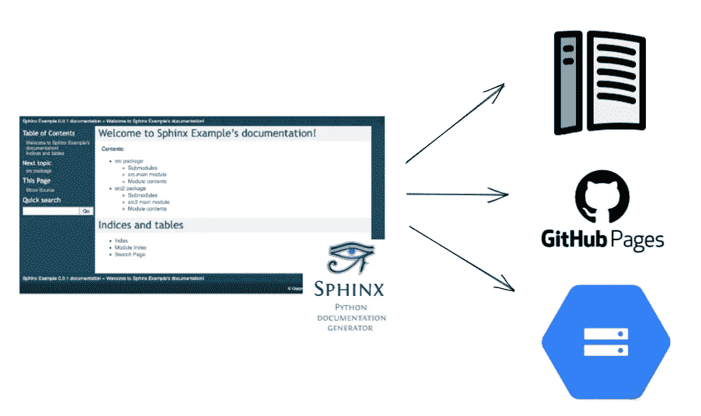
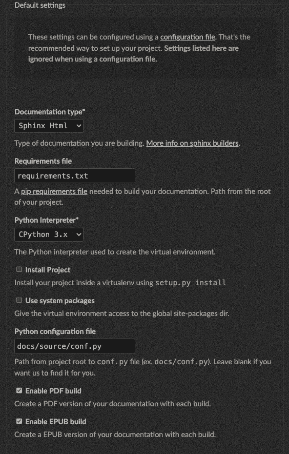
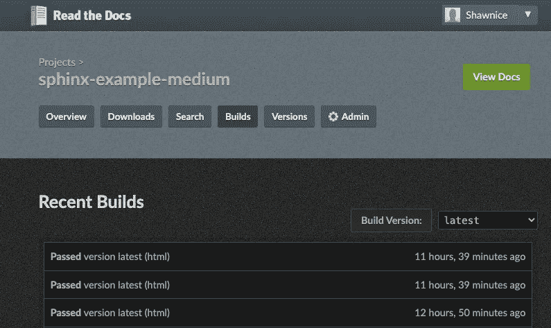

# 发布 Sphinx 文档的三种方式

> 原文：<https://betterprogramming.pub/three-ways-to-publish-sphinx-documentation-c276ffb22e5b>

## 与 GitHub 操作集成并自动发布



将 Sphinx 文档发布到三个不同的平台。

在之前的[文章](/quickly-generate-documentation-with-sphinx-cli-tools-99db0cb5994c)中，我们讨论了如何使用 Sphinx CLI 工具快速生成文档。在本文中，我将展示发布 Sphinx 文档的三种不同方式。因此，任何拥有该 URL 的人都可以查看您的文档。

我还将发布过程集成到 GitHub 动作中，这样发布过程将完全自动化。

# 发布到 GitHub 页面

GitHub Pages 是托管静态网站的好工具，例如 Sphinx 文档。我使用这个 GitHub 动作， [actions-gh-pages](https://github.com/peaceiris/actions-gh-pages) ，将我的文档部署到 GitHub 页面。

用起来真的很简单。您只需要提供您的文档的路径，例如`docs/build`，然后这个操作将帮助您处理剩下的步骤！

```
- name: Publish to GitHub Pages
  uses: peaceiris/actions-gh-pages@v3
  with:
    github_token: ${{ secrets.GITHUB_TOKEN }}
    publish_dir: docs/build
```

完成后，您可以从`https://<username>.github.io/<repository_name>/`查看发布的文档。

很简单，对吧？让我们转到下一个平台。

# 发布到 GCP 云存储

我推荐使用[upload-cloud-storage](https://github.com/google-github-actions/upload-cloud-storage)GitHub action 将您的文档上传到 GCS。使用此操作有三个步骤。首先，设置您的作业的权限，这样呼叫者就有权限访问 GitHub 机密。因为我也使用 [git-auto-commit-action](https://github.com/stefanzweifel/git-auto-commit-action) 进行提交更改，所以`contents`也应该设置为`write`。

```
permissions:
  contents: ‘write’
  id-token: ‘write’
```

第二，用[Google-github-actions/auth](https://github.com/google-github-actions/auth)认证 action，这样我们就可以上传文件到 GCS。最后，指定文档的目录和目标 bucket，例如`my-sample-bucket-123`。

```
- name: Gcloud Auth
  uses: ‘google-github-actions/auth@v0’
  with:
    credentials_json: ${{ secrets.GCP_CREDENTIALS }}
- name: Upload documentation to GCS
  uses: ‘google-github-actions/upload-cloud-storage@v0’
  with:
    path: ‘docs/build’
    destination: ‘my-sample-bucket-123’
```

下一步，我们需要公开`my-sample-bucket-123`下的所有对象。因此，人们可以在互联网上阅读文档。你可以在这里找到步骤。现在，您可以通过`https://storage.googleapis.com/<bucket-name>/build/index.html`查看您的文档。

但是，GCS 不支持自定义域。您可以在 GCS 前设置一个[负载平衡器](https://cloud.google.com/storage/docs/hosting-static-website#lb-ssl)。但这已经超出了本文的讨论范围，所以这里就不讨论了。

这是完整的工作流程。每当生成文档时，该工作流会自动将我们的文档发布到 GitHub 页面和 GCS。

# 发布到 ReadTheDocs

与其他两种方式不同，在您按照[的指令](https://sphinx-rtd-tutorial.readthedocs.io/en/latest/read-the-docs.html)将项目导入到 [readthedocs](https://readthedocs.org/) 之后，它会自动构建文档并在您更改存储库时触发构建。

导入项目后，需要进入`Admin` > `Advanced Settings`，在`Default settings`下，指定需求文件的路径和`conf.py`的路径，这样就可以正确的构建文档了。



当您在`Builds`选项卡下看到`Passed`时，意味着文档已经成功构建！点击`View Docs`查看文档。公共 URL 应该是`https://<project-name>.readthedocs.io`。



# 摘要

在上一篇文章中，我们构建了一个脚本来生成好看的文档，并将其与 GitHub 操作集成在一起。在本文中，我们演示了三种自动发布文档的方法。因此，现在我们有了生成和托管文档的完整管道！我希望这两篇文章对构建您的文档管道有所帮助。

您可以在这个[资源库](https://github.com/Shawnice/sphinx-example)中找到完整的示例。