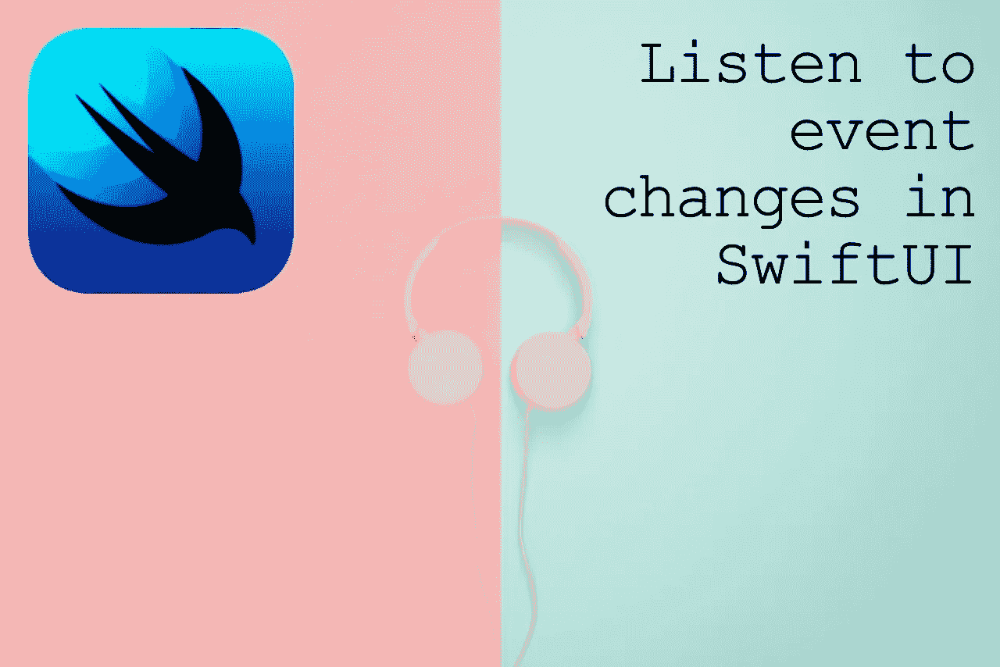
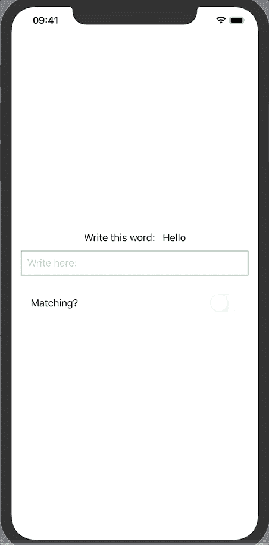

# SwiftUI 中对@State 变化做出反应的 3 种方式

> 原文：<https://betterprogramming.pub/three-ways-to-react-to-state-changes-in-swiftui-a30545c72361>

## 我们已经没有了。现在怎么办？



作者照片。

这就是我如何学会在 SwiftUI 控件中实现一个等效的`onChange`来更新其他的`@State`变量。

SwiftUI 发布将近一年后，我决定尝试一下。我开始动手实现基本的 UI 控件(如`Slider`或`TextField`)并学习如何操作视图状态。

我很快面临根据另一个`@State`变量的变化更新一个`@State`变量的挑战。

是的，我们知道的属性观察器(如`didSet`或`willSet`)在`@State`变量中不起作用。

经过一些研究(花费的时间比我预期的要长)，我学会了三种方法:

1.  UI 控件的具体回调:`onEditingChanged`。
2.  绑定变量。
3.  利用`[Combine](https://developer.apple.com/documentation/combine)`框架。

下面，我将描述一个具体的简单用例:检查一个`TextField`值是否匹配一个预定义的字，并通过切换开关开/关来显示(该控件称为`Toggle`)。



UI 框架代码:

# onEditingChanged

根据 Apple 的开发者文档，这个回调在三个控件的 inits 上可用:`TextField`、`Slider`和`Stepper`。

```
TextField:
init(_:text:onEditingChanged:onCommit:)Slider:
init(value:in:onEditingChanged:)Stepper:
init(_:onIncrement:onDecrement:onEditingChanged:)
```

我们在这里可以做的是用这个参数增强`TextField`的初始化:

这种方法的一个可能的缺点是用户按下键盘的`return`键后会调用`onEditingChanged`。

但如果你不希望这种情况实时发生，这是一个可行的解决方案。

# 绑定变量

`Binding`是一个属性包装器类型，它可以读写一个真实源所拥有的值。

该引用使视图能够编辑依赖于该数据的任何视图的状态。

我们可以用它来模仿 UIKit 方法中的属性观察者(getter/setter):

我不得不说，我并不特别喜欢这种方法，因为在呈现部分声明绑定和业务看起来并不干净。

# 组合框架

通过组合事件处理操作符，使用`Combine`框架定制异步事件的处理——在我们的例子中，是监听状态变化事件。

在 Combine 的词汇表中，我们有:

*   `ObservableObject` —一种带有发布者的对象类型，在对象更改前发出。
*   `ObservedObject` —声明对符合`ObservableObject`协议的引用类型的依赖。它是一个属性包装器类型，订阅一个可观察对象，并在可观察对象改变时使视图无效。
*   `Published` —发布用属性标记的属性的类型。

这种方法通过从视图中提取业务逻辑，迫使我们(以一种好的方式)拥有一个更清晰的代码。

创建视图模型:

在所需视图中使用它:

我不知道你怎么想，但我不得不说我更喜欢第三种选择，因为我对数据流有更多的控制，代码更容易维护。我需要在真实世界的用例中使用它。