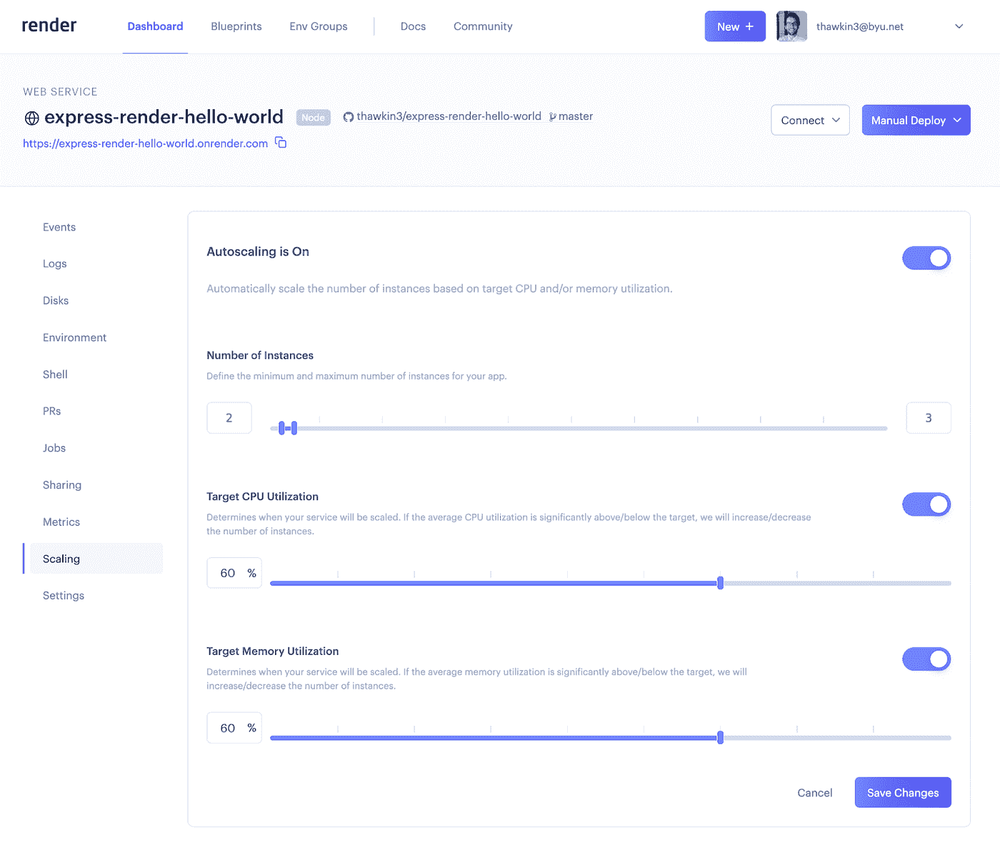
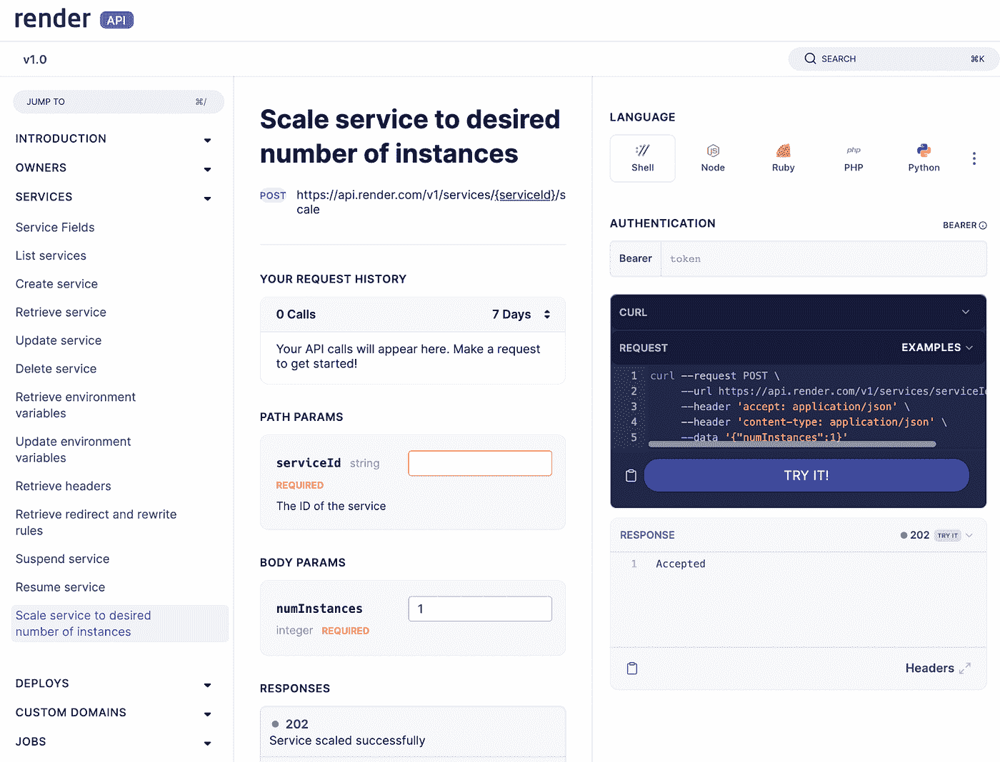

# 使用 Render 缩放应用程序的三种方式

> 原文：<https://betterprogramming.pub/three-ways-to-scale-your-apps-with-render-42f5a6d1b9cf>

## 使用蓝图规范、渲染 API 和仪表板



应用程序渲染面板中的缩放选项

当您的应用程序遇到高流量或高利用率时，您需要扩展您的服务来处理该负载。

可以垂直或水平扩展，也可以两者兼而有之！垂直扩展意味着让单个资源变得更大或更强大。例如，您可以向服务器添加更多的 CPU 或 RAM。水平扩展意味着创建同一服务的多个实例。例如，您可以部署三个服务器副本，而不是一个，然后将它们都放在一个负载平衡器后面，该负载平衡器负责将流量路由到每个副本。这两种缩放都可以手动或自动完成(自动缩放)。

通常，公司不会在自己的服务器上托管应用程序，而是选择在云中托管。 [Render](https://render.com/) 是一个统一的全栈开发平台，可以轻松托管您的应用，无论是静态网站、web 服务还是 cron 作业。此外，使用渲染进行缩放轻而易举。在这篇文章中，我们将探索三种方法来[用 Render](https://render.com/docs/scaling) 扩展你的应用。

# 选项#1:使用渲染面板

第一个选项是使用渲染面板缩放服务。创建 web 服务后，您可以导航到缩放选项卡来配置缩放设置。

当自动缩放关闭时，您可以通过指定实例的数量来手动放大或缩小 UI 中的应用程序。例如，您可能通常只需要服务的一个实例，但是本周您预计由于即将到来的事件，流量会出现高峰。您可以选择将服务扩展到三个实例来处理增加的负载。当事件结束时，您可以将服务缩减到一个实例。


手动缩放选项

如果您可以预见到负载即将发生的变化，手动伸缩会很有效，但是您可能并不总是正确地知道您需要多少个实例。猜测过高或过低都可能导致服务利用不足或过度利用，这两种情况都不理想。

自动扩展通过基于 CPU 和/或内存利用率在最小和最大实例数量范围内自动扩展，消除了猜测。

在渲染面板中，可以使用切换开关启用自动缩放。然后，您可以设置最小和最大实例数，以及 CPU 和/或内存利用率的目标。然后，基于这些目标，你的应用将根据需要自动放大或缩小。多好啊！


自动缩放选项

# 选项 2:使用渲染 API

扩展服务的第二个选择是使用[渲染 API](https://render.com/docs/api) 。一旦您在帐户设置中生成了 API 令牌，您就可以开始使用 Render API 进行请求了。



用于扩展的 API 端点

一个 [API 端点](https://api-docs.render.com/reference/scale-service)允许您将服务扩展到指定数量的实例。您需要做的就是向端点发出 POST 请求，提供您的 API 令牌和`serviceID`和`numInstances`参数，如下所示:

```
curl --request POST \
 --url https://api.render.com/v1/services/{serviceId}/scale \
 --header 'accept: application/json' \
 --header 'authorization: Bearer {API_Token}' \
 --header 'content-type: application/json' \
 --data '{"numInstances":2}'
```

手动发出 API 请求显然是一个手动缩放的过程，但是 API 应该以编程方式使用。如果您设置了一些额外的[监控或警报](https://render.com/docs/datadog)，您可以通过编程调用这个 API 端点来根据需要放大或缩小您的应用程序，而无需任何人工干预。然而，这可能有些矫枉过正，因为 Render 已经有了监控和自动缩放基础设施来为您完成这项工作。

# 选项 3:使用蓝图规范

我们将考虑的第三个选项是使用[蓝图规范](https://render.com/docs/blueprint-spec)来扩展您的服务。蓝图规格是使用 YAML 文件编写的代码 (IaC)的[基础设施，这些文件包含用于配置的键值对。IaC 的主要好处是它允许您通过代码而不是通过仪表板来创建和管理服务。这样，您可以将您的配置保持在源代码控制之下，标准化您的设置，并轻松地部署新的基础设施变更。](https://render.com/docs/infrastructure-as-code)

Render 的蓝图规格提供了两个选项来缩放您的应用程序。如果你不想使用自动缩放，你可以指定一个`numInstances`键和一个数值，如下所示:

```
numInstances: 3
```

如果您确实想在您的服务中利用自动伸缩，您可以像这样配置`scaling`属性:

```
scaling:
  minInstances: 1
  maxInstances: 3
  targetMemoryPercent: 60
  targetCPUPercent: 60
```

这些选项与您在渲染面板中看到的选项相同，但现在您不是在 UI 中手动设置它们，而是将基础架构编写为代码。整洁！

# 结论

使用 Render 缩放应用程序非常简单。无论您喜欢通过 API 或蓝图规范在 Render Dashboard 中扩展应用程序，Render 都能满足您的需求。

感谢您的阅读，祝您编码愉快！