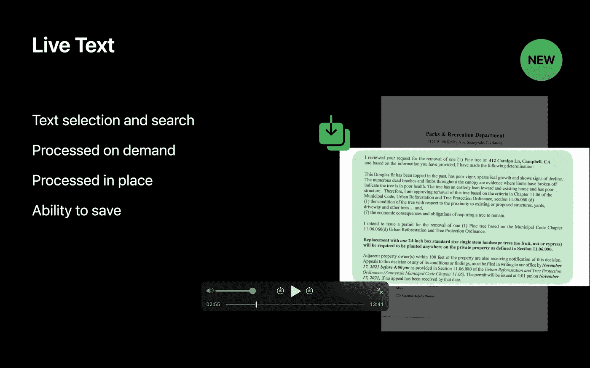
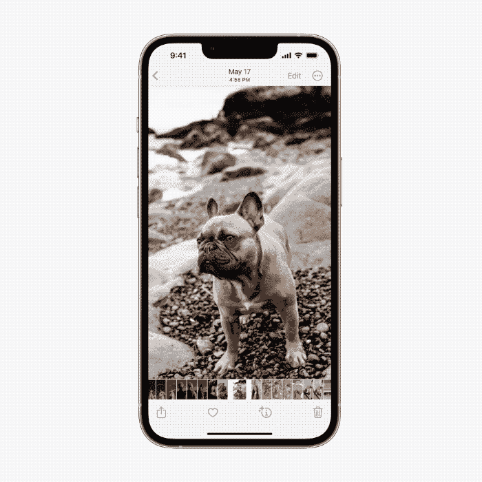

# 通过 iOS 16 APIs，苹果为混合现实开发奠定基础

> 原文：<https://betterprogramming.pub/through-ios-16-apis-apple-lays-the-foundation-for-mixed-reality-development-affc2c3d439e>

## 不用说这个词，苹果正在准备开发人员为其期待已久的 AR/VR 设备开发应用程序

来源:苹果

当苹果公司的 WWDC 2022 主题演讲 kickstarted 时，世界急切地等待着关于备受谈论的混合现实耳机的一些公告。

至少，一个类似于 M1 的开发人员 DTK 的工具包是被期待的。更有甚者，因为有很多关于 [realityOS](https://twitter.com/ParkerOrtolani/status/1530731346716409864?ref_src=twsrc%5Etfw%7Ctwcamp%5Etweetembed%7Ctwterm%5E1530731346716409864%7Ctwgr%5E%7Ctwcon%5Es1_&ref_url=https%3A%2F%2Fmashable.com%2Farticle%2Fwhat-to-expect-from-apple-wwdc-2022) 可能发布的传言。但是另一个 WWDC 活动却没有提及苹果最雄心勃勃的项目。

更让人不解的是？今年，`RealityKit`和`SceneKit`框架几乎没有任何更新。相反，迎接我们的是 M2 驱动的 MAC 电脑、iPadOS 的舞台管理器、改进的 iOS 以及 Carplay 的重大升级。

这款混合现实耳机曾预计在 2020 年发布，最终被推迟到 2023 年，现在只是进一步推迟了——2024 年发布。

在苹果的辩护中，谨慎的进展是可以理解的。为了让他们的新生产品获得大规模采用，它需要在他们的生态系统中进行更紧密的集成，并让开发人员兴奋地为元宇宙开发产品。

由于他们在连续性方面的巨大进步，今天苹果的生态系统比以往任何时候都更加统一。如果不提到 iOS 16 的新功能，我会很疏忽，该功能可以让你将 iPhone 用作 Mac 的网络摄像头(看起来这是对苹果耳机如何与 iPhone 一起操作的测试)。

与此同时，尽管没有 realityOS 开发的消息，但 iPhone 制造商一直在对其 API 和框架进行重大增强，以塑造开发者的混合现实未来。

让我们看看 WWDC 2022 期间发布的一些新 API。其中一些是众所周知的，并在 WWDC 22 期间受到了极大的关注。然而，从 AR/VR 开发的角度来看，这些 API 在活动中扮演的角色并不明显。

# Live Text API 和升级的 PDFKit，用于扫描媒体中的文本

在 iOS 15 中，苹果引入了动态文本功能，从图像中提取文本。在 iOS 16 中，他们通过发布一个实时文本 API 来轻松从图像和视频帧中抓取文本，从而将事情推向了一个新的高度。作为`VisionKit`框架的一部分，`DataScannerViewController`类允许您配置各种扫描参数。在幕后，Live Text API 使用`VNRecognizeTextRequest`来检测文本。

乍看之下，Live Text API 特性就像是注射了类固醇的谷歌镜头。然而，只要想想当苹果的下一个大玩意出现在你眼前时，它会带来什么样的可能性。对于初学者来说，想象转动你的头来用你的眼睛快速提取信息。是的，在 iOS 15 中已经可以通过 AirPods 的空间感知来利用`CMHeadphoneMotionManager`进行头部跟踪。现在，将 iOS 16 新的个性化空间音频融入其中，我已经可以看到 VR 机制的展开。

同样，`PDFKit`框架中的两个增强功能——解析文本字段和将文档页面转换为图像的能力——将在构建丰富的 AR 镜头体验中发挥重要作用。

来源:WWDC 2022 视频 PDFKit

为了确保苹果的混合现实设备不仅仅是你脸上的智能手表，提供一个与文本、图像和图形交互的工具集是很重要的。

随着两个强大的图像识别 API 的推出，我认为 iPhone 制造商正走在正确的道路上。一条通向具有丰富交互界面的 AR/VR 应用的道路。

# 听写和更好的语音识别

暂时忘记文本和图像，iOS 16 还改进了听写功能，让用户在语音和触摸之间无缝切换。

所以，你可能正在走廊里走着，可能想在手机上快速编辑一条短信。在 iOS 16 中，你可以快速使用语音轻松修改一段文字。

想要更多吗？`Speech`框架有了一点改进——能够从`SFSpeechRecognitionRequest`到`addsPunctation`切换标点符号。我很乐观，这将带来丰富的通信应用，因为它已经在 FaceTime 通话中的直播字幕中找到了自己的方式。

从混合现实的角度来看，这些是巨大的变化。使用语音输入文本将减少我们在虚拟世界中对键盘的依赖。苹果还使用新的`App Intents`框架，让 Siri 更容易集成到我们的应用程序中。

# 对用户界面的更好控制

在 iOS 16 中，宣布了大量新的 UI 控件——主要是在 SwiftUI 中——这是一个声明性框架，有望成为在所有苹果平台上构建应用的一站式解决方案。

在 SwiftUI 的众多特性中，`WidgetKit`框架的变化最能激起我的兴趣。有了 iOS 16，开发者现在可以为锁屏构建小工具了。此外，使用相同的代码，您也可以为不同的手表表面构建小部件。我们还可以在`WidgetKit`中创建实时活动，为用户提供实时更新。

我真的觉得 widgets 将成为应用程序的未来——至少在 AR/VR 领域是如此，因为用户会希望在不打开应用程序的情况下消费信息和浏览内容。

除 WidgetKit 之外，我们还推出了一个新的`WeatherKit`框架，帮助您的应用和小部件更新最新的天气信息。[让我们来看一下](https://twitter.com/dejager/status/1534634067953876992)它在锁定屏幕上会是什么样子。

除了框架之外，SwiftUI 还为我们提供了许多小型控件——比如`Gauges`,它们可以与小部件完美集成。然后是`[SpatialTapGesture](https://developer.apple.com/documentation/swiftui/spatialtapgesture?changes=latest_minor)`——一种在 SwiftUI 视图中跟踪点击位置的手势。

我特别喜欢让您将 SwiftUI 视图转换成图像的`ImageRenderer` API。再加上`Transferable`协议，跨应用程序拖放媒体元素将变得更加简单——因为我们现在在 SwiftUI 中有一个原生的 share sheet 控件。下面我们来看看拖放操作是如何让从照片中剪切主题并在其他应用程序中分享变得如此容易的:

来源:苹果

为了构建混合现实耳机的交互式应用，我们与文本、图像、语音、图形和其他形式的媒体进行交互的方式需要变得更加高效。

我认为苹果已经在这个方向上迈出了值得注意的步伐，不仅仅是通过上面提到的 UI 和手势控制，还通过升级的`SharedPlay` API、新的`Shared With You`框架和`Collaboration` API。

这些看起来都像是苹果期待已久的耳机的有前途的组成部分。

# RoomPlan API 和后台资产框架

`Background Assets`框架是另一个还没有得到太多关注的工具。引入它是为了处理跨不同应用程序状态的大文件下载，我认为它的可能性超出了这个实用程序。

通过从云中下载 3D 资产，我们可以快速构建和发布体积更小的增强现实应用。

类似地，`RealityKit`框架也没有得到任何显著的改变。但是苹果悄悄地发布了一个新的 RoomPlan API。

由 ARKit 6(今年确实得到了一些显著的改进)提供支持，Swift-only API 为扫描房间和构建 3D 模型提供了开箱即用的支持。

现在，人们可以将 RoomPlan API 视为对象捕捉 API 的扩展，但从 AR/VR 的角度来看，考虑到苹果的混合现实耳机将拥有激光雷达传感器和多个摄像头，RoomPlan 将成为开发者的游戏规则改变者。预计会有很多让你重建房屋的 AR 应用。

虽然这些是我认为将很好地适应混合现实未来的主要 API，但`Spatial`是另一个新的框架，它支持使用 3D 数学图元。它可能会在处理虚拟空间中的图形方面证明它的金属。

最终，苹果对其 AR/VR 耳机计划只字未提，但他们今年发布的新 API 将在元宇宙开发的所有环节中发挥关键作用。

重要的是让开发人员做好准备，为当今的新生态系统开发应用。毕竟，一个产品要想被广泛采用，需要有一个成熟的应用生态系统——这需要开发人员的参与。