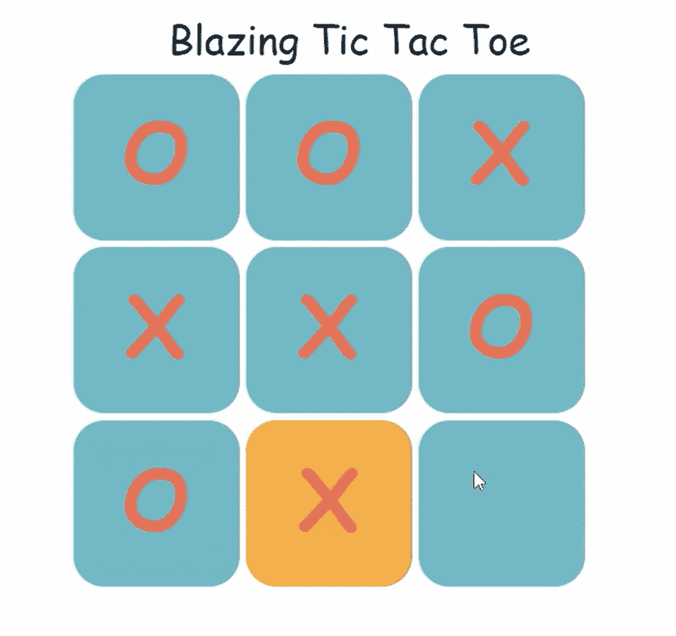
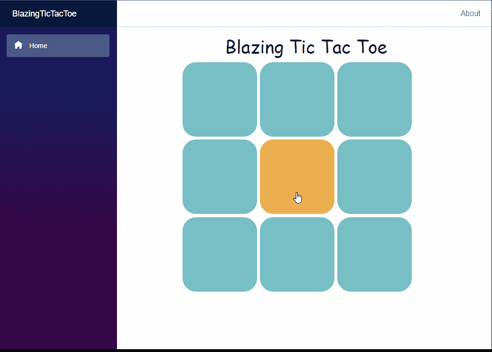
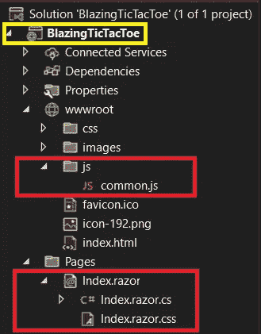
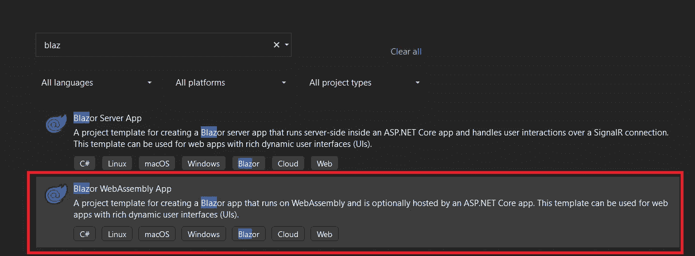
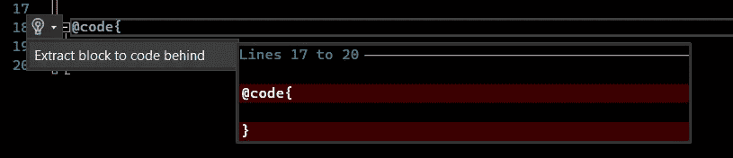
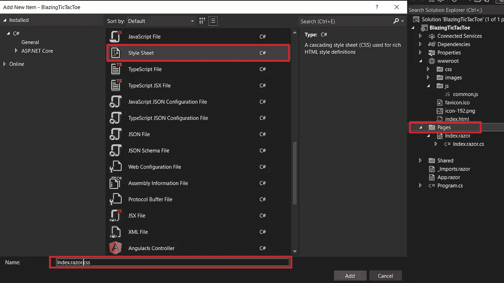
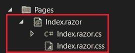
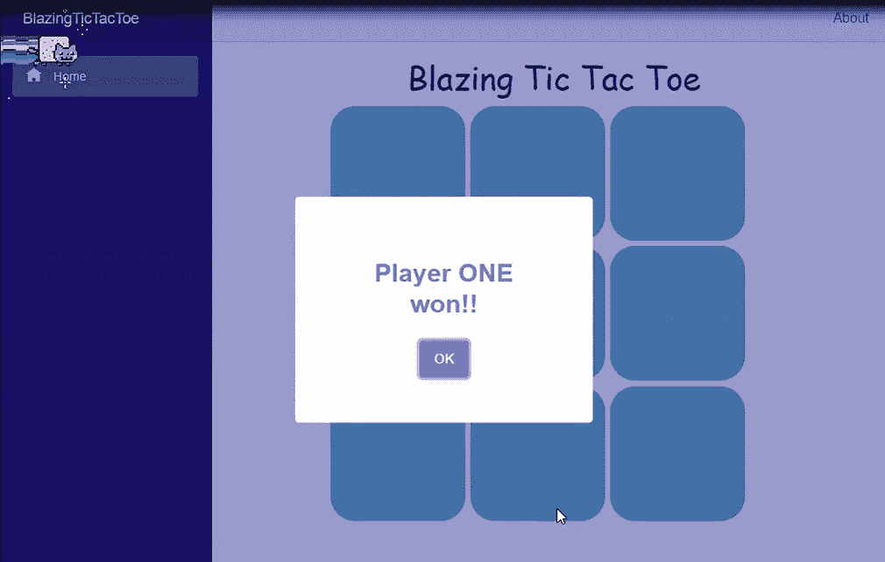
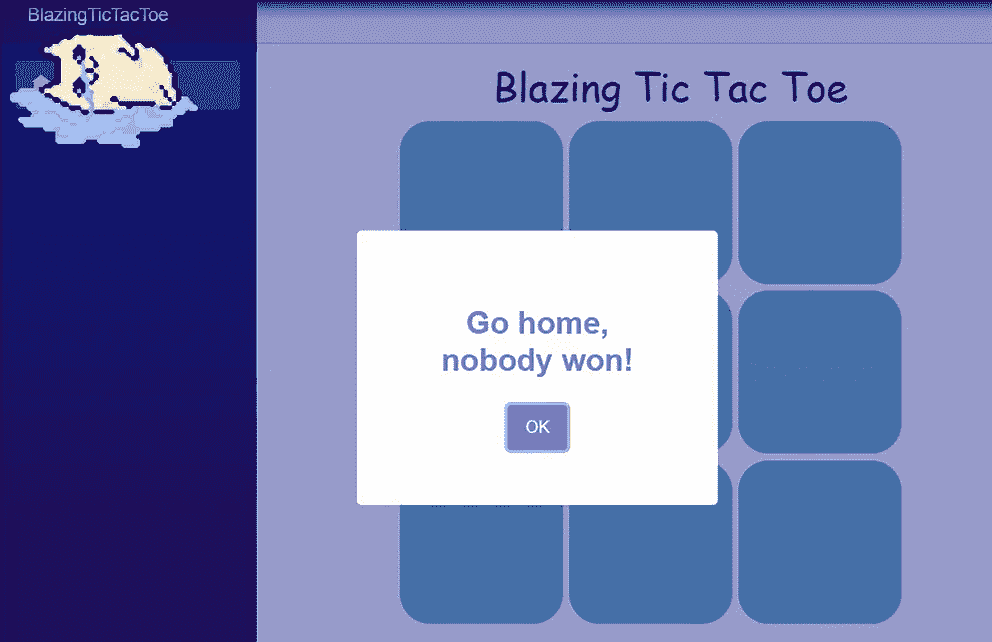

# 使用 C#和 JavaScript 在 Blazor 中构建一个井字游戏

> 原文：<https://betterprogramming.pub/tic-tac-toe-game-in-blazor-83a5763b5fac>

## 设计一个简单的游戏，展示你的网络开发技能

里卡姆·帕尔卡的井字游戏

# 演示

这是我们将在本文中构建的游戏的演示。如果你希望通过添加新的样式/验证来为这个项目做贡献，你可以去我的 [GitHub 库](https://github.com/RikamPalkar/Blazing-Blazor/tree/main/Projects/BlazingTicTacToe)。

演示

有两种方法可以实现这一点:我们可以完全使用 CSS，或者我们可以用 C#编写逻辑。嗯，我更喜欢 C#。我想演示 JavaScript 如何与 Blazor 集成。

在进入正题之前，我们先给这款应用起几个很酷的名字。“燃烧的井字游戏”怎么样？

# 做井字游戏我们需要什么？

让我给你一个 50000 英尺的概述。我们需要一个 razor 组件，CSS，C#代码，以及一个 JavaScript 文件来处理 JavaScript 之类的东西。仅此而已。

注意:JavaScript 文件进入`wwwroot`文件夹。

图 1:燃烧的井字游戏的文件结构

第一步:打开 visual studio，选择 Blazor WebAssembly App，如下图:

图 2:创建“Blazor WebAssembly 应用程序”

# Index .剃刀

首先，让我们将所有代码放在一个单独的文件中，也就是放到`Index.razor.cs`中。这里有一个简单的技巧来实现这一点。

*   您会发现文件中有一个部分写着`@code {`，单击灯泡图标或简单地单击(`Ctrl + ‘.’`，然后选择“提取代码块以隐藏代码”，参见图 3。

图 3:提取要隐藏的代码块

现在`Index.razor`只会有一个 UI 组件，所有的游戏逻辑都写在代码隐藏文件 `Index.razor.cs`里。

*   在第 2 行，我们注入了`IJSRuntime`，稍后我们将在逻辑中使用它来调用 JavaScript 方法。
*   我们需要在屏幕上添加九个方框。我们可以简单地用 for 循环来实现。通过九次创建一个 div 循环。
*   注意:在第 7 行，我们循环遍历名为“board”的数组该板是一个字符串数组，将保存“X”或“o”。一旦我们进入实际代码，这一点就很清楚了。
*   第 11 行有一个`OnClick`事件，它告诉我们哪个框被选中了。我们需要这个指数来跟踪获胜的组合。

*代码片段 1: Index.razor*

现在，游戏真正的面包和黄油是:逻辑。

# index . Razer . cs

## 佐料

*   `string[] array`:为了保存九个盒子的值，我们称之为“board”
*   字符串变量:为了表示可能是“X”或“O”的符号，我们称之为 player
*   存储获胜的组合:只有八种组合可以赢得游戏，我们可以简单地硬编码这些值。姑且称之为`winningCombos`。

## 逻辑

现在我们有了材料，我们需要创建一个名为`SquareCliked`的方法，它是 OnClick 事件的处理程序。来自代码片段 1，第 11 行。

我们所要做的就是循环通过`winningCombos`来检查我们的棋盘[]是否符合获胜的组合。如果是，我们将使用 JavaScript 显示一个漂亮的警告。

我们还需要在游戏结束后重置游戏。简单的重置`board[]`阵。

在我们跳到 JavaScript 之前，让我告诉你这个游戏的逻辑:

*代码片段 2: Index.razor.cs*

# JavaScript

您一定想知道第 34 行和第 41 行上的那些东西是什么？这就是我们所说的使用 JSRuntime 的 JavaScript 方法。

当我们调用 JS 时，有两种情况:

*   当一号或二号玩家获胜时。
*   如果比赛打成平局。

首先，转到`wwwroot`，创建一个名为`js`的新文件夹，在文件夹中，添加一个新的 JavaScript 文件，命名为`common.js`。有两种方法:

*   `ShowSwal`表示表现出甜蜜的警惕。在代码片段 2 的第 34 行，我们将这个方法名作为参数，所以`JsRuntime`寻找我们指定为参数的同一个方法。
*   在代码片段 2 的第 41 行，我们将这个方法名指定为一个参数。

*代码片段 3: common.js*

现在让我们将 JavaScript 与 Blazor 应用程序集成起来。

打开`wwwroot`文件夹下的`Index.html`。在 head 标签中，添加这三个脚本标签。

*代码片段 4:向项目添加 Sweet alert CDN。*

为了向您展示正确的位置，这里是整个`index.html`。这就是你完成修改后的样子。遵循以下代码片段中的第 13、14 和 15 行:

代码片段 5:Index.html

# CSS

我们差不多完成了，但是除非我们有一些 CSS，否则还没有完成，对吗？如果您还记得代码片段 1，我们已经在 div 中添加了一些类。让我们实际上在一个单独的 CSS 文件中编码这些类。

下面是创建 razor 专用 CSS 文件的技巧。只需点击名为“页面”的文件夹，说“添加新项目”，然后选择样式表。这里你必须给你的剃刀文件相同的名字。对于我们的例子，我们将命名为`Index.razor.css`。请参考下图:

图 4:添加特定于组件的 CSS

现在您将看到新添加的 CSS 是如何被自动分配到 razor 组件的正下方的。

图 5:特定于组件的 CSS

这是带有 flex 和 hover 基本属性的 CSS。

*代码片段 6: Index.razor.css*

让我们看一些实际的快照。

炽热的井字游戏

好吧！这就是你要做的。使用这个项目来理解 Blazor 工作模型的一些基本原理。

# 结论

现在我们知道如何开发这样的小游戏，我们知道如何将 JavaScript 集成到 Blazor 应用程序中，现在我们知道如何将代码和 CSS 添加到单独的文件中，而不是将它们都放在一个 razor 文件中。我希望你喜欢这场表演。

如果你想和我合作，可以在 [GitHub](https://github.com/RikamPalkar/Blazing-Blazor/tree/main/Projects/BlazingTicTacToe/BlazingTicTacToe) repository fork 获得源代码。