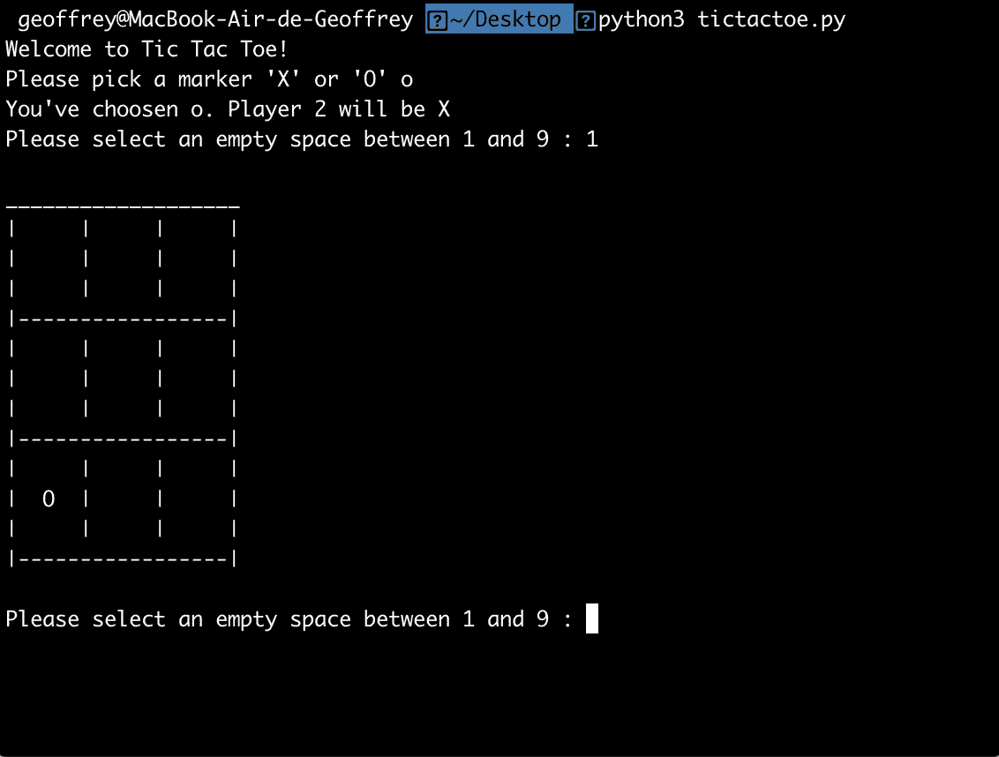

# 用 Python 构建井字游戏

> 原文：<https://betterprogramming.pub/tic-tac-toe-with-python-8fb6d666b13f>

## 一个有趣的命令行游戏


图片由 PIRO4D 来自 Pixabay

遏制时间可能会很长。在法国，对我来说是从 3 月 13 日开始的，这似乎只是一个开始。

所以为了消磨时间，我们用 Python 搭建一个多人井字游戏，不需要库。

我在这里建议的是试着创建你自己的函数，只是通过阅读它们的目的。如果你遇到任何麻烦，不要犹豫，快速看一下我是如何制作该功能的，然后回到你的编辑器中自己尝试。无论如何，如果需要，完整的代码可以在文章的底部找到。

为了玩我们的游戏，我们需要一些函数。首先要做的是总结我们的需求。

井字游戏是在棋盘上玩的。我们的第一个函数将是一个`display_board`函数。然后，我们需要问玩家他们是想用十字(X)还是圆(O)。我们得到了第二个函数。

我们还需要玩家放置标记(第三个功能)。但是在放置它之前，用户必须选择将它放置在哪里(第四个功能)，并确定这个位置是否可用(第五个功能)。

我们还想在每次放置标记时检查是否有人赢了(第六个功能)或棋盘是否已满(第七个功能)。

最后，我们想要一个回放功能。因为我们都有时间，如果我们可以尽情地玩而不用重新启动程序，那就太好了。

第一个函数将被称为`display_board`。我们将创建一个包含数字小键盘的空白板。玩家选择后，这些数字将被 X 或 O 代替。

玩家的选择将被存储在一个包含十个项目的列表中(只是因为项目编号 0 不能是用户的选择)。这个列表将在主程序中定义，看起来像这样:`board = [‘#’,‘#’,‘#’,‘#’,‘#’,‘#’,‘#’,‘#’,‘#’,‘#’]`。

该函数将棋盘列表作为参数，并用玩家的选择或空格替换`blankBoard`中的箱子编号。

第二个函数将询问一号玩家他们想要哪个标记。选项可以是 X/x 或 O/o。如果用户做了另一个选择，程序必须重新请求输入。

这里，我们简单地使用了一个`while True`语句，如果输入与可能性匹配，它将通过返回退出。注意，我们正在应用输入`if player1.upper() == ‘X’:`以避免双重检查。

第三个功能是`place_marker`。这个很小。

```
def place_marker(board, marker, position):
    board[position] = marker
    return board
```

我们只是传递棋盘列表、标记和选择的位置。该函数将把标记分配给我们的列表，替换给定位置的#字符。

此后，我们的两个函数都将向玩家询问位置，并检查所选择的位置是否为空。这两个功能是联系在一起的，这就是为什么我把这两个放在一起。

首先，`space_check`函数会收到两个`args`，板单和持仓。如果字段号`position`等于`#`，则返回`True`。这意味着空间是空闲的。如果不相等，这意味着这个场已经玩过了，所以返回`False`。

接下来，`player_choice`函数将板作为`param`。它要求用户做出选择。只要所选的位置不是空闲的，它就会一直要求用户输入有效的字段。最后，它返回用户的选择。

只剩下三个功能:棋盘满了吗？有人赢了吗？你想再玩一次吗？

```
def full_board_check(board):
    return len([x for x in board if x == '#']) == 1
```

问题“董事会满员了吗？”可以用上面的代码来检查。

我们在这里使用一个带有`if`语句的综合列表。我们所做的是解析 board 列表，并将所有匹配 hashtag (#)字符的项目提取到一个列表中。然后我们计算这个列表的长度，如果等于 1，我们返回`True`(即我们的板子满了)；如果没有，我们返回`False`。

下一个要检查的是是否有人赢得了游戏。我很确定它可以改进。我们只是检查我们是否有一条线或对角线有相同的标记。两个必需的参数是纸板列表和我们想要检查的标记。

我们在主程序之前的最后一个函数，只是询问用户是否想再玩一次。

```
def replay():
    playAgain = input("Do you want to play again (y/n) ? ")
    if playAgain.lower() == 'y':
        return True
    if playAgain.lower() == 'n':
        return False
```

我们完成了我们的功能。现在是时候将所有这些实现到我们的主程序中了。

只有当程序直接运行时，我们才运行它。如果我们从另一个 Python 脚本加载该函数，那么上面的`if`语句下面的内容将不会被执行。要了解关于内置变量`__name__`的更多信息，您可以在这里查看示例:[https://www . guru 99 . com/learn-python-main-function-with-examples-understand-main . html](https://www.guru99.com/learn-python-main-function-with-examples-understand-main.html)

[https://gist.github.com/30d4d2e378f2f0d671ccd59f7a2c99d2](https://gist.github.com/30d4d2e378f2f0d671ccd59f7a2c99d2)

我们需要什么？也许是一个我们称之为`i`的计数器。这个将用于确定哪个玩家在玩，使用模函数:`if i % 2 =` = 0，我们知道该轮到玩家二了。

接下来，我们要求用户使用功能`player_input`选择他们想要的标记。不要忘记这个函数返回两个值，我们将它们存储在`players`变量中。

我们还需要从一个空的董事会列表开始，它是由语句`board = [‘#’] * 10`定义的。

我们准备好出发了。我们从一个`while True`循环开始，这个循环从我们检查电路板是否已满开始。如果没有满，我们在第二个`while loop`进入。我们可以把它分成五块:

1.  我们要求用户输入:
    `position = player_choice(board)`
2.  我们决定谁在玩:

```
if i % 2 == 0:
marker = players[1]
else: marker = players[0]
```

3.我们放置标记并向玩家显示棋盘，然后我们增加计数器`i`来切换玩家:

```
# Play !
 place_marker(board, marker, int(position))
 # Check the board
 display_board(board)
 i += 1
```

3.我们检查是否有人赢了:

```
if win_check(board, marker):
 print(“You won !”)
 break
 game_on=full_board_check(board)
```

4.最后，我们请求重播。如果用户想再玩一次，我们重新初始化我们的棋盘和计数器变量，然后回到我们的第一个`while True`循环。

现在我们的代码已经可以工作了，你也可以开始玩了。您只需要将全部代码粘贴到一个`.py`文件中，并使用 Python 命令运行它。
以下是您将获得的输出:



TicTacToe 游戏概述

所有这些教程都是在观看一个精彩的 Udemy 课程[完整的 Python 训练营](https://www.udemy.com/course/complete-python-bootcamp/)时完成的。

您可以在 GitHub gist 中找到完整的代码:

我希望你喜欢这个教程，并且这个井字游戏会在这个特殊的时期给你带来快乐。

感谢所有的评论。