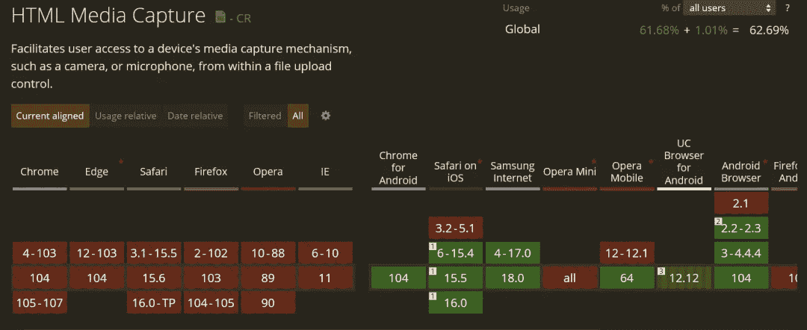

# TIL:你可以用 HTML 访问用户的摄像头

> 原文：<https://betterprogramming.pub/til-the-html-capture-attribute-is-rad-901d1cd50b28>


作者图片

前几天我偶然发现了一个从未听说过的很酷的 HTML 属性:`[capture](https://developer.mozilla.org/en-US/docs/Web/HTML/Attributes/capture)`。所以我决定制作一个视频和博客。

如果你喜欢，这里有一种视频格式:

您可以将`capture`属性放在文件类型的输入上，您可以给它一个值“`user`或“`environment`”。

关于 capture 属性的有趣之处在于，用户可以通过移动设备访问您的网站。如果他们与输入交互，而不是打开默认的文件拾取器，它实际上会打开他们的一个摄像头。它可能是前置摄像头，也可能是后置摄像头，具体取决于值。

如果您将该值设置为“`user`，它将使用面向用户或前置摄像头和/或麦克风。如果您将它设置为“`environment`”，它将使用面向外或面向后的摄像头和/或麦克风。

为了亲自测试，我创建了一个`index.html`文件，如下所示:

HTML 中唯一相关的部分是两个输入。它们都有一个捕获属性，都有一个接受属性。一个设置为用任何类型的视频捕捉“`environment`”。另一个设置为用任何类型的图像捕捉“`user`”。

在桌面上，capture 属性不会做任何有趣的事情。当我点击输入时，它会打开文件选择器。

但是有趣的部分来了…

如果我在手机上调出该页面并点击第一个输入，我的相机会以视频录制模式打开。当我点击第二个输入时，我的手机会在图像捕捉模式下打开相机(由于某种原因，我的手机无法区分前置或后置相机)。

当您拍摄照片或视频时，该文件被发送到 HTML 输入。

多酷啊。！

现在，每当我们谈论新的 web APIs 或功能时，我们都必须讨论兼容性，如果我们看看 caniuse.com 上的[支持，它看起来并不太好…](https://caniuse.com/html-media-capture)



但这是有意义的，因为所有这些不受支持的浏览器都是桌面浏览器，没有前置或后置摄像头。所以只有打开文件选择器才有意义。

但是支持的浏览器都是手机浏览器。因此，该功能已经准备就绪。

另一件很酷的事情是，即使用户使用不支持的浏览器访问您的应用程序，它也会退回到默认的文件选择器 UI。

渐进增强 FTW！！！

这就是 HTML 的捕获属性。如果你知道你的移动用户在上传的时候会拍照、录像或者录音，这是一个很酷的增加用户体验的方法。

```
**Want to Connect?**Thank you so much for reading. If you liked this article, please share it. It’s one of the best ways to support me. You can also [sign up for my newsletter](https://austingil.com/newsletter/) or [follow me on Twitter](https://twitter.com/heyAustinGil) if you want to know when new articles are published.
```

*原载于*[*【austingil.com】*](https://austingil.com/html-capture-attribute/)*。*